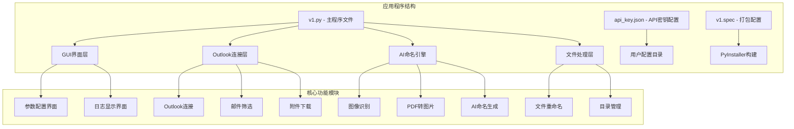
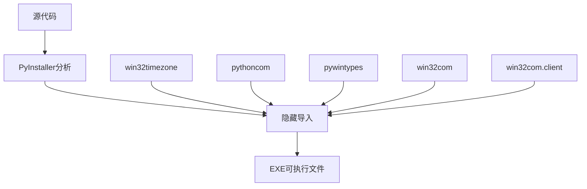
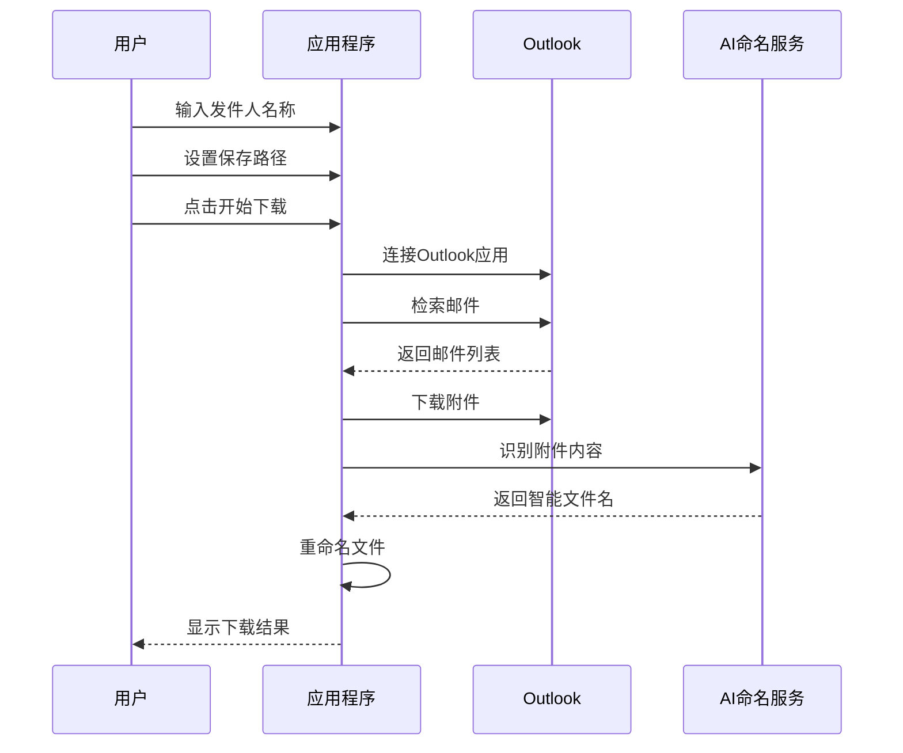
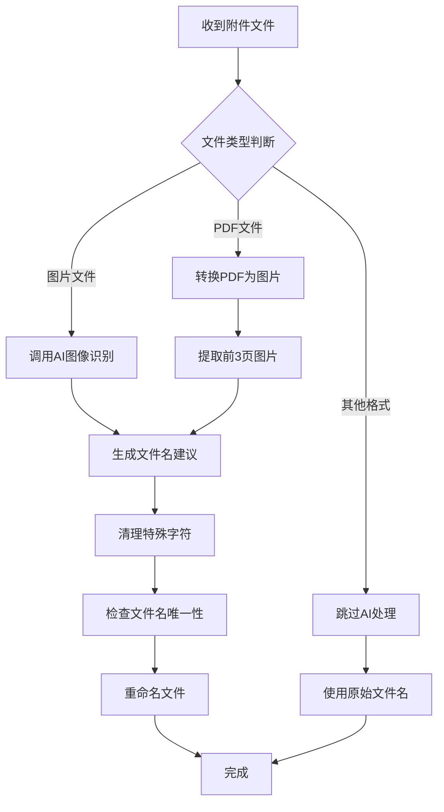
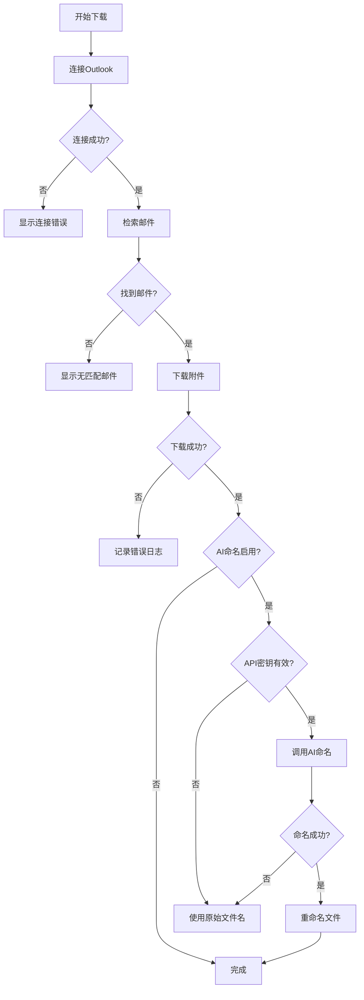

# 快速开始

<cite>
**本文引用的文件**
- [v1.py](file://v1.py)
- [api_key.json](file://api_key.json)
- [v1.spec](file://v1.spec)
</cite>

## 目录
1. [简介](#简介)
2. [项目结构](#项目结构)
3. [环境要求](#环境要求)
4. [安装步骤](#安装步骤)
5. [第一次使用完整流程](#第一次使用完整流程)
6. [基本使用示例](#基本使用示例)
7. [常见问题与故障排除](#常见问题与故障排除)
8. [性能与优化建议](#性能与优化建议)
9. [总结](#总结)

## 简介

Outlook附件下载AI智能命名系统是一个基于Python开发的桌面应用程序，专门用于从Outlook邮箱中批量下载附件并使用AI技术进行智能命名。该系统结合了Microsoft Outlook的自动化接口和阿里云百炼平台的多模态AI模型，能够自动识别图片和PDF文档的内容，并生成有意义的文件名。

主要功能特性：
- 自动连接Outlook并检索指定发件人的邮件
- 支持按发件人名称、主题关键词和时间范围筛选
- 批量下载邮件附件到指定目录
- AI智能命名：基于图片内容或PDF文档主题生成文件名
- 支持多种图像格式（JPG、PNG、BMP、TIFF）和PDF文档
- 图形用户界面，操作简单直观

## 项目结构

该项目采用单文件架构设计，包含以下核心组件：



**图表来源**
- [v1.py:1-827](file://v1.py#L1-L827)

**章节来源**
- [v1.py:1-827](file://v1.py#L1-L827)

## 环境要求

### 硬件要求
- **处理器**: Intel Core i3或更高性能的CPU
- **内存**: 至少4GB RAM（建议8GB以上）
- **存储空间**: 至少500MB可用空间
- **显示器**: 分辨率1024x768以上

### 软件要求
- **操作系统**: Windows 7 SP1及以上版本
- **Outlook版本**: Outlook 2016或更高版本
- **Python版本**: Python 3.8-3.11
- **系统权限**: 需要管理员权限以访问Outlook

### 必需的系统组件
- **Microsoft Office**: 包含Outlook应用程序
- **Windows COM组件**: 系统自带的COM接口支持
- **Python运行时**: 完整的Python 3.x安装

**章节来源**
- [v1.py:25-32](file://v1.py#L25-L32)
- [v1.py:72-85](file://v1.py#L72-L85)

## 安装步骤

### 方法一：使用预编译的可执行文件（推荐）

1. **下载可执行文件**
   - 从项目根目录获取`v1.exe`文件
   - 确保文件完整性，建议校验MD5哈希值

2. **首次运行准备**
   - 右键点击`v1.exe`选择"以管理员身份运行"
   - 系统会自动创建用户配置目录

3. **配置API密钥**
   - 在界面中点击"申请 Key"按钮
   - 在弹出的浏览器中注册阿里云账号
   - 获取API密钥并复制到输入框
   - 点击"保存 Key"按钮

### 方法二：从源码安装

1. **安装Python环境**
   ```bash
   # 下载Python 3.8-3.11版本
   # 安装时勾选"Add to PATH"选项
   ```

2. **安装依赖包**
   ```bash
   pip install pywin32 requests pillow pdf2image
   ```

3. **安装Poppler组件**
   - 下载Poppler for Windows
   - 解压到`poppler/Library/bin`目录
   - 确保`pdftoppm.exe`文件存在

4. **运行程序**
   ```bash
   python v1.py
   ```

### PyInstaller打包配置

项目使用PyInstaller进行打包，配置文件位于`v1.spec`：



**图表来源**
- [v1.spec:9-15](file://v1.spec#L9-L15)

**章节来源**
- [v1.spec:1-45](file://v1.spec#L1-L45)

## 第一次使用完整流程

### 步骤1：启动应用程序
1. 双击`v1.exe`文件启动程序
2. 等待界面加载完成
3. 确认窗口标题为"Outlook 附件下载 - AI智能命名"

### 步骤2：配置下载参数
1. **设置发件人名称**
   - 在"发件人名称"输入框中输入目标发件人名称
   - 支持模糊匹配，可输入部分名称

2. **配置主题关键词（可选）**
   - 如需按主题筛选，输入关键词
   - 不区分大小写，支持多个关键词

3. **设置保存路径**
   - 点击"浏览..."按钮选择保存目录
   - 建议创建专用的下载文件夹

4. **设置检索天数**
   - 默认值为1天
   - 如未找到附件，可调整为7天或30天

### 步骤3：配置AI智能命名
1. **启用AI功能**
   - 点击"AI 智能命名：已开启"按钮
   - 确认显示"已开启"状态

2. **配置API密钥**
   - 点击"申请 Key"按钮获取免费API密钥
   - 在阿里云控制台创建API密钥
   - 复制密钥到输入框并点击"保存 Key"

3. **选择模型**
   - 默认使用"qwen-vl-max"
   - 可选择其他可用模型

### 步骤4：开始下载
1. 点击"开始下载附件"按钮
2. 等待程序连接Outlook并检索邮件
3. 查看实时下载进度和日志

### 步骤5：验证结果
1. 打开保存目录查看下载的文件
2. 检查AI生成的智能文件名
3. 验证附件是否正确下载

**章节来源**
- [v1.py:230-250](file://v1.py#L230-L250)
- [v1.py:437-450](file://v1.py#L437-L450)

## 基本使用示例

### 示例1：基础附件下载


**图表来源**
- [v1.py:199-435](file://v1.py#L199-L435)

### 示例2：AI智能命名流程


**图表来源**
- [v1.py:149-196](file://v1.py#L149-L196)

### 示例3：错误处理机制


**图表来源**
- [v1.py:419-435](file://v1.py#L419-L435)

**章节来源**
- [v1.py:107-148](file://v1.py#L107-L148)
- [v1.py:149-196](file://v1.py#L149-L196)

## 常见问题与故障排除

### Outlook连接问题

**问题1：无法连接Outlook**
- **症状**: 程序显示"连接失败"或"Outlook不可用"
- **解决方法**:
  1. 确认Outlook已完全启动
  2. 以管理员身份运行程序
  3. 检查Windows防火墙设置
  4. 重启Outlook和计算机

**问题2：Outlook版本兼容性**
- **症状**: 程序启动但无法获取邮件列表
- **解决方法**:
  1. 确保使用Outlook 2016或更高版本
  2. 检查Microsoft Office安装完整性
  3. 更新到最新版本的Outlook

### AI命名功能问题

**问题3：API密钥无效**
- **症状**: 显示"请先填写 API Key"错误
- **解决方法**:
  1. 点击"申请 Key"按钮获取新密钥
  2. 确保密钥格式正确（以sk-开头）
  3. 检查网络连接状态
  4. 在阿里云控制台确认密钥状态

**问题4：AI命名失败**
- **症状**: 附件下载但文件名未改变
- **解决方法**:
  1. 检查API密钥是否正确保存
  2. 确认AI功能已启用
  3. 尝试更换其他模型
  4. 检查网络连接稳定性

### 文件处理问题

**问题5：PDF文件处理失败**
- **症状**: PDF文件无法转换或命名失败
- **解决方法**:
  1. 检查Poppler组件安装
  2. 确认`pdftoppm.exe`文件存在
  3. 验证PDF文件完整性
  4. 尝试手动转换PDF测试

**问题6：文件名冲突**
- **症状**: 重命名时出现"(1)"后缀
- **解决方法**:
  1. 程序会自动处理重复文件名
  2. 检查保存目录中是否存在同名文件
  3. 清理重复文件后重新下载

### 性能优化建议

**问题7：下载速度慢**
- **症状**: 大量附件下载耗时较长
- **解决方法**:
  1. 减少检索天数范围
  2. 排除不需要的主题关键词
  3. 关闭不必要的Outlook插件
  4. 确保网络连接稳定

**问题8：内存占用过高**
- **症状**: 程序运行时内存使用量增加
- **解决方法**:
  1. 限制同时处理的附件数量
  2. 关闭其他大型应用程序
  3. 增加系统虚拟内存
  4. 重启程序释放内存

**章节来源**
- [v1.py:16-19](file://v1.py#L16-L19)
- [v1.py:72-85](file://v1.py#L72-L85)
- [v1.py:419-435](file://v1.py#L419-L435)

## 性能与优化建议

### 系统性能优化

1. **内存管理**
   - 程序使用线程池处理大量附件
   - 自动清理临时文件和图像缓存
   - 支持大文件处理的内存优化

2. **网络性能**
   - AI API调用超时设置为60秒
   - 支持断线重连机制
   - 缓存API响应数据

3. **磁盘I/O优化**
   - 批量文件操作减少磁盘访问
   - 智能文件名生成避免重复写入
   - 临时文件自动清理机制

### 使用最佳实践

1. **合理设置参数**
   - 发件人名称使用精确匹配
   - 主题关键词避免过于宽泛
   - 检索天数根据实际需求调整

2. **文件组织策略**
   - 为不同类型的附件创建专门目录
   - 使用日期前缀组织文件
   - 定期清理临时文件

3. **监控和维护**
   - 定期检查API密钥有效性
   - 监控磁盘空间使用情况
   - 备份重要的配置文件

**章节来源**
- [v1.py:107-148](file://v1.py#L107-L148)
- [v1.py:149-196](file://v1.py#L149-L196)

## 总结

Outlook附件下载AI智能命名系统是一个功能强大且易于使用的工具，能够在30分钟内帮助新用户完成首次下载任务。通过遵循本快速开始指南，您将能够：

1. **成功安装和配置**系统环境
2. **正确设置Outlook连接**参数
3. **配置API密钥**实现AI智能命名
4. **执行完整的下载流程**并验证结果
5. **解决常见问题**并进行性能优化

### 关键要点回顾

- **环境要求**: Windows系统、Outlook应用、Python运行时
- **安装方式**: 推荐使用预编译的可执行文件
- **首次配置**: 发件人设置、保存路径、API密钥配置
- **核心功能**: 批量下载、智能命名、日志记录
- **故障排除**: 常见问题的快速解决方案

### 后续学习资源

- 探索更多AI模型选项
- 学习高级筛选条件配置
- 了解批量处理最佳实践
- 掌握日志分析技巧

通过持续使用和探索，您将能够充分利用该系统的全部功能，提高邮件附件管理的效率和智能化水平。