# 代码定制

<cite>
**本文引用的文件**
- [v1.py](file://v1.py)
- [api_key.json](file://api_key.json)
- [v1.spec](file://v1.spec)
</cite>

## 目录
1. [简介](#简介)
2. [项目结构](#项目结构)
3. [核心组件](#核心组件)
4. [架构总览](#架构总览)
5. [详细组件分析](#详细组件分析)
6. [依赖关系分析](#依赖关系分析)
7. [性能考虑](#性能考虑)
8. [故障排除指南](#故障排除指南)
9. [结论](#结论)
10. [附录](#附录)

## 简介

Outlook附件下载AI智能命名系统是一个集成了人工智能技术的邮件附件自动化处理工具。该系统能够自动从Outlook收件箱中批量下载指定发件人的邮件附件，并利用阿里百炼Qwen-VL-Max多模态模型对图片和PDF文档进行智能内容分析，生成符合语义的文件名。

该系统采用单文件架构设计，集成了以下核心功能：
- Outlook邮件系统集成
- AI智能命名算法
- PDF文档解析
- 图片内容识别
- 用户界面交互
- 配置文件管理

## 项目结构

当前项目采用极简的单文件架构，所有功能都集中在单一Python文件中。这种设计便于部署和分发，但不利于长期维护和扩展。

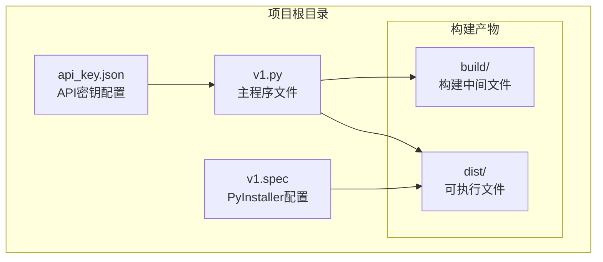

**图表来源**
- [v1.py:1-860](file://v1.py#L1-L860)
- [v1.spec:1-45](file://v1.spec#L1-L45)

**章节来源**
- [v1.py:1-860](file://v1.py#L1-L860)
- [v1.spec:1-45](file://v1.spec#L1-L45)

## 核心组件

### API密钥管理系统

系统实现了完整的API密钥管理机制，支持用户配置和安全存储：

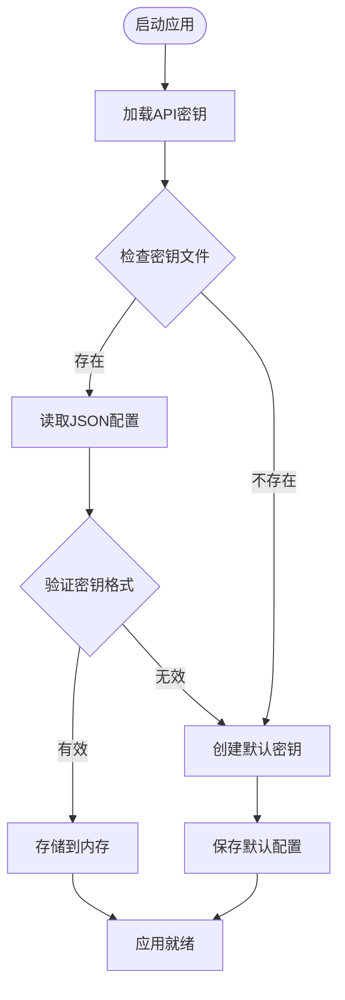

**图表来源**
- [v1.py:38-56](file://v1.py#L38-L56)

### AI智能命名引擎

系统集成了阿里百炼Qwen-VL-Max多模态模型，支持图片和PDF文档的内容分析：

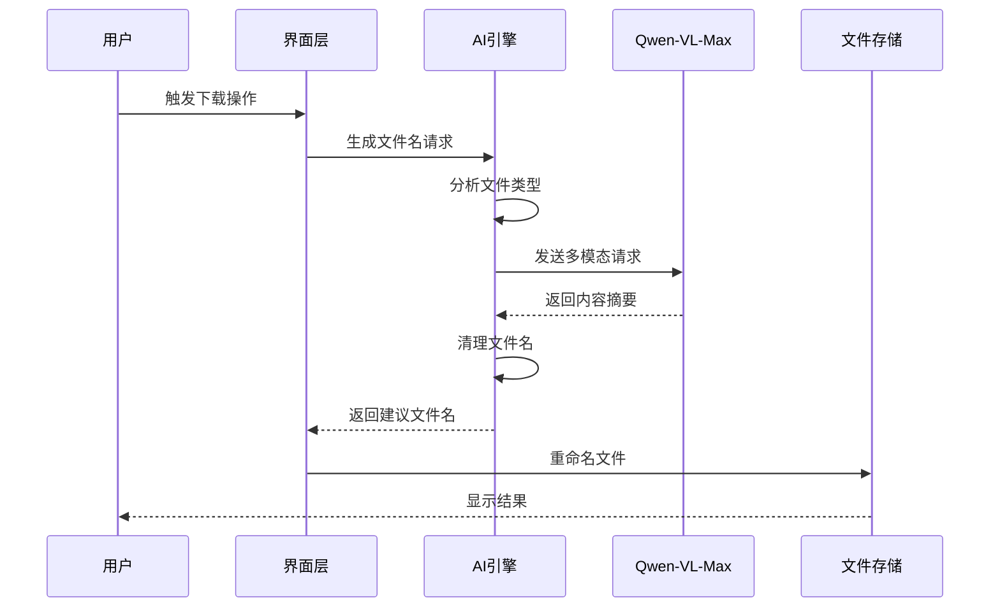

**图表来源**
- [v1.py:149-197](file://v1.py#L149-L197)
- [v1.py:107-148](file://v1.py#L107-L148)

### Outlook集成模块

系统通过COM接口与Outlook进行深度集成，实现邮件检索和附件下载：

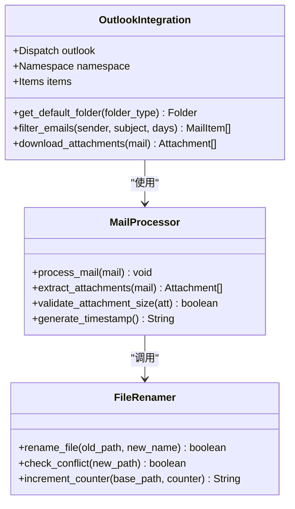

**图表来源**
- [v1.py:257-435](file://v1.py#L257-L435)

**章节来源**
- [v1.py:107-197](file://v1.py#L107-L197)
- [v1.py:257-435](file://v1.py#L257-L435)

## 架构总览

系统采用分层架构设计，将不同职责的功能模块清晰分离：

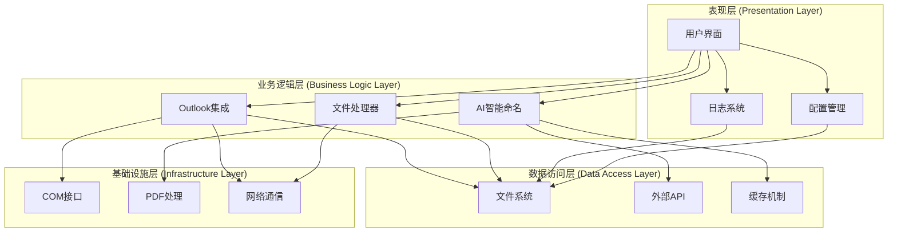

**图表来源**
- [v1.py:1-860](file://v1.py#L1-L860)

## 详细组件分析

### 配置文件化方案

#### API密钥配置管理

系统实现了灵活的API密钥配置机制，支持多种存储方式：

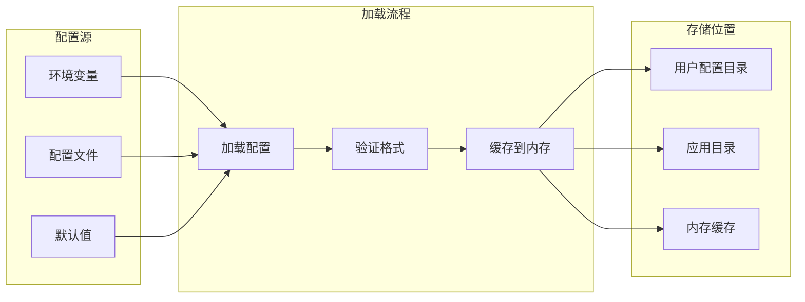

**图表来源**
- [v1.py:28-56](file://v1.py#L28-L56)

#### Poppler路径配置

系统支持动态检测和配置PDF处理工具路径：

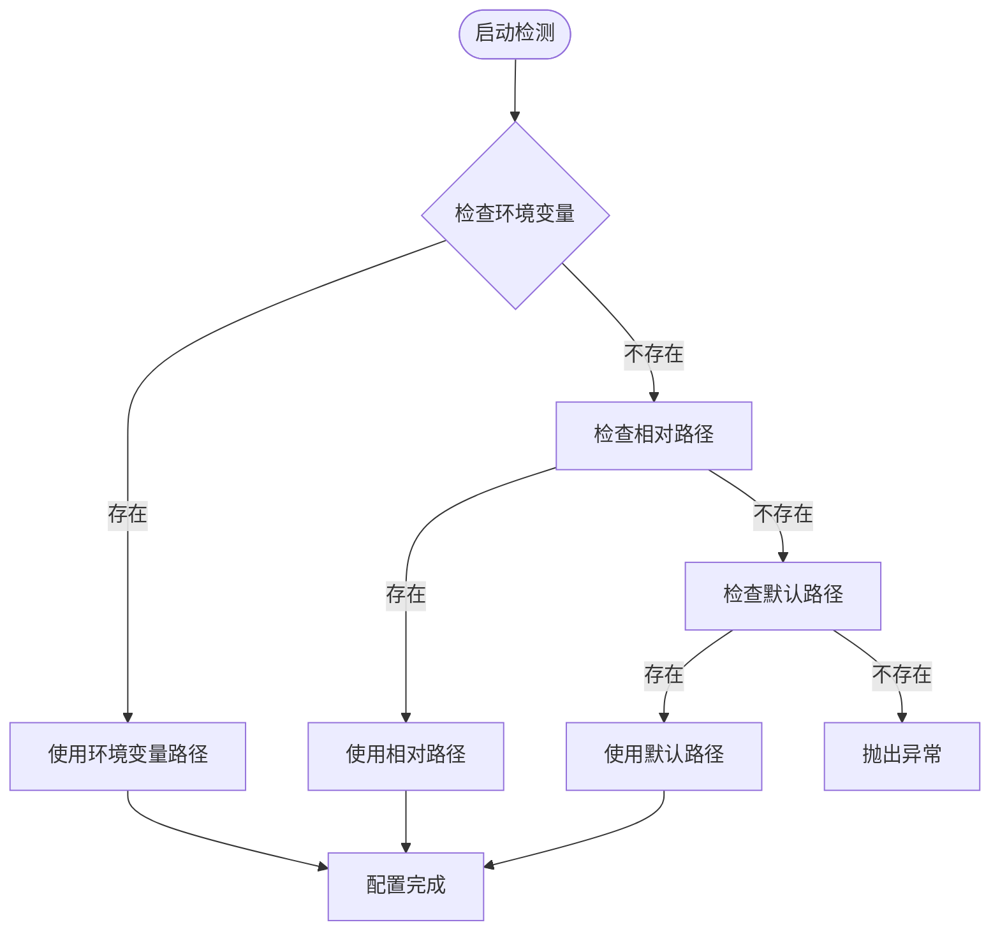

**图表来源**
- [v1.py:72-85](file://v1.py#L72-L85)

### 插件系统设计

#### 扩展点定义

系统预留了多个插件扩展点，支持功能模块化：

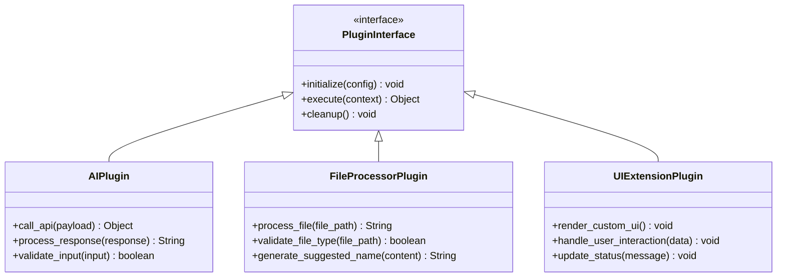

**图表来源**
- [v1.py:107-197](file://v1.py#L107-L197)

#### 插件加载机制

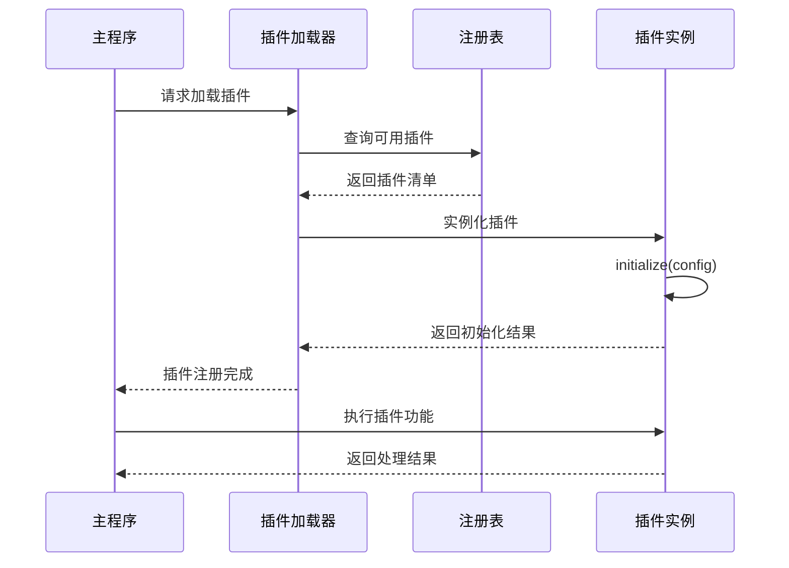

**图表来源**
- [v1.py:1-20](file://v1.py#L1-L20)

### 模块化重构指导

#### 功能模块分离策略

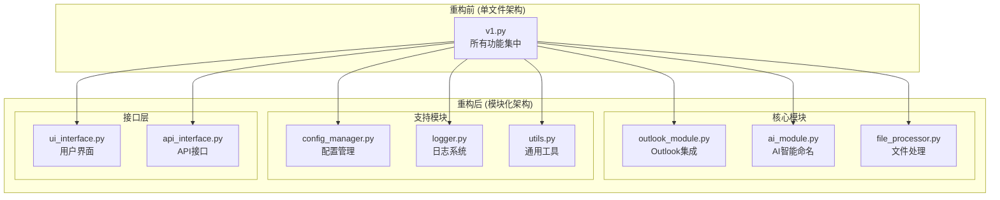

**图表来源**
- [v1.py:1-860](file://v1.py#L1-L860)

#### 配置管理模块化

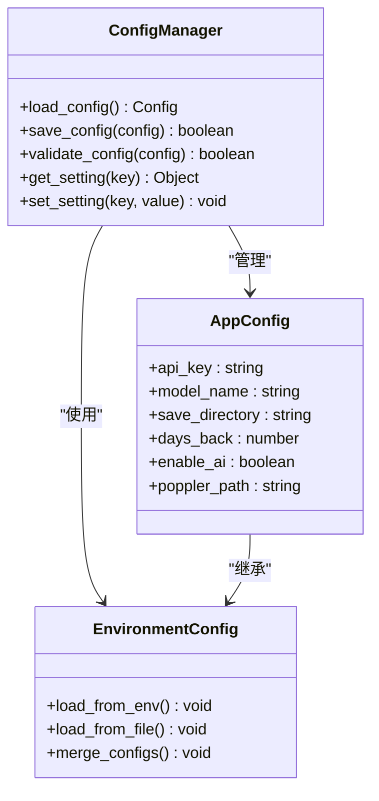

**图表来源**
- [v1.py:28-56](file://v1.py#L28-L56)
- [v1.py:72-85](file://v1.py#L72-L85)

### UI组件模块化

#### 界面组件分离

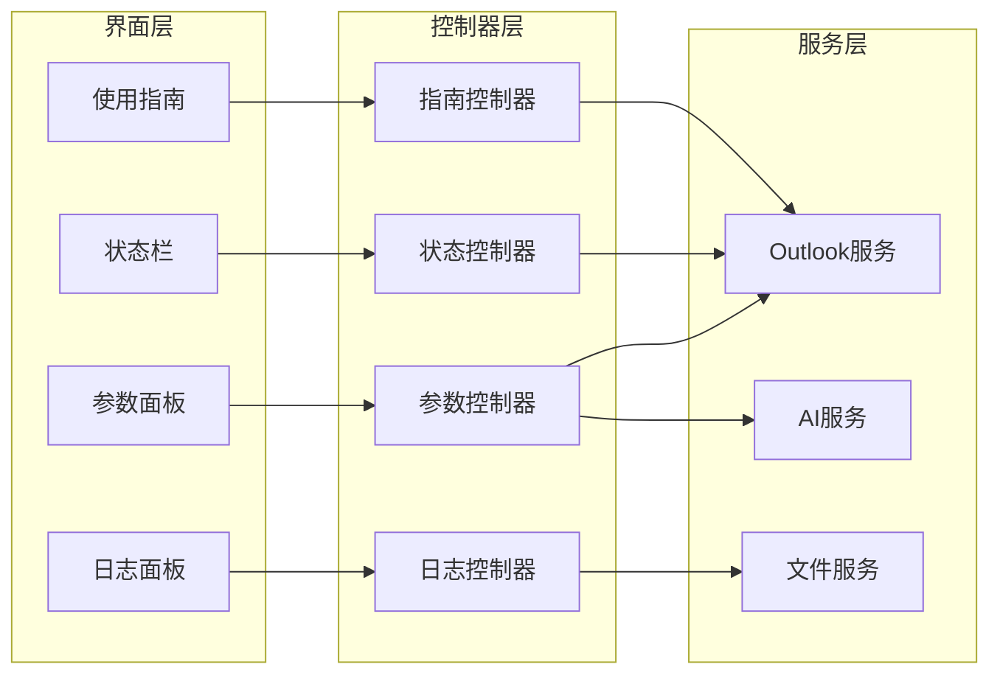

**图表来源**
- [v1.py:467-860](file://v1.py#L467-L860)

## 依赖关系分析

### 外部依赖管理

系统依赖关系复杂，涉及多个第三方库：

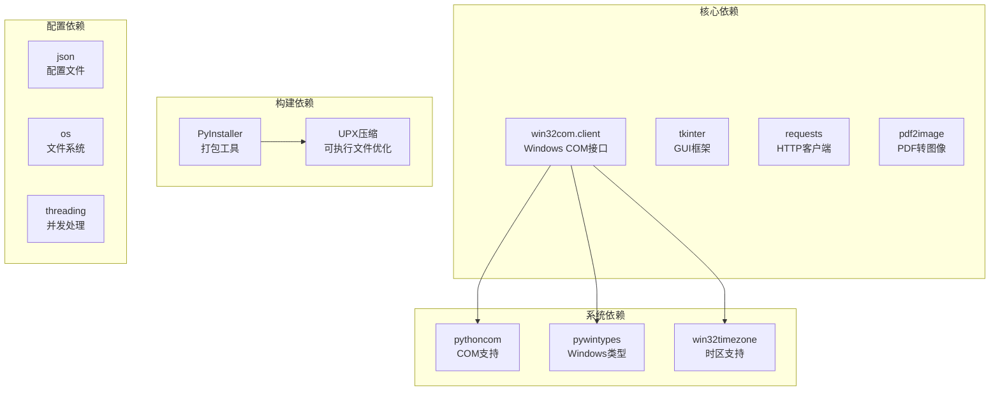

**图表来源**
- [v1.py:1-14](file://v1.py#L1-L14)
- [v1.spec:9-22](file://v1.spec#L9-L22)

### 内部模块依赖

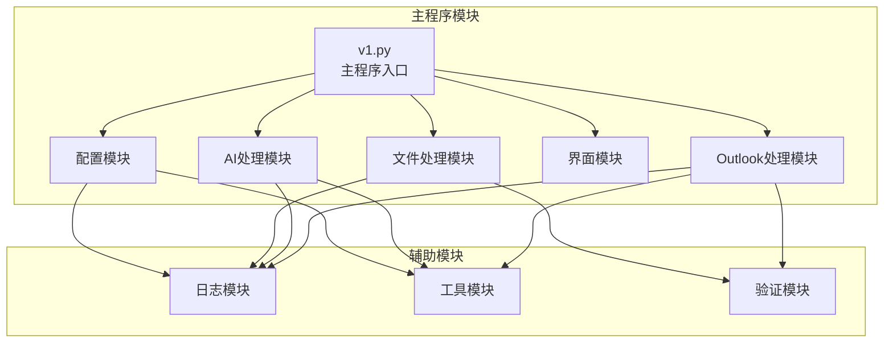

**图表来源**
- [v1.py:1-860](file://v1.py#L1-L860)

**章节来源**
- [v1.spec:1-45](file://v1.spec#L1-L45)

## 性能考虑

### 并发处理优化

系统采用了多线程架构来提升性能：

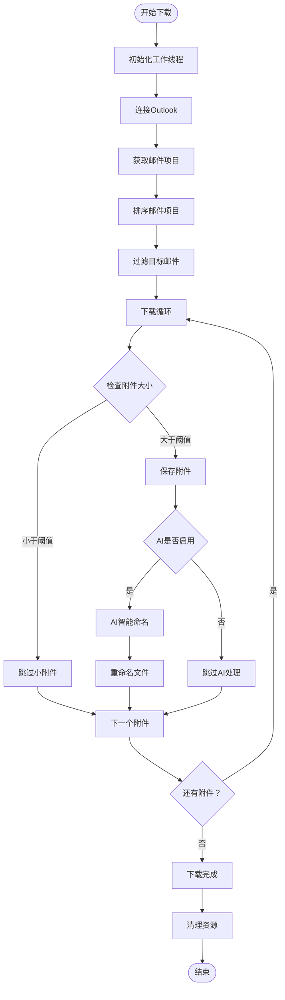

**图表来源**
- [v1.py:257-435](file://v1.py#L257-L435)

### 内存管理策略

系统实现了智能的内存管理机制：

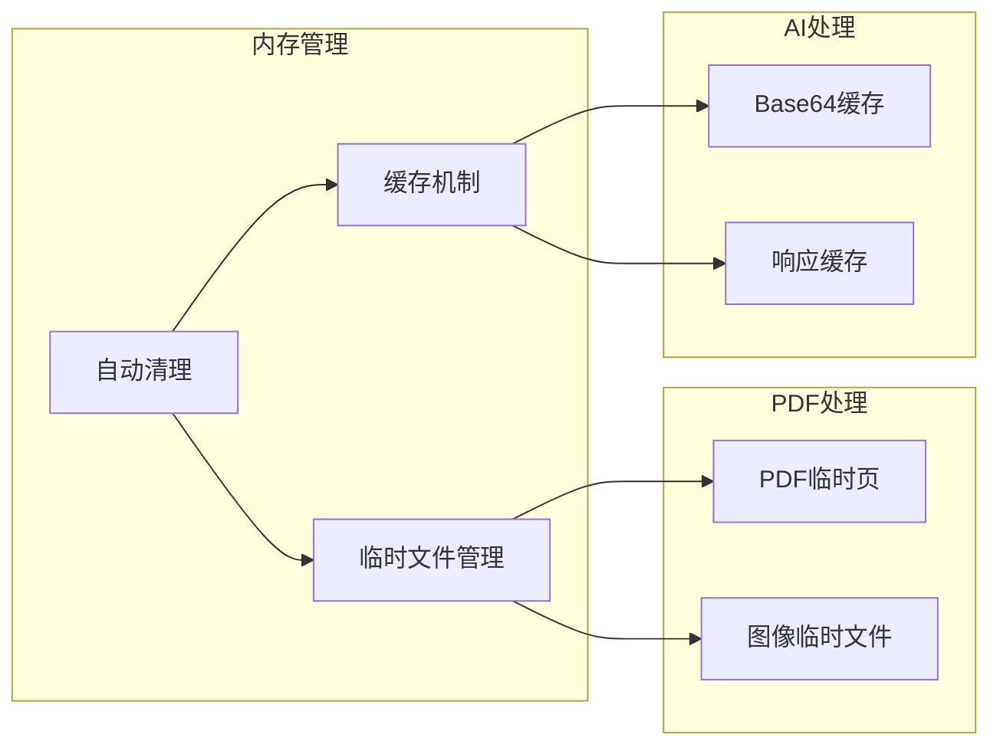

**图表来源**
- [v1.py:165-197](file://v1.py#L165-L197)

## 故障排除指南

### 常见问题诊断

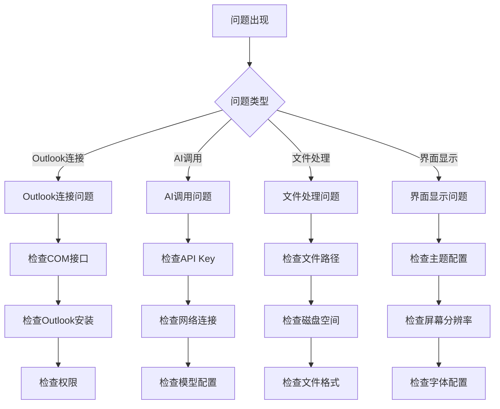

**图表来源**
- [v1.py:419-427](file://v1.py#L419-L427)

### 错误处理机制

系统实现了多层次的错误处理机制：

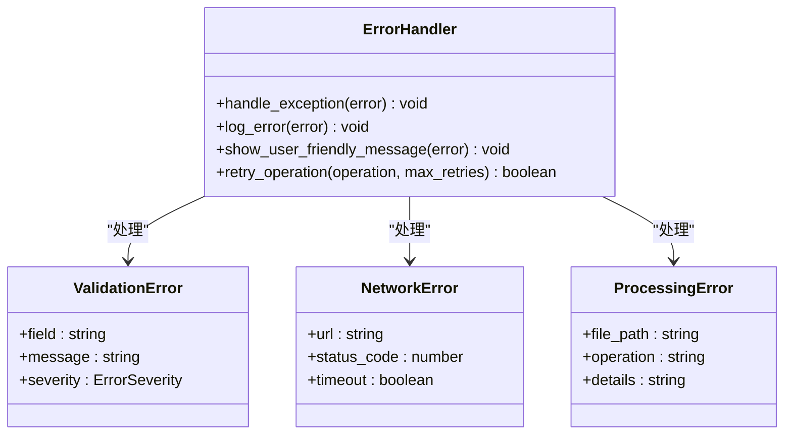

**图表来源**
- [v1.py:419-427](file://v1.py#L419-L427)

**章节来源**
- [v1.py:419-427](file://v1.py#L419-L427)

## 结论

Outlook附件下载AI智能命名系统展现了优秀的工程实践，通过单文件架构实现了功能完整性与部署便利性的平衡。系统的核心优势包括：

1. **模块化设计**：虽然当前为单文件架构，但代码结构清晰，便于后续重构为模块化结构
2. **AI集成**：深度集成了阿里百炼多模态模型，提供了强大的内容理解能力
3. **用户体验**：提供了直观的图形界面和详细的日志反馈
4. **配置管理**：实现了灵活的配置管理机制，支持多种配置源

### 改进建议

基于当前架构分析，建议的改进方向：

1. **模块化重构**：将单文件拆分为多个功能模块，提升代码可维护性
2. **插件系统**：设计标准化的插件接口，支持功能扩展
3. **配置文件化**：将硬编码的配置项外部化，支持动态配置
4. **测试覆盖**：增加单元测试和集成测试，确保代码质量
5. **文档完善**：补充详细的API文档和技术文档

## 附录

### 最佳实践指导

#### 代码重构最佳实践

1. **渐进式重构**：采用渐进式方式重构，避免一次性大改动
2. **保持向后兼容**：确保重构过程中保持API兼容性
3. **测试驱动开发**：在重构前后都进行充分的测试验证
4. **版本控制**：使用Git进行版本管理，便于回滚和追踪

#### 配置管理最佳实践

1. **配置分离**：将配置与代码分离，支持环境差异化配置
2. **安全存储**：敏感信息使用加密存储，避免明文泄露
3. **默认值设计**：为配置项提供合理的默认值
4. **配置验证**：实现配置项的格式和范围验证

#### 插件系统最佳实践

1. **接口设计**：定义清晰的插件接口规范
2. **生命周期管理**：实现插件的完整生命周期管理
3. **错误隔离**：确保插件异常不影响主系统稳定性
4. **动态加载**：支持插件的动态加载和卸载