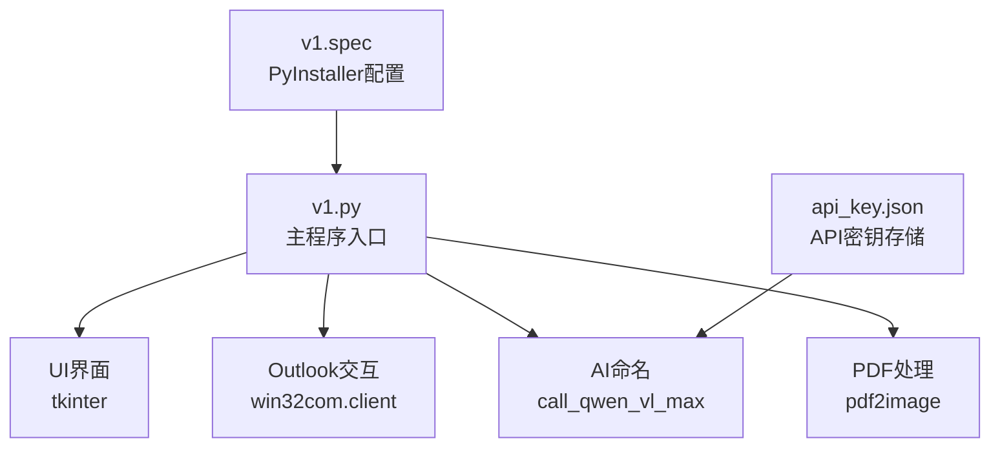
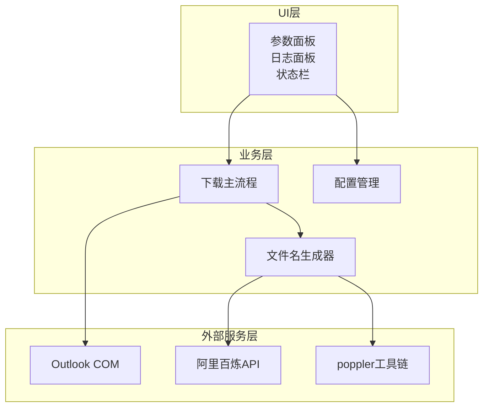
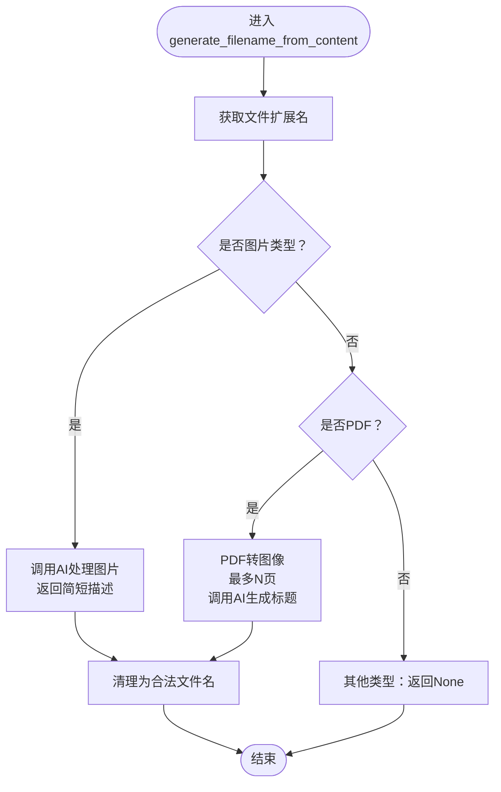
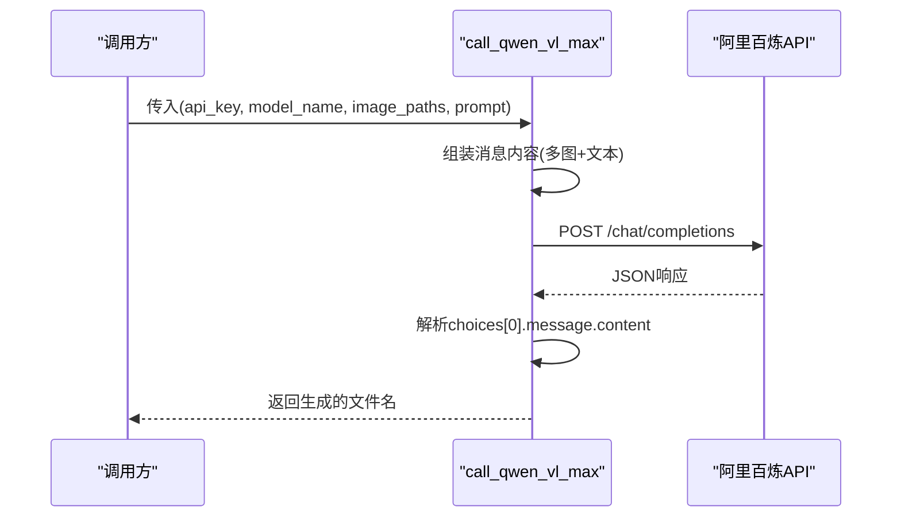
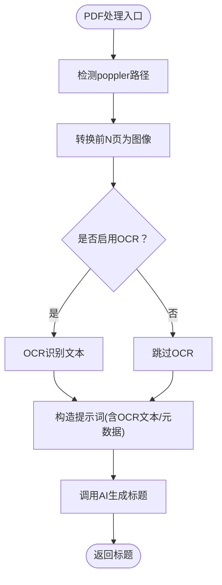
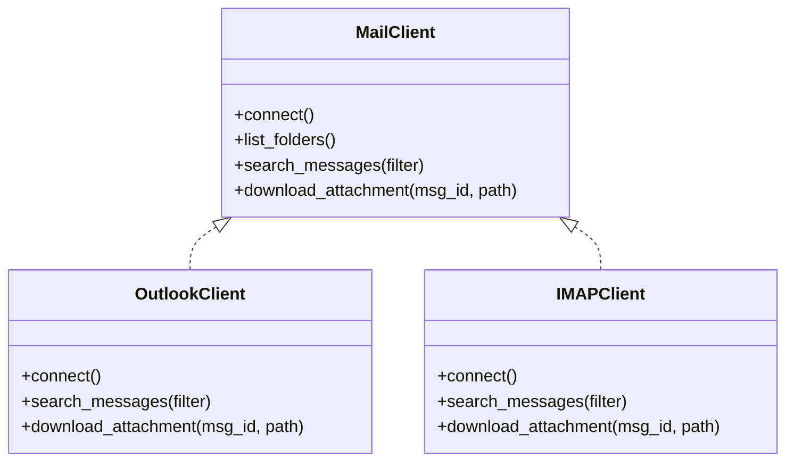
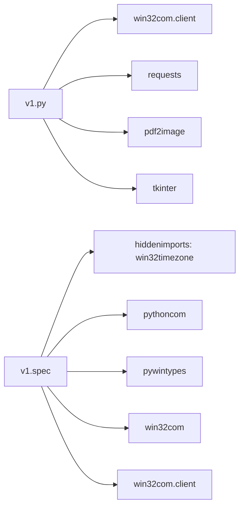

# 功能扩展

<cite>
**本文引用的文件**
- [v1.py](file://v1.py)
- [api_key.json](file://api_key.json)
- [v1.spec](file://v1.spec)
</cite>

## 目录
1. [简介](#简介)
2. [项目结构](#项目结构)
3. [核心组件](#核心组件)
4. [架构总览](#架构总览)
5. [详细组件分析](#详细组件分析)
6. [依赖关系分析](#依赖关系分析)
7. [性能考虑](#性能考虑)
8. [故障排除指南](#故障排除指南)
9. [结论](#结论)
10. [附录](#附录)

## 简介
本扩展文档面向Outlook附件下载AI智能命名系统，提供针对以下目标的功能扩展指导：
- 添加新的文件格式支持（如doc、xls、ppt等Office文档）
- 集成更多AI模型（如通义千问系列其他模型）
- 扩展邮件客户端兼容性（支持Outlook以外的邮件客户端）
- 增强PDF处理能力
- 保持向后兼容性
- 扩展配置与API接口

文档将结合现有代码架构，给出可操作的扩展点、修改示例与最佳实践。

## 项目结构
该仓库包含一个主程序入口、一个API密钥配置文件以及PyInstaller打包配置。核心逻辑集中在单文件主程序中，UI采用tkinter构建，Outlook交互通过win32com实现，AI命名通过阿里百炼Qwen-VL系列模型完成。

图表来源
- [v1.py:1-860](file://v1.py#L1-L860)
- [api_key.json:1-3](file://api_key.json#L1-L3)
- [v1.spec:1-45](file://v1.spec#L1-L45)

章节来源
- [v1.py:1-860](file://v1.py#L1-L860)
- [api_key.json:1-3](file://api_key.json#L1-L3)
- [v1.spec:1-45](file://v1.spec#L1-L45)

## 核心组件
- API密钥管理与加载：负责从用户目录加载/保存API密钥，支持显示脱敏。
- PDF转图像：基于poppler工具链将PDF页转换为图像，供AI模型分析。
- AI调用封装：统一调用阿里百炼Qwen-VL系列模型，支持多图输入与提示词。
- 文件名生成器：根据文件类型选择不同策略，目前支持图片与PDF。
- 下载主流程：连接Outlook、筛选邮件、保存附件、可选AI重命名。
- UI界面：参数配置、日志输出、状态反馈与新手指南。

章节来源
- [v1.py:38-64](file://v1.py#L38-L64)
- [v1.py:97-105](file://v1.py#L97-L105)
- [v1.py:107-147](file://v1.py#L107-L147)
- [v1.py:149-196](file://v1.py#L149-L196)
- [v1.py:199-435](file://v1.py#L199-L435)
- [v1.py:466-860](file://v1.py#L466-L860)

## 架构总览
系统采用“UI层-业务层-外部服务层”的分层设计：
- UI层：参数输入、日志展示、状态控制
- 业务层：邮件筛选、附件保存、AI重命名
- 外部服务层：Outlook COM接口、阿里百炼API、poppler工具

图表来源
- [v1.py:199-435](file://v1.py#L199-L435)
- [v1.py:149-196](file://v1.py#L149-L196)
- [v1.py:107-147](file://v1.py#L107-L147)
- [v1.py:97-105](file://v1.py#L97-L105)

## 详细组件分析

### 组件A：文件名生成器扩展点
当前实现位于 [v1.py:149-196]，支持图片与PDF两类文件。扩展点包括：
- 新增文件类型处理器：在扩展映射表中添加类型到处理函数的映射
- 新增AI模型适配：在调用封装中增加模型分支
- 新增PDF增强策略：如OCR、元数据提取、多页摘要

图表来源
- [v1.py:149-196](file://v1.py#L149-L196)

章节来源
- [v1.py:149-196](file://v1.py#L149-L196)

### 组件B：AI调用封装扩展点
当前实现位于 [v1.py:107-147]，支持多图输入与提示词拼接。扩展点包括：
- 模型名称参数化：从UI下拉框读取模型名
- 请求参数可配置：温度、最大token等
- 错误处理增强：网络错误、API返回格式异常

图表来源
- [v1.py:107-147](file://v1.py#L107-L147)

章节来源
- [v1.py:107-147](file://v1.py#L107-L147)

### 组件C：PDF处理增强方案
当前实现位于 [v1.py:97-105] 与 [v1.py:160-175]，基于poppler工具链。增强方案包括：
- OCR识别：在AI之前加入OCR步骤，提升非图像PDF的可读性
- 元数据提取：从PDF中提取作者、标题、主题等信息作为提示词
- 多页摘要：对多页PDF进行分段摘要，再综合生成标题
- 图像质量优化：调整分辨率、压缩率，平衡速度与精度

图表来源
- [v1.py:97-105](file://v1.py#L97-L105)
- [v1.py:160-175](file://v1.py#L160-L175)

章节来源
- [v1.py:97-105](file://v1.py#L97-L105)
- [v1.py:160-175](file://v1.py#L160-L175)

### 组件D：邮件客户端抽象层
当前实现绑定Outlook（win32com），扩展思路：
- 抽象接口：定义统一的邮件客户端接口（连接、筛选、下载）
- 多实现：Outlook实现、IMAP实现、Exchange实现
- 配置驱动：通过配置文件选择具体实现
- 兼容性：对不同客户端的差异进行适配（字段映射、时间格式）

图表来源
- [v1.py:270-273](file://v1.py#L270-L273)
- [v1.py:288-335](file://v1.py#L288-L335)
- [v1.py:378-382](file://v1.py#L378-L382)

章节来源
- [v1.py:270-273](file://v1.py#L270-L273)
- [v1.py:288-335](file://v1.py#L288-L335)
- [v1.py:378-382](file://v1.py#L378-L382)

### 组件E：UI与配置扩展
- 模型选择：UI下拉框支持多种Qwen-VL模型
- API密钥管理：用户目录持久化，支持脱敏显示
- 日志与状态：线程安全更新UI，提供详细执行日志

章节来源
- [v1.py:737-741](file://v1.py#L737-L741)
- [v1.py:451-464](file://v1.py#L451-L464)
- [v1.py:207-221](file://v1.py#L207-L221)

## 依赖关系分析
系统依赖关系如下：
- 运行时依赖：win32com、requests、pdf2image、tkinter
- 打包依赖：PyInstaller配置中显式声明hiddenimports
- 外部服务：阿里百炼API、poppler工具链

图表来源
- [v1.py:1-14](file://v1.py#L1-L14)
- [v1.spec:9-15](file://v1.spec#L9-L15)

章节来源
- [v1.py:1-14](file://v1.py#L1-L14)
- [v1.spec:9-15](file://v1.spec#L9-L15)

## 性能考虑
- 并发与UI：下载流程在后台线程执行，UI通过after回调更新，避免阻塞
- PDF处理：限制最大页数与图像质量，减少AI调用成本
- 重命名冲突：自动编号避免覆盖，但需注意大量同名文件时的磁盘IO压力
- API调用：超时控制与错误重试策略，避免长时间等待

章节来源
- [v1.py:257-435](file://v1.py#L257-L435)
- [v1.py:164-175](file://v1.py#L164-L175)
- [v1.py:139-147](file://v1.py#L139-L147)

## 故障排除指南
- API Key未配置：检查用户目录下的配置文件是否存在与权限
- poppler路径错误：确认环境变量或相对路径存在pdftoppm.exe
- Outlook连接失败：确保Outlook已安装且COM可用
- AI调用失败：检查网络连通性与API返回格式

章节来源
- [v1.py:38-64](file://v1.py#L38-L64)
- [v1.py:72-84](file://v1.py#L72-L84)
- [v1.py:107-147](file://v1.py#L107-L147)
- [v1.py:270-273](file://v1.py#L270-L273)

## 结论
本系统通过清晰的分层设计与明确的扩展点，为后续添加新文件格式、集成更多AI模型、扩展邮件客户端兼容性提供了良好的基础。建议在扩展过程中遵循“最小改动、向后兼容、配置驱动”的原则，确保稳定性与可维护性。

## 附录

### 扩展清单与实施步骤

- 新增文件格式支持（doc/xls/ppt等Office文档）
  - 在文件名生成器中新增类型分支，针对Office文档：
    - 提取元数据（标题、作者、主题）作为提示词
    - 可选：调用本地Office组件或第三方库进行快速预览文本提取
    - 返回简短标题
  - 修改路径参考：[v1.py:149-196](file://v1.py#L149-L196)

- 集成更多AI模型（通义千问系列其他模型）
  - 在UI下拉框中添加模型选项：[v1.py:737-741](file://v1.py#L737-L741)
  - 在AI调用封装中支持模型切换：[v1.py:107-147](file://v1.py#L107-L147)
  - 注意：不同模型的请求参数与返回格式可能存在差异，需做兼容处理

- 扩展邮件客户端兼容性（支持Outlook以外的邮件客户端）
  - 抽象MailClient接口，实现Outlook与IMAP两个实现：
    - Outlook：使用win32com
    - IMAP：使用标准库imaplib
  - 修改下载主流程以注入客户端实例
  - 参考路径：[v1.py:270-273](file://v1.py#L270-L273), [v1.py:288-335](file://v1.py#L288-L335)

- 增强PDF处理功能
  - 启用OCR：在PDF转图像后调用OCR引擎提取文本
  - 元数据提取：从PDF中读取标题、作者、主题等字段
  - 多页摘要：对前N页分别生成摘要，再综合生成最终标题
  - 参考路径：[v1.py:97-105](file://v1.py#L97-L105), [v1.py:160-175](file://v1.py#L160-L175)

- 向后兼容性保证
  - 保持现有API签名不变，新增参数使用默认值
  - 旧版配置文件无需迁移，新增字段可选
  - UI交互保持一致，新增功能默认关闭

- 配置文件扩展
  - API密钥：用户目录持久化，支持脱敏显示
  - 模型配置：下拉框动态加载
  - PDF处理参数：页数上限、图像质量、OCR开关等
  - 参考路径：[api_key.json:1-3](file://api_key.json#L1-L3), [v1.py:737-741](file://v1.py#L737-L741)

- API接口扩展
  - 增加模型切换接口：[v1.py:107-147](file://v1.py#L107-L147)
  - 增加PDF处理参数接口：[v1.py:97-105](file://v1.py#L97-L105)
  - 增加邮件客户端抽象接口：[v1.py:270-273](file://v1.py#L270-L273)