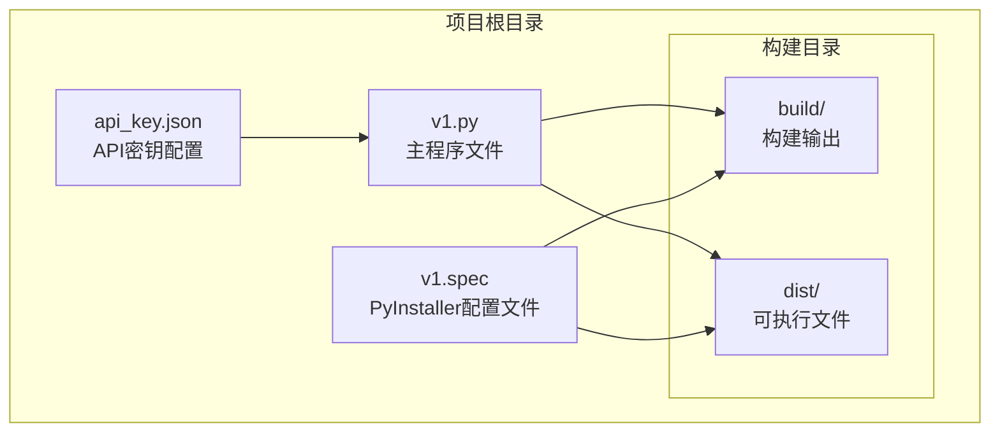
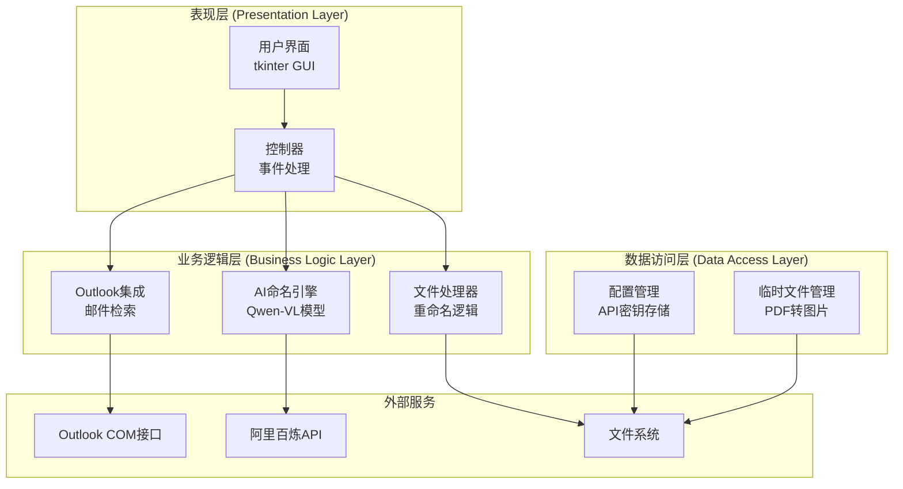
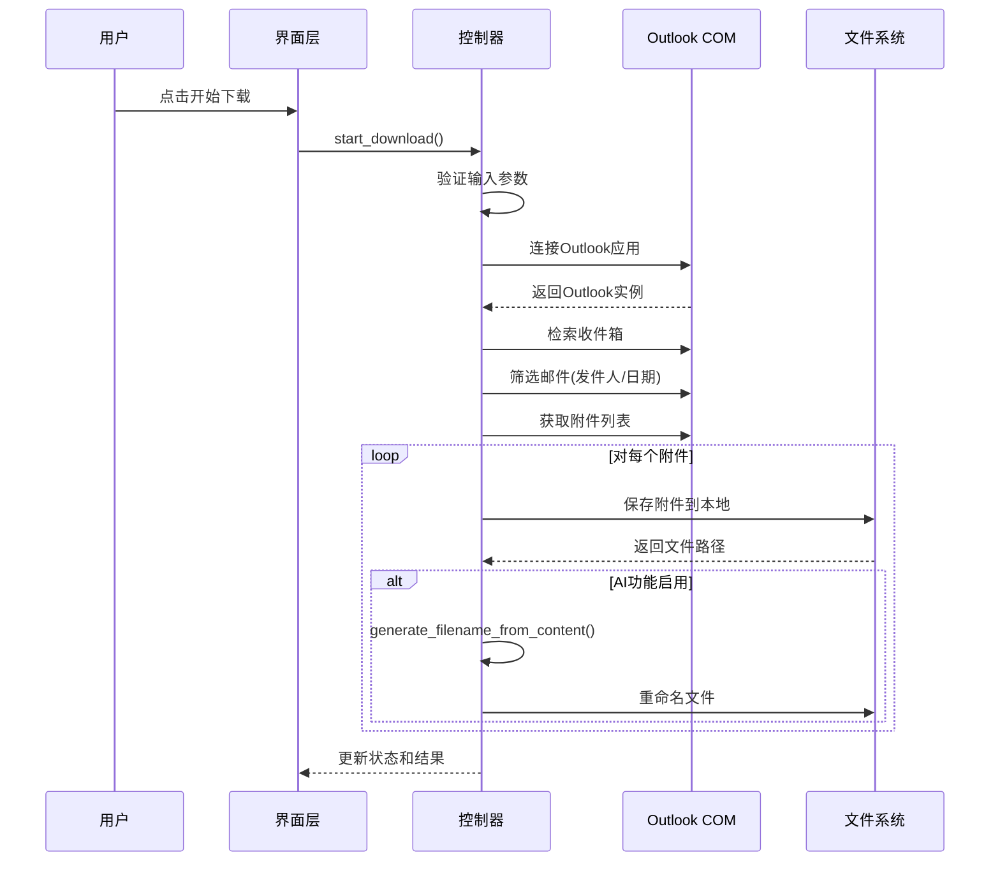
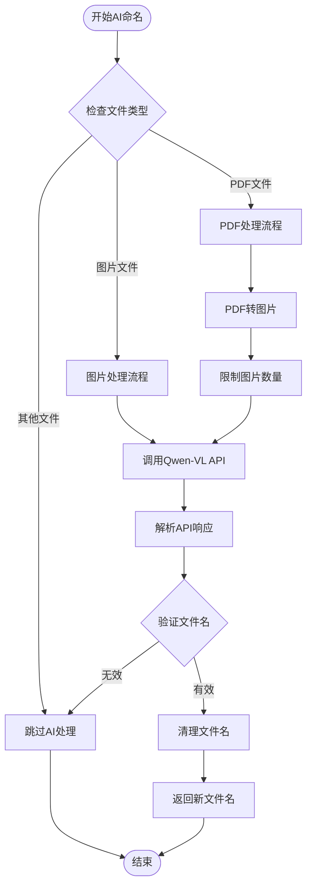
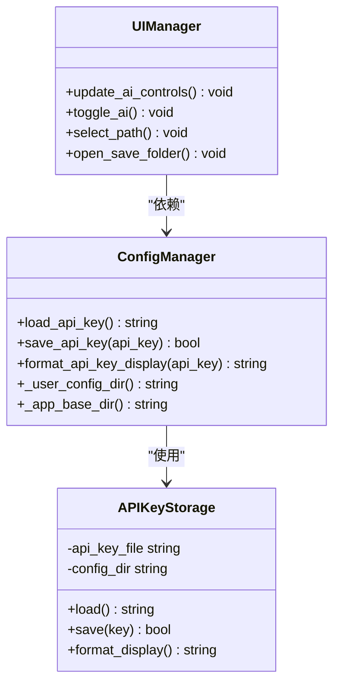
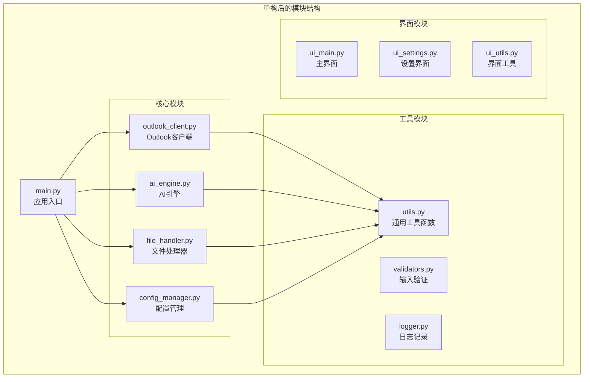

# 扩展与定制

<cite>
**本文档引用的文件**
- [v1.py](file://v1.py)
- [v1.spec](file://v1.spec)
- [api_key.json](file://api_key.json)
</cite>

## 目录
1. [简介](#简介)
2. [项目结构](#项目结构)
3. [核心组件](#核心组件)
4. [架构概览](#架构概览)
5. [详细组件分析](#详细组件分析)
6. [扩展开发指南](#扩展开发指南)
7. [模块化重构指导](#模块化重构指导)
8. [配置文件化方案](#配置文件化方案)
9. [API接口扩展](#api接口扩展)
10. [性能考虑](#性能考虑)
11. [故障排除指南](#故障排除指南)
12. [结论](#结论)

## 简介

Outlook附件下载AI智能命名系统是一个基于Python开发的桌面应用程序，专门用于从Outlook邮箱中批量下载附件并利用AI技术对文件进行智能命名。该系统集成了阿里云百炼平台的Qwen-VL多模态模型，能够识别图片和PDF文档的内容并生成语义化的文件名。

系统采用模块化设计，支持以下主要功能：
- Outlook邮件附件的批量下载
- AI智能内容识别和文件命名
- 多种文件格式支持（图片、PDF等）
- 用户友好的图形界面
- 配置文件管理和API密钥存储

## 项目结构

该项目采用简洁的单文件架构，所有功能都集中在单一的Python源文件中：



**图表来源**
- [v1.py:1-827](file://v1.py#L1-L827)
- [v1.spec:1-45](file://v1.spec#L1-L45)

**章节来源**
- [v1.py:1-827](file://v1.py#L1-L827)
- [v1.spec:1-45](file://v1.spec#L1-L45)

## 核心组件

系统由以下核心组件构成：

### 1. 外观设计组件
- **UI框架**: 使用tkinter构建现代化的图形界面
- **样式系统**: 集中式颜色和字体配置管理
- **响应式布局**: 自适应窗口大小和屏幕分辨率

### 2. 功能逻辑组件
- **Outlook集成层**: COM接口封装，邮件检索和附件处理
- **AI命名引擎**: 基于Qwen-VL模型的内容识别和命名
- **文件处理层**: PDF转图片、文件重命名、临时文件管理

### 3. 配置管理组件
- **API密钥管理**: 用户配置文件存储和加密显示
- **应用配置**: 用户偏好设置和运行参数
- **环境适配**: 跨平台兼容性和路径解析

**章节来源**
- [v1.py:467-827](file://v1.py#L467-L827)
- [v1.py:28-56](file://v1.py#L28-L56)

## 架构概览

系统采用分层架构设计，确保关注点分离和代码可维护性：



**图表来源**
- [v1.py:199-435](file://v1.py#L199-L435)
- [v1.py:107-148](file://v1.py#L107-L148)

## 详细组件分析

### Outlook集成模块

Outlook集成模块负责与Outlook应用程序进行通信，实现邮件检索和附件下载功能：



**图表来源**
- [v1.py:257-435](file://v1.py#L257-L435)
- [v1.py:271-273](file://v1.py#L271-L273)

### AI命名引擎

AI命名引擎是系统的核心智能组件，负责分析附件内容并生成语义化文件名：



**图表来源**
- [v1.py:149-197](file://v1.py#L149-L197)
- [v1.py:107-148](file://v1.py#L107-L148)

**章节来源**
- [v1.py:149-197](file://v1.py#L149-L197)
- [v1.py:107-148](file://v1.py#L107-L148)

### 配置管理系统

配置管理系统负责管理API密钥、用户偏好设置和应用配置：



**图表来源**
- [v1.py:38-56](file://v1.py#L38-L56)
- [v1.py:451-465](file://v1.py#L451-L465)

**章节来源**
- [v1.py:38-56](file://v1.py#L38-L56)
- [v1.py:451-465](file://v1.py#L451-L465)

## 扩展开发指南

### 添加新的文件格式支持

要扩展系统以支持新的文件格式，需要修改文件类型检测和处理逻辑：

#### 1. 修改文件类型检测

在文件类型检测函数中添加新的格式支持：

```python
# 在generate_filename_from_content函数中添加新的格式分支
elif ext == '.new_format':
    # 实现新格式的AI处理逻辑
    prompt = "请根据这个新格式文件的主要内容，生成一个简短的文件名..."
    result = call_qwen_vl_max(api_key, model_name, file_path, prompt)
    return safe_filename(result)
```

#### 2. 添加相应的预处理逻辑

对于需要特殊处理的文件格式，添加相应的预处理步骤：

```python
# 添加PDF转图片的辅助函数
def convert_new_format_to_images(file_path):
    """将新格式转换为图片列表"""
    # 实现转换逻辑
    pass
```

**章节来源**
- [v1.py:149-197](file://v1.py#L149-L197)

### 集成更多AI模型

系统支持多种Qwen-VL模型的集成，可以通过以下方式扩展：

#### 1. 模型配置管理

添加新的模型配置：

```python
# 在模型配置中添加新模型
MODELS = {
    "qwen-vl-max": {
        "name": "Qwen-VL Max",
        "description": "高性能多模态模型",
        "max_tokens": 150,
        "temperature": 0.2
    },
    "new-model": {
        "name": "New Model",
        "description": "新模型描述",
        "max_tokens": 200,
        "temperature": 0.3
    }
}
```

#### 2. API调用适配

修改API调用函数以支持新的模型参数：

```python
def call_ai_model(api_key, model_name, image_paths, prompt):
    """调用指定AI模型"""
    model_config = MODELS.get(model_name, MODELS["qwen-vl-max"])
    
    payload = {
        "model": model_name,
        "messages": [{"role": "user", "content": content}],
        "max_tokens": model_config["max_tokens"],
        "temperature": model_config["temperature"]
    }
    
    # 实现API调用逻辑
```

**章节来源**
- [v1.py:737-742](file://v1.py#L737-L742)
- [v1.py:132-147](file://v1.py#L132-L147)

### 扩展邮件客户端兼容性

为了支持更多的邮件客户端，需要实现通用的邮件协议接口：

#### 1. 抽象邮件客户端接口

```python
class EmailClientInterface:
    """邮件客户端抽象接口"""
    
    def connect(self):
        """建立连接"""
        raise NotImplementedError
    
    def disconnect(self):
        """断开连接"""
        raise NotImplementedError
    
    def search_emails(self, criteria):
        """搜索邮件"""
        raise NotImplementedError
    
    def download_attachments(self, email_id):
        """下载附件"""
        raise NotImplementedError
```

#### 2. Outlook客户端实现

```python
class OutlookClient(EmailClientInterface):
    """Outlook客户端实现"""
    
    def __init__(self):
        self.outlook = None
        self.namespace = None
    
    def connect(self):
        """连接到Outlook"""
        self.outlook = win32com.client.Dispatch("Outlook.Application")
        self.namespace = self.outlook.GetNamespace("MAPI")
    
    def search_emails(self, criteria):
        """搜索Outlook邮件"""
        inbox = self.namespace.GetDefaultFolder(6)
        # 实现搜索逻辑
```

#### 3. IMAP客户端实现

```python
class IMAPClient(EmailClientInterface):
    """IMAP客户端实现"""
    
    def __init__(self, server, username, password):
        self.server = server
        self.username = username
        self.password = password
        self.connection = None
    
    def connect(self):
        """连接到IMAP服务器"""
        import imaplib
        self.connection = imaplib.IMAP4_SSL(self.server)
        self.connection.login(self.username, self.password)
    
    def search_emails(self, criteria):
        """搜索IMAP邮件"""
        # 实现搜索逻辑
```

**章节来源**
- [v1.py:271-273](file://v1.py#L271-L273)

## 模块化重构指导

### 1. 分离关注点

将现有单文件架构重构为模块化结构：



### 2. 接口定义

为各个模块定义清晰的接口：

```python
# 定义统一的邮件客户端接口
class IEmailClient(ABC):
    @abstractmethod
    def connect(self) -> bool:
        pass
    
    @abstractmethod
    def search_emails(self, criteria: dict) -> List[Email]:
        pass
    
    @abstractmethod
    def download_attachments(self, email_id: str) -> List[str]:
        pass

# 定义AI引擎接口
class IAIEngine(ABC):
    @abstractmethod
    def generate_filename(self, file_path: str, content_type: str) -> str:
        pass
    
    @abstractmethod
    def process_content(self, file_path: str) -> dict:
        pass
```

### 3. 依赖注入

实现依赖注入以提高模块间的解耦：

```python
class Application:
    def __init__(self, email_client: IEmailClient, ai_engine: IAIEngine, config_manager: ConfigManager):
        self.email_client = email_client
        self.ai_engine = ai_engine
        self.config_manager = config_manager
    
    def run(self):
        # 应用逻辑
        pass
```

**章节来源**
- [v1.py:199-435](file://v1.py#L199-L435)

## 配置文件化方案

### 1. 配置文件结构

创建统一的配置文件管理系统：

```python
# 配置文件示例结构
CONFIG_SCHEMA = {
    "version": "1.0",
    "app": {
        "name": "Outlook附件下载AI",
        "version": "1.0.0",
        "theme": "light"
    },
    "outlook": {
        "connection_timeout": 30,
        "max_retries": 3,
        "auto_connect": True
    },
    "ai": {
        "enabled": True,
        "model": "qwen-vl-max",
        "api_key": "",
        "max_tokens": 150,
        "temperature": 0.2
    },
    "files": {
        "save_directory": "",
        "max_file_size": "10MB",
        "allowed_extensions": ["*.jpg", "*.pdf", "*.docx"],
        "rename_strategy": "semantic"
    },
    "ui": {
        "language": "zh-CN",
        "window_size": "large",
        "auto_update": True
    }
}
```

### 2. 配置加载和验证

实现配置文件的动态加载和验证：

```python
class ConfigManager:
    def __init__(self, config_file: str):
        self.config_file = config_file
        self.config_data = {}
        self.load_config()
    
    def load_config(self):
        """加载配置文件"""
        try:
            with open(self.config_file, 'r', encoding='utf-8') as f:
                self.config_data = json.load(f)
            
            # 验证配置
            self.validate_config()
            
        except FileNotFoundError:
            # 创建默认配置
            self.create_default_config()
        except json.JSONDecodeError:
            # 配置文件损坏，创建默认配置
            self.create_default_config()
    
    def validate_config(self):
        """验证配置的有效性"""
        required_fields = ['app', 'outlook', 'ai', 'files']
        for field in required_fields:
            if field not in self.config_data:
                raise ValueError(f"配置缺少必需字段: {field}")
```

### 3. 环境特定配置

支持不同环境的配置管理：

```python
class EnvironmentConfig:
    ENVIRONMENTS = {
        'development': {
            'debug': True,
            'log_level': 'DEBUG',
            'api_endpoint': 'https://dev-api.example.com'
        },
        'staging': {
            'debug': False,
            'log_level': 'INFO',
            'api_endpoint': 'https://staging-api.example.com'
        },
        'production': {
            'debug': False,
            'log_level': 'WARNING',
            'api_endpoint': 'https://api.example.com'
        }
    }
    
    def get_current_env(self) -> dict:
        env = os.getenv('APP_ENV', 'development')
        return self.ENVIRONMENTS.get(env, self.ENVIRONMENTS['development'])
```

**章节来源**
- [v1.py:28-56](file://v1.py#L28-L56)
- [v1.py:451-465](file://v1.py#L451-L465)

## API接口扩展

### 1. RESTful API设计

为系统提供RESTful API接口：

```python
from flask import Flask, request, jsonify
from typing import Dict, List

app = Flask(__name__)

@app.route('/api/download', methods=['POST'])
def download_attachments():
    """批量下载附件API"""
    try:
        data = request.json
        
        # 验证请求参数
        required_fields = ['sender', 'save_dir', 'days_back']
        for field in required_fields:
            if field not in data:
                return jsonify({'error': f'缺少必需参数: {field}'}), 400
        
        # 执行下载操作
        result = start_download_async(
            sender=data['sender'],
            subject_keyword=data.get('subject_keyword', ''),
            save_dir=data['save_dir'],
            days_back=data['days_back'],
            ai_enabled=data.get('ai_enabled', True),
            model_name=data.get('model_name', 'qwen-vl-max')
        )
        
        return jsonify({
            'status': 'success',
            'task_id': result['task_id'],
            'message': result['message']
        })
    
    except Exception as e:
        return jsonify({'error': str(e)}), 500

@app.route('/api/tasks/<task_id>', methods=['GET'])
def get_task_status(task_id):
    """获取任务状态API"""
    try:
        task = get_task_status(task_id)
        return jsonify(task)
    except Exception as e:
        return jsonify({'error': str(e)}), 404

@app.route('/api/config', methods=['GET', 'PUT'])
def manage_config():
    """管理配置API"""
    if request.method == 'GET':
        return jsonify(load_config())
    elif request.method == 'PUT':
        config = request.json
        save_config(config)
        return jsonify({'status': 'success'})
```

### 2. WebSocket实时通知

实现WebSocket接口以提供实时状态更新：

```python
from flask_socketio import SocketIO, emit

socketio = SocketIO(app, cors_allowed_origins="*")

def emit_progress_update(task_id: str, progress: dict):
    """发送进度更新"""
    socketio.emit(f'task_progress_{task_id}', progress)

@socketio.on('join_task_room')
def handle_join_task_room(data):
    """加入任务房间"""
    task_id = data['task_id']
    join_room(f'task_room_{task_id}')
    
    # 发送初始状态
    emit('task_status', get_task_status(task_id))

@socketio.on('disconnect')
def handle_disconnect():
    """处理断开连接"""
    leave_room(room)
```

### 3. API认证和授权

实现API安全机制：

```python
from functools import wraps
import jwt

API_SECRET_KEY = os.getenv('API_SECRET_KEY', 'your-secret-key')

def require_api_key(f):
    """API密钥认证装饰器"""
    @wraps(f)
    def decorated_function(*args, **kwargs):
        api_key = request.headers.get('X-API-Key')
        if not api_key or api_key != API_SECRET_KEY:
            return jsonify({'error': 'Invalid API Key'}), 401
        return f(*args, **kwargs)
    return decorated_function

@app.before_request
def authenticate_request():
    """请求认证中间件"""
    if request.endpoint and request.endpoint.startswith('api'):
        # 实现认证逻辑
        pass
```

**章节来源**
- [v1.py:199-435](file://v1.py#L199-L435)

## 性能考虑

### 1. 并发处理优化

系统已经使用多线程处理长时间运行的操作，但可以进一步优化：

```python
import asyncio
import concurrent.futures
from threading import Thread

class AsyncProcessor:
    def __init__(self, max_workers: int = 4):
        self.executor = concurrent.futures.ThreadPoolExecutor(max_workers=max_workers)
        self.loop = asyncio.new_event_loop()
    
    async def process_attachments_async(self, attachments: List[Attachment]):
        """异步处理附件"""
        tasks = []
        for attachment in attachments:
            task = self.loop.run_in_executor(
                self.executor,
                self.process_single_attachment,
                attachment
            )
            tasks.append(task)
        
        return await asyncio.gather(*tasks, return_exceptions=True)
    
    def process_single_attachment(self, attachment: Attachment):
        """处理单个附件（同步）"""
        # 实现附件处理逻辑
        pass
```

### 2. 内存管理优化

优化PDF处理和图片转换的内存使用：

```python
def process_pdf_with_memory_management(pdf_path: str, max_pages: int = 3):
    """内存友好的PDF处理"""
    temp_images = []
    try:
        # 使用流式处理减少内存占用
        images = pdf_to_images_streaming(pdf_path, max_pages)
        
        for i, image in enumerate(images):
            temp_path = self.save_temp_image(image, i)
            temp_images.append(temp_path)
            
            # 及时释放内存
            del image
            
        return temp_images
    
    except Exception as e:
        # 清理临时文件
        self.cleanup_temp_files(temp_images)
        raise e
    
    finally:
        # 确保清理
        self.cleanup_temp_files(temp_images)
```

### 3. 缓存策略

实现智能缓存以减少重复计算：

```python
import hashlib
from functools import lru_cache

class AICache:
    def __init__(self, maxsize: int = 128):
        self.cache = {}
        self.maxsize = maxsize
    
    def get_cache_key(self, file_path: str, model_name: str) -> str:
        """生成缓存键"""
        key_string = f"{file_path}:{model_name}"
        return hashlib.md5(key_string.encode()).hexdigest()
    
    @lru_cache(maxsize=128)
    def cached_generate_filename(self, file_path: str, model_name: str) -> str:
        """带缓存的文件名生成"""
        return self._generate_filename(file_path, model_name)
    
    def _generate_filename(self, file_path: str, model_name: str) -> str:
        """实际的文件名生成逻辑"""
        # 实现AI命名逻辑
        pass
```

## 故障排除指南

### 1. 常见问题诊断

#### Outlook连接问题

```python
def diagnose_outlook_connection():
    """诊断Outlook连接问题"""
    issues = []
    
    # 检查Outlook是否安装
    try:
        outlook = win32com.client.Dispatch("Outlook.Application")
        namespace = outlook.GetNamespace("MAPI")
    except Exception as e:
        issues.append({
            'type': 'outlook_missing',
            'message': 'Outlook未安装或无法连接',
            'solution': '安装Microsoft Outlook并确保COM接口可用'
        })
        return issues
    
    # 检查Outlook版本兼容性
    try:
        version = outlook.Version
        if float(version) < 15.0:
            issues.append({
                'type': 'outlook_version',
                'message': f'Outlook版本过低: {version}',
                'solution': '升级到Outlook 2016或更高版本'
            })
    except Exception:
        pass
    
    return issues
```

#### AI模型调用失败

```python
def handle_ai_api_error(error: Exception):
    """处理AI API调用错误"""
    error_msg = str(error)
    
    if 'API Key' in error_msg:
        return {
            'type': 'invalid_api_key',
            'message': 'API Key无效或过期',
            'solution': '重新申请有效的API Key并正确配置'
        }
    elif 'timeout' in error_msg.lower():
        return {
            'type': 'api_timeout',
            'message': 'AI API调用超时',
            'solution': '检查网络连接，稍后重试'
        }
    elif 'quota' in error_msg.lower():
        return {
            'type': 'quota_exceeded',
            'message': 'API配额已用尽',
            'solution': '等待配额重置或升级账户'
        }
    else:
        return {
            'type': 'unknown_error',
            'message': '未知AI API错误',
            'solution': '查看详细错误日志并联系技术支持'
        }
```

### 2. 错误恢复机制

```python
class ErrorHandler:
    def __init__(self):
        self.error_log = []
    
    def handle_exception(self, func):
        """异常处理装饰器"""
        def wrapper(*args, **kwargs):
            try:
                return func(*args, **kwargs)
            except Exception as e:
                error_info = {
                    'timestamp': datetime.now(),
                    'function': func.__name__,
                    'error': str(e),
                    'traceback': traceback.format_exc()
                }
                
                self.error_log.append(error_info)
                self.log_error(error_info)
                
                # 根据错误类型决定处理策略
                if self.is_recoverable_error(e):
                    self.attempt_recovery(e)
                else:
                    self.notify_user(e)
                
                return None
        return wrapper
    
    def is_recoverable_error(self, error: Exception) -> bool:
        """判断错误是否可恢复"""
        recoverable_types = [
            'timeout',
            'network',
            'temporary',
            'retry'
        ]
        
        error_msg = str(error).lower()
        return any(error_type in error_msg for error_type in recoverable_types)
    
    def attempt_recovery(self, error: Exception):
        """尝试错误恢复"""
        # 实现恢复逻辑
        pass
    
    def notify_user(self, error: Exception):
        """通知用户错误"""
        # 实现用户通知逻辑
        pass
```

### 3. 日志记录和监控

```python
import logging
from logging.handlers import RotatingFileHandler

class SystemLogger:
    def __init__(self, log_file: str = 'app.log'):
        self.logger = logging.getLogger('OutlookAI')
        self.logger.setLevel(logging.DEBUG)
        
        # 文件处理器（轮转）
        file_handler = RotatingFileHandler(
            log_file, 
            maxBytes=10*1024*1024,  # 10MB
            backupCount=5
        )
        
        # 控制台处理器
        console_handler = logging.StreamHandler()
        
        # 格式化器
        formatter = logging.Formatter(
            '%(asctime)s - %(name)s - %(levelname)s - %(message)s'
        )
        
        file_handler.setFormatter(formatter)
        console_handler.setFormatter(formatter)
        
        self.logger.addHandler(file_handler)
        self.logger.addHandler(console_handler)
    
    def log_operation(self, operation: str, details: dict):
        """记录操作日志"""
        self.logger.info(f"Operation: {operation} - Details: {details}")
    
    def log_error(self, error: dict):
        """记录错误日志"""
        self.logger.error(f"Error: {error}")
    
    def log_performance(self, metric: str, value: float, unit: str):
        """记录性能指标"""
        self.logger.info(f"Performance: {metric} = {value} {unit}")
```

**章节来源**
- [v1.py:419-426](file://v1.py#L419-L426)
- [v1.py:823-827](file://v1.py#L823-L827)

## 结论

Outlook附件下载AI智能命名系统是一个功能完整且高度可扩展的应用程序。通过本文档提供的扩展开发指南，开发者可以：

1. **模块化重构**: 将现有单文件架构重构为清晰的模块化结构
2. **功能扩展**: 添加新的文件格式支持和AI模型集成
3. **配置管理**: 实现统一的配置文件化方案
4. **API接口**: 提供RESTful API和WebSocket实时通知
5. **性能优化**: 实现并发处理和内存管理优化
6. **故障排除**: 建立完善的错误处理和监控机制

系统的架构设计充分考虑了可扩展性和可维护性，为未来的功能增强和技术演进提供了坚实的基础。通过遵循本文档的最佳实践，开发者可以安全地扩展系统功能，同时保持向后兼容性和稳定性。