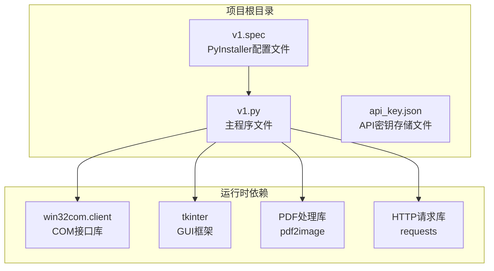
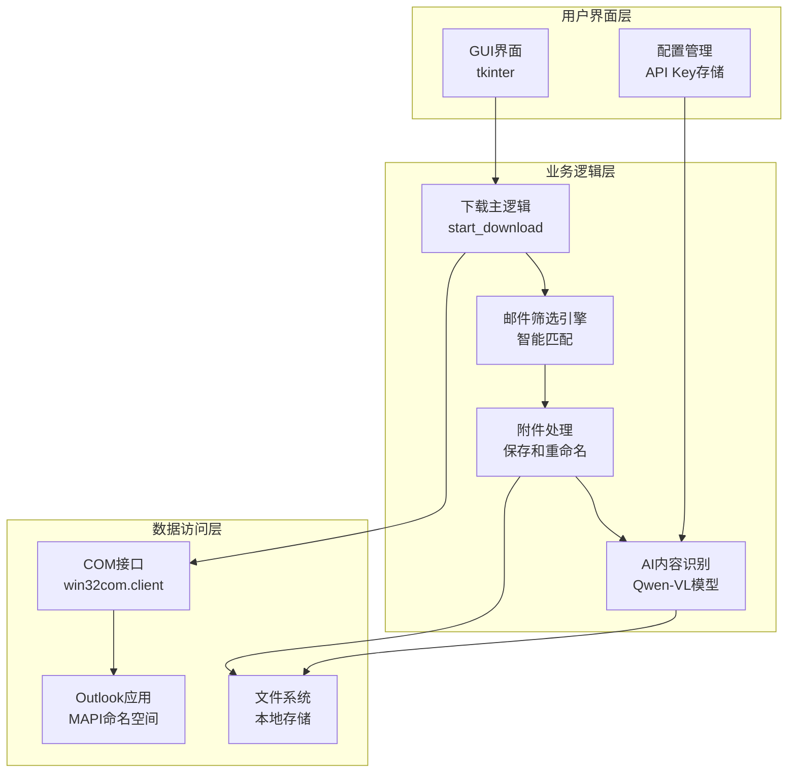
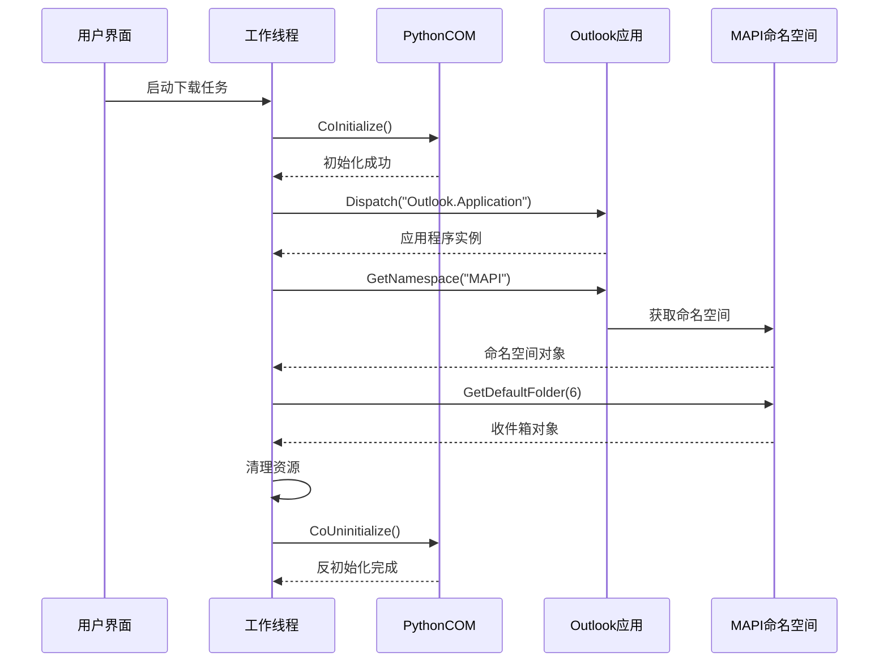
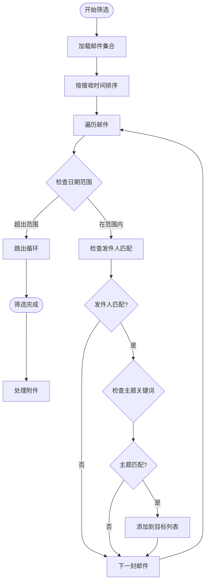
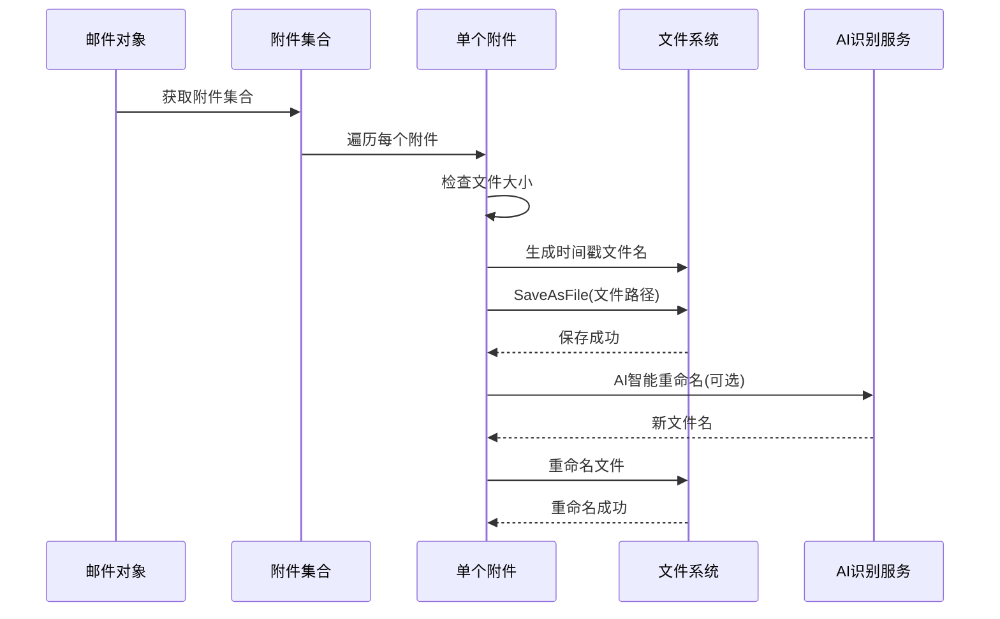
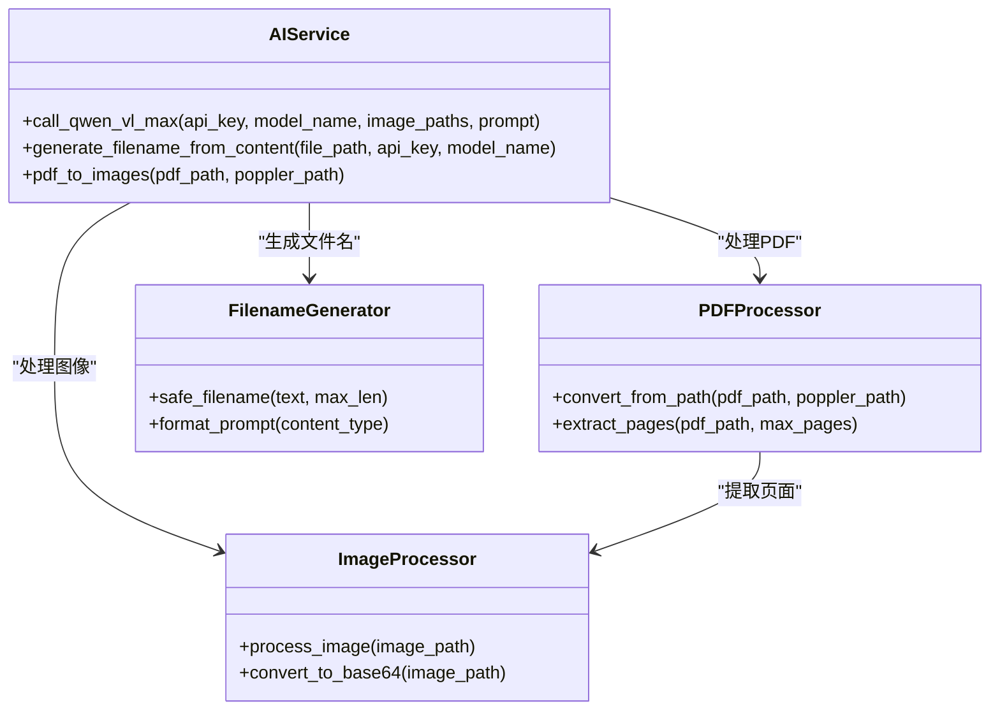
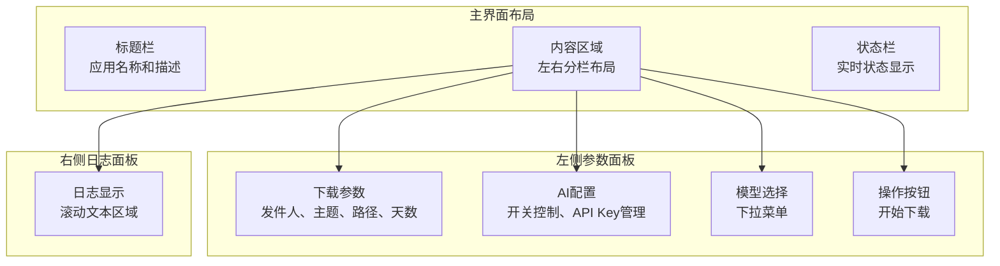
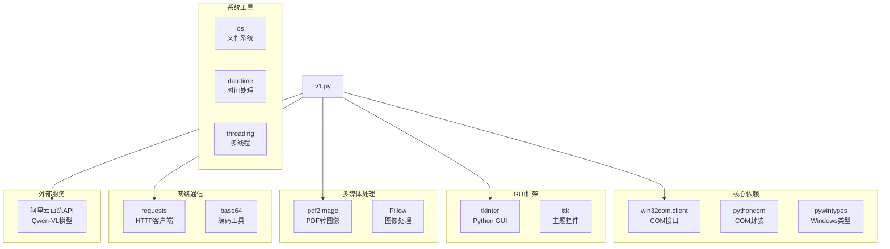
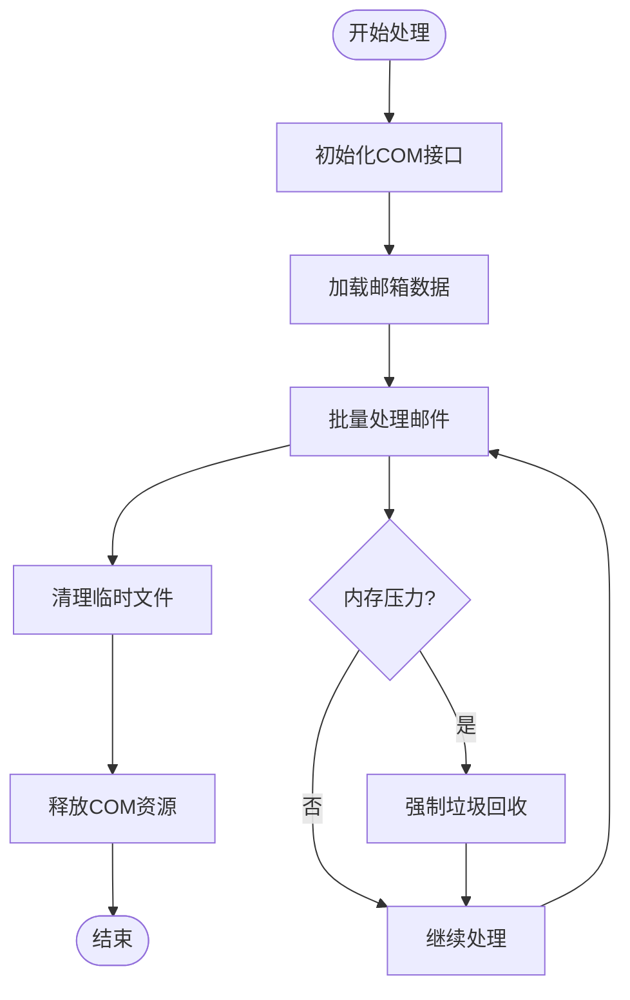
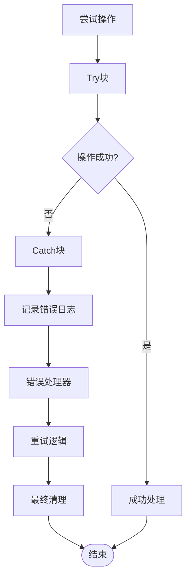

# Outlook集成模块

<cite>
**本文档引用的文件**
- [v1.py](file://v1.py)
- [v1.spec](file://v1.spec)
- [api_key.json](file://api_key.json)
</cite>

## 目录
1. [简介](#简介)
2. [项目结构](#项目结构)
3. [核心组件](#核心组件)
4. [架构概览](#架构概览)
5. [详细组件分析](#详细组件分析)
6. [依赖关系分析](#依赖关系分析)
7. [性能考虑](#性能考虑)
8. [故障排除指南](#故障排除指南)
9. [结论](#结论)

## 简介

Outlook集成模块是一个基于Python的桌面应用程序，专门设计用于自动化处理Outlook邮件中的附件。该模块利用win32com.client COM接口与Outlook应用程序进行交互，实现了智能邮件筛选、附件批量下载和AI驱动的内容识别重命名功能。

该应用程序采用GUI界面设计，支持用户通过图形界面配置发件人筛选条件、主题关键词过滤、保存路径设置和检索天数等参数。核心功能包括：
- Outlook应用程序连接和邮件对象访问
- 基于发件人名称和主题关键词的智能邮件筛选
- 时间排序机制和日期范围限制
- 附件批量下载和保存
- AI驱动的附件内容识别和智能命名
- 错误处理和异常恢复机制

## 项目结构

该项目采用简洁的单文件架构，所有功能都集中在单一的Python源文件中，便于部署和维护。

**图表来源**
- [v1.py:1-15](file://v1.py#L1-L15)
- [v1.spec:9-15](file://v1.spec#L9-L15)

**章节来源**
- [v1.py:1-15](file://v1.py#L1-L15)
- [v1.spec:1-45](file://v1.spec#L1-L45)

## 核心组件

### COM接口集成层

模块的核心是通过win32com.client库与Outlook进行COM接口通信。该层负责建立与Outlook应用程序的连接，访问邮件集合，并执行各种操作。

关键实现特点：
- 使用Dispatch方法创建Outlook应用程序实例
- 通过GetNamespace获取MAPI命名空间
- 访问默认收件箱文件夹（文件夹编号6）
- 支持COM接口的初始化和反初始化

### 邮件筛选引擎

邮件筛选功能是模块的核心业务逻辑，实现了多维度的邮件过滤和匹配机制。

主要筛选条件：
- 发件人名称匹配：支持发件人姓名和邮箱地址的模糊匹配
- 主题关键词过滤：对邮件主题进行不区分大小写的关键词匹配
- 时间范围限制：基于接收时间的日期范围筛选
- 排序机制：按接收时间降序排列邮件

### 附件处理流水线

附件处理流程包含多个阶段，从附件发现到最终保存，每个阶段都有相应的验证和错误处理。

处理步骤：
1. 邮件遍历和筛选
2. 附件数量验证
3. 文件大小过滤（>10KB）
4. 时间戳生成和文件命名
5. 附件保存到目标目录
6. AI智能重命名（可选）

**章节来源**
- [v1.py:261-435](file://v1.py#L261-L435)

## 架构概览

该系统采用分层架构设计，清晰分离了UI层、业务逻辑层和数据访问层。

**图表来源**
- [v1.py:199-435](file://v1.py#L199-L435)
- [v1.py:261-273](file://v1.py#L261-L273)

## 详细组件分析

### COM接口初始化与连接机制

Outlook应用程序连接是整个系统的基础，涉及COM接口的正确初始化和Outlook实例的获取。

**图表来源**
- [v1.py:261-273](file://v1.py#L261-L273)

关键实现细节：
- COM接口初始化：使用CoInitialize()确保线程安全
- Outlook实例创建：通过Dispatch方法动态加载Outlook应用程序
- 命名空间获取：使用MAPI命名空间访问标准文件夹
- 资源清理：始终执行CoUninitialize()防止内存泄漏

**章节来源**
- [v1.py:261-273](file://v1.py#L261-L273)

### 邮件筛选算法实现

邮件筛选算法是模块的核心业务逻辑，实现了高效的邮件匹配和过滤机制。

**图表来源**
- [v1.py:288-336](file://v1.py#L288-L336)

筛选算法的关键特性：
- **时间排序优化**：使用Sort方法按接收时间降序排列，提高筛选效率
- **早停机制**：一旦遇到超出日期范围的邮件立即停止遍历
- **多条件匹配**：同时支持发件人名称和主题关键词的精确匹配
- **类型安全**：对所有属性访问进行异常处理，确保程序稳定性

**章节来源**
- [v1.py:288-336](file://v1.py#L288-L336)

### 附件处理流程

附件处理流程涵盖了从发现附件到最终保存的完整生命周期管理。

**图表来源**
- [v1.py:346-410](file://v1.py#L346-L410)

处理流程的优化策略：
- **大小过滤**：跳过小于10KB的小文件，减少无效处理
- **并发处理**：使用独立线程处理长时间运行的操作
- **进度反馈**：实时更新UI状态和日志信息
- **错误隔离**：单个附件失败不影响整体流程

**章节来源**
- [v1.py:346-410](file://v1.py#L346-L410)

### AI智能命名系统

AI智能命名功能集成了阿里云百炼平台的Qwen-VL多模态模型，能够根据附件内容自动生成合适的文件名。

**图表来源**
- [v1.py:107-197](file://v1.py#L107-L197)

AI系统的实现特点：
- **多格式支持**：支持JPG、PNG、PDF等多种文件格式
- **智能提示**：针对不同文件类型生成相应的识别提示
- **临时文件管理**：自动创建和清理临时图像文件
- **API集成**：通过REST API调用阿里云百炼服务

**章节来源**
- [v1.py:107-197](file://v1.py#L107-L197)

### GUI界面与用户体验

界面设计采用了现代化的响应式布局，提供了直观易用的操作体验。

**图表来源**
- [v1.py:467-827](file://v1.py#L467-L827)

界面设计的关键特性：
- **自适应布局**：根据屏幕尺寸自动调整窗口大小
- **实时状态反馈**：通过状态栏和颜色编码提供操作状态
- **错误可视化**：使用不同颜色突出显示错误和警告信息
- **用户友好**：提供占位符文本和即时反馈

**章节来源**
- [v1.py:467-827](file://v1.py#L467-L827)

## 依赖关系分析

模块的依赖关系相对简单，主要依赖于几个核心库和外部服务。

**图表来源**
- [v1.py:1-15](file://v1.py#L1-L15)
- [v1.spec:9-15](file://v1.spec#L9-L15)

**章节来源**
- [v1.py:1-15](file://v1.py#L1-L15)
- [v1.spec:9-15](file://v1.spec#L9-L15)

## 性能考虑

### COM接口性能优化

COM接口调用是影响性能的关键因素，模块采用了多种优化策略：

1. **连接复用**：在整个下载过程中保持单个Outlook连接
2. **批量操作**：尽可能减少COM调用次数
3. **异步处理**：使用独立线程处理耗时操作
4. **资源管理**：及时释放COM资源，防止内存泄漏

### 内存管理策略

### 网络请求优化

AI识别服务的网络请求采用了以下优化策略：
- **超时控制**：设置60秒超时防止长时间阻塞
- **错误重试**：对临时性网络错误进行重试
- **连接复用**：使用持久连接减少握手开销
- **并发限制**：控制同时进行的AI请求数量

## 故障排除指南

### 常见问题诊断

#### Outlook连接问题
- **症状**：无法连接到Outlook应用程序
- **原因**：Outlook未安装或COM注册表问题
- **解决方案**：重新安装Outlook，检查COM组件注册

#### 权限问题
- **症状**：访问Outlook失败或权限不足
- **原因**：用户权限不足或UAC限制
- **解决方案**：以管理员身份运行程序

#### 文件保存失败
- **症状**：附件保存到磁盘失败
- **原因**：磁盘空间不足或路径权限问题
- **解决方案**：检查磁盘空间和目标路径权限

### 错误处理策略

模块实现了多层次的错误处理机制：

**章节来源**
- [v1.py:419-427](file://v1.py#L419-L427)

## 结论

Outlook集成模块是一个功能完整、设计合理的自动化工具，成功地将COM接口技术、GUI界面设计和AI服务集成为一体。该模块的主要优势包括：

**技术优势**：
- 稳健的COM接口集成，支持与Outlook的深度交互
- 高效的邮件筛选算法，支持多维度条件匹配
- 完善的错误处理机制，确保系统稳定性
- 现代化的GUI设计，提供良好的用户体验

**实用价值**：
- 自动化处理大量邮件附件，显著提高工作效率
- 智能命名功能减少手动整理工作量
- 可配置的筛选条件满足不同使用场景
- 跨平台兼容性良好

**改进建议**：
- 添加更多筛选选项，如邮件大小、发送时间等
- 实现增量同步功能，避免重复处理已处理的邮件
- 增加日志分析功能，帮助用户了解处理历史
- 提供批量配置模板，支持不同用户的使用习惯

该模块为Outlook邮件附件管理提供了一个可靠的解决方案，适合在企业环境中推广使用。