# 多线程架构设计

<cite>
**本文档引用的文件**
- [v1.py](file://v1.py)
- [v1.spec](file://v1.spec)
- [api_key.json](file://api_key.json)
</cite>

## 目录
1. [引言](#引言)
2. [项目结构](#项目结构)
3. [核心组件](#核心组件)
4. [架构概览](#架构概览)
5. [详细组件分析](#详细组件分析)
6. [依赖关系分析](#依赖关系分析)
7. [性能考虑](#性能考虑)
8. [故障排除指南](#故障排除指南)
9. [结论](#结论)

## 引言

本文档深入分析了基于Python Tkinter的多线程架构设计，重点探讨了UI线程安全更新机制、后台工作线程管理、线程间通信策略等核心设计模式。该系统通过巧妙的线程间通信机制实现了响应式的用户界面，同时确保了UI线程的安全性。

## 项目结构

该项目采用简洁的单文件架构设计，所有功能集中在单一Python文件中，便于部署和维护：

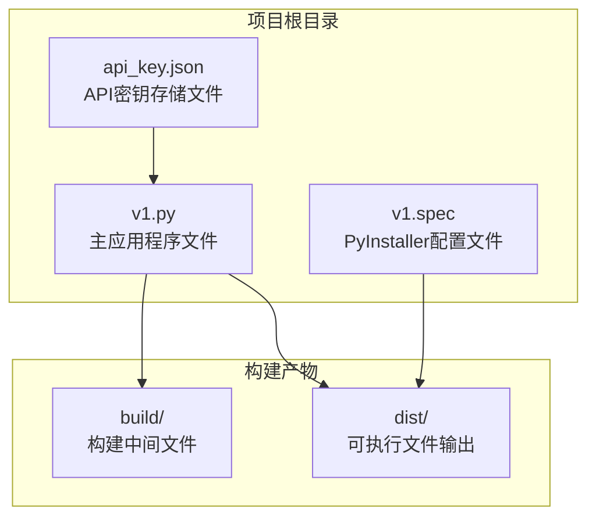

**图表来源**
- [v1.py:1-860](file://v1.py#L1-L860)
- [v1.spec:1-45](file://v1.spec#L1-L45)

**章节来源**
- [v1.py:1-860](file://v1.py#L1-L860)
- [v1.spec:1-45](file://v1.spec#L1-L45)

## 核心组件

### UI线程安全更新机制

系统实现了完善的UI线程安全更新机制，通过`ui_call`函数确保所有UI操作都在主线程中执行：

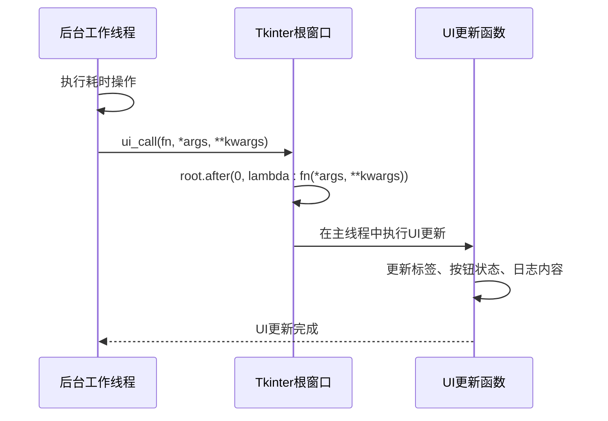

**图表来源**
- [v1.py:201-205](file://v1.py#L201-L205)

### 后台工作线程管理

系统使用Python标准库的`threading`模块创建后台工作线程，采用守护线程模式确保应用退出时线程能够正确终止：

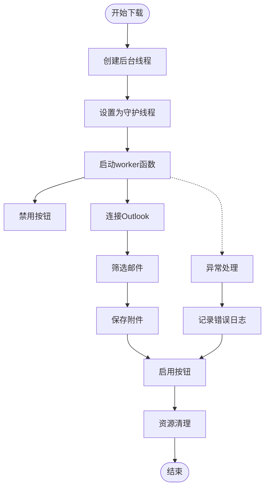

**图表来源**
- [v1.py:257-435](file://v1.py#L257-L435)

**章节来源**
- [v1.py:199-435](file://v1.py#L199-L435)

## 架构概览

系统采用经典的GUI多线程架构模式，将耗时操作与UI更新分离：

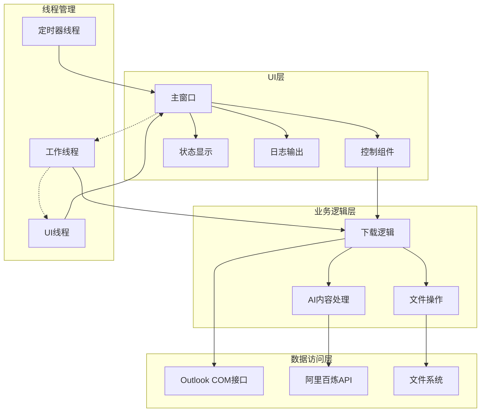

**图表来源**
- [v1.py:467-860](file://v1.py#L467-L860)

## 详细组件分析

### UI线程安全更新组件

#### ui_call函数实现原理

`ui_call`函数是整个多线程架构的核心，它通过`root.after()`机制确保UI更新在主线程中执行：

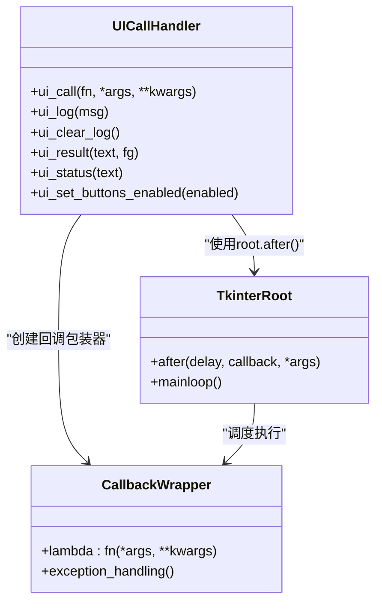

**图表来源**
- [v1.py:201-229](file://v1.py#L201-L229)

#### root.after回调机制详解

`root.after()`方法提供了线程安全的回调调度机制：

| 参数 | 类型 | 描述 |
|------|------|------|
| delay | int | 延迟毫秒数，0表示立即执行 |
| callback | callable | 回调函数 |
| *args | tuple | 回调参数 |

回调机制的工作流程：
1. 后台线程调用`ui_call()`
2. `root.after(0, lambda: fn(*args, **kwargs))`注册回调
3. Tkinter事件循环在下一个空闲时刻执行回调
4. 回调在UI线程中安全执行

**章节来源**
- [v1.py:201-205](file://v1.py#L201-L205)

### 后台工作线程组件

#### worker函数架构

后台工作线程负责执行所有耗时操作，包括Outlook连接、邮件筛选、附件下载等：

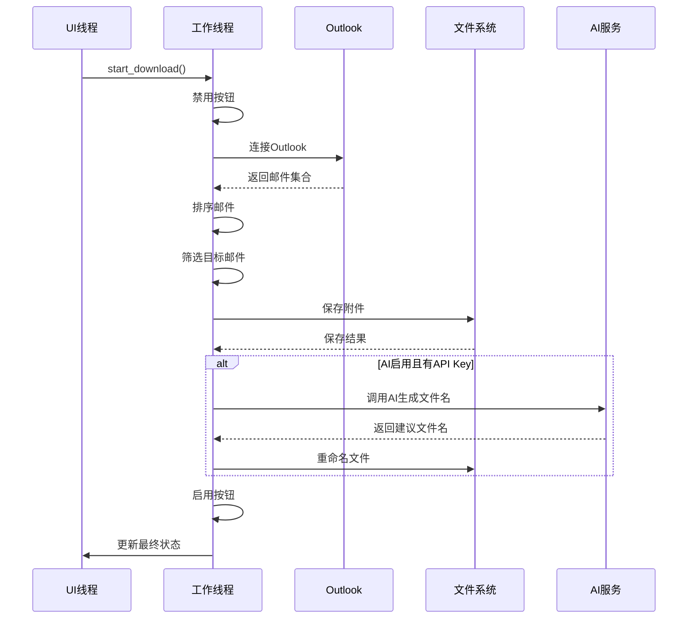

**图表来源**
- [v1.py:257-435](file://v1.py#L257-L435)

#### 线程同步策略

系统采用多种同步策略确保线程安全：

1. **UI线程独占原则**：所有UI操作必须在UI线程中执行
2. **异常隔离**：后台线程异常不影响UI线程
3. **资源管理**：确保COM对象正确初始化和清理

**章节来源**
- [v1.py:257-435](file://v1.py#L257-L435)

### 线程间通信策略

#### 通信机制设计

系统通过以下方式实现线程间通信：

```mermaid
flowchart LR
subgraph "线程间通信模式"
A[UI线程] < --> B[root.after回调]
C[后台线程] < --> D[UI更新函数]
E[异常信息] < --> F[日志记录]
end
subgraph "通信通道"
G[lambda表达式]
H[参数传递]
I[异常传播]
end
A --> G
C --> H
E --> I
```

**图表来源**
- [v1.py:201-229](file://v1.py#L201-L229)

#### 异常处理在多线程环境下的特殊考虑

异常处理机制确保了系统的健壮性：

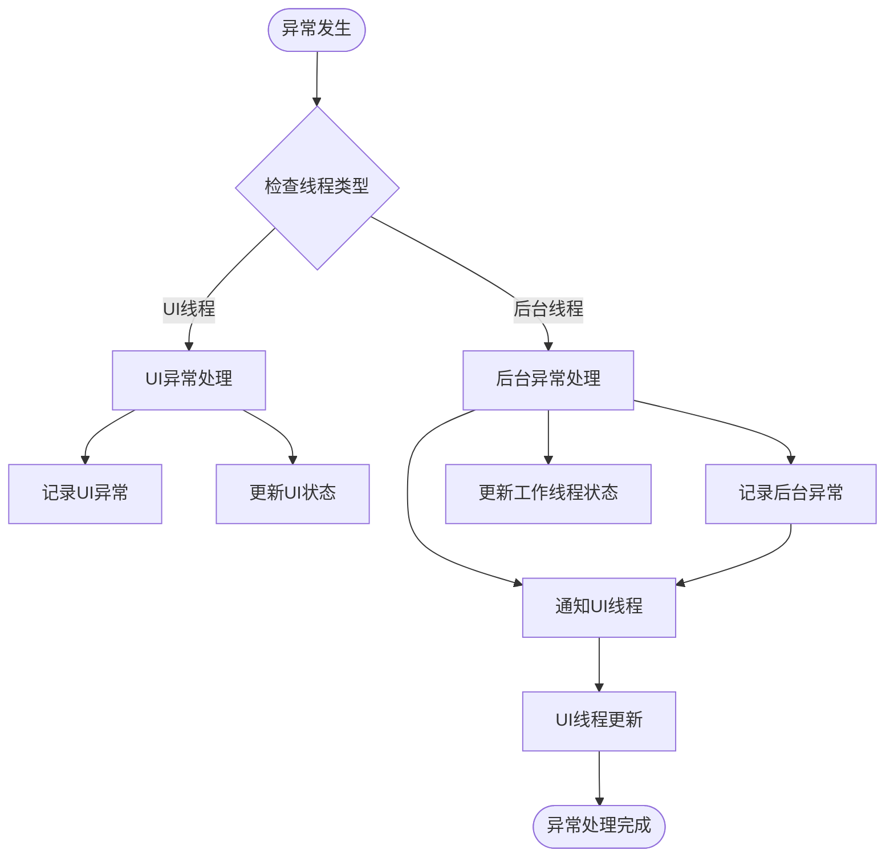

**图表来源**
- [v1.py:419-426](file://v1.py#L419-L426)

**章节来源**
- [v1.py:419-426](file://v1.py#L419-L426)

### 线程生命周期管理

#### 线程创建与启动

系统使用Python标准库的线程管理机制：

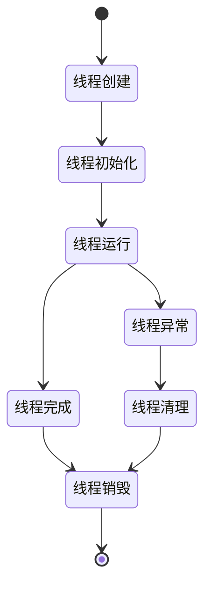

#### 资源清理策略

系统实现了多层次的资源清理机制：

1. **COM对象清理**：确保Outlook连接正确释放
2. **文件句柄清理**：防止文件占用导致的问题
3. **UI状态恢复**：异常情况下恢复UI控件状态

**章节来源**
- [v1.py:427-433](file://v1.py#L427-L433)

## 依赖关系分析

### 外部依赖管理

系统依赖关系清晰明确：

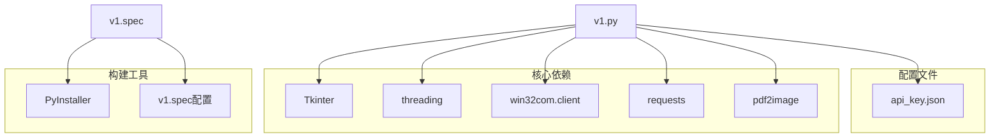

**图表来源**
- [v1.py:1-14](file://v1.py#L1-L14)
- [v1.spec:9-15](file://v1.spec#L9-L15)

### 模块导入策略

系统采用了条件导入和延迟导入策略：

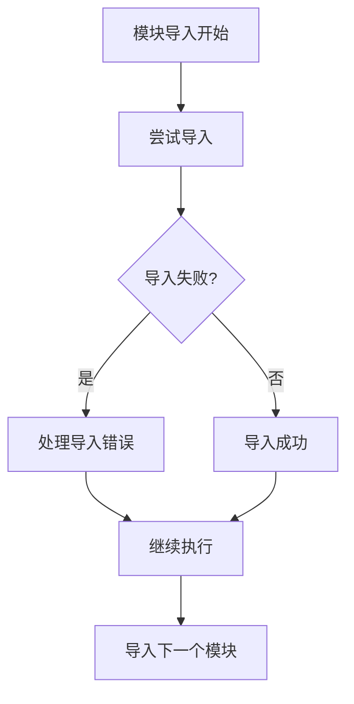

**图表来源**
- [v1.py:16-19](file://v1.py#L16-L19)

**章节来源**
- [v1.py:1-14](file://v1.py#L1-L14)
- [v1.spec:9-15](file://v1.spec#L9-L15)

## 性能考虑

### 线程性能优化

系统在性能方面采取了多项优化措施：

1. **异步I/O操作**：网络请求和文件操作都是异步的
2. **内存管理**：及时清理临时文件和图像对象
3. **UI响应性**：通过回调机制保持UI流畅

### 内存使用优化

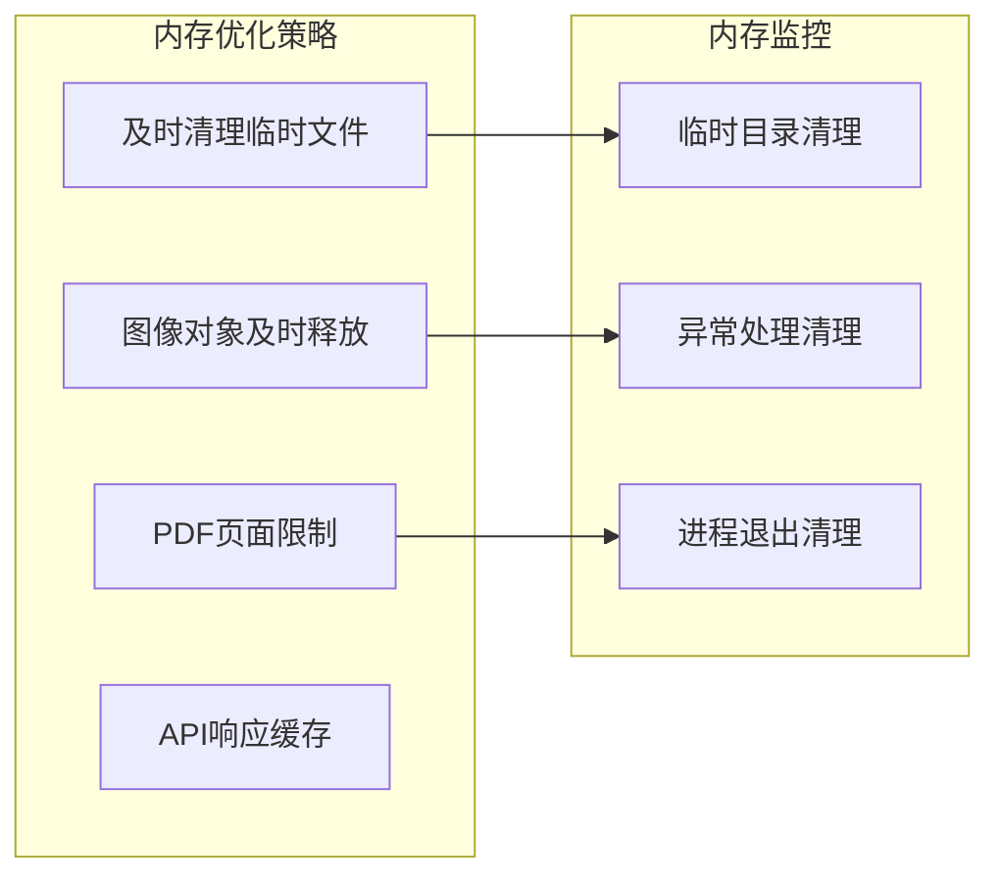

## 故障排除指南

### 常见问题及解决方案

#### UI线程阻塞问题

**问题描述**：UI界面无响应
**解决方案**：确保所有耗时操作都在后台线程执行

#### 线程安全问题

**问题描述**：UI更新出现异常
**解决方案**：使用`ui_call`函数确保UI操作在线程中执行

#### 资源泄漏问题

**问题描述**：Outlook连接无法释放
**解决方案**：确保在finally块中调用`CoUninitialize()`

**章节来源**
- [v1.py:427-433](file://v1.py#L427-L433)

### 调试技巧

1. **日志记录**：使用`ui_log`函数记录详细的操作过程
2. **状态跟踪**：通过`status_var`监控系统状态
3. **异常捕获**：在关键位置添加异常处理代码

## 结论

该多线程架构设计展现了优秀的软件工程实践，通过巧妙的UI线程安全更新机制和后台工作线程管理，实现了高性能、高可用的桌面应用程序。系统的设计充分考虑了线程安全、资源管理和异常处理等关键因素，为类似的应用程序提供了良好的参考模板。

主要设计亮点包括：
- 完善的UI线程安全机制
- 清晰的线程间通信策略  
- 健壮的异常处理和资源管理
- 优雅的用户体验设计

这些设计原则和实现模式可以广泛应用于其他需要多线程支持的桌面应用程序开发中。