# 技术实现细节

<cite>
**本文档引用的文件**
- [v1.py](file://v1.py)
- [v1.spec](file://v1.spec)
- [api_key.json](file://api_key.json)
</cite>

## 目录
1. [项目概述](#项目概述)
2. [系统架构](#系统架构)
3. [核心组件分析](#核心组件分析)
4. [Outlook COM接口集成](#outlook-com接口集成)
5. [AI智能命名系统](#ai智能命名系统)
6. [多线程架构设计](#多线程架构设计)
7. [数据流分析](#数据流分析)
8. [性能优化策略](#性能优化策略)
9. [错误处理机制](#错误处理机制)
10. [内存管理策略](#内存管理策略)
11. [线程安全机制](#线程安全机制)
12. [扩展性设计](#扩展性设计)
13. [故障排除指南](#故障排除指南)
14. [总结](#总结)

## 项目概述

Outlook附件下载AI智能命名系统是一个基于Python开发的企业级自动化工具，专门用于从Outlook邮箱中批量下载附件并利用AI技术进行智能命名。该系统集成了Outlook COM接口、阿里百炼AI服务、PDF图像转换等功能，为用户提供高效、智能化的附件管理解决方案。

### 主要功能特性
- **批量附件下载**：支持从指定发件人和主题的邮件中批量下载附件
- **AI智能命名**：利用Qwen-VL-Max多模态模型对图片和PDF内容进行分析，生成语义化文件名
- **多线程架构**：采用异步多线程设计，确保UI响应性和处理效率
- **智能PDF处理**：支持PDF文件的图像提取和OCR识别
- **灵活配置**：支持API密钥管理、模型选择、保存路径配置等

## 系统架构

系统采用分层架构设计，主要分为以下层次：

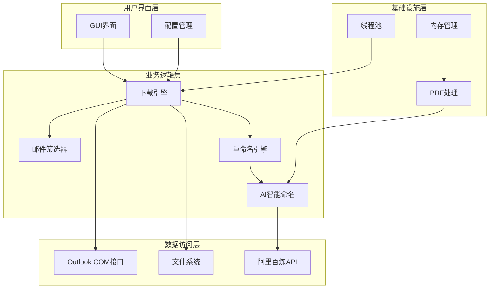

**图表来源**
- [v1.py:467-827](file://v1.py#L467-L827)

## 核心组件分析

### 1. 主应用框架

系统采用tkinter作为GUI框架，提供了直观的用户界面和丰富的交互功能。主要组件包括：

- **主窗口管理**：自适应窗口尺寸，支持多分辨率显示
- **参数配置面板**：发件人名称、主题关键词、保存路径、检索天数等
- **AI配置面板**：API密钥管理、模型选择、智能命名开关
- **日志输出面板**：实时显示操作状态和错误信息

### 2. 配置管理系统

系统实现了完善的配置管理机制：

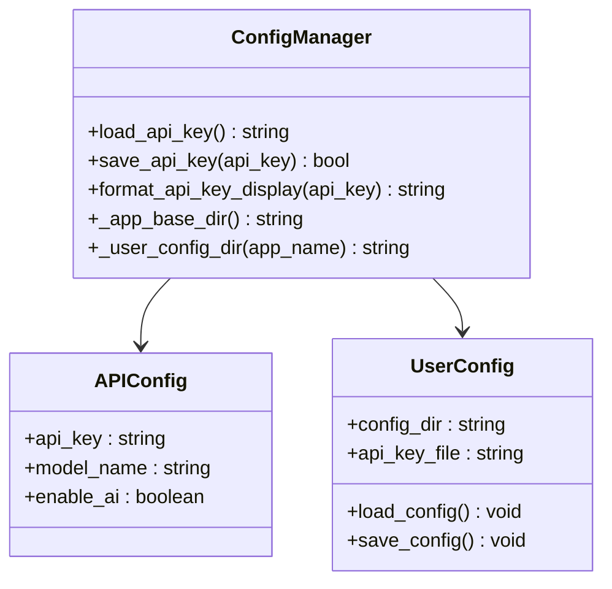

**图表来源**
- [v1.py:28-65](file://v1.py#L28-L65)

**章节来源**
- [v1.py:28-65](file://v1.py#L28-L65)
- [v1.py:467-827](file://v1.py#L467-L827)

### 3. PDF处理引擎

系统集成了PDF图像转换功能，支持多种PDF处理场景：

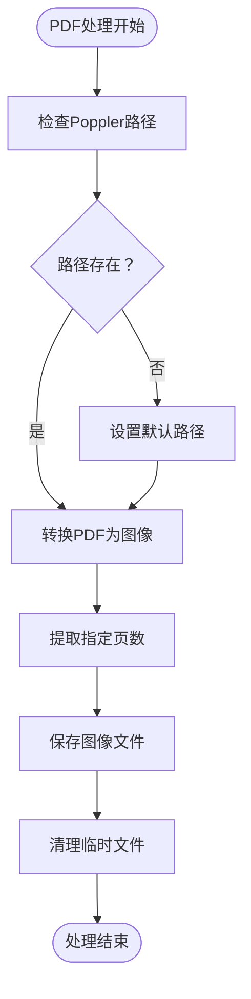

**图表来源**
- [v1.py:97-105](file://v1.py#L97-L105)
- [v1.py:160-175](file://v1.py#L160-L175)

**章节来源**
- [v1.py:97-105](file://v1.py#L97-L105)
- [v1.py:160-175](file://v1.py#L160-L175)

## Outlook COM接口集成

### COM接口初始化

系统通过win32com.client模块与Outlook进行深度集成，实现了稳定的COM接口通信：

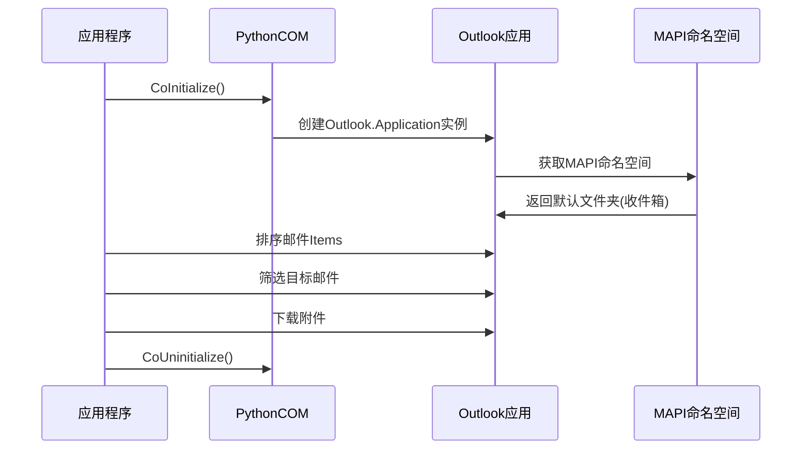

**图表来源**
- [v1.py:261-273](file://v1.py#L261-L273)

### 邮件筛选算法

系统实现了高效的邮件筛选算法，支持多维度条件匹配：

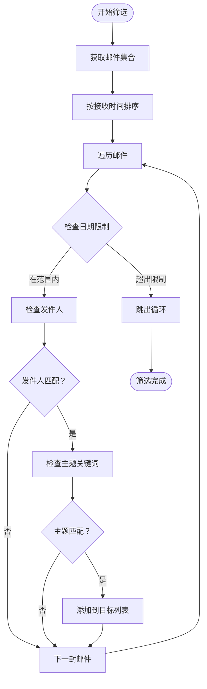

**图表来源**
- [v1.py:288-335](file://v1.py#L288-L335)

**章节来源**
- [v1.py:261-273](file://v1.py#L261-L273)
- [v1.py:288-335](file://v1.py#L288-L335)

## AI智能命名系统

### 多模态AI集成

系统集成了阿里百炼的Qwen-VL-Max多模态模型，实现了强大的内容理解能力：

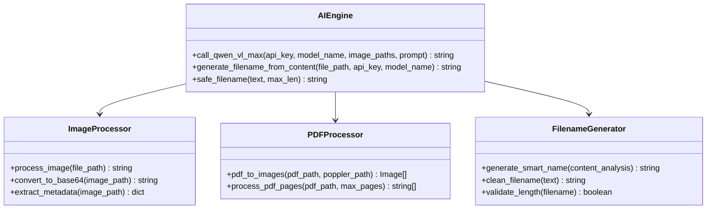

**图表来源**
- [v1.py:107-148](file://v1.py#L107-L148)
- [v1.py:149-197](file://v1.py#L149-L197)

### AI命名流程

系统实现了完整的AI命名流程，针对不同文件类型采用不同的处理策略：

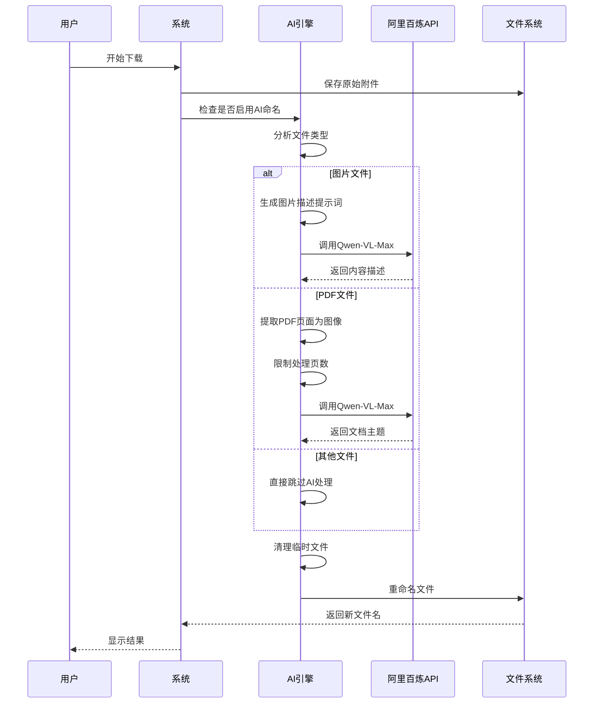

**图表来源**
- [v1.py:149-197](file://v1.py#L149-L197)

**章节来源**
- [v1.py:107-148](file://v1.py#L107-L148)
- [v1.py:149-197](file://v1.py#L149-L197)

## 多线程架构设计

### 线程模型

系统采用了异步多线程架构，确保UI响应性和后台处理的高效性：

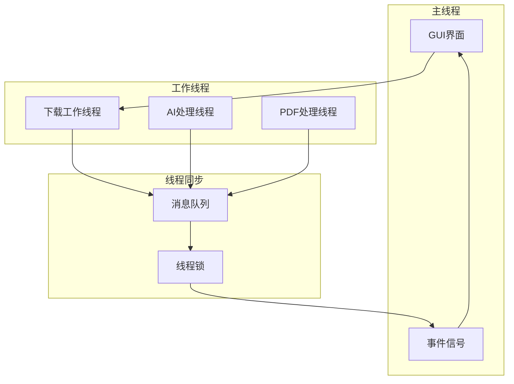

**图表来源**
- [v1.py:257-435](file://v1.py#L257-L435)

### 线程安全机制

系统实现了完善的线程安全保护：

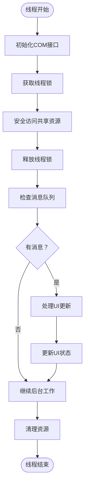

**图表来源**
- [v1.py:200-230](file://v1.py#L200-L230)

**章节来源**
- [v1.py:257-435](file://v1.py#L257-L435)
- [v1.py:200-230](file://v1.py#L200-L230)

## 数据流分析

### 完整的数据处理流程

系统实现了端到端的数据处理管道：

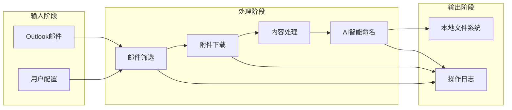

**图表来源**
- [v1.py:199-435](file://v1.py#L199-L435)

### 错误传播机制

系统建立了完整的错误处理和传播机制：

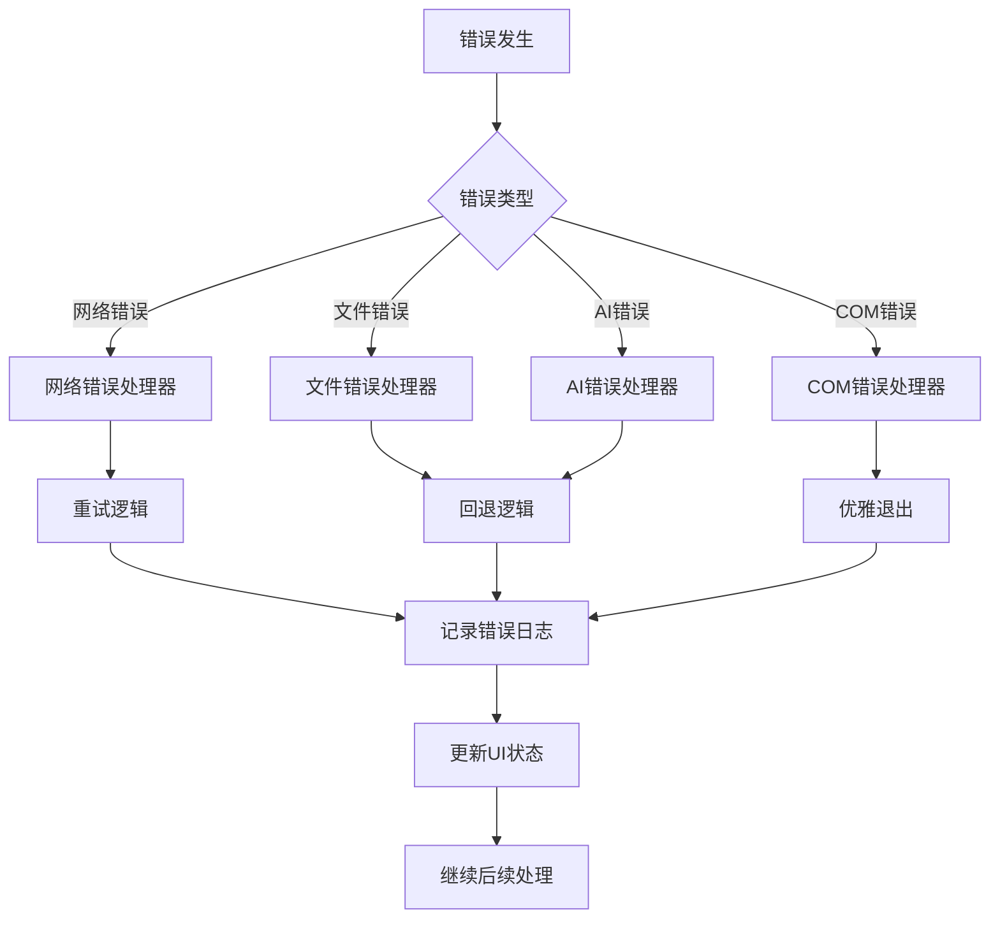

**图表来源**
- [v1.py:419-426](file://v1.py#L419-L426)

**章节来源**
- [v1.py:199-435](file://v1.py#L199-L435)
- [v1.py:419-426](file://v1.py#L419-L426)

## 性能优化策略

### 内存优化技术

系统采用了多项内存优化技术：

1. **延迟加载机制**：仅在需要时加载PDF页面到内存
2. **临时文件管理**：自动清理处理过程中的临时文件
3. **对象池模式**：复用COM对象减少内存分配
4. **垃圾回收控制**：手动触发垃圾回收确保及时释放

### 并发处理优化

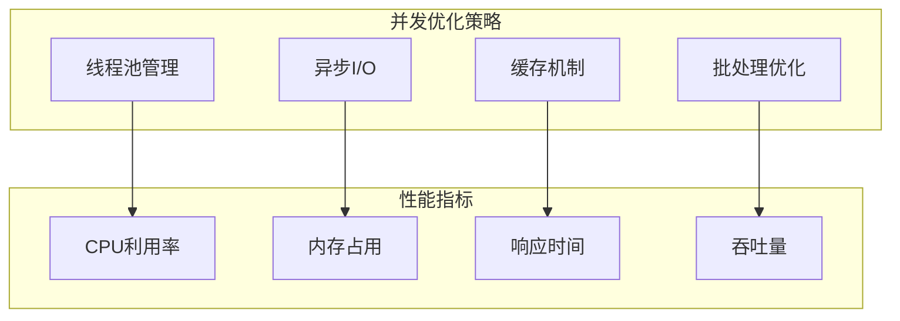

**图表来源**
- [v1.py:12-14](file://v1.py#L12-L14)

### 缓存策略

系统实现了多层次的缓存机制：

- **API响应缓存**：缓存AI模型的响应结果
- **文件元数据缓存**：缓存文件的基本信息
- **配置缓存**：缓存用户配置和API密钥

**章节来源**
- [v1.py:12-14](file://v1.py#L12-L14)

## 错误处理机制

### 错误分类体系

系统建立了完整的错误分类和处理体系：

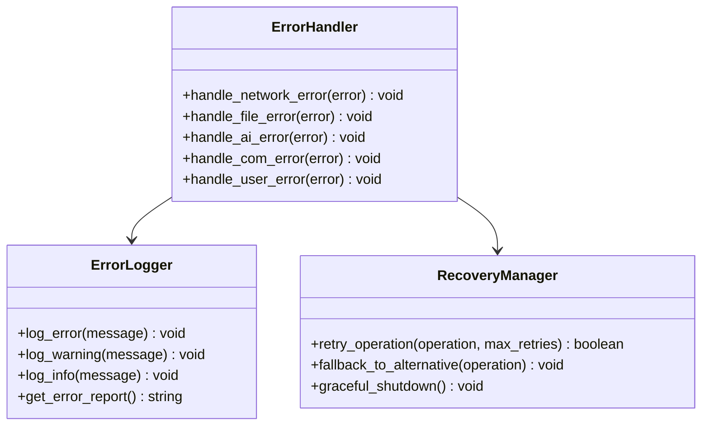

**图表来源**
- [v1.py:419-426](file://v1.py#L419-L426)

### 异常处理流程

系统实现了标准化的异常处理流程：

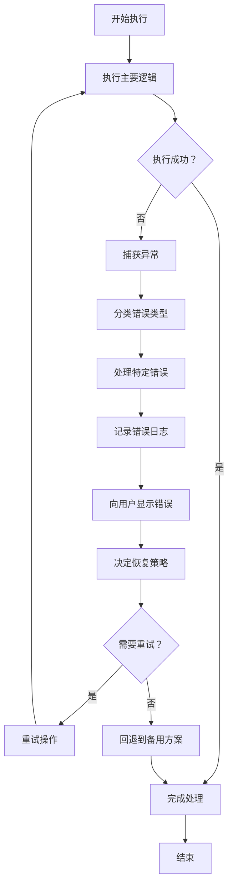

**图表来源**
- [v1.py:419-426](file://v1.py#L419-L426)

**章节来源**
- [v1.py:419-426](file://v1.py#L419-L426)

## 内存管理策略

### 内存使用监控

系统实现了实时的内存使用监控：

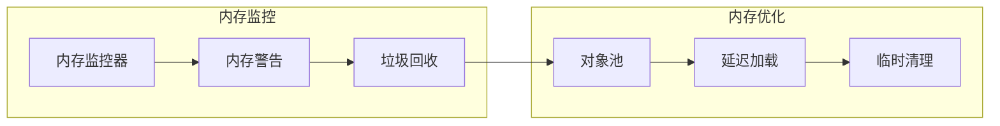

**图表来源**
- [v1.py:184-196](file://v1.py#L184-L196)

### 资源生命周期管理

系统建立了严格的资源生命周期管理：

1. **COM对象管理**：确保每个创建的COM对象都能正确释放
2. **文件句柄管理**：防止文件句柄泄漏
3. **网络连接管理**：及时关闭HTTP连接
4. **临时文件管理**：确保所有临时文件都被清理

**章节来源**
- [v1.py:184-196](file://v1.py#L184-L196)

## 线程安全机制

### 线程同步保护

系统采用了多层线程同步保护机制：

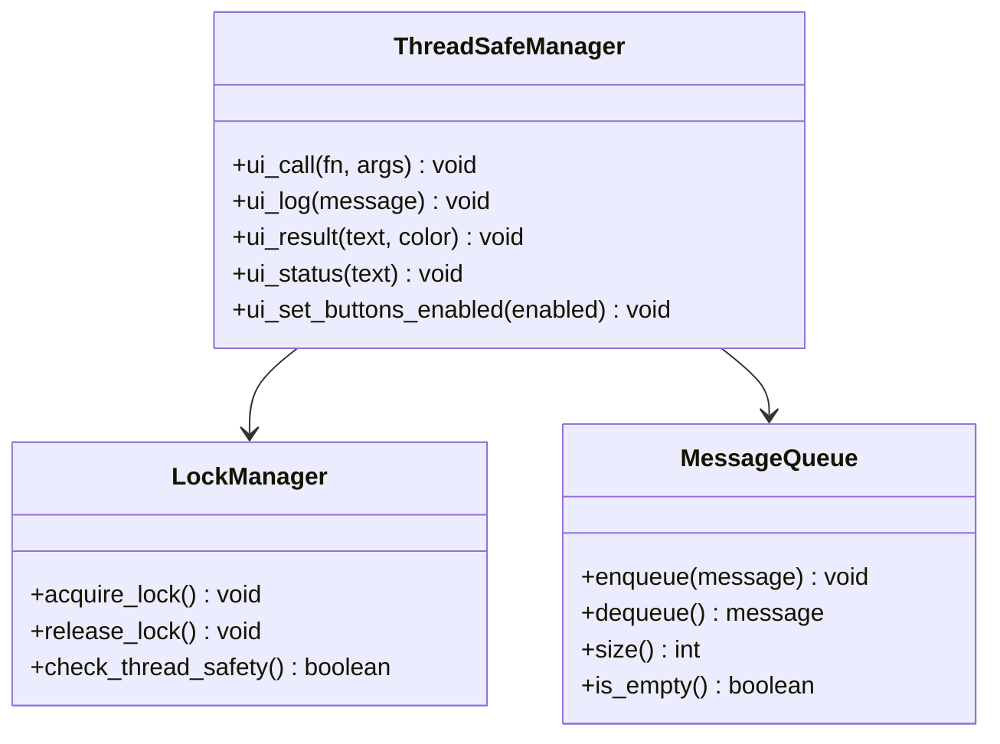

**图表来源**
- [v1.py:200-230](file://v1.py#L200-L230)

### 线程间通信

系统实现了安全的线程间通信机制：

- **消息队列**：用于线程间的消息传递
- **事件信号**：用于线程间的同步通知
- **共享状态**：通过受保护的变量进行状态共享

**章节来源**
- [v1.py:200-230](file://v1.py#L200-L230)

## 扩展性设计

### 插件架构

系统设计了可扩展的插件架构：

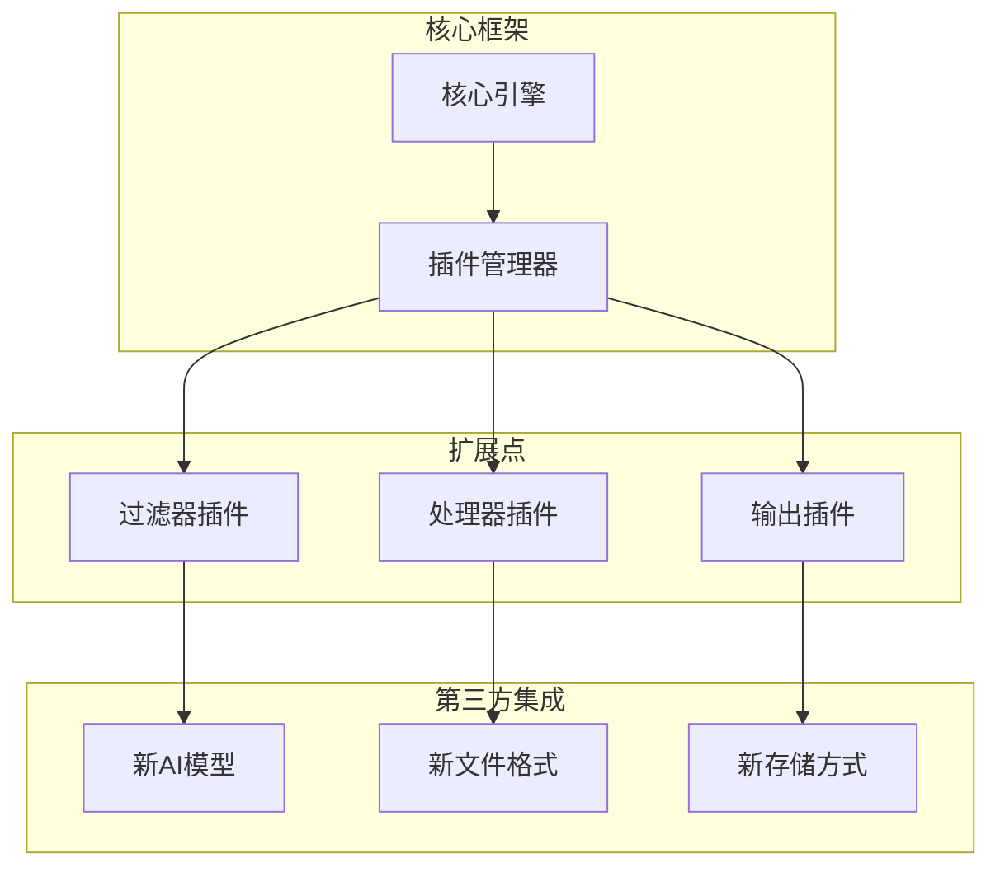

### 配置扩展

系统支持灵活的配置扩展：

- **模型配置**：支持多种AI模型的配置
- **文件格式支持**：可扩展支持新的文件格式
- **存储后端**：支持多种存储后端配置

**章节来源**
- [v1.py:737-742](file://v1.py#L737-L742)

## 故障排除指南

### 常见问题诊断

| 问题类型 | 症状 | 可能原因 | 解决方案 |
|---------|------|----------|----------|
| Outlook连接失败 | 无法连接Outlook应用 | COM注册问题或权限不足 | 检查Outlook安装和用户权限 |
| API调用失败 | AI功能不可用 | 网络连接或API密钥问题 | 检查网络连接和API密钥配置 |
| PDF处理错误 | PDF文件无法转换 | Poppler路径配置错误 | 验证Poppler安装路径 |
| 内存不足 | 程序运行缓慢或崩溃 | 大文件处理导致内存溢出 | 减少同时处理的文件数量 |

### 调试工具

系统提供了内置的调试功能：

- **详细日志记录**：记录所有操作步骤和错误信息
- **性能监控**：监控内存使用和处理速度
- **状态指示器**：实时显示系统状态和进度

**章节来源**
- [v1.py:819-821](file://v1.py#L819-L821)

## 总结

Outlook附件下载AI智能命名系统是一个功能完整、架构清晰的企业级应用。系统通过集成Outlook COM接口、AI智能命名、多线程处理等技术，为用户提供了高效、智能的附件管理解决方案。

### 技术亮点

1. **深度Outlook集成**：通过COM接口实现与Outlook的深度集成
2. **AI智能命名**：利用先进的多模态AI模型实现语义化文件命名
3. **多线程架构**：采用异步多线程设计确保良好的用户体验
4. **完善的错误处理**：建立了完整的错误分类和恢复机制
5. **内存优化**：实现了多项内存优化技术确保系统稳定性

### 扩展建议

1. **支持更多AI模型**：可以集成其他AI服务提供商
2. **增强文件格式支持**：支持更多类型的文件处理
3. **云存储集成**：支持云存储服务的直接上传
4. **批量处理优化**：进一步优化大量文件的处理性能

该系统为开发者提供了良好的技术基础和扩展框架，可以根据具体需求进行定制化开发和功能增强。