# 错误处理与异常管理

<cite>
**本文档引用的文件**
- [v1.py](file://v1.py)
- [v1.spec](file://v1.spec)
- [api_key.json](file://api_key.json)
</cite>

## 目录
1. [简介](#简介)
2. [项目结构](#项目结构)
3. [核心组件](#核心组件)
4. [架构概览](#架构概览)
5. [详细组件分析](#详细组件分析)
6. [依赖关系分析](#依赖关系分析)
7. [性能考虑](#性能考虑)
8. [故障排除指南](#故障排除指南)
9. [结论](#结论)

## 简介

本文档深入分析了Outlook附件下载AI智能命名系统的错误处理与异常管理机制。该系统采用多层异常处理策略，涵盖UI线程安全更新、网络请求异常、文件操作异常、第三方库兼容性问题等多个层面。系统通过结构化的异常捕获、资源清理、用户友好的错误提示等机制，确保在各种异常情况下仍能保持稳定运行。

## 项目结构

该项目采用单文件架构设计，所有功能集中在单一Python文件中，便于打包和部署：

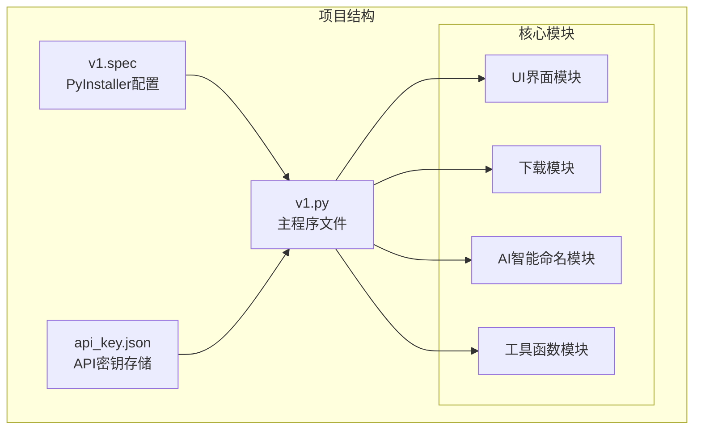

**图表来源**
- [v1.py:1-860](file://v1.py#L1-L860)
- [v1.spec:1-45](file://v1.spec#L1-L45)

**章节来源**
- [v1.py:1-860](file://v1.py#L1-L860)
- [v1.spec:1-45](file://v1.spec#L1-L45)

## 核心组件

系统的核心异常处理机制围绕以下关键组件构建：

### 1. UI线程安全异常处理
系统实现了专门的UI线程安全更新机制，确保后台线程能够安全地更新GUI组件：

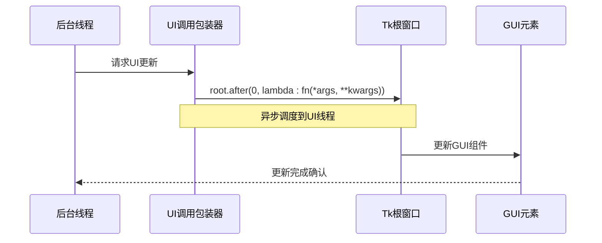

**图表来源**
- [v1.py:200-230](file://v1.py#L200-L230)

### 2. 分层异常处理策略
系统采用多层次的异常处理策略，从底层API调用到UI层都有相应的错误处理机制：

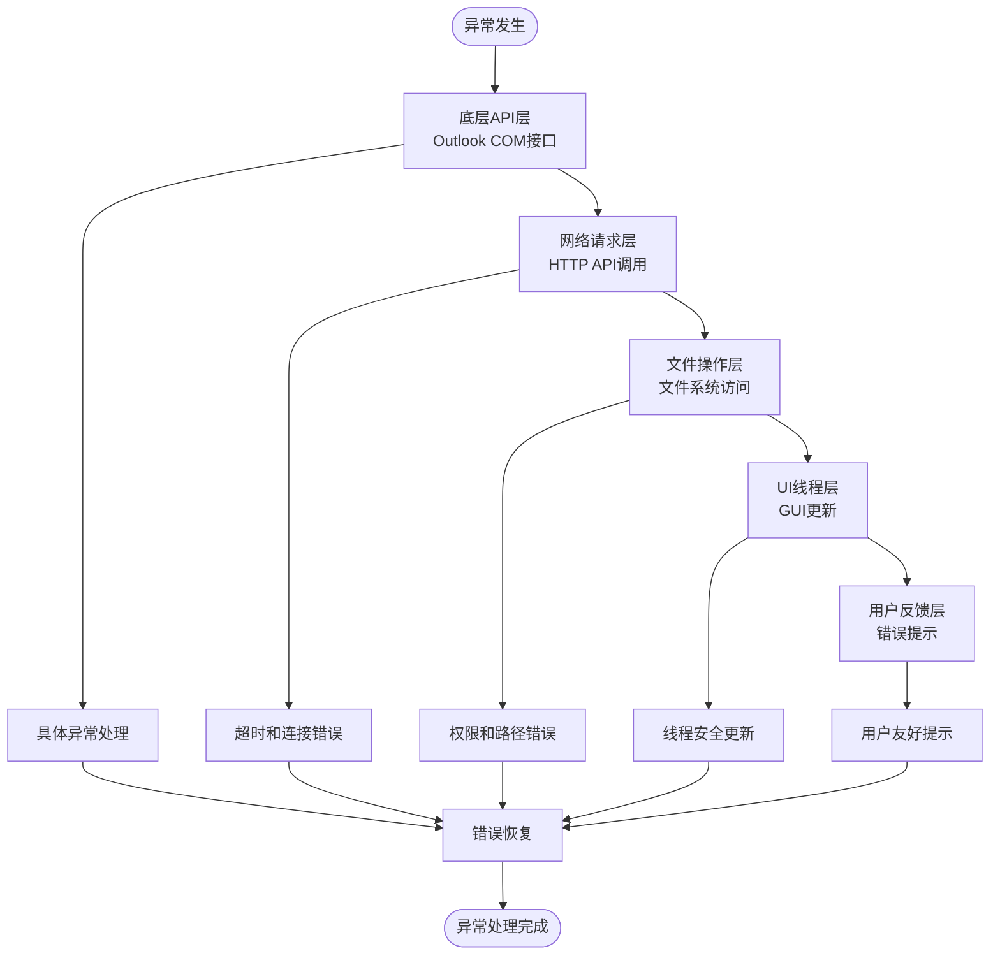

**图表来源**
- [v1.py:16-19](file://v1.py#L16-L19)
- [v1.py:38-46](file://v1.py#L38-L46)
- [v1.py:242-426](file://v1.py#L242-L426)

**章节来源**
- [v1.py:16-19](file://v1.py#L16-L19)
- [v1.py:38-46](file://v1.py#L38-L46)
- [v1.py:200-230](file://v1.py#L200-L230)
- [v1.py:242-426](file://v1.py#L242-L426)

## 架构概览

系统采用异步架构设计，通过多线程处理长时间运行的任务，同时保持UI响应性：

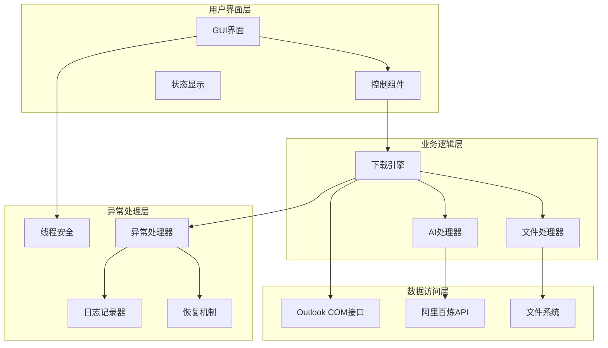

**图表来源**
- [v1.py:199-435](file://v1.py#L199-L435)
- [v1.py:467-860](file://v1.py#L467-L860)

## 详细组件分析

### 1. API密钥管理异常处理

API密钥管理系统实现了完整的异常处理机制，包括文件读取、写入和格式化显示：

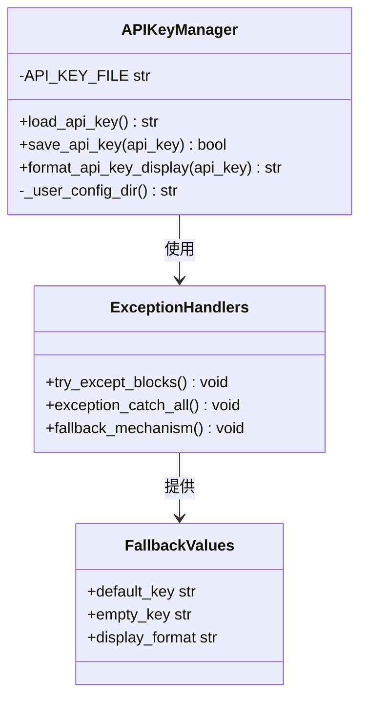

**图表来源**
- [v1.py:38-64](file://v1.py#L38-L64)

#### API密钥加载流程
系统在加载API密钥时采用了多重保护措施：

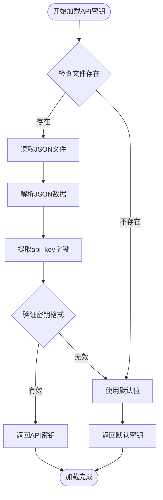

**图表来源**
- [v1.py:38-46](file://v1.py#L38-L46)

**章节来源**
- [v1.py:38-64](file://v1.py#L38-L64)

### 2. PDF转图像异常处理

PDF处理模块实现了robust的异常处理机制，确保在各种PDF格式和路径配置下都能正常工作：

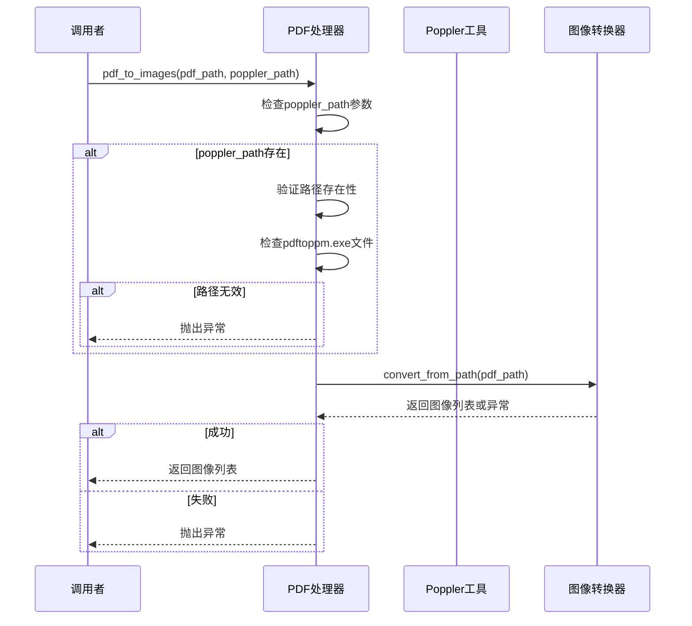

**图表来源**
- [v1.py:97-105](file://v1.py#L97-L105)

#### PDF处理异常场景
系统针对PDF处理可能遇到的各种异常情况提供了专门的处理机制：

**章节来源**
- [v1.py:97-105](file://v1.py#L97-L105)

### 3. AI智能命名异常处理

AI智能命名功能实现了复杂的异常处理策略，包括API调用、图像处理和文件重命名等各个环节：

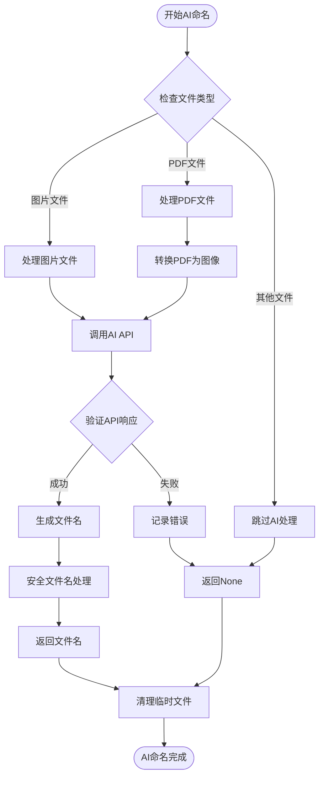

**图表来源**
- [v1.py:149-196](file://v1.py#L149-L196)

#### 资源清理策略
系统在AI命名过程中实现了完善的资源清理机制：

**章节来源**
- [v1.py:149-196](file://v1.py#L149-L196)

### 4. 下载引擎异常处理

下载引擎是系统中最复杂的异常处理模块，涵盖了Outlook连接、邮件筛选、附件保存、AI重命名等多个环节：

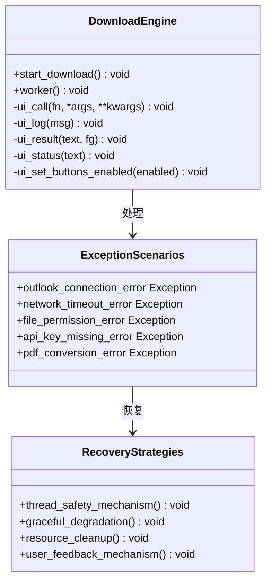

**图表来源**
- [v1.py:199-435](file://v1.py#L199-L435)

#### 下载过程异常处理流程

**章节来源**
- [v1.py:199-435](file://v1.py#L199-L435)

### 5. UI线程安全更新机制

系统实现了专门的UI线程安全更新机制，确保后台线程能够安全地更新GUI组件：

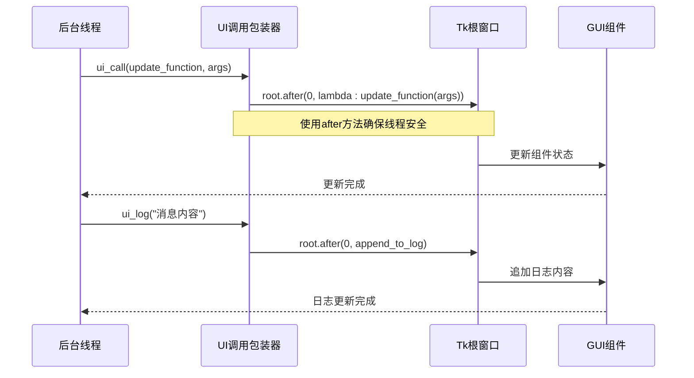

**图表来源**
- [v1.py:200-230](file://v1.py#L200-L230)

**章节来源**
- [v1.py:200-230](file://v1.py#L200-L230)

## 依赖关系分析

系统对外部依赖的异常处理体现了良好的工程实践：

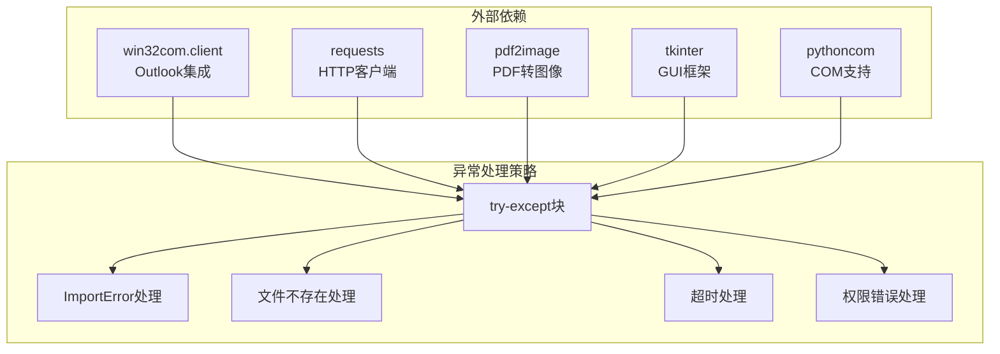

**图表来源**
- [v1.py:16-19](file://v1.py#L16-L19)
- [v1.py:108-147](file://v1.py#L108-L147)

### PyInstaller打包配置的异常处理

系统在打包配置中包含了对特定模块的异常处理：

**章节来源**
- [v1.spec:9-15](file://v1.spec#L9-L15)

## 性能考虑

系统在异常处理方面采用了多项性能优化策略：

### 1. 异步处理优化
- 使用`daemon=True`线程避免主线程阻塞
- 通过`root.after()`实现非阻塞的UI更新
- 合理的线程池管理和资源回收

### 2. 内存管理优化
- 及时清理临时文件和目录
- 使用`finally`块确保资源释放
- 控制AI处理的图像数量限制

### 3. 网络请求优化
- 设置合理的超时时间（60秒）
- 实现重试机制和错误降级
- 缓存API密钥避免重复读取

## 故障排除指南

### 常见异常类型及解决方案

#### 1. API密钥相关异常
- **异常现象**: "请先填写 API Key"
- **可能原因**: API密钥未正确配置
- **解决方法**: 检查api_key.json文件是否存在，重新申请并保存API密钥

#### 2. PDF处理异常
- **异常现象**: "Poppler路径不存在" 或 "pdftoppm.exe未找到"
- **可能原因**: Poppler工具安装路径配置错误
- **解决方法**: 设置环境变量POPPLER_PATH或手动配置poppler路径

#### 3. Outlook连接异常
- **异常现象**: "无法连接Outlook"
- **可能原因**: Outlook未安装或COM接口不可用
- **解决方法**: 确保Outlook已安装，检查pythoncom模块可用性

#### 4. 权限相关异常
- **异常现象**: "保存失败" 或 "权限不足"
- **可能原因**: 目标目录权限不足或磁盘空间不足
- **解决方法**: 更换保存路径，检查磁盘空间，以管理员身份运行

### 调试信息收集

系统提供了完整的调试信息收集机制：

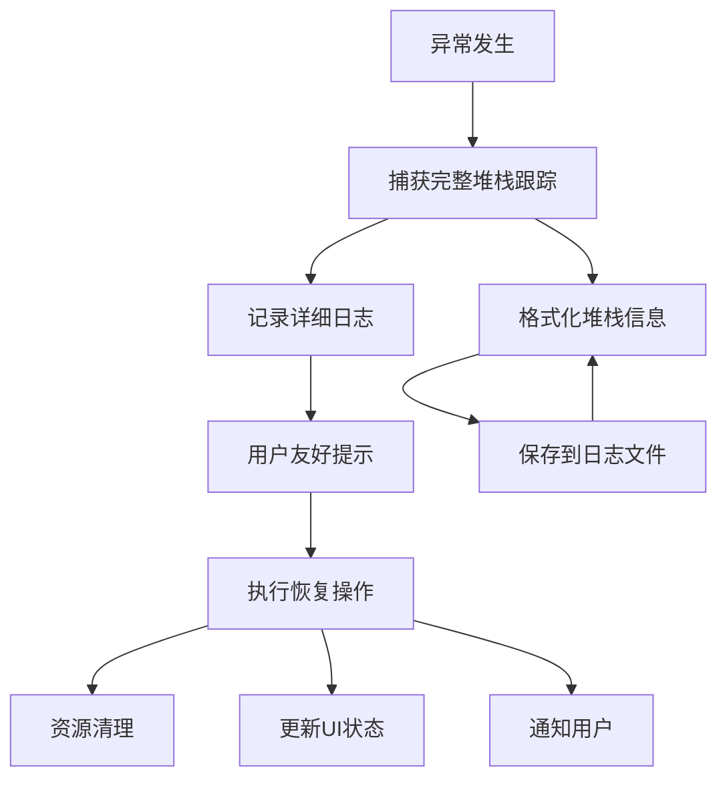

**图表来源**
- [v1.py:421-425](file://v1.py#L421-L425)

**章节来源**
- [v1.py:421-425](file://v1.py#L421-L425)

### 最佳实践建议

1. **异常分类管理**: 将异常分为致命错误、可恢复错误和警告三类
2. **渐进式降级**: 在出现异常时提供基础功能而非完全失败
3. **用户透明度**: 向用户提供清晰的错误信息和解决建议
4. **日志完整性**: 记录足够的上下文信息便于问题诊断
5. **资源清理**: 确保异常情况下也能正确清理临时资源

## 结论

该Outlook附件下载AI智能命名系统展现了优秀的异常处理与异常管理实践。通过多层异常处理策略、完善的UI线程安全机制、智能化的资源清理和用户友好的错误提示，系统能够在各种复杂环境下保持稳定运行。

系统的主要优势包括：
- **全面的异常覆盖**: 涵盖了从底层API到UI层的所有异常场景
- **优雅的降级机制**: 在异常情况下仍能提供基本功能
- **用户友好的体验**: 通过清晰的错误提示和状态更新提升用户体验
- **完善的调试支持**: 提供详细的日志记录和堆栈跟踪信息

这些设计原则和实现模式为类似的企业级应用提供了宝贵的参考价值，特别是在处理复杂的工作流和多线程环境下的异常管理方面。