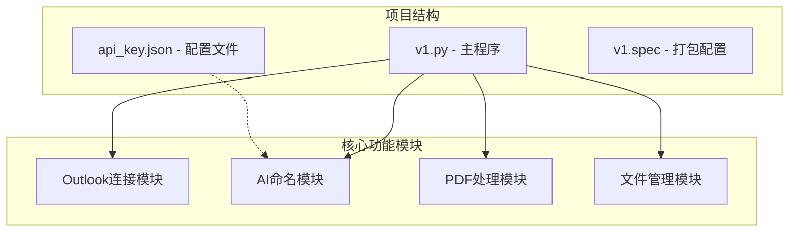
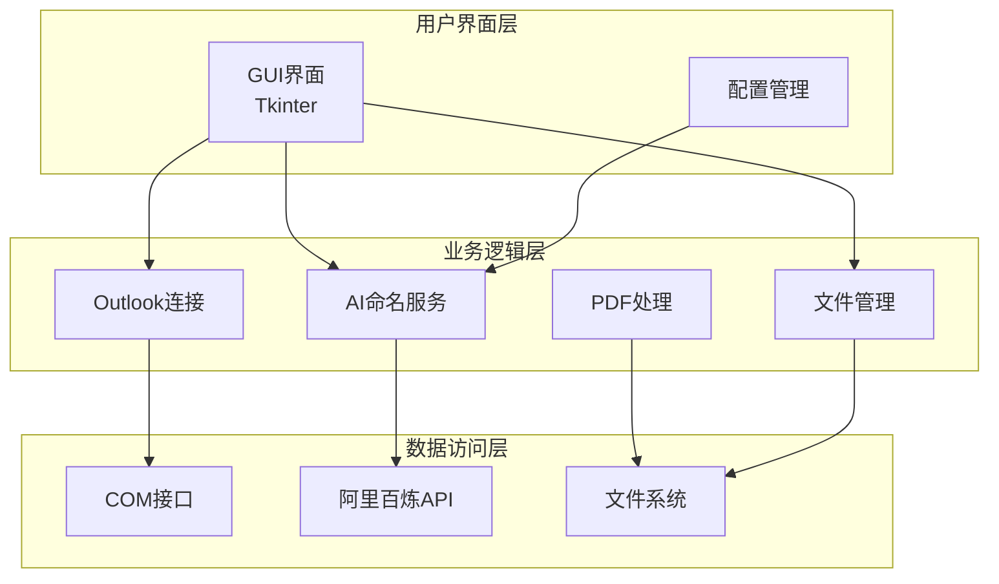
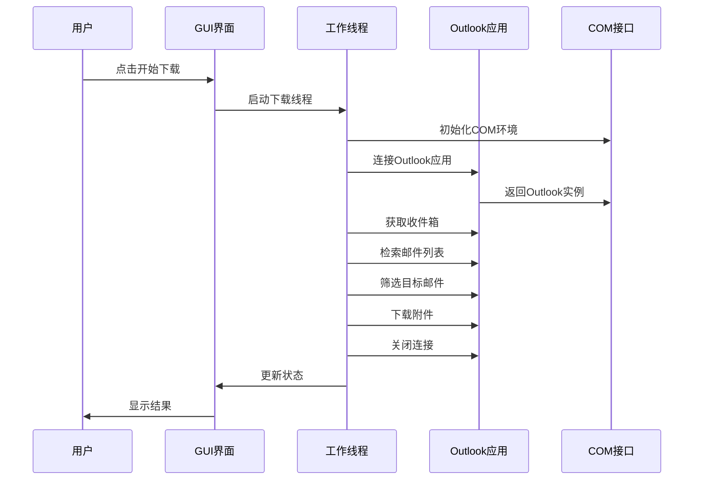
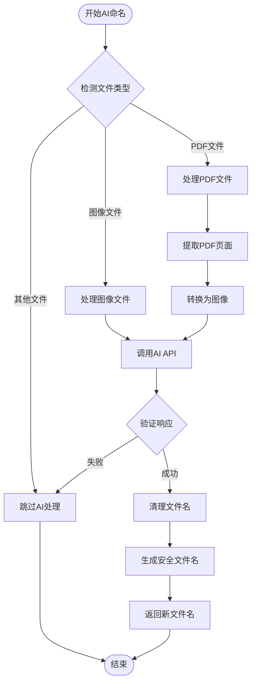
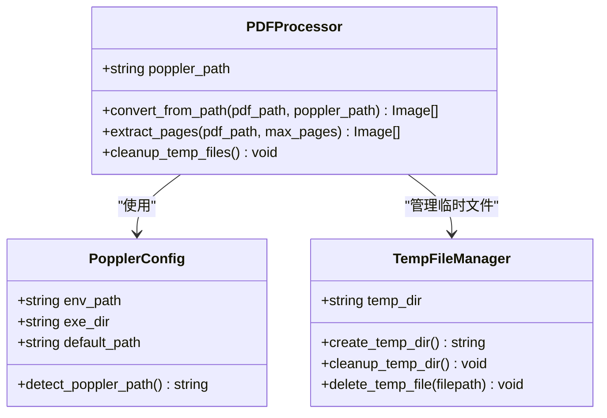
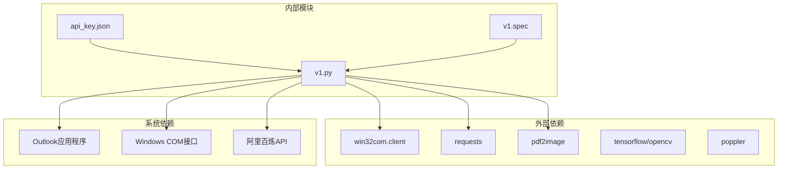
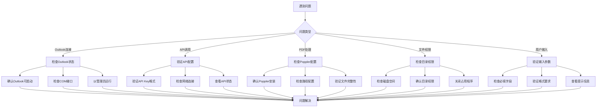

# 常见问题

<cite>
**本文引用的文件**
- [v1.py](file://v1.py)
- [api_key.json](file://api_key.json)
- [v1.spec](file://v1.spec)
</cite>

## 目录
1. [简介](#简介)
2. [项目结构](#项目结构)
3. [核心组件](#核心组件)
4. [架构总览](#架构总览)
5. [详细组件分析](#详细组件分析)
6. [依赖关系分析](#依赖关系分析)
7. [性能考虑](#性能考虑)
8. [故障排除指南](#故障排除指南)
9. [结论](#结论)

## 简介
Outlook附件下载AI智能命名系统是一个基于Python开发的桌面应用程序，旨在自动化从Outlook收件箱中批量下载附件，并利用AI技术对附件进行智能命名。该系统集成了Outlook COM接口、阿里百炼多模态AI服务、PDF处理功能以及友好的图形用户界面。

## 项目结构
该项目采用简洁的单文件架构设计，主要包含以下核心组件：
- 主程序文件：包含完整的业务逻辑和UI界面
- 配置文件：存储API密钥信息
- 打包配置：PyInstaller配置文件用于生成可执行文件

**图表来源**
- [v1.py:1-860](file://v1.py#L1-L860)
- [api_key.json:1-3](file://api_key.json#L1-L3)
- [v1.spec:1-45](file://v1.spec#L1-L45)

**章节来源**
- [v1.py:1-860](file://v1.py#L1-L860)
- [v1.spec:1-45](file://v1.spec#L1-L45)

## 核心组件
系统由多个相互协作的组件构成，每个组件都有明确的职责分工：

### Outlook连接组件
负责与Outlook应用程序建立连接，检索邮件并处理附件下载。该组件实现了智能的时间过滤、发件人匹配和主题关键词搜索功能。

### AI命名组件
集成阿里百炼多模态AI服务，支持图像和PDF内容分析，自动生成语义化的文件名。该组件具备错误处理机制，确保在AI服务不可用时仍能正常工作。

### PDF处理组件
提供PDF文件的图像转换功能，支持多页PDF的分页处理和临时文件管理。该组件包含完善的资源清理机制。

### 文件管理组件
负责文件的保存、重命名和冲突处理。实现了智能的文件名去重机制，避免文件覆盖问题。

**章节来源**
- [v1.py:199-435](file://v1.py#L199-L435)
- [v1.py:97-196](file://v1.py#L97-L196)
- [v1.py:107-148](file://v1.py#L107-L148)

## 架构总览
系统采用分层架构设计，各层之间职责清晰，耦合度低，便于维护和扩展。

**图表来源**
- [v1.py:1-14](file://v1.py#L1-L14)
- [v1.py:107-148](file://v1.py#L107-L148)
- [v1.py:261-435](file://v1.py#L261-L435)

## 详细组件分析

### Outlook连接组件分析
Outlook连接组件是整个系统的核心，负责与Outlook应用程序进行交互。

**图表来源**
- [v1.py:257-435](file://v1.py#L257-L435)
- [v1.py:261-273](file://v1.py#L261-L273)

该组件的关键特性包括：
- **智能邮件筛选**：支持发件人名称和主题关键词的模糊匹配
- **时间范围控制**：可配置邮件检索的时间范围
- **并发处理**：使用多线程避免界面阻塞
- **错误恢复**：具备完善的异常处理和恢复机制

**章节来源**
- [v1.py:257-435](file://v1.py#L257-L435)

### AI命名服务组件分析
AI命名服务组件集成了阿里百炼多模态AI能力，为不同类型的附件提供智能命名服务。

**图表来源**
- [v1.py:149-196](file://v1.py#L149-L196)
- [v1.py:107-148](file://v1.py#L107-L148)

**章节来源**
- [v1.py:149-196](file://v1.py#L149-L196)
- [v1.py:107-148](file://v1.py#L107-L148)

### PDF处理组件分析
PDF处理组件提供了完整的PDF文件处理能力，包括页面提取和图像转换。

**图表来源**
- [v1.py:97-106](file://v1.py#L97-L106)
- [v1.py:69-85](file://v1.py#L69-L85)

**章节来源**
- [v1.py:97-106](file://v1.py#L97-L106)
- [v1.py:69-85](file://v1.py#L69-L85)

## 依赖关系分析
系统依赖关系清晰，主要依赖包括：

**图表来源**
- [v1.py:1-14](file://v1.py#L1-L14)
- [v1.spec:9-15](file://v1.spec#L9-L15)

**章节来源**
- [v1.py:1-14](file://v1.py#L1-L14)
- [v1.spec:9-15](file://v1.spec#L9-L15)

## 性能考虑
系统在设计时充分考虑了性能优化，主要包括：

### 并发处理优化
- 使用多线程避免UI阻塞
- 异步API调用减少等待时间
- 连接池管理提高资源利用率

### 内存管理优化
- 及时清理临时文件和图像缓存
- 控制AI处理的图像数量
- 优化PDF页面提取策略

### 网络性能优化
- 合理的超时设置（60秒）
- 错误重试机制
- 连接复用策略

## 故障排除指南

### Outlook连接问题

#### 问题1：Outlook未启动
**症状表现**：
- 程序启动时出现连接错误
- 日志显示Outlook应用无法初始化
- 状态显示"异常"

**可能原因**：
- Outlook应用程序未安装或损坏
- COM接口注册表项缺失
- 权限不足导致无法访问Outlook

**解决步骤**：
1. 确认Outlook已正确安装并可正常启动
2. 以管理员身份运行程序
3. 检查Windows COM接口是否正常注册
4. 重启Outlook应用程序后重试

**预防措施**：
- 定期检查Outlook更新
- 确保系统权限设置正确
- 避免同时运行多个Outlook实例

#### 问题2：权限不足
**症状表现**：
- 保存附件时出现权限错误
- 程序提示无法访问指定目录
- 文件保存失败

**可能原因**：
- 目标保存目录权限不足
- 文件被其他程序占用
- 系统安全策略限制

**解决步骤**：
1. 右键点击保存目录选择"属性"
2. 在"安全"选项卡中检查用户权限
3. 确保具有"完全控制"权限
4. 关闭占用文件的其他程序
5. 以管理员身份运行程序

**预防措施**：
- 使用系统标准用户目录作为默认保存位置
- 定期清理不需要的文件占用空间
- 避免在共享网络驱动器上保存大量文件

#### 问题3：COM接口错误
**症状表现**：
- 程序启动时崩溃
- 出现"COM初始化失败"错误
- 界面无法正常显示

**可能原因**：
- Python COM库版本不兼容
- Windows系统缺少必要的COM组件
- PyInstaller打包配置问题

**解决步骤**：
1. 检查Python版本与win32com兼容性
2. 确认系统已安装Microsoft Visual C++运行库
3. 重新安装Python win32com包
4. 检查v1.spec中的hiddenimports配置

**预防措施**：
- 使用官方推荐的Python版本
- 定期更新系统组件
- 确保开发环境一致性

### API调用失败

#### 问题4：API Key无效
**症状表现**：
- AI命名功能无法使用
- 日志显示"请先填写API Key"
- 程序自动跳过AI处理

**可能原因**：
- API Key格式不正确
- API Key已过期或被撤销
- 网络连接问题影响验证

**解决步骤**：
1. 登录阿里百炼控制台查看API Key状态
2. 确认API Key格式符合要求
3. 重新申请有效的API Key
4. 在程序中重新保存API Key

**预防措施**：
- 定期检查API Key有效性
- 设置API Key自动续期提醒
- 备份重要的API凭据

#### 问题5：网络连接问题
**症状表现**：
- API调用超时
- 返回网络错误响应
- 程序显示网络连接失败

**可能原因**：
- 本地网络不稳定
- 防火墙阻止API访问
- 阿里云服务器暂时不可用

**解决步骤**：
1. 检查本地网络连接状态
2. 临时关闭防火墙测试
3. 更换网络环境重试
4. 程序会自动重试，无需手动干预

**预防措施**：
- 使用稳定的网络连接
- 配置企业防火墙白名单
- 准备备用网络方案

#### 问题6：请求超时
**症状表现**：
- AI处理过程卡住
- 程序显示超时错误
- 最终放弃AI命名

**可能原因**：
- 网络延迟过高
- AI服务响应慢
- 请求数据量过大

**解决步骤**：
1. 检查网络带宽使用情况
2. 减少同时处理的文件数量
3. 选择网络状况更好的时间段
4. 调整AI处理参数

**预防措施**：
- 监控网络性能指标
- 合理安排处理时间
- 优化文件预处理流程

### PDF处理错误

#### 问题7：Poppler路径配置错误
**症状表现**：
- PDF处理时报路径错误
- 程序显示"Poppler路径不存在"
- PDF文件无法正常处理

**可能原因**：
- Poppler工具包未正确安装
- 环境变量设置错误
- 路径配置与实际安装位置不符

**解决步骤**：
1. 下载并安装Poppler工具包
2. 设置POPPLER_PATH环境变量
3. 确认pdftoppm.exe存在
4. 重启程序使配置生效

**预防措施**：
- 在安装说明中明确Poppler要求
- 提供自动检测和安装脚本
- 建立配置验证机制

#### 问题8：PDF文件损坏
**症状表现**：
- PDF处理过程中报错
- 程序显示PDF解析失败
- 部分页面无法提取

**可能原因**：
- PDF文件传输过程中损坏
- 文件格式不符合标准
- 编码方式不兼容

**解决步骤**：
1. 使用PDF修复工具修复文件
2. 重新下载原始PDF文件
3. 检查文件完整性
4. 尝试使用其他PDF阅读器打开

**预防措施**：
- 添加文件完整性校验
- 提供错误文件的降级处理
- 建立文件格式兼容性检查

#### 问题9：页面提取失败
**症状表现**：
- PDF处理完成但无页面输出
- 程序显示"PDF无页面"
- AI命名功能无法使用

**可能原因**：
- PDF文件为空或只有空白页
- 页面被加密或受保护
- PDF版本过旧不兼容

**解决步骤**：
1. 使用PDF查看器确认页面数量
2. 检查PDF是否被加密
3. 尝试转换PDF格式
4. 手动选择其他文件

**预防措施**：
- 添加页面数量验证
- 提供错误提示和建议
- 建立文件质量评估机制

### 文件权限问题

#### 问题10：保存路径无权限
**症状表现**：
- 附件保存失败
- 程序显示权限不足错误
- 文件无法写入目标目录

**可能原因**：
- 目标目录权限设置不当
- 系统安全策略限制
- 磁盘空间不足

**解决步骤**：
1. 检查目标目录权限设置
2. 确认磁盘空间充足
3. 更改保存目录到有权限的位置
4. 以管理员身份运行程序

**预防措施**：
- 自动检测目录权限
- 提供权限检查功能
- 建立默认安全目录

#### 问题11：文件被占用
**症状表现**：
- 文件重命名失败
- 程序显示文件正在使用
- 操作系统拒绝访问

**可能原因**：
- 文件被其他程序打开
- 系统进程占用文件
- 网络共享文件锁定

**解决步骤**：
1. 关闭占用文件的程序
2. 重启相关系统服务
3. 等待文件释放后再试
4. 使用系统工具查找占用者

**预防措施**：
- 实施文件锁定检测
- 提供重试机制
- 建立文件使用监控

#### 问题12：磁盘空间不足
**症状表现**：
- 附件保存失败
- 程序显示磁盘空间不足
- 文件写入操作被拒绝

**可能原因**：
- 目标磁盘空间不足
- 磁盘配额限制
- 系统临时文件过多

**解决步骤**：
1. 清理目标磁盘空间
2. 移除不必要的临时文件
3. 选择有足够空间的磁盘
4. 分批处理大文件

**预防措施**：
- 实时监控磁盘空间
- 提供空间不足警告
- 建立自动清理机制

### 用户输入错误

#### 问题13：发件人名称输入错误
**症状表现**：
- 未找到匹配的邮件
- 程序显示"未找到匹配邮件"
- 搜索结果为空

**可能原因**：
- 发件人名称拼写错误
- 使用了错误的发件人标识
- 关键字过于具体导致无匹配

**解决步骤**：
1. 检查发件人名称拼写
2. 使用更通用的关键词
3. 尝试不同的发件人标识
4. 查看邮件发件人信息确认

**预防措施**：
- 提供发件人名称自动补全
- 建立常用发件人列表
- 添加输入验证和提示

#### 问题14：保存路径配置错误
**症状表现**：
- 程序无法保存文件
- 显示路径不存在错误
- 保存操作失败

**可能原因**：
- 路径格式不正确
- 目录不存在
- 路径包含非法字符

**解决步骤**：
1. 使用程序内置的浏览功能选择路径
2. 确认路径存在且可访问
3. 避免使用特殊字符
4. 确保路径末尾没有多余斜杠

**预防措施**：
- 提供路径有效性验证
- 自动创建不存在的目录
- 建立路径配置备份机制

#### 问题15：检索天数设置不当
**症状表现**：
- 检索结果过多或过少
- 程序显示"未找到匹配邮件"
- 搜索效率低下

**可能原因**：
- 检索天数设置过短
- 检索天数设置过长
- 时间范围计算错误

**解决步骤**：
1. 根据实际需求调整天数
2. 首次使用建议设置为7-30天
3. 观察历史邮件分布情况
4. 逐步优化检索参数

**预防措施**：
- 提供智能天数建议
- 建立历史使用统计
- 添加参数合理性检查

### 通用故障排除流程

**图表来源**
- [v1.py:242-250](file://v1.py#L242-L250)
- [v1.py:386-407](file://v1.py#L386-L407)

## 结论
Outlook附件下载AI智能命名系统通过合理的架构设计和完善的错误处理机制，为用户提供了稳定可靠的自动化附件管理解决方案。系统涵盖了从Outlook连接、AI命名服务到文件管理的完整功能链路。

针对常见的各种问题，系统提供了多层次的防护和恢复机制。用户在使用过程中遇到问题时，可以按照本文提供的故障排除指南进行自助解决。同时，系统还具备良好的扩展性和维护性，为后续的功能增强和问题修复奠定了坚实基础。

建议用户在使用前仔细阅读新手使用指南，合理配置各项参数，定期检查系统状态，以确保获得最佳的使用体验。