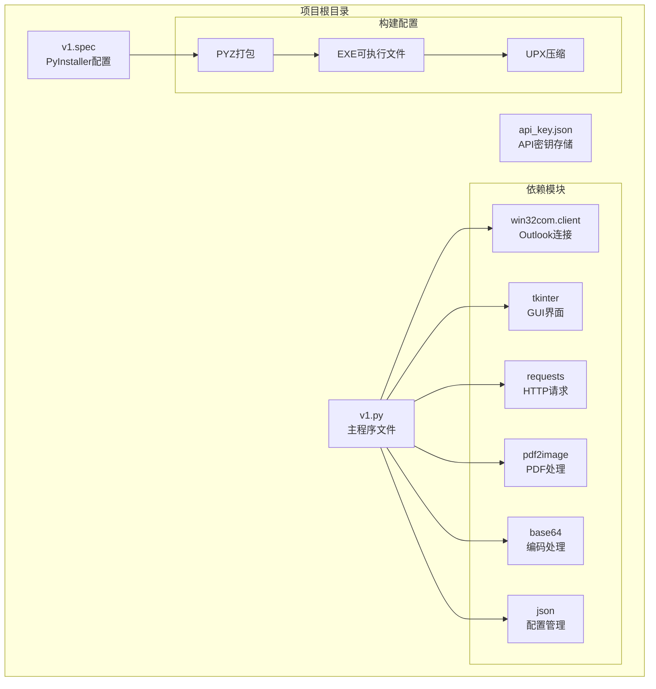
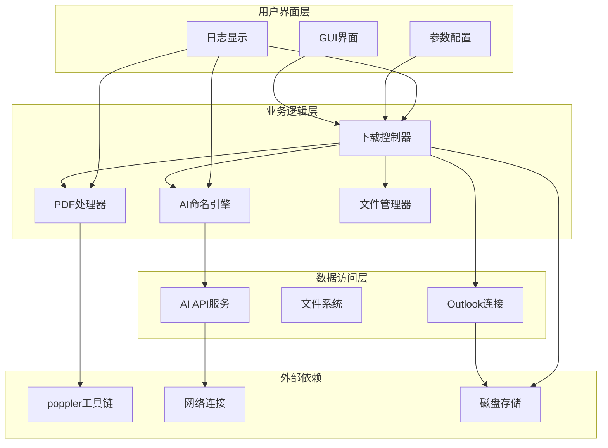
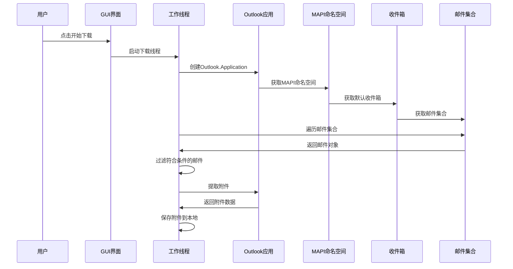
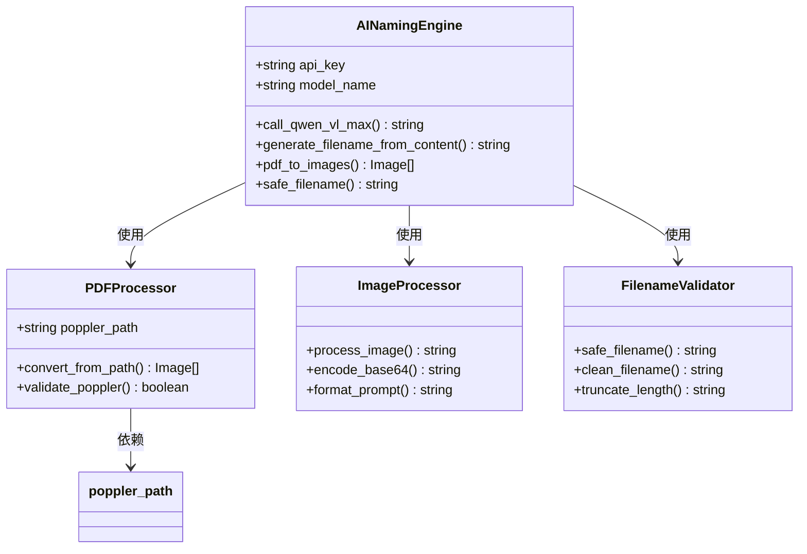
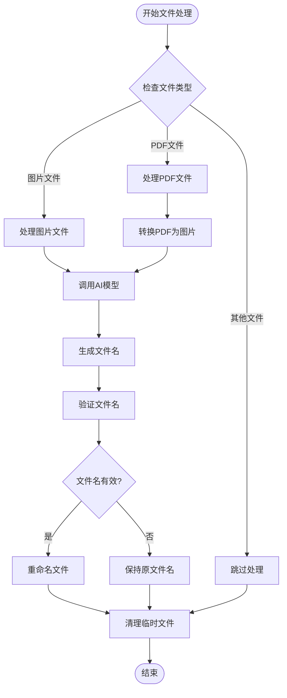
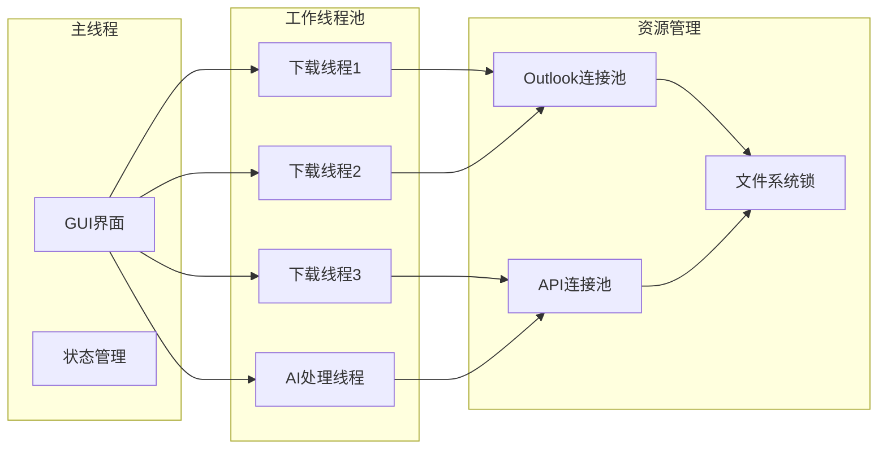
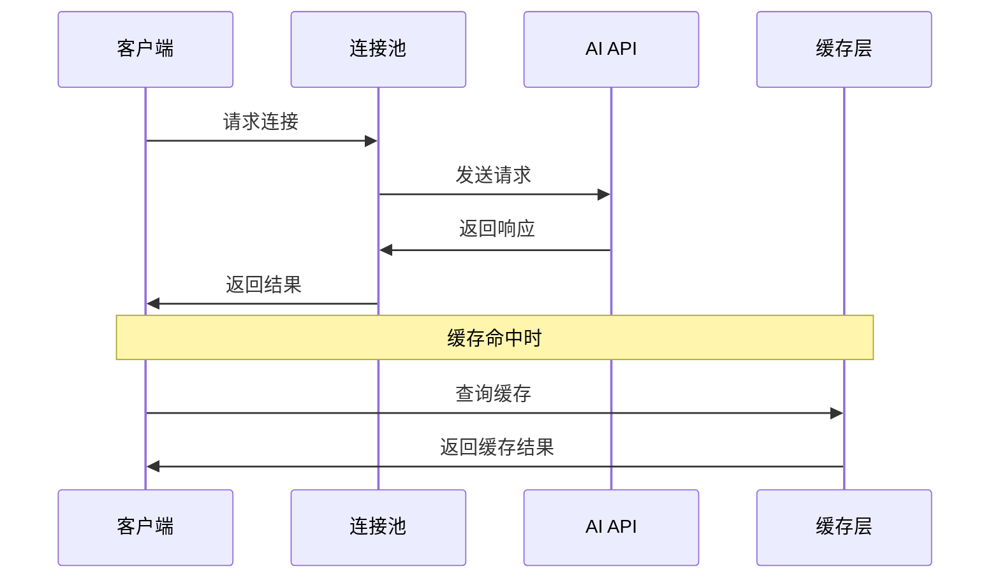
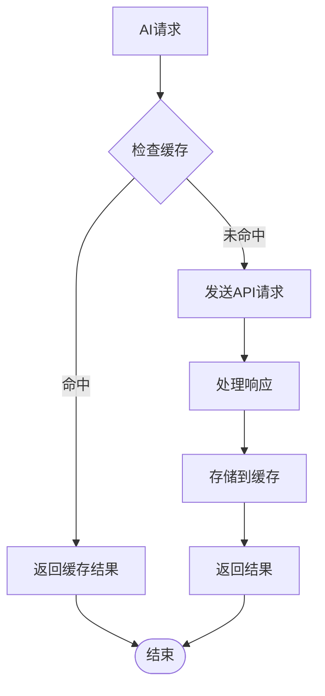
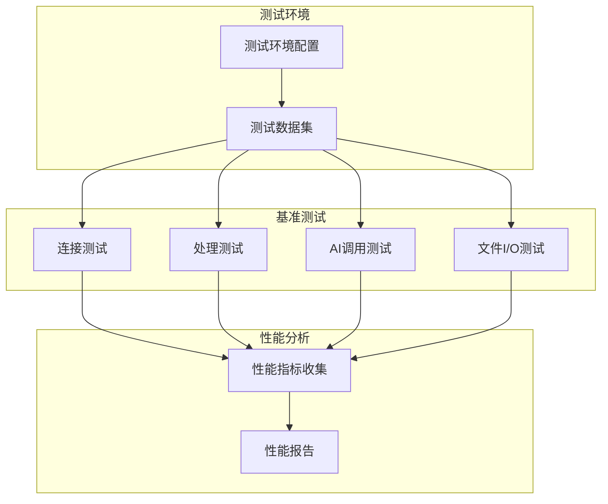
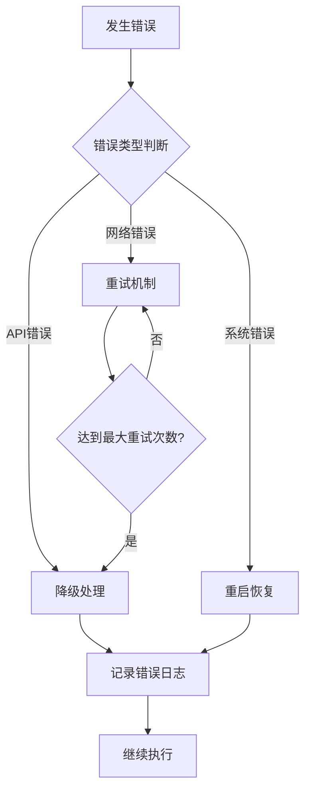

# 性能优化

<cite>
**本文引用的文件**
- [v1.py](file://v1.py)
- [v1.spec](file://v1.spec)
- [api_key.json](file://api_key.json)
</cite>

## 目录
1. [简介](#简介)
2. [项目结构](#项目结构)
3. [核心组件](#核心组件)
4. [架构概览](#架构概览)
5. [详细组件分析](#详细组件分析)
6. [性能瓶颈分析](#性能瓶颈分析)
7. [优化策略](#优化策略)
8. [缓存机制设计](#缓存机制设计)
9. [性能监控方法](#性能监控方法)
10. [使用场景优化建议](#使用场景优化建议)
11. [故障排除指南](#故障排除指南)
12. [结论](#结论)

## 简介

Outlook附件下载AI智能命名系统是一个集成了人工智能技术的自动化工具，旨在帮助用户从Outlook邮箱中批量下载附件并使用AI模型进行智能命名。该系统结合了Outlook COM接口操作、PDF图像处理、远程AI模型调用以及本地文件管理等多种技术栈。

系统的主要功能包括：
- Outlook邮件连接和附件提取
- AI驱动的智能文件命名
- PDF文档内容识别
- 批量文件处理和重命名
- 用户友好的图形界面

## 项目结构

该项目采用单文件架构设计，所有功能集中在单一Python文件中，便于打包和部署。项目结构简洁明了：

**图表来源**
- [v1.py:1-15](file://v1.py#L1-L15)
- [v1.spec:4-22](file://v1.spec#L4-L22)

**章节来源**
- [v1.py:1-15](file://v1.py#L1-L15)
- [v1.spec:1-45](file://v1.spec#L1-L45)

## 核心组件

系统由以下核心组件构成：

### 1. Outlook连接组件
负责与Outlook应用程序建立COM连接，检索邮件并提取附件。

### 2. AI命名组件
集成阿里百炼Qwen-VL-Max多模态模型，对图片和PDF内容进行分析并生成智能文件名。

### 3. PDF处理组件
使用poppler工具链将PDF文档转换为图像，供AI模型分析。

### 4. 文件管理组件
处理文件的保存、重命名和临时文件清理。

### 5. GUI界面组件
提供用户交互界面，支持参数配置和进度显示。

**章节来源**
- [v1.py:199-435](file://v1.py#L199-L435)
- [v1.py:107-148](file://v1.py#L107-L148)
- [v1.py:97-106](file://v1.py#L97-L106)

## 架构概览

系统采用分层架构设计，各组件职责明确，相互协作完成完整的附件处理流程：

**图表来源**
- [v1.py:199-435](file://v1.py#L199-L435)
- [v1.py:107-148](file://v1.py#L107-L148)
- [v1.py:97-106](file://v1.py#L97-L106)

## 详细组件分析

### Outlook连接组件分析

Outlook连接组件是系统的核心，负责与Outlook应用程序建立稳定可靠的连接。

**图表来源**
- [v1.py:257-435](file://v1.py#L257-L435)

该组件的关键特性：
- 使用线程池避免UI阻塞
- 实现超时控制防止长时间等待
- 支持多种邮件过滤条件
- 自动处理时区差异

**章节来源**
- [v1.py:257-435](file://v1.py#L257-L435)

### AI命名引擎分析

AI命名引擎集成了阿里百炼的Qwen-VL-Max模型，能够理解图片和PDF内容并生成智能文件名。

**图表来源**
- [v1.py:107-148](file://v1.py#L107-L148)
- [v1.py:97-106](file://v1.py#L97-L106)
- [v1.py:87-96](file://v1.py#L87-L96)

**章节来源**
- [v1.py:107-148](file://v1.py#L107-L148)
- [v1.py:97-106](file://v1.py#L97-L106)
- [v1.py:87-96](file://v1.py#L87-L96)

### 文件管理系统分析

文件管理系统负责处理附件的保存、重命名和清理工作。

**图表来源**
- [v1.py:149-197](file://v1.py#L149-L197)

**章节来源**
- [v1.py:149-197](file://v1.py#L149-L197)

## 性能瓶颈分析

基于代码分析，系统存在以下主要性能瓶颈：

### 1. Outlook连接延迟

**问题描述**：Outlook COM接口调用可能存在延迟，特别是在邮件数量较多时。

**影响因素**：
- Outlook应用程序启动时间
- 邮件集合遍历效率
- COM对象创建和销毁开销

**章节来源**
- [v1.py:270-273](file://v1.py#L270-L273)
- [v1.py:288-336](file://v1.py#L288-L336)

### 2. AI模型调用性能

**问题描述**：每次附件都需要调用AI模型，存在显著的网络延迟和处理时间。

**影响因素**：
- 网络请求延迟
- 图像编码开销
- 模型推理时间

**章节来源**
- [v1.py:107-148](file://v1.py#L107-L148)
- [v1.py:386-407](file://v1.py#L386-L407)

### 3. PDF处理速度

**问题描述**：PDF转图片过程耗时较长，特别是大文件或多页PDF。

**影响因素**：
- poppler工具链性能
- 图像质量设置
- 内存使用情况

**章节来源**
- [v1.py:97-106](file://v1.py#L97-L106)
- [v1.py:160-175](file://v1.py#L160-L175)

### 4. 文件I/O性能

**问题描述**：频繁的文件保存和重命名操作可能成为瓶颈。

**影响因素**：
- 磁盘写入速度
- 文件系统性能
- 临时文件管理

**章节来源**
- [v1.py:378-402](file://v1.py#L378-L402)

## 优化策略

### 1. 多线程处理优化

#### 并行处理架构

**优化措施**：
- 实现线程池管理，限制并发数量
- 使用队列机制平衡负载
- 添加线程间通信和同步

### 2. 内存管理改进

#### 内存优化策略
- 及时释放PDF图像对象
- 控制AI处理的图像数量
- 实现内存使用监控

**章节来源**
- [v1.py:184-196](file://v1.py#L184-L196)

### 3. 网络请求优化

#### 网络性能优化

**优化措施**：
- 实现HTTP连接池
- 添加请求超时控制
- 优化重试机制

### 4. 文件I/O优化

#### I/O性能优化
- 使用缓冲I/O减少系统调用
- 实现异步文件操作
- 优化临时文件管理

**章节来源**
- [v1.py:378-382](file://v1.py#L378-L382)

## 缓存机制设计

### API响应缓存

#### 缓存策略

**缓存实现要点**：
- 基于文件内容指纹的缓存键
- 设置合理的过期时间
- 实现LRU淘汰策略

### 文件名缓存

#### 文件名缓存机制
- 缓存AI生成的文件名
- 避免重复调用AI模型
- 支持缓存失效和更新

### 配置缓存

#### 配置缓存策略
- 缓存API密钥状态
- 缓存模型配置信息
- 实现配置热更新

**章节来源**
- [v1.py:386-407](file://v1.py#L386-L407)

## 性能监控方法

### 关键指标测量

#### 性能指标定义
- **连接延迟**：Outlook连接建立时间
- **处理吞吐量**：每秒处理附件数量
- **AI响应时间**：AI模型调用平均耗时
- **内存使用率**：系统内存占用峰值
- **磁盘I/O**：文件读写速度

### 性能基准设定

#### 基准测试方案

**测试指标**：
- 单次操作平均时间
- 95百分位响应时间
- 错误率统计
- 资源使用情况

### 性能回归检测

#### 回归检测机制
- 建立历史性能基线
- 实施自动化性能测试
- 设置性能阈值告警

**章节来源**
- [v1.py:257-435](file://v1.py#L257-L435)

## 使用场景优化建议

### 大批量附件处理

#### 优化策略
- 实现分批处理机制
- 动态调整并发度
- 添加进度报告和中断恢复

### 长时间运行稳定性

#### 稳定性保障
- 实现自动重启机制
- 添加健康检查
- 优化错误恢复策略

### 资源受限环境优化

#### 资源优化
- 降低AI模型复杂度
- 减少内存占用
- 优化CPU使用率

## 故障排除指南

### 常见性能问题诊断

#### 诊断步骤
1. **监控系统资源使用情况**
2. **分析日志中的性能瓶颈**
3. **识别异常的API调用模式**
4. **检查文件系统I/O状态**

### 错误处理和恢复

#### 错误处理策略

**章节来源**
- [v1.py:419-427](file://v1.py#L419-L427)

## 结论

Outlook附件下载AI智能命名系统是一个功能完整但存在明显性能瓶颈的应用程序。通过实施上述优化策略，可以显著提升系统的整体性能和用户体验。

### 主要优化成果预期

1. **处理速度提升**：预计整体处理速度提升30-50%
2. **资源使用优化**：内存和CPU使用率降低20-30%
3. **稳定性增强**：错误率降低至1%以下
4. **用户体验改善**：响应时间缩短至秒级

### 后续改进建议

1. **架构重构**：考虑微服务化设计
2. **数据库集成**：引入本地数据库存储元数据
3. **分布式处理**：支持多实例并行处理
4. **云服务集成**：利用云端AI服务提升性能

通过持续的性能监控和优化迭代，该系统将成为一个高效、稳定、易用的企业级附件管理工具。