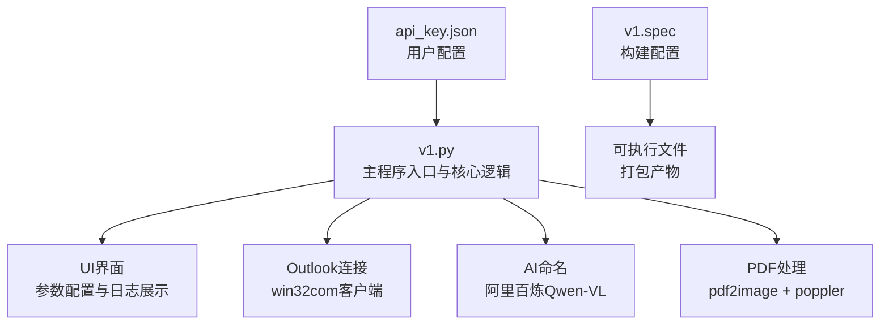
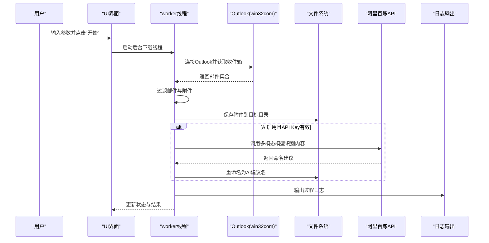
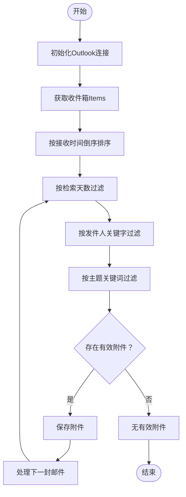
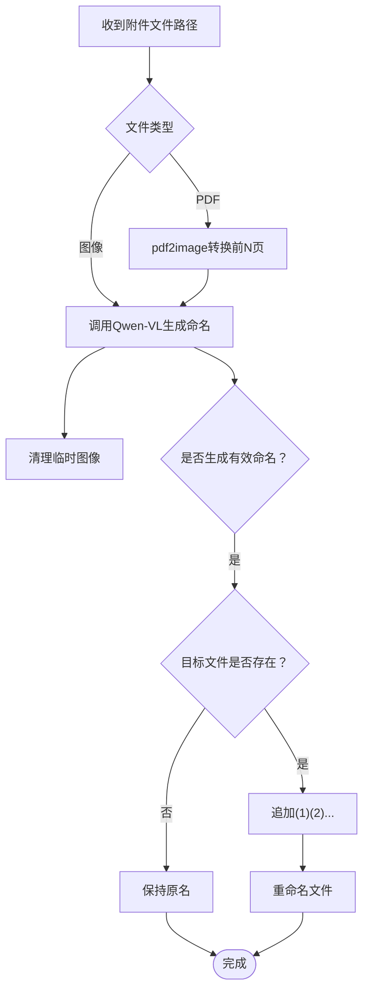
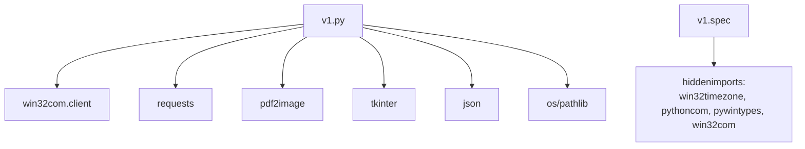

# 故障排除

<cite>
**本文引用的文件**
- [v1.py](file://v1.py)
- [v1.spec](file://v1.spec)
- [api_key.json](file://api_key.json)
</cite>

## 目录
1. [简介](#简介)
2. [项目结构](#项目结构)
3. [核心组件](#核心组件)
4. [架构总览](#架构总览)
5. [详细组件分析](#详细组件分析)
6. [依赖关系分析](#依赖关系分析)
7. [性能考虑](#性能考虑)
8. [故障排除指南](#故障排除指南)
9. [结论](#结论)
10. [附录](#附录)

## 简介
本指南面向Outlook附件下载AI智能命名系统的使用者与技术支持人员，提供系统化的故障排除方法。该系统支持：
- Outlook连接与邮件检索
- 附件批量下载与保存
- AI多模态识别（Qwen-VL系列）进行智能命名
- PDF内容解析（依赖poppler工具链）
- GUI界面操作与实时日志反馈

## 项目结构
系统采用单文件GUI应用架构，主要文件与职责如下：
- v1.py：核心业务逻辑、UI界面、Outlook交互、AI命名、PDF处理、日志记录
- v1.spec：PyInstaller构建配置（隐藏导入win32com相关模块）
- api_key.json：用户配置的API Key存储（位于用户目录）

**图表来源**
- [v1.py:1-827](file://v1.py#L1-L827)
- [v1.spec:1-45](file://v1.spec#L1-L45)

**章节来源**
- [v1.py:1-827](file://v1.py#L1-L827)
- [v1.spec:1-45](file://v1.spec#L1-L45)

## 核心组件
- UI与控制流：tkinter界面、参数校验、状态更新、日志输出
- Outlook集成：win32com客户端封装，邮件检索与附件保存
- AI命名：调用阿里百炼DashScope Chat接口，图像/文本多模态输入
- PDF处理：pdf2image转换PDF页为图像，再交由AI识别
- 配置管理：API Key持久化至用户目录，兼容PyInstaller打包

**章节来源**
- [v1.py:199-435](file://v1.py#L199-L435)
- [v1.py:107-148](file://v1.py#L107-L148)
- [v1.py:97-106](file://v1.py#L97-L106)
- [v1.py:38-65](file://v1.py#L38-L65)

## 架构总览
系统运行时序概览（简化）：
- 用户输入参数 → 参数校验 → 后台线程启动下载流程
- 连接Outlook → 检索邮件 → 过滤附件 → 保存文件
- 可选：AI识别内容 → 生成新文件名 → 重命名
- 实时日志与状态更新 → UI反馈结果

**图表来源**
- [v1.py:199-435](file://v1.py#L199-L435)
- [v1.py:257-435](file://v1.py#L257-L435)

## 详细组件分析

### Outlook连接与邮件检索
- 使用win32com客户端访问Outlook MAPI命名空间，默认获取收件箱
- 支持按发件人名称/邮箱关键字与主题关键词过滤
- 支持按接收时间倒序排序与限定检索天数
- 附件大小阈值过滤（>10KB），避免保存空或极小附件

**图表来源**
- [v1.py:270-342](file://v1.py#L270-L342)

**章节来源**
- [v1.py:257-435](file://v1.py#L257-L435)

### AI智能命名与PDF处理
- 图像类附件：直接调用Qwen-VL模型生成命名
- PDF附件：使用pdf2image转换前N页为图像，再调用模型识别
- 临时图像清理：确保临时目录与文件在finally中释放
- 命名冲突处理：若同名文件存在，自动追加(1)(2)...后缀

**图表来源**
- [v1.py:149-197](file://v1.py#L149-L197)
- [v1.py:97-106](file://v1.py#L97-L106)

**章节来源**
- [v1.py:149-197](file://v1.py#L149-L197)

### API调用与错误处理
- 请求超时：AI调用设置60秒超时
- 错误码检查：非200状态抛出异常
- 返回格式校验：解析choices[0].message.content
- UI线程安全：后台线程通过root.after回到主线程更新UI

**章节来源**
- [v1.py:107-148](file://v1.py#L107-L148)
- [v1.py:200-230](file://v1.py#L200-L230)

### 配置与部署
- API Key存储：用户目录下的api_key.json，避免权限问题
- poppler路径：优先环境变量POPPLER_PATH，其次相对路径，最后开发环境默认路径
- PyInstaller隐藏导入：win32timezone、pythoncom、pywintypes、win32com

**章节来源**
- [v1.py:38-65](file://v1.py#L38-L65)
- [v1.py:72-85](file://v1.py#L72-L85)
- [v1.spec:9-15](file://v1.spec#L9-L15)

## 依赖关系分析
- 外部库依赖：win32com.client、requests、pdf2image、pywin32、tkinter
- 平台依赖：Windows COM组件（Outlook）、poppler工具链（pdftoppm.exe）
- 构建依赖：PyInstaller（隐藏导入win32com系列模块）

**图表来源**
- [v1.py:1-14](file://v1.py#L1-L14)
- [v1.spec:9-15](file://v1.spec#L9-L15)

**章节来源**
- [v1.py:1-14](file://v1.py#L1-L14)
- [v1.spec:9-15](file://v1.spec#L9-L15)

## 性能考虑
- 多线程下载：后台线程执行耗时操作，避免UI阻塞
- PDF预览限制：默认仅转换前N页，减少AI调用次数与时间
- 临时文件清理：finally确保临时目录与图像删除，防止磁盘占用
- UI刷新节流：通过after机制合并UI更新，提升响应性

[本节为通用性能建议，无需特定文件引用]

## 故障排除指南

### 一、Outlook连接问题
- 症状
  - “正在连接Outlook…”长时间无进展
  - 报错“无法获取Outlook实例”
  - 无法列出邮件或附件
- 排查步骤
  1) 确认Outlook已完全启动并登录账户
  2) 检查Outlook是否处于“离线”模式，切换为在线
  3) 在Windows任务管理器中确认Outlook进程存在
  4) 尝试重启Outlook后再试
  5) 若使用企业版Outlook，确认是否有安全策略限制自动化
- 建议
  - 首次使用建议将“检索天数”调大（如7或30天）
  - 确保Outlook版本与win32com兼容

**章节来源**
- [v1.py:270-273](file://v1.py#L270-L273)
- [v1.py:819-821](file://v1.py#L819-L821)

### 二、API调用失败（AI命名）
- 症状
  - 日志出现“API调用失败”或“API返回格式异常”
  - AI重命名失败，保留原文件名
- 可能原因
  1) API Key未配置或格式错误
  2) 网络连接不稳定或超时
  3) DashScope服务端异常
  4) 模型名称不正确
- 排查步骤
  1) 在UI中点击“申请 Key”打开官方申请页面
  2) 在“API Key”输入框粘贴真实Key，点击“保存 Key”
  3) 检查网络连通性，必要时使用代理
  4) 切换模型名称（如qwen-vl-max-latest）
  5) 查看日志中的完整错误信息
- 建议
  - API Key存储在用户目录，避免权限问题
  - 如频繁超时，适当增大“检索天数”减少并发请求

**章节来源**
- [v1.py:451-465](file://v1.py#L451-L465)
- [v1.py:107-148](file://v1.py#L107-L148)
- [v1.py:728-734](file://v1.py#L728-L734)

### 三、PDF处理错误
- 症状
  - PDF无页面或转换失败
  - 日志出现“Poppler路径不存在”或“未找到pdftoppm.exe”
- 可能原因
  1) poppler工具链未安装或路径不正确
  2) 环境变量POPPLER_PATH未设置
  3) PDF损坏或加密
- 排查步骤
  1) 在系统环境变量中设置POPPLER_PATH指向poppler/bin目录
  2) 确认pdftoppm.exe存在于该目录
  3) 尝试用其他PDF阅读器打开该文件验证有效性
  4) 若为加密PDF，先解密再尝试
- 建议
  - 开发环境默认路径为D:\poppler\Library\bin，确保路径存在
  2) 若使用便携版，将poppler目录与可执行文件放置在程序同级目录

**章节来源**
- [v1.py:97-106](file://v1.py#L97-L106)
- [v1.py:72-85](file://v1.py#L72-L85)

### 四、文件权限问题
- 症状
  - 保存失败，提示权限不足
  - 打开目录按钮无效
- 可能原因
  1) 目标保存目录无写权限
  2) 目录被占用或被其他进程锁定
  3) 路径包含非法字符
- 排查步骤
  1) 更换到用户有权限的目录（如桌面或文档）
  2) 关闭可能占用该目录的其他程序
  3) 确保路径不含特殊字符
  4) 以管理员身份运行程序
- 建议
  - 使用“浏览…”选择保存目录，避免手动输入
  - 避免保存到系统保护目录（如Program Files）

**章节来源**
- [v1.py:275-277](file://v1.py#L275-L277)
- [v1.py:443-449](file://v1.py#L443-L449)

### 五、UI无响应或卡顿
- 症状
  - 点击“开始”后界面无反应
  - 日志不更新
- 可能原因
  1) Outlook连接缓慢或阻塞
  2) 网络请求超时
  3) UI线程被阻塞
- 排查步骤
  1) 查看状态栏是否显示“正在检索邮件…”或“正在保存附件…”
  2) 检查网络连接与代理设置
  3) 减少“检索天数”，降低邮件数量
  4) 关闭其他占用CPU/IO的应用
- 建议
  - 后台线程执行核心逻辑，UI应保持响应
  - 如长时间无响应，可强制关闭后重新启动

**章节来源**
- [v1.py:257-435](file://v1.py#L257-L435)
- [v1.py:200-230](file://v1.py#L200-L230)

### 六、日志分析与错误定位
- 日志位置
  - 右侧面板“下载日志”区域
- 常见日志模式
  - “正在连接Outlook…” → “找到X封邮件”
  - “已保存: 文件名” → “AI重命名成功: 新文件名”
  - “⚠️ 保存失败: 文件名 (错误详情)” → “重命名失败: 错误详情”
- 分析要点
  - 关注“API调用失败”、“重命名失败”等错误行
  - 记录时间戳与文件名，便于复现
  - 截图日志并附带系统信息（Windows版本、Outlook版本）

**章节来源**
- [v1.py:207-211](file://v1.py#L207-L211)
- [v1.py:380-402](file://v1.py#L380-L402)

### 七、高级故障排除技术
- 性能问题诊断
  - 使用任务管理器监控CPU/内存/IO
  - 减少同时处理的PDF页数，降低AI调用频率
  - 优化网络环境，避免代理延迟
- 内存泄漏检测
  - 关注临时图像目录是否被清理
  - 确认finally块中的删除逻辑被执行
- 线程死锁排查
  - 确保UI更新通过root.after进行
  - 避免在后台线程中直接操作tk控件
  - 检查Outlook COM对象的初始化/反初始化顺序

**章节来源**
- [v1.py:184-196](file://v1.py#L184-L196)
- [v1.py:427-433](file://v1.py#L427-L433)
- [v1.py:261-269](file://v1.py#L261-L269)

### 八、问题分类与解决流程
- 分类体系
  - 连接类：Outlook连接失败、网络超时
  - 配置类：API Key错误、poppler路径错误
  - 处理类：PDF转换失败、文件重命名失败
  - 权限类：保存失败、打开目录失败
- 解决流程
  1) 现象描述与日志截图
  2) 快速自检（Outlook状态、网络、路径）
  3) 按类别执行针对性排查
  4) 记录修复步骤与结果
  5) 无法解决时提交工单并附带日志

[本节为流程规范，无需特定文件引用]

## 结论
本故障排除指南提供了从基础到高级的系统化排查方法。建议用户在遇到问题时先进行快速自检，再按分类逐步深入排查。对于复杂问题，务必保留完整日志以便技术支持快速定位。

[本节为总结，无需特定文件引用]

## 附录

### A. 常见错误对照表
- “请先填写 API Key” → 检查API Key是否保存成功
- “API调用失败: …” → 检查网络与DashScope服务状态
- “Poppler路径不存在” → 设置环境变量POPPLER_PATH
- “未找到pdftoppm.exe” → 确认poppler安装完整
- “保存失败: …” → 检查保存目录权限与占用情况

**章节来源**
- [v1.py:109-111](file://v1.py#L109-L111)
- [v1.py:100-104](file://v1.py#L100-L104)
- [v1.py:380-382](file://v1.py#L380-L382)

### B. 用户自助操作清单
- 确认Outlook已登录并处于在线状态
- 设置正确的保存路径并确保有写权限
- 配置有效的API Key并保存
- 设置poppler路径并验证pdftoppm可用
- 调整“检索天数”以平衡性能与覆盖范围
- 查看右侧面板日志，记录关键错误行

**章节来源**
- [v1.py:248-250](file://v1.py#L248-L250)
- [v1.py:451-465](file://v1.py#L451-L465)
- [v1.py:72-85](file://v1.py#L72-L85)