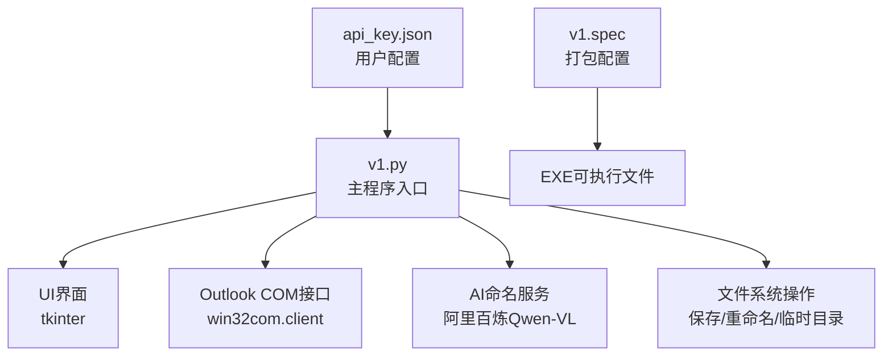
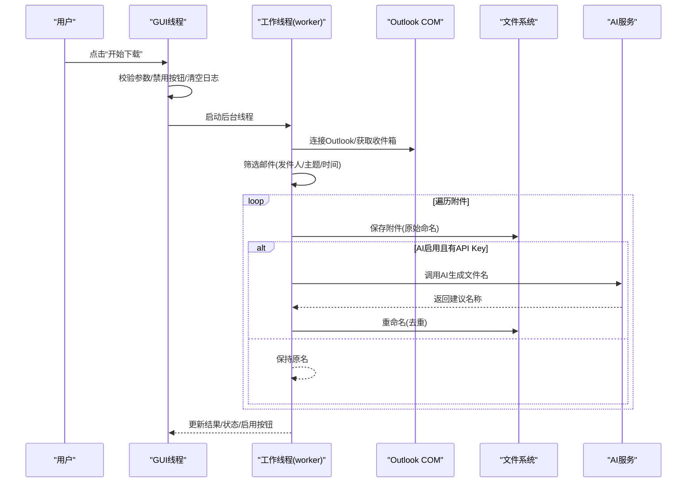
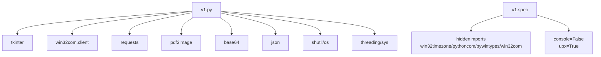

# 调试技巧

<cite>
**本文引用的文件**
- [v1.py](file://v1.py)
- [v1.spec](file://v1.spec)
- [api_key.json](file://api_key.json)
</cite>

## 目录
1. [简介](#简介)
2. [项目结构](#项目结构)
3. [核心组件](#核心组件)
4. [架构总览](#架构总览)
5. [详细组件分析](#详细组件分析)
6. [依赖关系分析](#依赖关系分析)
7. [性能考虑](#性能考虑)
8. [故障排查指南](#故障排查指南)
9. [结论](#结论)
10. [附录](#附录)

## 简介
本指南面向Outlook附件下载AI智能命名系统的开发者与高级用户，提供系统性的调试方法论与实操技巧。内容涵盖日志分析、错误定位策略、性能分析、断点调试与工具使用最佳实践，帮助快速定位并解决运行期问题，提升系统稳定性与用户体验。

## 项目结构
该系统采用单文件GUI应用架构，核心逻辑集中在单一Python脚本中，配合打包配置与API密钥存储文件：
- v1.py：主程序，包含Outlook交互、AI命名、UI界面、日志输出、多线程下载等完整流程
- v1.spec：PyInstaller打包配置，声明隐藏导入与运行时选项
- api_key.json：用户配置目录下的API密钥持久化文件

**图表来源**
- [v1.py:1-860](file://v1.py#L1-L860)
- [v1.spec:1-45](file://v1.spec#L1-L45)

**章节来源**
- [v1.py:1-860](file://v1.py#L1-L860)
- [v1.spec:1-45](file://v1.spec#L1-L45)

## 核心组件
- UI与事件循环：基于tkinter构建，包含参数输入、状态展示、日志滚动窗口与引导提示
- Outlook集成：通过win32com.client访问Outlook收件箱，筛选邮件并遍历附件
- AI命名：调用阿里百炼DashScope API，对图片/PDF内容进行多模态理解，生成文件名
- 文件系统：保存原始附件、AI重命名、临时图像转换目录清理
- 多线程下载：后台线程执行耗时任务，通过UI线程安全回调更新界面
- 配置管理：API Key加载/保存、模型名称配置、poppler路径解析

**章节来源**
- [v1.py:199-435](file://v1.py#L199-L435)
- [v1.py:107-148](file://v1.py#L107-L148)
- [v1.py:149-197](file://v1.py#L149-L197)
- [v1.py:257-435](file://v1.py#L257-L435)

## 架构总览
系统采用“GUI线程 + 后台工作线程”的异步架构，确保UI响应性。核心流程如下：

**图表来源**
- [v1.py:199-435](file://v1.py#L199-L435)
- [v1.py:257-435](file://v1.py#L257-L435)

## 详细组件分析

### 日志与状态管理
- UI线程安全更新：通过root.after将后台线程的操作回传到主线程，避免并发UI更新问题
- 日志输出：统一使用滚动文本框记录步骤、警告与异常堆栈
- 状态展示：状态标签实时反映当前阶段（检索/筛选/保存/完成/异常）

调试要点
- 关注UI线程与后台线程的切换点，确保日志追加与状态更新不会阻塞
- 利用日志中的时间戳与步骤标记定位具体环节
- 异常发生时务必查看traceback输出，结合上下文定位

**章节来源**
- [v1.py:200-230](file://v1.py#L200-L230)
- [v1.py:207-211](file://v1.py#L207-L211)
- [v1.py:419-426](file://v1.py#L419-L426)

### Outlook集成与邮件筛选
- COM初始化/反初始化：确保Outlook对象生命周期正确
- 排序与时间过滤：按接收时间降序，基于天数限制筛选
- 发件人/主题匹配：大小写无关的包含匹配
- 附件过滤：忽略小于阈值的附件

调试要点
- 若Outlook不可用，检查COM初始化是否成功
- 时间过滤涉及时区，注意本地化与UTC差异
- 附件计数异常时，逐封邮件验证属性访问

**章节来源**
- [v1.py:261-269](file://v1.py#L261-L269)
- [v1.py:279-283](file://v1.py#L279-L283)
- [v1.py:294-335](file://v1.py#L294-L335)
- [v1.py:346-376](file://v1.py#L346-L376)

### AI命名与PDF处理
- PDF转图像：使用poppler工具链，支持环境变量与相对路径
- 图像编码：Base64编码图片数据，构造多模态消息
- API调用：超时控制、状态码校验、JSON解析与异常处理
- 文件名生成：清理非法字符、截断长度、去重重命名

调试要点
- poppler路径必须存在且包含必需可执行文件
- API Key缺失或无效会导致直接抛错
- PDF页数过多时，限制处理页数以控制成本与时间

**章节来源**
- [v1.py:97-105](file://v1.py#L97-L105)
- [v1.py:107-148](file://v1.py#L107-L148)
- [v1.py:149-197](file://v1.py#L149-L197)

### 文件系统与临时目录清理
- 保存附件：使用接收时间作为前缀，避免覆盖
- 重命名：检测同名冲突，自动添加序号后缀
- 清理策略：删除临时图像与临时目录，异常时静默跳过

调试要点
- 确认保存目录存在且有写权限
- 重命名冲突时检查文件是否存在与路径一致性
- 临时目录清理失败不影响主流程，但可能占用磁盘

**章节来源**
- [v1.py:378-402](file://v1.py#L378-L402)
- [v1.py:184-196](file://v1.py#L184-L196)

### 多线程与异常处理
- 后台线程：执行耗时任务，避免阻塞UI
- 异常捕获：捕获顶层异常，打印traceback并恢复UI状态
- COM资源释放：确保CoUninitialize在finally中执行

调试要点
- 确保UI更新通过ui_call安全回调
- 异常发生时优先查看后台线程的traceback
- COM资源泄漏会导致后续调用失败

**章节来源**
- [v1.py:257-435](file://v1.py#L257-L435)

## 依赖关系分析
系统外部依赖与打包配置如下：

**图表来源**
- [v1.py:1-14](file://v1.py#L1-L14)
- [v1.spec:9-22](file://v1.spec#L9-L22)

**章节来源**
- [v1.py:1-14](file://v1.py#L1-L14)
- [v1.spec:9-22](file://v1.spec#L9-L22)

## 性能考虑
- 网络请求：API调用设置超时，避免长时间阻塞
- PDF处理：限制最大页数，减少图像转换开销
- UI更新：批量日志输出合并，避免频繁刷新
- 线程安全：后台线程通过after回调更新UI，降低锁竞争
- 资源释放：COM对象与临时目录清理在finally中执行

优化建议
- 对大量附件场景，考虑分批处理与进度条
- 缓存API Key与模型配置，减少重复IO
- 在UI线程中避免长耗时操作，保持响应性

**章节来源**
- [v1.py:139-141](file://v1.py#L139-L141)
- [v1.py:164-175](file://v1.py#L164-L175)
- [v1.py:200-230](file://v1.py#L200-L230)
- [v1.py:427-433](file://v1.py#L427-L433)

## 故障排查指南

### 日志分析方法
- 查看UI日志窗口中的步骤标记（如“正在连接Outlook”、“正在保存附件”、“正在调用AI识别内容”）
- 关键错误信息识别：API调用失败、路径不存在、PDF无页面、重命名失败等
- 异常堆栈阅读：从后台线程traceback入手，定位具体函数与行号

实用技巧
- 将日志复制到文本编辑器中，使用搜索功能定位错误关键词
- 结合状态标签与结果标签判断问题阶段

**章节来源**
- [v1.py:207-211](file://v1.py#L207-L211)
- [v1.py:419-426](file://v1.py#L419-L426)

### 错误定位策略
- 分段调试法：将流程拆分为“连接Outlook→筛选邮件→保存附件→AI命名→重命名”，逐段验证
- 异常捕获分析：关注顶层try/except与各子函数的异常处理，确认异常传播路径
- 网络请求调试：检查API Key、网络连通性、超时设置、返回状态码
- 文件系统调试：验证保存目录存在性、权限、临时目录清理、重命名冲突

**章节来源**
- [v1.py:261-269](file://v1.py#L261-L269)
- [v1.py:139-141](file://v1.py#L139-L141)
- [v1.py:184-196](file://v1.py#L184-L196)

### 断点调试技巧
- Python内置pdb：在关键函数入口设置断点，逐步执行观察变量变化
- IDE断点：在IDE中为start_download、worker、generate_filename_from_content等函数设置断点
- 变量检查：重点检查Outlook对象、附件集合、API Key、poppler路径、文件路径
- 调用链追踪：从UI事件到后台线程再到API调用的完整调用链

**章节来源**
- [v1.py:199-435](file://v1.py#L199-L435)
- [v1.py:149-197](file://v1.py#L149-L197)

### 性能分析方法
- 执行时间测量：在关键节点插入时间戳，统计各阶段耗时
- 内存使用监控：观察大文件处理与PDF转换过程中的内存峰值
- 线程状态检查：确认后台线程正常运行，UI线程未被阻塞

**章节来源**
- [v1.py:257-435](file://v1.py#L257-L435)

### 调试工具使用指南
- PyInstaller打包：通过v1.spec配置隐藏导入与运行时选项，确保COM模块可用
- API密钥管理：通过api_key.json持久化，注意文件权限与路径解析
- poppler路径：优先使用环境变量，其次相对路径，最后硬编码路径

最佳实践
- 开发阶段启用console输出，便于查看标准错误
- 生产打包时保持console=False，避免弹出控制台窗口
- 在用户配置目录下存放API密钥，避免权限问题

**章节来源**
- [v1.spec:25-44](file://v1.spec#L25-L44)
- [v1.py:38-55](file://v1.py#L38-L55)
- [v1.py:72-85](file://v1.py#L72-L85)

## 结论
通过系统化的日志分析、分段调试、异常捕获与性能监控，可以高效定位Outlook附件下载AI智能命名系统中的问题。建议在开发与部署过程中遵循本文提供的调试策略与最佳实践，持续优化用户体验与系统稳定性。

## 附录
- 快速检查清单
  - Outlook是否可访问且已初始化
  - API Key是否正确且有网络访问权限
  - poppler路径是否存在且包含必需可执行文件
  - 保存目录是否存在且有写权限
  - 后台线程是否正常运行，UI是否阻塞