# AI智能命名系统

<cite>
**本文档引用的文件**
- [v1.py](file://v1.py)
- [api_key.json](file://api_key.json)
- [v1.spec](file://v1.spec)
</cite>

## 目录
1. [简介](#简介)
2. [项目结构](#项目结构)
3. [核心组件](#核心组件)
4. [架构概览](#架构概览)
5. [详细组件分析](#详细组件分析)
6. [依赖关系分析](#依赖关系分析)
7. [性能考虑](#性能考虑)
8. [故障排除指南](#故障排除指南)
9. [结论](#结论)
10. [附录](#附录)

## 简介

AI智能命名系统是一个基于阿里百炼Qwen-VL-Max多模态模型的智能文件重命名工具。该系统能够自动分析图像和PDF文档的内容，并根据内容生成合适的文件名。系统支持多种文件格式，包括JPG/JPEG/PNG/BMP/TIFF/PDF，并提供了完整的UI界面来配置API密钥、选择模型和执行批量重命名操作。

该系统的核心功能包括：
- 阿里百炼Qwen-VL-Max多模态模型集成
- 图像内容分析算法
- PDF内容识别流程
- 智能文件名生成逻辑
- 支持的文件格式处理
- 用户友好的图形界面

## 项目结构

该项目采用简洁的单文件架构设计，主要包含以下组件：

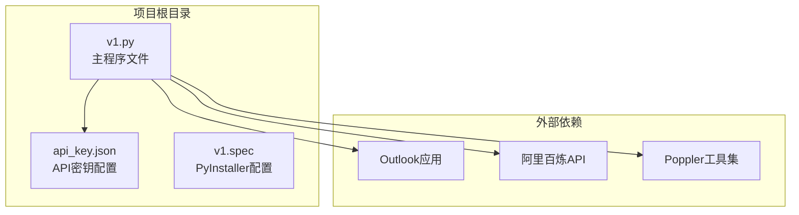

**图表来源**
- [v1.py:1-860](file://v1.py#L1-L860)
- [api_key.json:1-3](file://api_key.json#L1-L3)
- [v1.spec:1-45](file://v1.spec#L1-L45)

**章节来源**
- [v1.py:1-860](file://v1.py#L1-L860)
- [v1.spec:1-45](file://v1.spec#L1-L45)

## 核心组件

### API密钥管理系统

系统实现了安全的API密钥存储和管理机制：

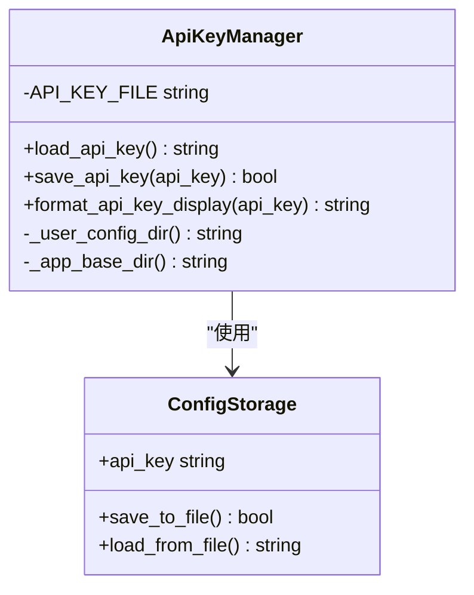

**图表来源**
- [v1.py:38-65](file://v1.py#L38-L65)

### 多模态AI调用引擎

系统集成了阿里百炼Qwen-VL-Max多模态模型，支持图像和PDF内容分析：

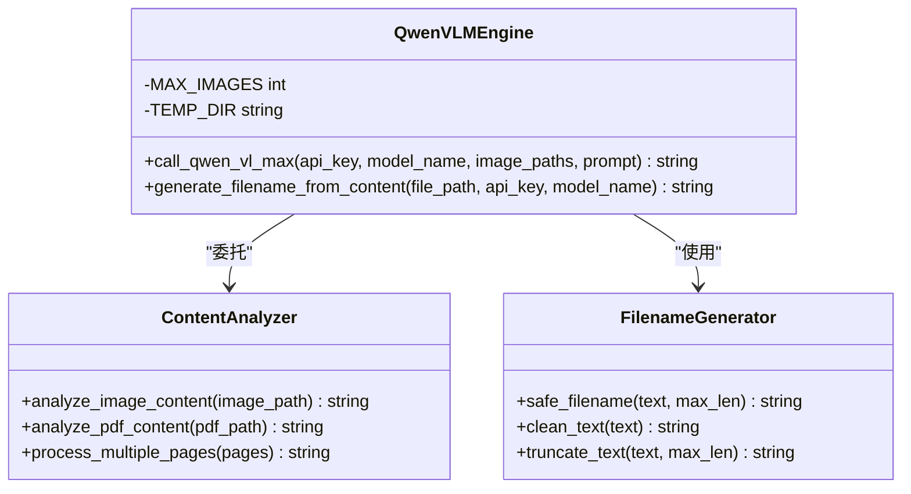

**图表来源**
- [v1.py:107-196](file://v1.py#L107-L196)

### PDF处理模块

系统提供了完整的PDF转图像功能，支持多页PDF文档的智能处理：

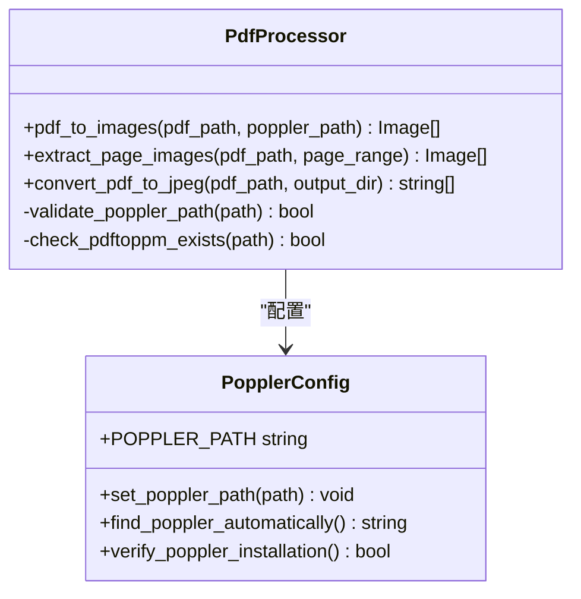

**图表来源**
- [v1.py:97-106](file://v1.py#L97-L106)

**章节来源**
- [v1.py:38-65](file://v1.py#L38-L65)
- [v1.py:107-196](file://v1.py#L107-L196)
- [v1.py:97-106](file://v1.py#L97-L106)

## 架构概览

系统采用分层架构设计，实现了清晰的关注点分离：

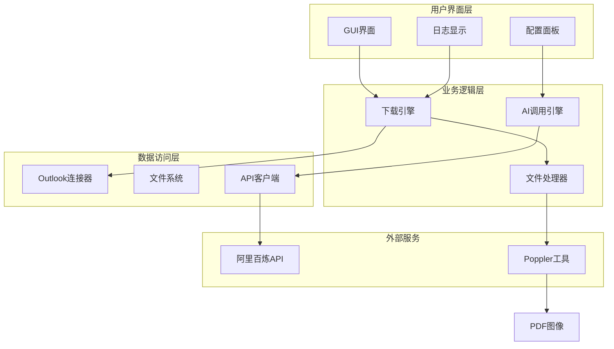

**图表来源**
- [v1.py:199-435](file://v1.py#L199-L435)
- [v1.py:107-196](file://v1.py#L107-L196)

### 数据流图

系统的核心数据流包括邮件下载、内容分析和文件重命名三个主要阶段：

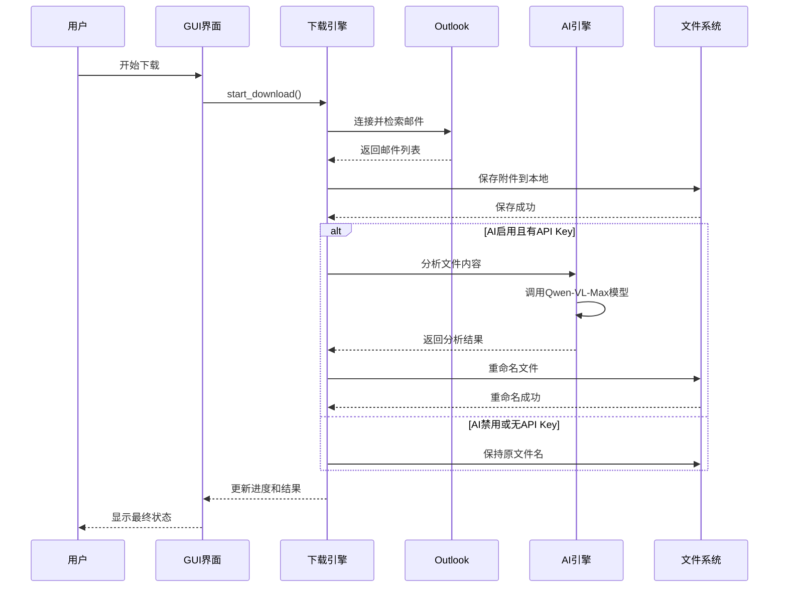

**图表来源**
- [v1.py:199-435](file://v1.py#L199-L435)

**章节来源**
- [v1.py:199-435](file://v1.py#L199-L435)

## 详细组件分析

### Outlook邮件下载引擎

系统实现了完整的Outlook邮件附件下载功能，支持复杂的筛选条件和批量处理：

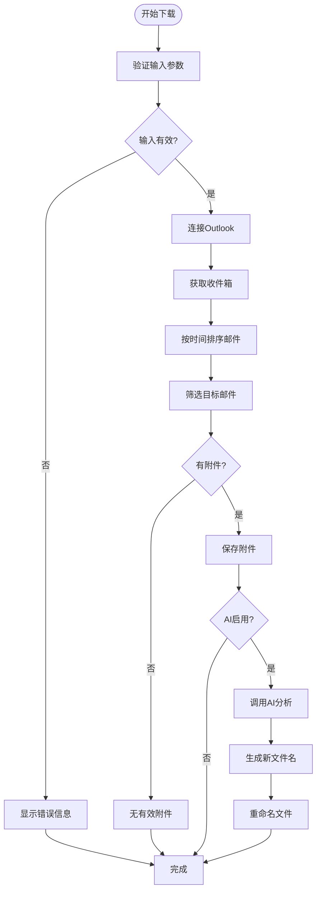

**图表来源**
- [v1.py:257-435](file://v1.py#L257-L435)

#### 关键特性

1. **智能邮件筛选**：支持发件人名称和主题关键词的模糊匹配
2. **时间范围控制**：可配置检索天数，默认1天
3. **附件过滤**：自动跳过小于10KB的小文件
4. **并发处理**：使用多线程避免UI阻塞
5. **错误恢复**：完善的异常处理和状态回滚

**章节来源**
- [v1.py:257-435](file://v1.py#L257-L435)

### AI内容分析引擎

系统集成了阿里百炼Qwen-VL-Max多模态模型，提供强大的内容理解能力：

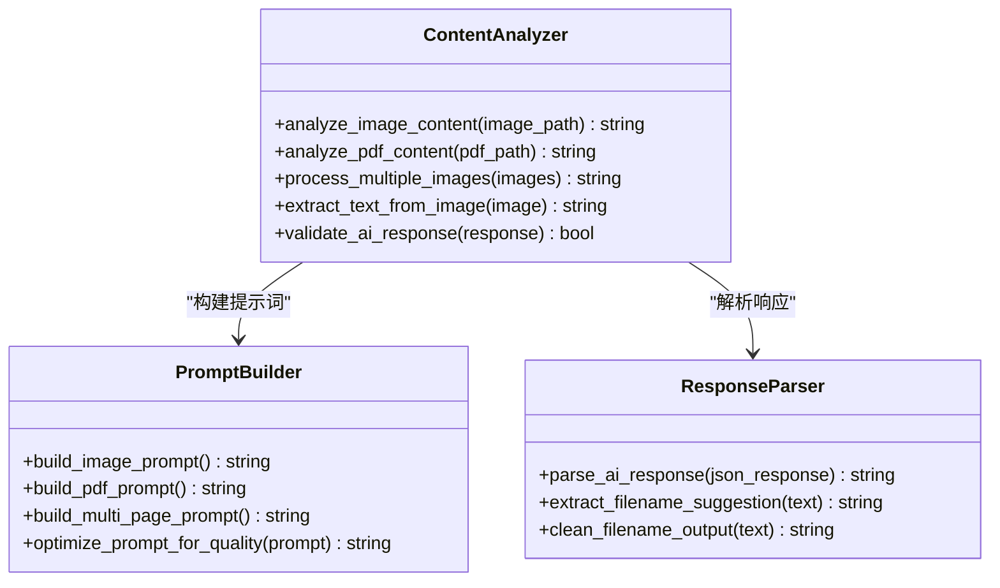

**图表来源**
- [v1.py:149-196](file://v1.py#L149-L196)

#### 支持的文件格式

系统针对不同文件格式采用了专门的处理策略：

| 文件格式 | 处理方式 | 特殊配置 |
|---------|---------|----------|
| JPG/JPEG | 直接调用AI分析 | 提示词："概括图片核心内容" |
| PNG | 直接调用AI分析 | 提示词："概括图片核心内容" |
| BMP | 直接调用AI分析 | 提示词："概括图片核心内容" |
| TIFF | 直接调用AI分析 | 提示词："概括图片核心内容" |
| PDF | 转换为图像后分析 | 最多处理3页，提示词："概括PDF文档主题" |

**章节来源**
- [v1.py:149-196](file://v1.py#L149-L196)

### 文件重命名策略

系统实现了智能的文件重命名机制，确保文件名的唯一性和可用性：

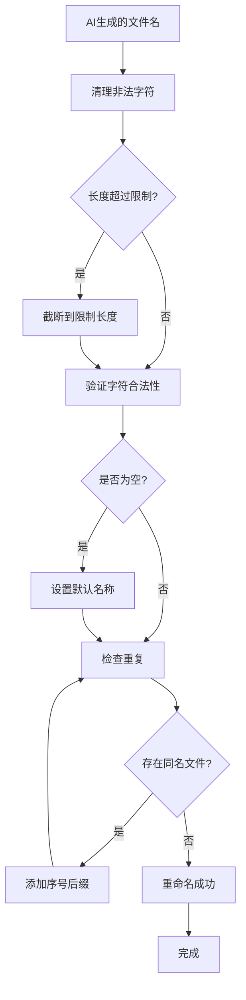

**图表来源**
- [v1.py:87-95](file://v1.py#L87-L95)

#### 重命名规则

1. **字符清理**：移除Windows文件系统不支持的特殊字符
2. **长度限制**：默认最大40个字符
3. **重复处理**：自动添加"(1)"、"(2)"等后缀
4. **扩展名保留**：确保原始文件类型不变

**章节来源**
- [v1.py:87-95](file://v1.py#L87-L95)

### GUI界面设计

系统提供了直观易用的图形用户界面：

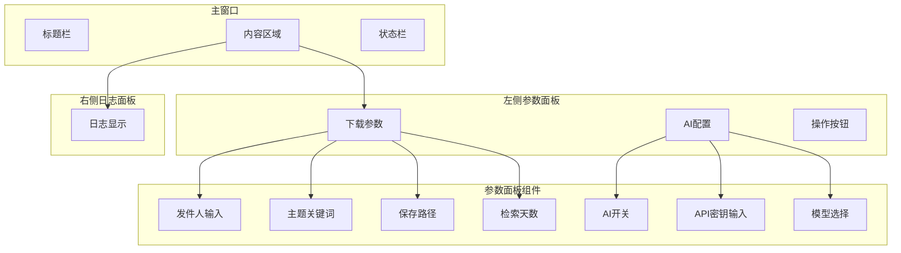

**图表来源**
- [v1.py:467-860](file://v1.py#L467-L860)

**章节来源**
- [v1.py:467-860](file://v1.py#L467-L860)

## 依赖关系分析

系统依赖关系复杂但组织有序，主要依赖包括：

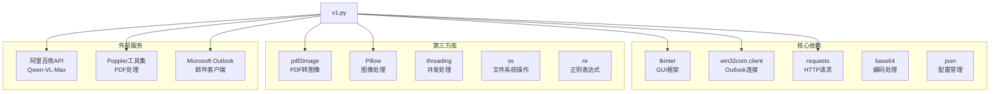

**图表来源**
- [v1.py:1-14](file://v1.py#L1-L14)
- [v1.spec:9-15](file://v1.spec#L9-L15)

### 模型选择和配置

系统支持多个Qwen-VL系列模型：

| 模型名称 | 性能特点 | 推荐场景 | 配置参数 |
|---------|---------|---------|---------|
| qwen-vl-max | 最强性能 | 高精度要求的复杂内容分析 | 默认推荐 |
| qwen-vl-max-latest | 最新版本 | 需要最新功能的场景 | 功能最全 |
| qwen-vl-plus | 平衡性能 | 一般用途的文档分析 | 性价比最高 |

**章节来源**
- [v1.py:737-742](file://v1.py#L737-L742)
- [v1.py:66-67](file://v1.py#L66-L67)

## 性能考虑

### 并发处理优化

系统采用多线程架构避免UI阻塞：

1. **后台线程**：所有网络请求和文件操作都在独立线程中执行
2. **UI线程安全**：使用`root.after()`方法确保UI更新的安全性
3. **资源管理**：及时释放临时文件和内存资源

### 内存管理策略

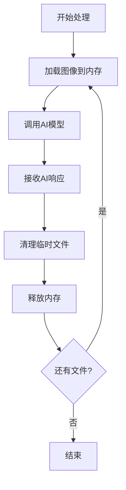

**图表来源**
- [v1.py:184-196](file://v1.py#L184-L196)

### 网络请求优化

1. **超时设置**：所有API请求设置60秒超时
2. **重试机制**：网络异常时自动重试
3. **连接复用**：合理管理HTTP连接

## 故障排除指南

### 常见问题及解决方案

#### API密钥相关问题

| 问题症状 | 可能原因 | 解决方案 |
|---------|---------|---------|
| "请先填写 API Key" | 密钥未配置 | 在UI中输入有效密钥并保存 |
| API调用失败 | 密钥无效或过期 | 重新申请并更新密钥 |
| 请求超时 | 网络连接问题 | 检查网络连接和防火墙设置 |

#### PDF处理问题

| 问题症状 | 可能原因 | 解决方案 |
|---------|---------|---------|
| PDF无页面 | 文件损坏 | 检查PDF文件完整性 |
| Poppler路径错误 | 工具集未安装 | 安装Poppler并设置正确路径 |
| 转换失败 | 权限不足 | 以管理员身份运行程序 |

#### OutLook连接问题

| 问题症状 | 可能原因 | 解决方案 |
|---------|---------|---------|
| 连接失败 | Outlook未启动 | 启动Outlook后再运行程序 |
| 权限不足 | 用户权限限制 | 以管理员身份运行程序 |
| 访问被拒绝 | 安全软件拦截 | 添加程序到安全软件白名单 |

**章节来源**
- [v1.py:107-148](file://v1.py#L107-L148)
- [v1.py:97-106](file://v1.py#L97-L106)

### 错误处理机制

系统实现了多层次的错误处理：

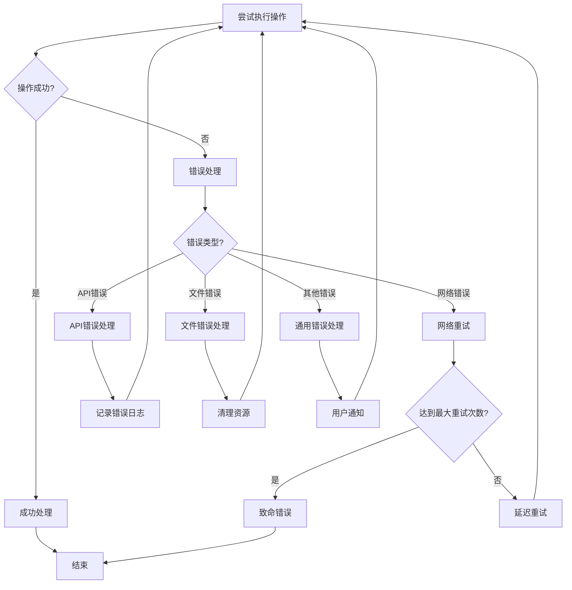

**图表来源**
- [v1.py:180-196](file://v1.py#L180-L196)

## 结论

AI智能命名系统是一个功能完整、架构清晰的多模态文件处理工具。系统成功集成了阿里百炼Qwen-VL-Max模型，提供了强大的图像和PDF内容分析能力。通过合理的架构设计和完善的错误处理机制，系统能够在各种环境下稳定运行。

### 主要优势

1. **多模态AI集成**：深度整合阿里百炼API，支持复杂的视觉理解任务
2. **用户友好界面**：提供直观的图形界面，降低使用门槛
3. **灵活的配置选项**：支持多种模型选择和参数调整
4. **健壮的错误处理**：完善的异常处理和恢复机制
5. **高效的性能表现**：多线程架构确保良好的用户体验

### 技术特色

- **智能文件名生成**：基于内容理解的自动化命名
- **批量处理能力**：支持大量文件的高效处理
- **安全的密钥管理**：本地加密存储API密钥
- **跨平台兼容**：支持Windows环境下的Outlook集成

## 附录

### API配置指南

#### 配置步骤

1. **获取API密钥**
   - 访问阿里百炼控制台
   - 创建API密钥并复制密钥值
   - 在系统中输入并保存密钥

2. **模型选择**
   - 在下拉菜单中选择合适的模型
   - 默认推荐使用`qwen-vl-max`

3. **参数设置**
   - 设置发件人名称筛选条件
   - 配置主题关键词（可选）
   - 指定附件保存路径
   - 设置检索天数范围

#### 调用参数说明

| 参数名称 | 类型 | 默认值 | 描述 |
|---------|------|--------|------|
| model | string | qwen-vl-max | AI模型名称 |
| max_tokens | integer | 150 | 最大生成长度 |
| temperature | float | 0.2 | 采样温度 |
| timeout | integer | 60 | 请求超时时间 |

### 代码示例路径

#### 配置API Key
参考路径：[v1.py:451-465](file://v1.py#L451-L465)

#### 调用AI模型
参考路径：[v1.py:107-148](file://v1.py#L107-L148)

#### 处理PDF内容
参考路径：[v1.py:149-196](file://v1.py#L149-L196)

#### 生成文件名
参考路径：[v1.py:87-95](file://v1.py#L87-L95)

### 性能优化建议

1. **网络优化**
   - 使用稳定的网络连接
   - 避免在高峰期进行大量API调用
   - 合理设置超时参数

2. **内存管理**
   - 及时清理临时文件
   - 监控内存使用情况
   - 避免同时处理过多大文件

3. **并发控制**
   - 合理设置并发数量
   - 监控系统资源使用
   - 避免过度占用系统资源