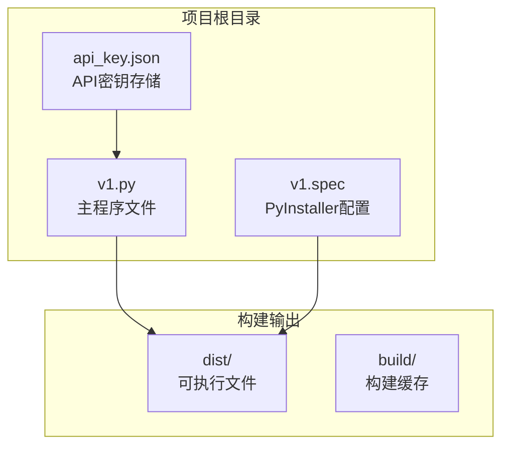
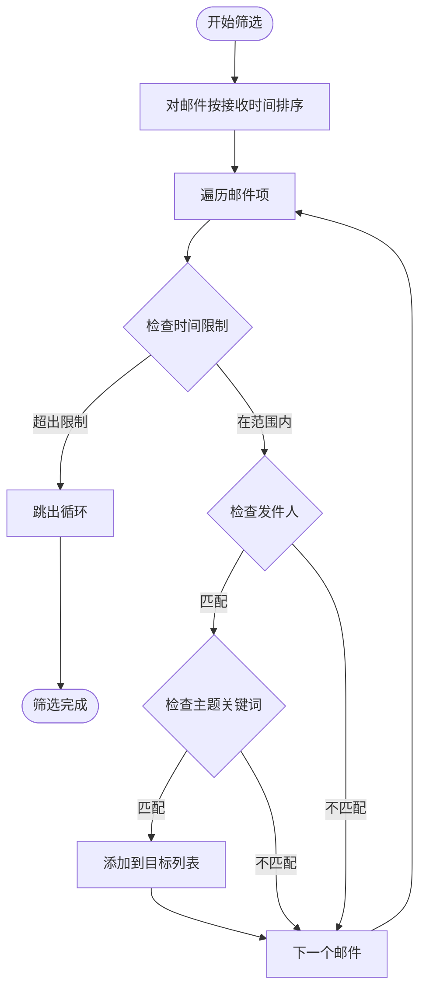
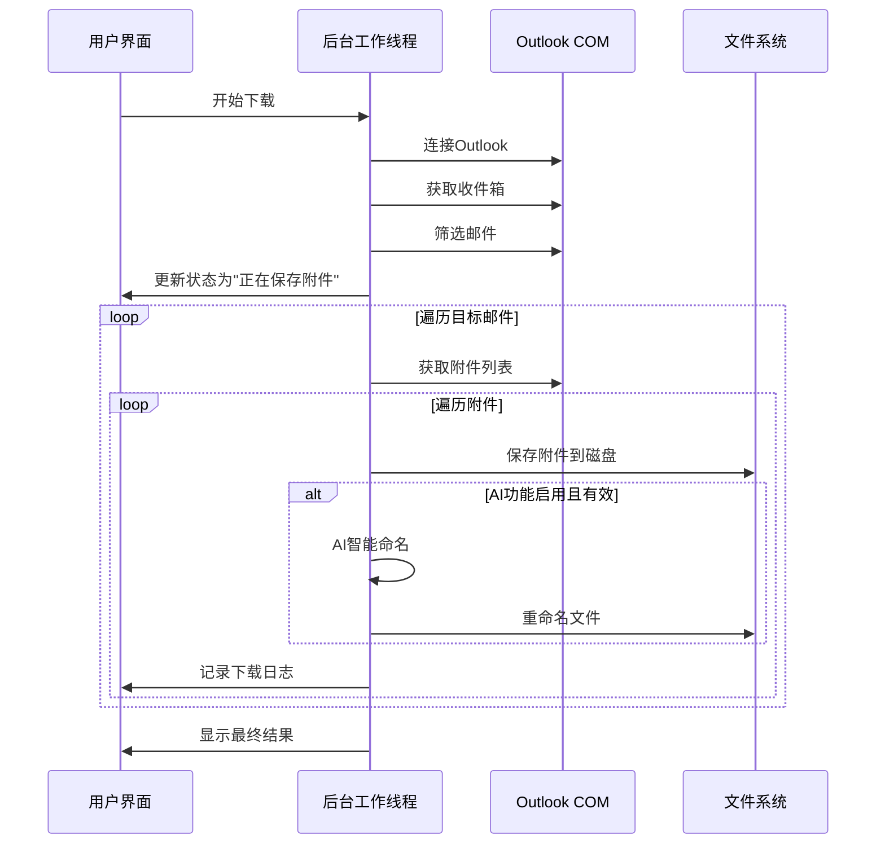
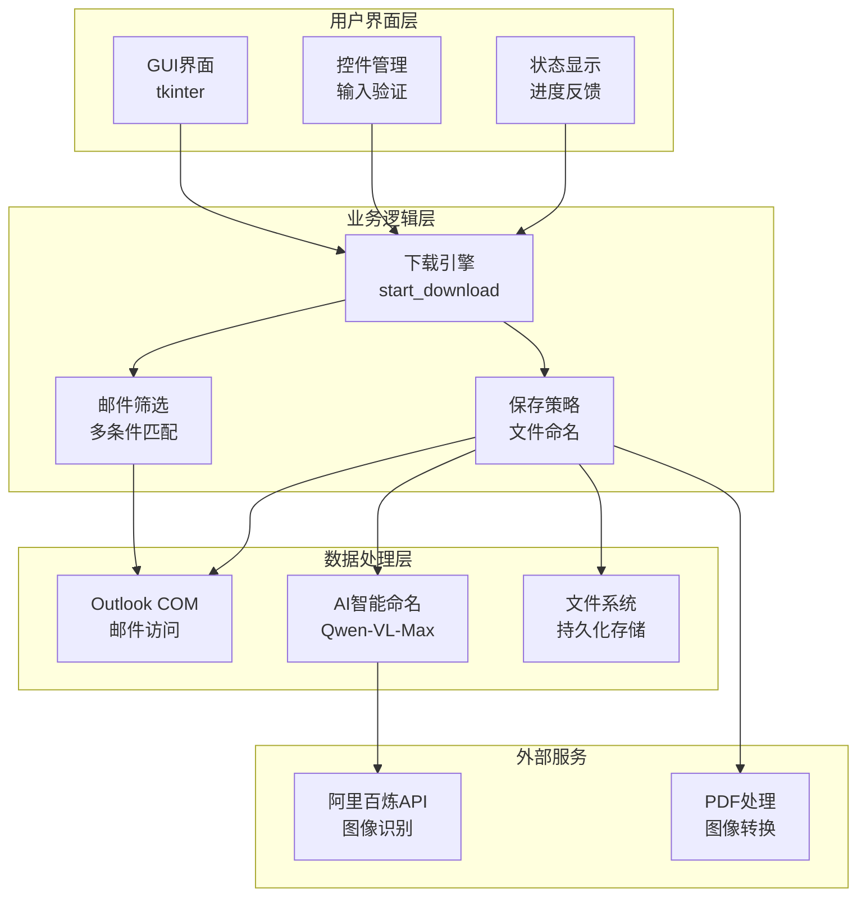
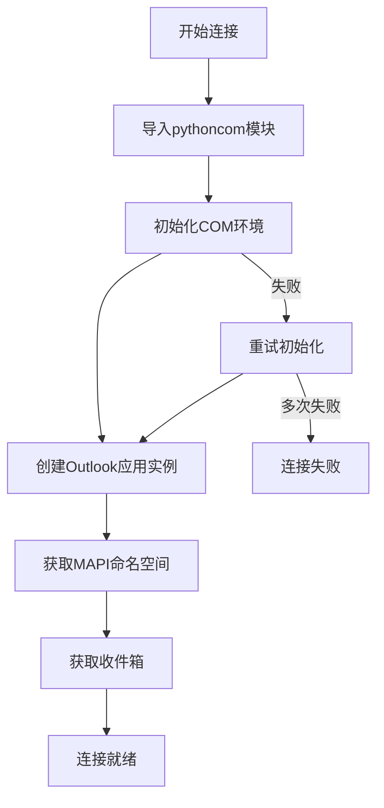
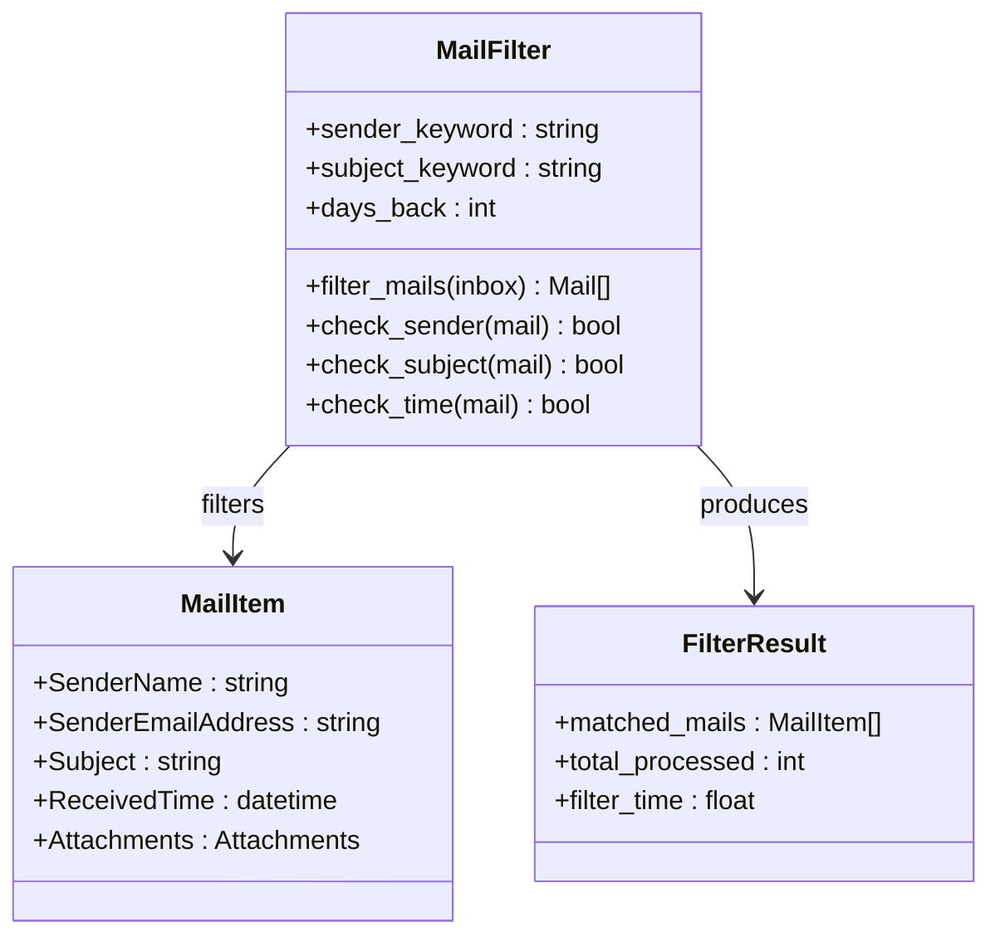
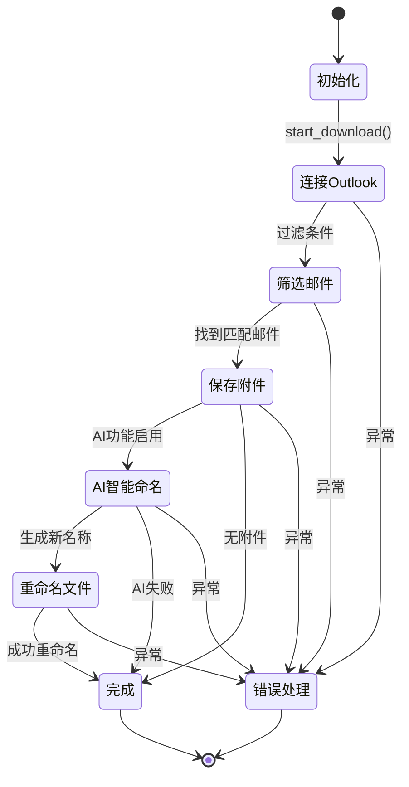
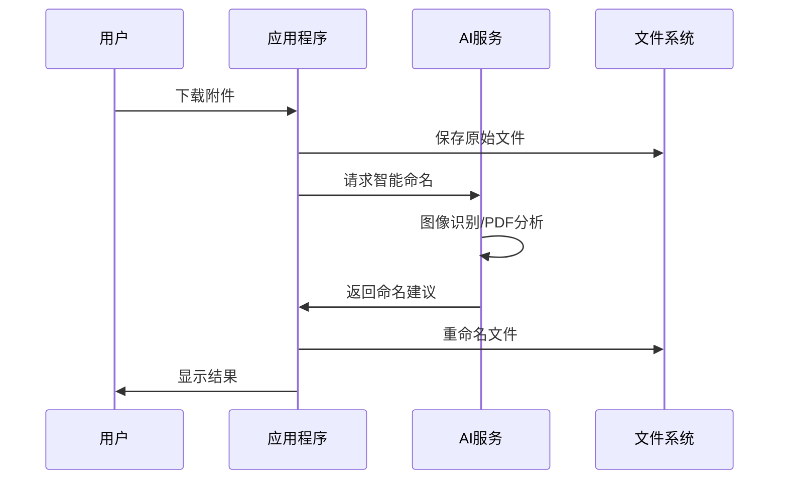
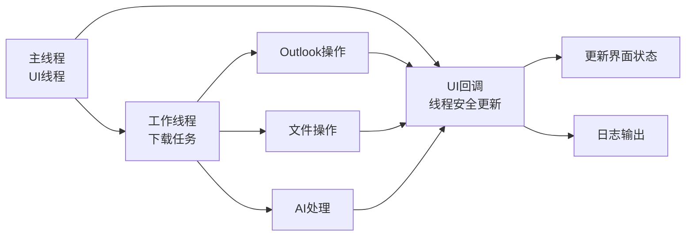
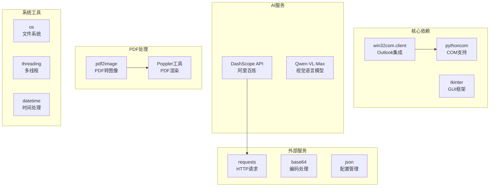

# Outlook附件下载

<cite>
**本文档引用的文件**
- [v1.py](file://v1.py)
- [v1.spec](file://v1.spec)
- [api_key.json](file://api_key.json)
</cite>

## 目录
1. [简介](#简介)
2. [项目结构](#项目结构)
3. [核心组件](#核心组件)
4. [架构概览](#架构概览)
5. [详细组件分析](#详细组件分析)
6. [依赖关系分析](#依赖关系分析)
7. [性能考虑](#性能考虑)
8. [故障排除指南](#故障排除指南)
9. [结论](#结论)
10. [附录](#附录)

## 简介

Outlook附件下载是一个基于Python的桌面应用程序，专门设计用于从Outlook邮箱中批量下载特定发件人的邮件附件。该应用集成了Outlook COM接口、多线程处理、AI智能命名等功能，为用户提供了一个直观易用的图形界面来管理邮件附件。

主要功能特性包括：
- 基于发件人名称和主题关键词的智能邮件筛选
- 时间范围限制的邮件搜索
- 批量附件下载和保存
- AI驱动的智能文件命名
- 多线程异步处理
- 完整的日志记录和状态反馈

## 项目结构

该项目采用简洁的单文件架构，所有功能都集中在单一的Python脚本中：



**图表来源**
- [v1.py:1-860](file://v1.py#L1-L860)
- [v1.spec:1-45](file://v1.spec#L1-L45)

**章节来源**
- [v1.py:1-860](file://v1.py#L1-L860)
- [v1.spec:1-45](file://v1.spec#L1-L45)

## 核心组件

### Outlook COM接口集成

应用程序通过win32com.client模块与Outlook进行深度集成，实现了对Outlook邮箱的完全控制：

- **Outlook Application对象**：通过Dispatch("Outlook.Application")创建Outlook实例
- **MAPI命名空间**：使用GetNamespace("MAPI")访问Outlook数据
- **收件箱操作**：通过GetDefaultFolder(6)获取收件箱
- **邮件项处理**：遍历Items集合，支持排序和筛选

### 邮件筛选算法

系统实现了高效的邮件筛选机制，支持多种筛选条件：



**图表来源**
- [v1.py:288-336](file://v1.py#L288-L336)

### 附件下载流程

附件下载过程包含多个步骤，确保数据完整性和用户体验：



**图表来源**
- [v1.py:346-417](file://v1.py#L346-L417)

**章节来源**
- [v1.py:261-435](file://v1.py#L261-L435)

## 架构概览

应用程序采用分层架构设计，清晰分离了用户界面、业务逻辑和数据处理层：



**图表来源**
- [v1.py:199-435](file://v1.py#L199-L435)

## 详细组件分析

### Outlook连接管理

Outlook连接是整个系统的核心，负责建立与Outlook应用程序的通信：

#### 连接建立流程



**图表来源**
- [v1.py:261-273](file://v1.py#L261-L273)

#### 错误处理机制

连接过程中可能遇到的问题包括：
- Outlook应用程序未启动
- COM接口初始化失败
- 权限不足
- 网络连接问题

系统通过try-catch块和状态检查来处理这些异常情况。

**章节来源**
- [v1.py:261-273](file://v1.py#L261-L273)

### 邮件筛选算法

邮件筛选是系统的核心功能之一，支持多种复杂的筛选条件：

#### 多条件筛选实现



**图表来源**
- [v1.py:288-336](file://v1.py#L288-L336)

#### 时间范围处理

系统支持灵活的时间范围限制，能够处理不同时间区域的邮件：

- **本地时间处理**：自动检测邮件的时区信息
- **动态计算**：根据当前时间和用户设置计算截止日期
- **精确匹配**：确保邮件在指定时间范围内

**章节来源**
- [v1.py:288-336](file://v1.py#L288-L336)

### 附件下载流程

附件下载过程包含完整的错误处理和状态管理：

#### 下载状态机



**图表来源**
- [v1.py:346-417](file://v1.py#L346-L417)

#### 保存策略

系统实现了智能的文件保存策略：

- **时间戳命名**：使用邮件接收时间作为文件名前缀
- **原始扩展名**：保持附件的原始文件扩展名
- **冲突解决**：自动处理重复文件名
- **大小过滤**：忽略小于10KB的小文件

**章节来源**
- [v1.py:346-417](file://v1.py#L346-L417)

### AI智能命名系统

AI智能命名功能提供了基于内容的自动化文件命名：

#### AI命名流程



**图表来源**
- [v1.py:149-197](file://v1.py#L149-L197)

#### 支持的文件类型

系统支持多种文件类型的智能命名：

- **图像文件**：JPG、PNG、BMP、TIFF
- **PDF文件**：多页PDF的前几页图像分析
- **其他格式**：保留原文件名

**章节来源**
- [v1.py:149-197](file://v1.py#L149-L197)

### 多线程下载处理

系统采用多线程架构确保用户界面的响应性：

#### 线程管理



**图表来源**
- [v1.py:257-435](file://v1.py#L257-L435)

#### 线程安全机制

系统通过root.after方法确保UI更新的线程安全性：

- **UI回调封装**：ui_call函数确保回调在主线程执行
- **状态同步**：使用StringVar和BooleanVar管理状态
- **异常隔离**：工作线程异常不影响主线程

**章节来源**
- [v1.py:257-435](file://v1.py#L257-L435)

## 依赖关系分析

应用程序的依赖关系相对简单，主要依赖于标准库和第三方包：



**图表来源**
- [v1.py:1-14](file://v1.py#L1-L14)
- [v1.spec:9-15](file://v1.spec#L9-L15)

**章节来源**
- [v1.spec:9-15](file://v1.spec#L9-L15)

## 性能考虑

### 内存管理

系统在处理大量邮件和附件时采用了多项内存优化措施：

- **延迟加载**：只在需要时加载邮件内容
- **及时释放**：使用finally块确保资源正确释放
- **增量处理**：分批处理邮件，避免内存峰值

### 网络优化

AI命名功能的网络请求进行了优化：

- **超时控制**：设置60秒超时防止长时间等待
- **错误重试**：API调用失败时自动重试
- **连接复用**：合理管理HTTP连接

### 用户体验优化

- **进度反馈**：实时显示处理进度和状态
- **异步处理**：避免界面冻结
- **日志记录**：详细记录操作过程便于调试

## 故障排除指南

### 常见问题及解决方案

#### Outlook连接问题

**问题症状**：无法连接到Outlook应用程序

**可能原因**：
- Outlook未启动
- COM接口权限不足
- Office版本不兼容

**解决方案**：
1. 确保Outlook应用程序已启动
2. 以管理员权限运行程序
3. 检查Office安装完整性

#### API密钥问题

**问题症状**：AI功能无法使用

**可能原因**：
- API密钥格式错误
- 网络连接问题
- 配额限制

**解决方案**：
1. 在设置中重新输入有效的API密钥
2. 检查网络连接状态
3. 确认账户配额充足

#### 文件保存问题

**问题症状**：附件无法保存到指定位置

**可能原因**：
- 目录权限不足
- 磁盘空间不足
- 文件名冲突

**解决方案**：
1. 检查目标目录的写入权限
2. 确保有足够的磁盘空间
3. 修改保存路径或文件名

### 调试技巧

#### 日志分析

系统提供了详细的日志输出，可以通过以下方式查看：

1. 打开下载日志面板
2. 查看错误信息和警告
3. 分析处理流程的每个步骤

#### 状态监控

- **状态栏**：显示当前操作状态
- **结果标签**：显示最终处理结果
- **进度指示**：显示处理进度百分比

**章节来源**
- [v1.py:419-427](file://v1.py#L419-L427)

## 结论

Outlook附件下载应用程序是一个功能完整、设计合理的桌面工具。它成功地将复杂的Outlook COM接口操作、智能邮件筛选算法、AI驱动的文件命名功能和多线程处理机制整合在一个用户友好的界面中。

主要优势包括：
- **功能全面**：涵盖了从邮件筛选到文件命名的完整流程
- **用户友好**：直观的图形界面和详细的使用指南
- **性能优秀**：多线程处理确保良好的用户体验
- **扩展性强**：模块化设计便于功能扩展

未来可以考虑的功能改进：
- 添加更多筛选条件选项
- 支持更多的文件类型处理
- 增强错误恢复能力
- 提供批量操作功能

## 附录

### 配置文件说明

#### API密钥配置

API密钥存储在用户配置目录中，使用JSON格式存储：

```json
{
  "api_key": "sk-xxxxxxxxxxxxxxxxxxxxxxxx"
}
```

#### PyInstaller配置

v1.spec文件定义了应用程序的打包配置，包括：
- 隐藏导入模块列表
- 二进制文件包含
- 数据文件处理
- 运行时钩子配置

### 使用示例

#### 基本使用流程

1. **配置发件人名称**：在发件人名称输入框中输入要筛选的发件人关键字
2. **设置主题关键词**：可选的主题匹配条件
3. **选择保存路径**：点击浏览按钮选择附件保存目录
4. **设置检索天数**：输入要搜索的邮件天数范围
5. **配置AI功能**：如需智能命名，配置API密钥
6. **开始下载**：点击开始按钮执行下载操作

#### 高级配置

- **时间范围**：建议首次使用时设置为7天或30天
- **AI模型选择**：可根据需求选择不同的Qwen模型
- **并发处理**：系统自动处理多线程，无需用户干预