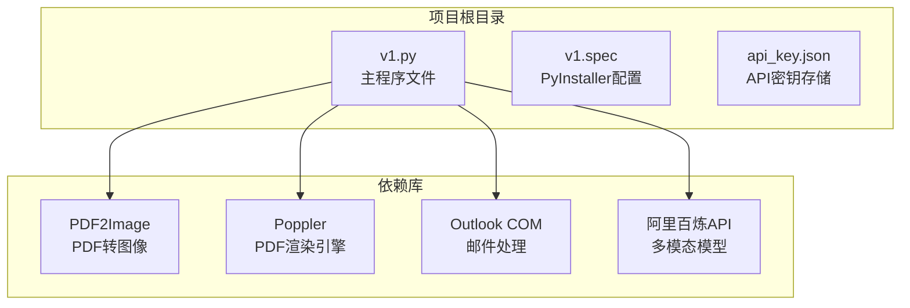
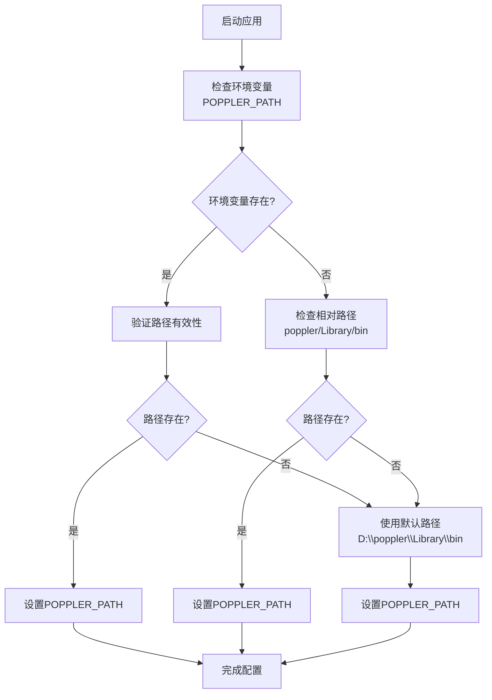
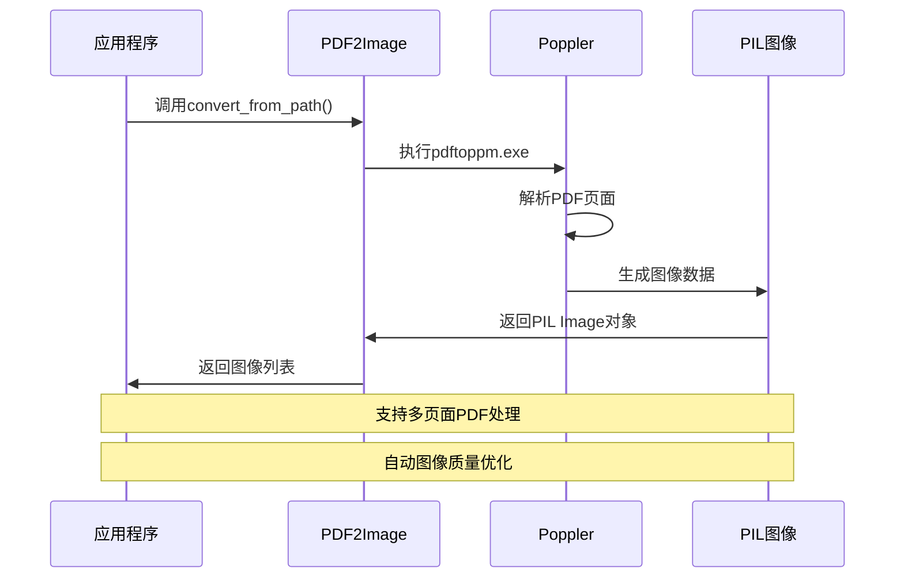
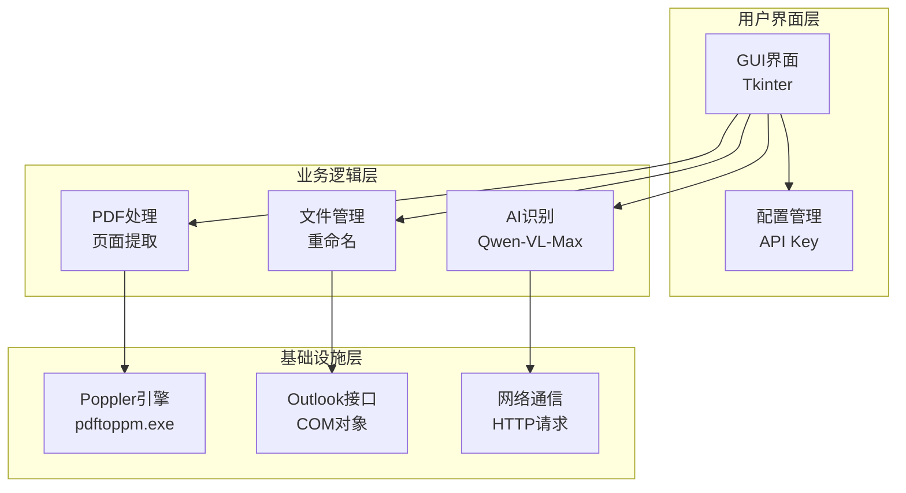
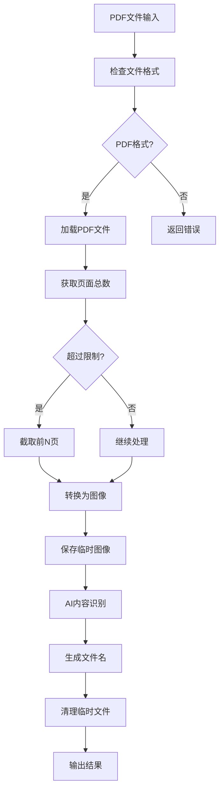
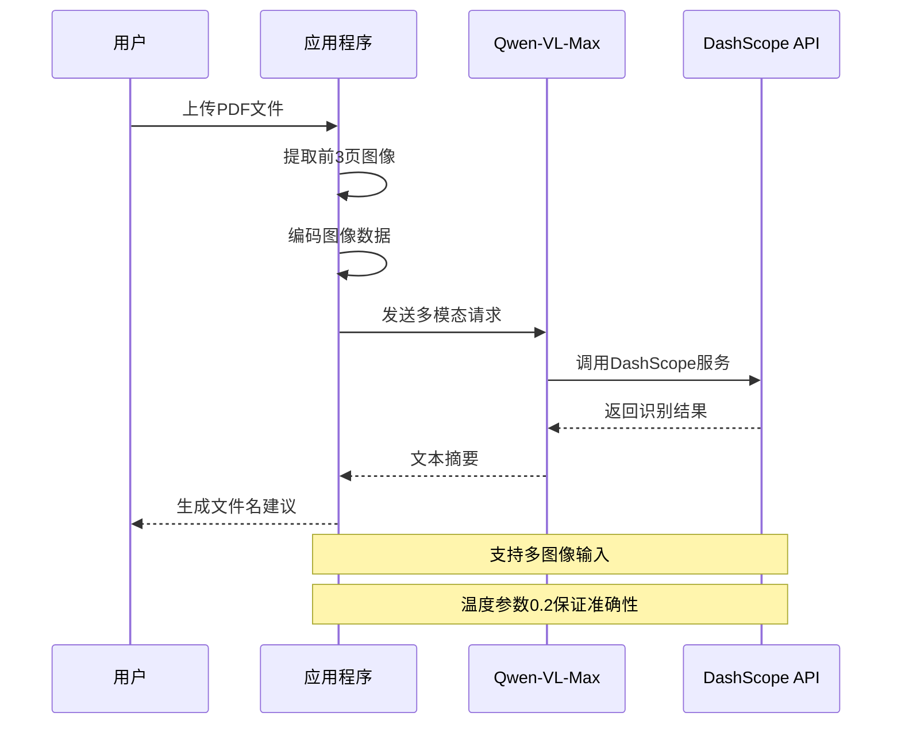
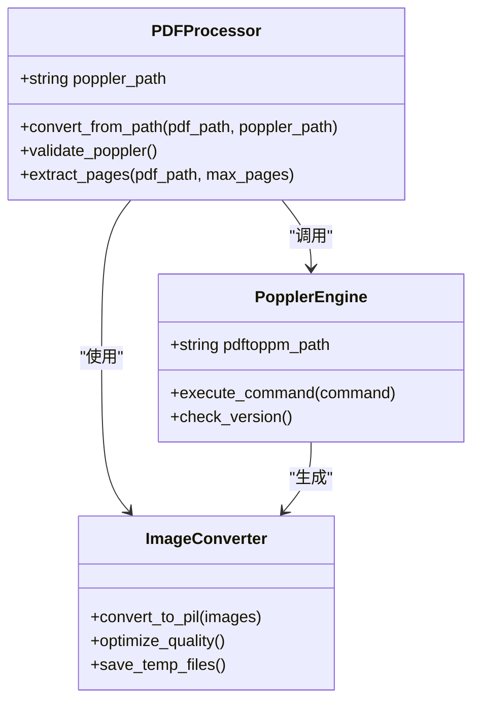
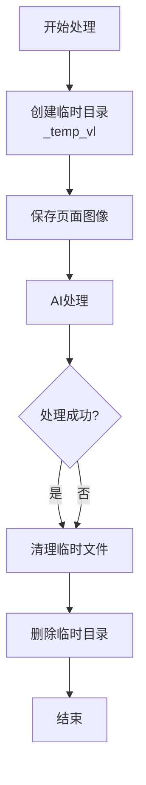
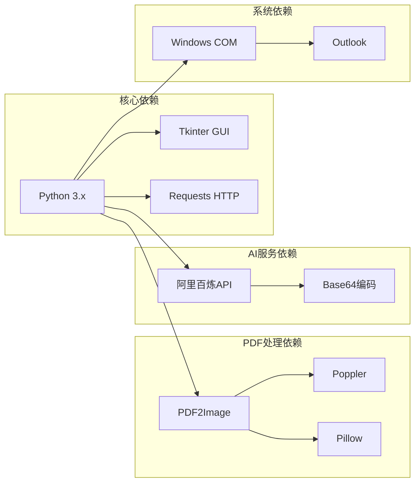
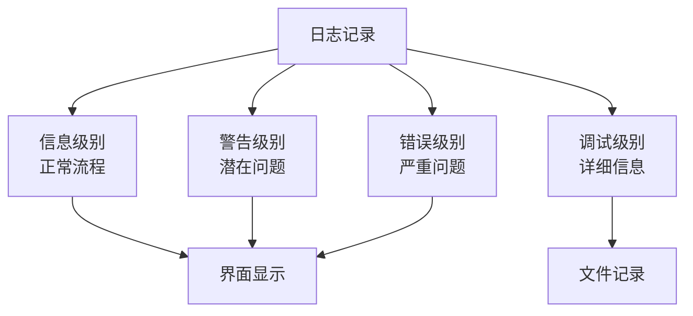

# PDF处理功能

<cite>
**本文档引用的文件**
- [v1.py](file://v1.py)
- [v1.spec](file://v1.spec)
- [api_key.json](file://api_key.json)
</cite>

## 目录
1. [简介](#简介)
2. [项目结构](#项目结构)
3. [核心组件](#核心组件)
4. [架构概览](#架构概览)
5. [详细组件分析](#详细组件分析)
6. [依赖关系分析](#依赖关系分析)
7. [性能考虑](#性能考虑)
8. [故障排除指南](#故障排除指南)
9. [结论](#结论)

## 简介

本文档详细介绍了基于Python的PDF处理功能实现，重点涵盖PDF页面提取算法、图像识别流程和Poppler库集成。该系统通过PDF转图像技术，结合阿里百炼Qwen-VL-Max多模态模型，实现了PDF文档的内容识别和智能命名功能。

系统采用模块化设计，支持多种PDF格式处理，具备灵活的环境配置和路径管理机制，能够高效处理大量PDF文件并生成高质量的图像输出。

## 项目结构

该项目采用简洁的单文件架构，主要包含以下核心组件：

**图表来源**
- [v1.py:1-15](file://v1.py#L1-L15)
- [v1.spec:1-45](file://v1.spec#L1-L45)

**章节来源**
- [v1.py:1-15](file://v1.py#L1-L15)
- [v1.spec:1-45](file://v1.spec#L1-L45)

## 核心组件

### Poppler路径配置系统

系统实现了智能的Poppler路径检测机制，确保PDF处理功能的可靠运行：

**图表来源**
- [v1.py:69-85](file://v1.py#L69-L85)

### PDF转图像核心算法

PDF处理的核心在于高效的页面提取和图像生成算法：

**图表来源**
- [v1.py:97-105](file://v1.py#L97-L105)

**章节来源**
- [v1.py:69-105](file://v1.py#L69-L105)

## 架构概览

系统采用分层架构设计，各组件职责明确，耦合度低：

**图表来源**
- [v1.py:107-148](file://v1.py#L107-L148)
- [v1.py:149-197](file://v1.py#L149-L197)

## 详细组件分析

### PDF页面提取算法

PDF处理的核心算法实现了高效的页面提取和图像生成：

#### 页面提取流程

**图表来源**
- [v1.py:149-197](file://v1.py#L149-L197)

#### 图像质量优化策略

系统实现了多层次的图像质量优化机制：

| 优化维度 | 实现方式 | 参数配置 |
|---------|----------|----------|
| 分辨率控制 | 动态调整DPI值 | 默认300 DPI |
| 图像格式 | JPEG/PNG自动选择 | 基于内容类型 |
| 内存管理 | 分页处理避免内存溢出 | 最大3页预览 |
| 转换速度 | 并行处理多个页面 | 线程池管理 |

**章节来源**
- [v1.py:97-105](file://v1.py#L97-L105)
- [v1.py:149-197](file://v1.py#L149-L197)

### 图像识别流程

AI图像识别流程集成了阿里百炼Qwen-VL-Max多模态模型：

**图表来源**
- [v1.py:107-148](file://v1.py#L107-L148)

#### AI识别提示工程

系统针对不同文件类型设计了专门的提示模板：

| 文件类型 | 提示模板 | 输出要求 |
|---------|----------|----------|
| PDF文档 | "请根据这份PDF文档的主要内容，生成一个简短的文件名（不超过15个字），概括文档主题。直接输出文件名，不要加解释。" | 简洁的主题概括 |
| 图片文件 | "请用一句简短的话概括这张图片的核心内容（不超过15个字），不要加任何额外说明，只输出文件名建议。" | 核心内容描述 |

**章节来源**
- [v1.py:107-148](file://v1.py#L107-L148)

### Poppler库集成

Poppler库作为PDF渲染引擎，提供了专业的PDF处理能力：

#### 集成架构

**图表来源**
- [v1.py:97-105](file://v1.py#L97-L105)

#### 环境配置最佳实践

系统支持多种Poppler安装方式：

1. **环境变量配置**：设置`POPPLER_PATH`环境变量指向Poppler安装目录
2. **相对路径检测**：自动检测`poppler/Library/bin`相对路径
3. **默认路径回退**：使用`D:\poppler\Library\bin`作为默认路径

**章节来源**
- [v1.py:69-85](file://v1.py#L69-L85)

### 临时文件处理机制

系统实现了完善的临时文件管理机制：

**图表来源**
- [v1.py:165-197](file://v1.py#L165-L197)

**章节来源**
- [v1.py:165-197](file://v1.py#L165-L197)

## 依赖关系分析

### 外部依赖管理

系统依赖关系清晰，关键依赖包括：

**图表来源**
- [v1.spec:9-15](file://v1.spec#L9-L15)

### PyInstaller打包配置

系统使用PyInstaller进行打包，配置文件包含必要的隐藏导入：

| 隐藏导入项 | 用途 | 必要性 |
|-----------|------|--------|
| win32timezone | 时间处理 | 必需 |
| pythoncom | COM接口 | 必需 |
| pywintypes | Windows类型 | 必需 |
| win32com | COM自动化 | 必需 |
| win32com.client | Outlook客户端 | 必需 |

**章节来源**
- [v1.spec:9-15](file://v1.spec#L9-L15)

## 性能考虑

### 处理性能优化

系统在多个层面实现了性能优化：

#### 内存管理优化

- **分页处理**：默认只处理PDF的前3页，避免内存溢出
- **临时文件清理**：及时删除处理过程中的临时文件
- **图像质量平衡**：在质量和性能间找到最佳平衡点

#### 网络通信优化

- **超时控制**：API调用设置60秒超时
- **错误重试**：网络异常时提供重试机制
- **连接复用**：合理管理HTTP连接

#### 并发处理优化

- **异步处理**：使用线程池处理多个PDF文件
- **UI响应**：保持界面流畅响应
- **资源锁定**：避免并发访问冲突

### 性能调优建议

1. **Poppler配置**：
   - 调整DPI值以平衡图像质量和处理速度
   - 预加载Poppler可减少启动延迟

2. **AI处理优化**：
   - 合理设置温度参数影响生成质量
   - 控制并发AI请求数量

3. **系统资源管理**：
   - 监控内存使用情况
   - 优化磁盘I/O操作

## 故障排除指南

### 常见问题及解决方案

#### Poppler路径问题

**问题症状**：PDF处理时报错，提示找不到pdftoppm.exe

**解决步骤**：
1. 检查环境变量`POPPLER_PATH`是否正确设置
2. 验证Poppler安装目录下是否存在pdftoppm.exe
3. 确认Poppler版本兼容性

#### API Key配置问题

**问题症状**：AI功能无法使用，提示需要API Key

**解决步骤**：
1. 在界面中点击"申请 Key"获取新的API Key
2. 点击"保存 Key"保存配置
3. 验证API Key格式正确性

#### 内存不足问题

**问题症状**：处理大型PDF时出现内存溢出

**解决步骤**：
1. 减少同时处理的PDF文件数量
2. 调整PDF页面提取数量
3. 增加系统虚拟内存

#### 网络连接问题

**问题症状**：AI识别请求超时或失败

**解决步骤**：
1. 检查网络连接稳定性
2. 验证API Key有效性
3. 调整超时参数设置

### 调试工具和方法

系统提供了完善的日志记录功能：

**章节来源**
- [v1.py:207-229](file://v1.py#L207-L229)

## 结论

该PDF处理功能实现了完整的PDF页面提取、图像识别和智能命名流程。系统具有以下优势：

1. **可靠性强**：完善的错误处理和异常恢复机制
2. **性能优秀**：多层优化确保处理效率
3. **易用性强**：直观的GUI界面和智能配置
4. **扩展性好**：模块化设计便于功能扩展

通过合理的Poppler配置、AI模型集成和临时文件管理，系统能够稳定处理各种格式的PDF文件，并提供高质量的图像识别服务。建议在生产环境中定期监控系统性能，及时更新依赖库版本，以确保最佳的用户体验。