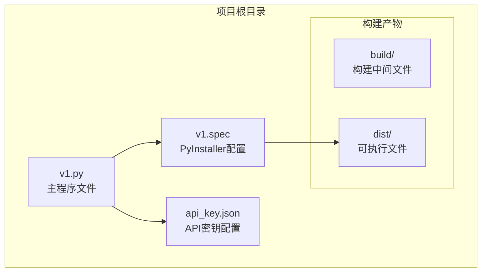
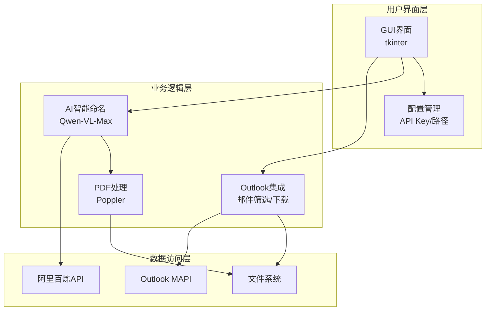
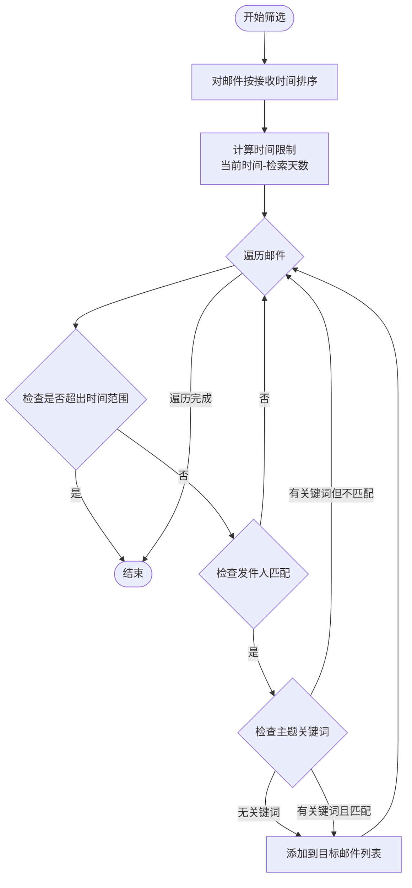
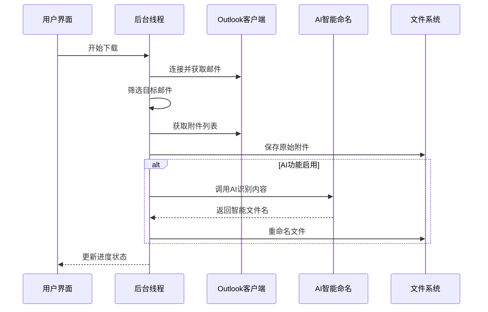
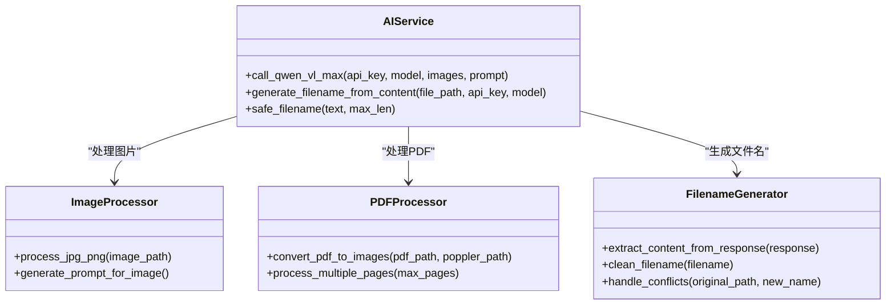
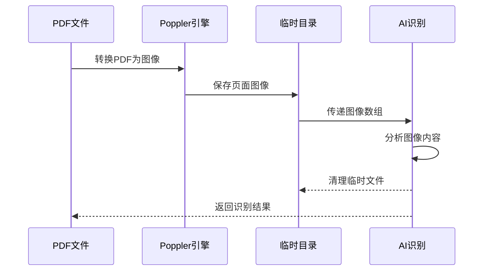
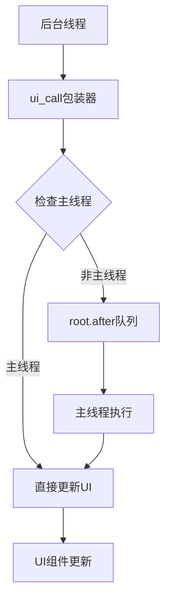
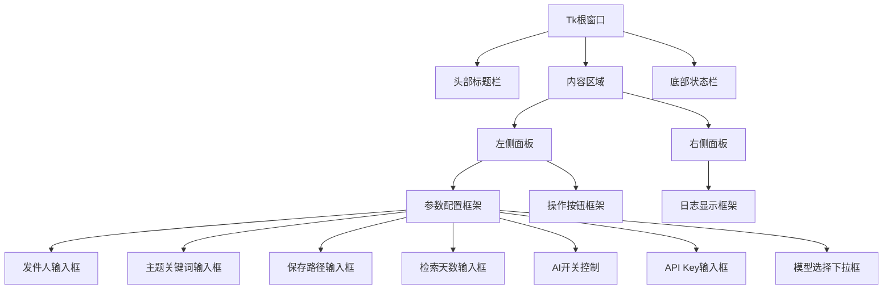
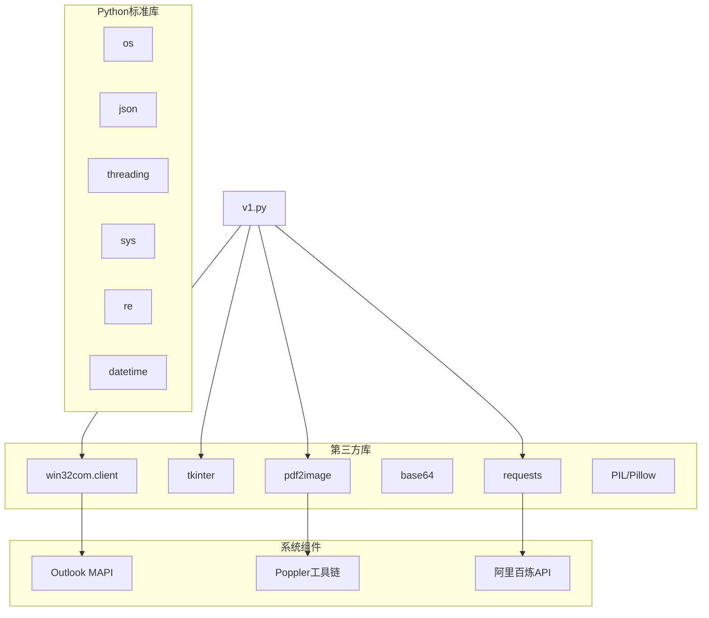
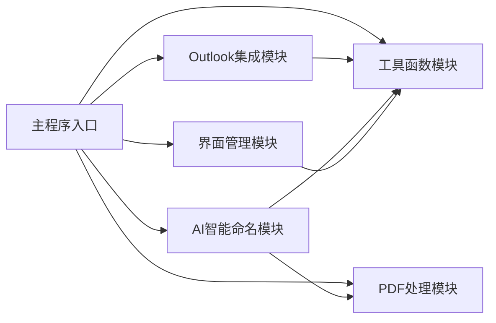

# 核心功能

<cite>
**本文引用的文件**
- [v1.py](file://v1.py)
- [v1.spec](file://v1.spec)
- [api_key.json](file://api_key.json)
</cite>

## 目录
1. [简介](#简介)
2. [项目结构](#项目结构)
3. [核心组件](#核心组件)
4. [架构总览](#架构总览)
5. [详细组件分析](#详细组件分析)
6. [依赖关系分析](#依赖关系分析)
7. [性能考虑](#性能考虑)
8. [故障排除指南](#故障排除指南)
9. [结论](#结论)
10. [附录](#附录)

## 简介
Outlook附件下载AI智能命名系统是一个集成了Outlook邮件客户端、AI智能识别和PDF处理功能的自动化工具。该系统能够：
- 自动连接Outlook并筛选指定发件人和主题的邮件
- 批量下载邮件附件并进行智能重命名
- 利用阿里百炼Qwen-VL-Max多模态模型识别图片和PDF内容
- 支持多线程并发处理，提升下载效率
- 提供友好的图形用户界面和实时进度反馈

## 项目结构
该项目采用单文件架构设计，所有功能集中在单一Python文件中，便于打包和部署。



**图表来源**
- [v1.py:1-827](file://v1.py#L1-L827)
- [v1.spec:1-45](file://v1.spec#L1-L45)

**章节来源**
- [v1.py:1-827](file://v1.py#L1-L827)
- [v1.spec:1-45](file://v1.spec#L1-L45)

## 核心组件
系统由以下核心组件构成：

### 1. Outlook集成模块
负责与Outlook邮件客户端进行交互，包括连接、邮件筛选和附件下载。

### 2. AI智能命名系统
基于阿里百炼Qwen-VL-Max模型的多模态内容识别系统，能够理解图片和PDF文档内容并生成智能文件名。

### 3. PDF处理功能
集成Poppler工具链，支持PDF文件的图像提取和预览功能。

### 4. 多线程处理机制
采用后台线程处理耗时操作，确保UI响应性和用户体验。

### 5. 图形用户界面
基于tkinter的现代化界面设计，提供直观的操作体验。

**章节来源**
- [v1.py:1-827](file://v1.py#L1-L827)

## 架构总览
系统采用分层架构设计，各组件职责明确，耦合度低。



**图表来源**
- [v1.py:1-827](file://v1.py#L1-L827)

## 详细组件分析

### Outlook集成模块

#### 邮件筛选算法
系统实现了高效的邮件筛选机制，支持多条件组合筛选：



**图表来源**
- [v1.py:288-336](file://v1.py#L288-L336)

#### 附件下载流程
系统采用增量下载策略，确保不会重复处理相同附件：



**图表来源**
- [v1.py:257-435](file://v1.py#L257-L435)

**章节来源**
- [v1.py:257-435](file://v1.py#L257-L435)

### AI智能命名系统

#### 多模态内容识别
系统支持多种文件类型的智能识别：



**图表来源**
- [v1.py:107-197](file://v1.py#L107-L197)

#### 文件重命名逻辑
系统实现了智能的文件重命名机制，避免文件冲突：

```mermaid
flowchart TD
INPUT[AI生成的新文件名] --> CHECK{检查文件是否存在}
CHECK --> |不存在| RENAME[重命名文件]
CHECK --> |存在| COUNTER[添加序号后缀<br/>name(1), name(2)...]
COUNTER --> CHECK2{检查新路径是否存在}
CHECK2 --> |存在| COUNTER
CHECK2 --> |不存在| RENAME
RENAME --> SUCCESS[重命名成功]
```

**图表来源**
- [v1.py:389-400](file://v1.py#L389-L400)

**章节来源**
- [v1.py:107-197](file://v1.py#L107-L197)

### PDF处理功能

#### Poppler集成
系统集成了Poppler工具链，支持PDF文件的图像提取：



**图表来源**
- [v1.py:97-106](file://v1.py#L97-L106)

**章节来源**
- [v1.py:97-106](file://v1.py#L97-L106)

### 多线程处理机制

#### 线程安全设计
系统采用线程安全的UI更新机制：



**图表来源**
- [v1.py:200-229](file://v1.py#L200-L229)

**章节来源**
- [v1.py:200-229](file://v1.py#L200-L229)

### 图形用户界面

#### 界面布局设计
系统采用响应式布局设计，适配不同屏幕尺寸：



**图表来源**
- [v1.py:467-827](file://v1.py#L467-L827)

**章节来源**
- [v1.py:467-827](file://v1.py#L467-L827)

## 依赖关系分析

### 外部依赖
系统依赖以下关键外部组件：



**图表来源**
- [v1.py:1-14](file://v1.py#L1-L14)
- [v1.spec:9-15](file://v1.spec#L9-L15)

### 内部模块依赖
系统内部模块间的关系清晰，职责分离明确：



**图表来源**
- [v1.py:1-827](file://v1.py#L1-L827)

**章节来源**
- [v1.py:1-827](file://v1.py#L1-L827)
- [v1.spec:1-45](file://v1.spec#L1-L45)

## 性能考虑

### 并发处理优化
- **多线程架构**：所有耗时操作都在后台线程执行，避免阻塞UI
- **异步API调用**：AI识别使用超时控制，防止长时间等待
- **内存管理**：及时清理临时文件和图像缓存

### 网络性能
- **请求超时**：AI API调用设置60秒超时
- **错误重试**：网络异常时提供重试机制
- **连接池**：复用HTTP连接减少开销

### 存储优化
- **增量处理**：跳过小于10KB的小文件
- **智能重命名**：避免文件覆盖冲突
- **临时文件管理**：自动清理生成的临时文件

## 故障排除指南

### 常见问题及解决方案

#### Outlook连接问题
- **症状**：无法连接Outlook或获取邮件列表为空
- **原因**：Outlook未启动或权限不足
- **解决**：确保Outlook已启动，检查Windows权限设置

#### AI识别失败
- **症状**：AI重命名功能不可用或报错
- **原因**：API Key配置错误或网络连接问题
- **解决**：检查API Key有效性，确认网络连接正常

#### PDF处理异常
- **症状**：PDF文件无法正确转换为图像
- **原因**：Poppler工具链缺失或路径配置错误
- **解决**：安装Poppler工具链并正确配置路径

#### 性能问题
- **症状**：处理大量附件时响应缓慢
- **原因**：系统资源不足或网络延迟
- **解决**：增加系统内存，优化网络环境

**章节来源**
- [v1.py:419-426](file://v1.py#L419-L426)

## 结论
Outlook附件下载AI智能命名系统是一个功能完整、架构清晰的自动化工具。其核心优势包括：

1. **智能化程度高**：通过AI技术实现智能文件命名
2. **易用性强**：提供直观的图形界面和丰富的配置选项
3. **性能优秀**：采用多线程架构确保流畅的用户体验
4. **扩展性好**：模块化设计便于功能扩展和维护

该系统为用户提供了一种高效、智能的邮件附件管理解决方案，特别适用于需要批量处理和智能分类的企业用户。

## 附录

### 配置选项详解

#### 基础配置
- **发件人名称**：支持发件人姓名和邮箱地址的模糊匹配
- **主题关键词**：可选的邮件主题过滤条件
- **保存路径**：附件文件的存储目录
- **检索天数**：邮件筛选的时间范围

#### AI配置
- **API Key**：阿里百炼平台的认证密钥
- **模型选择**：支持多种Qwen-VL系列模型
- **智能命名开关**：控制AI功能的启用/禁用

#### 高级配置
- **Poppler路径**：PDF处理工具链的安装路径
- **临时文件夹**：AI处理过程中的临时文件存储位置
- **日志级别**：控制日志输出的详细程度

### 最佳实践建议

1. **API Key管理**
   - 建议使用独立的API Key账户
   - 定期轮换API Key提高安全性
   - 在团队环境中共享配置文件

2. **性能优化**
   - 合理设置检索天数，避免处理过多邮件
   - 定期清理临时文件释放磁盘空间
   - 监控系统资源使用情况

3. **安全考虑**
   - API Key应妥善保管，避免泄露
   - 定期更新软件版本修复安全漏洞
   - 谨慎处理敏感邮件附件

4. **故障恢复**
   - 建立定期备份机制
   - 记录重要的配置信息
   - 准备应急处理方案

**章节来源**
- [v1.py:67-68](file://v1.py#L67-L68)
- [v1.py:230-240](file://v1.py#L230-L240)