# GUI架构设计

<cite>
**本文档引用的文件**
- [v1.py](file://v1.py)
- [v1.spec](file://v1.spec)
- [api_key.json](file://api_key.json)
</cite>

## 目录
1. [引言](#引言)
2. [项目结构](#项目结构)
3. [核心组件](#核心组件)
4. [架构概览](#架构概览)
5. [详细组件分析](#详细组件分析)
6. [依赖关系分析](#依赖关系分析)
7. [性能考虑](#性能考虑)
8. [故障排除指南](#故障排除指南)
9. [结论](#结论)

## 引言

本文档详细阐述了Outlook附件下载AI智能命名系统的GUI架构设计。该系统采用基于Tkinter的桌面应用程序架构，结合Outlook邮件客户端集成和阿里百炼AI服务，实现了智能附件命名功能。系统通过模块化的界面设计、响应式的布局管理和统一的主题样式系统，为用户提供直观易用的操作体验。

## 项目结构

该项目采用简洁的单文件架构设计，所有功能集中在单一Python文件中，便于部署和维护：

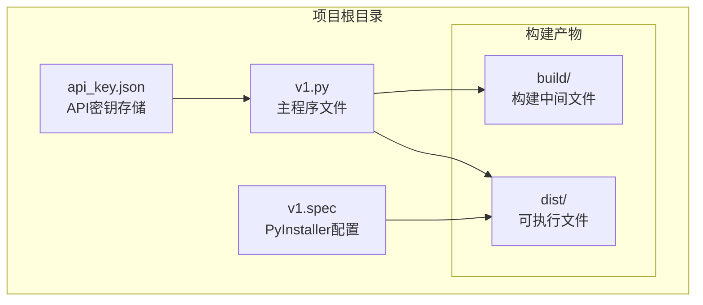

**图表来源**
- [v1.py:1-50](file://v1.py#L1-L50)
- [v1.spec:1-45](file://v1.spec#L1-L45)

**章节来源**
- [v1.py:1-50](file://v1.py#L1-L50)
- [v1.spec:1-45](file://v1.spec#L1-L45)

## 核心组件

系统的核心组件围绕Tkinter框架构建，采用分层架构设计：

### 主要组件层次结构

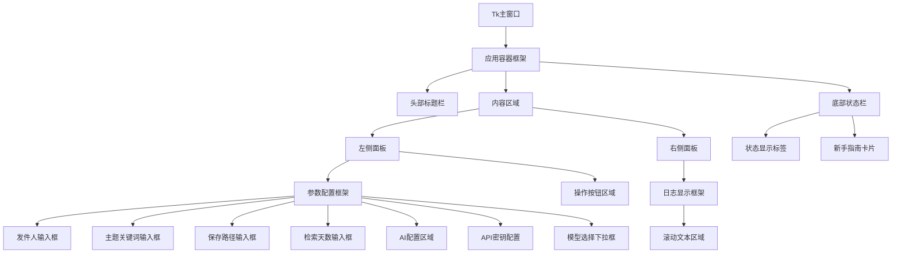

**图表来源**
- [v1.py:467-860](file://v1.py#L467-L860)

### 核心数据流

系统采用异步处理架构，确保UI响应性：

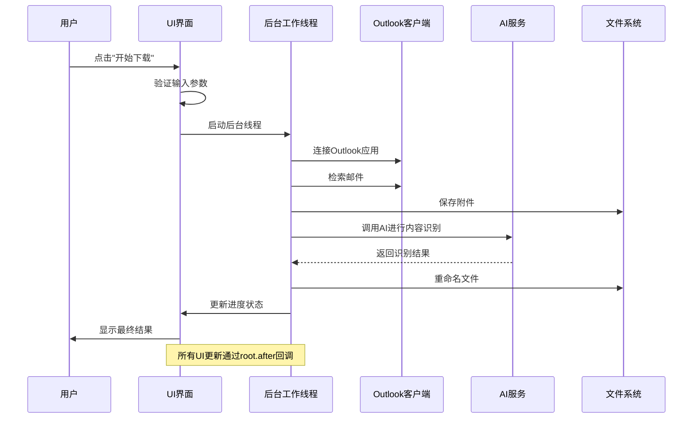

**图表来源**
- [v1.py:199-435](file://v1.py#L199-L435)

**章节来源**
- [v1.py:467-860](file://v1.py#L467-L860)

## 架构概览

系统采用模块化设计，将功能划分为独立的模块：

### 整体架构设计

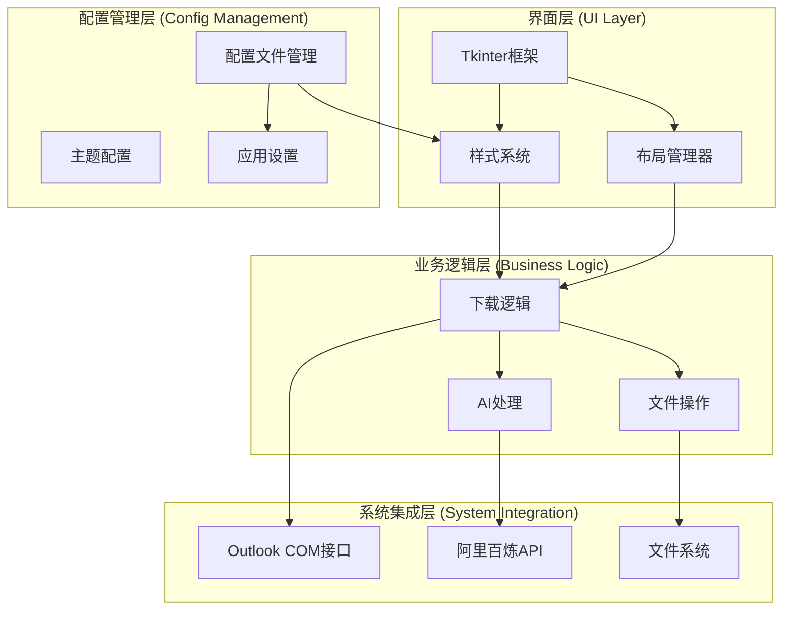

**图表来源**
- [v1.py:1-860](file://v1.py#L1-L860)

### 主题系统架构

系统实现了完整的主题配置体系，支持统一的颜色管理和样式定制：

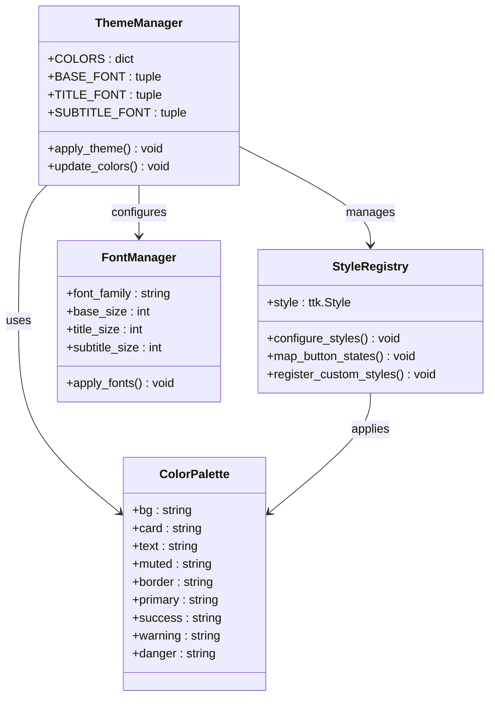

**图表来源**
- [v1.py:527-582](file://v1.py#L527-L582)

**章节来源**
- [v1.py:527-582](file://v1.py#L527-L582)

## 详细组件分析

### 主窗口设计

主窗口采用自适应几何布局，确保在不同屏幕尺寸下的最佳显示效果：

#### 自适应窗口管理

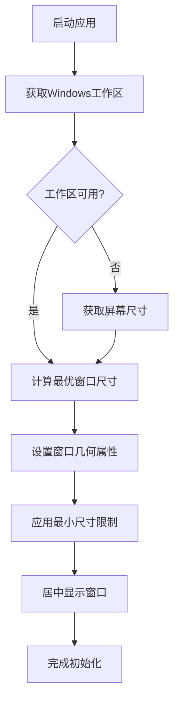

**图表来源**
- [v1.py:471-525](file://v1.py#L471-L525)

#### 窗口初始化流程

主窗口初始化包含以下关键步骤：
1. 创建Tk主窗口实例
2. 设置窗口标题和可调整属性
3. 获取工作区信息以避免任务栏遮挡
4. 计算自适应窗口尺寸
5. 应用最小尺寸约束
6. 居中显示窗口

**章节来源**
- [v1.py:467-525](file://v1.py#L467-L525)

### 容器组织方式

系统采用层次化的容器组织结构，实现清晰的功能分区：

#### 主要容器层级

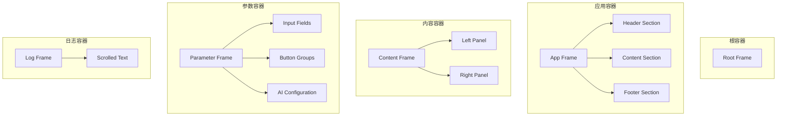

**图表来源**
- [v1.py:583-801](file://v1.py#L583-L801)

### 网格布局策略

系统采用基于网格的布局管理器，实现灵活的响应式设计：

#### 网格布局配置

| 行/列 | 权重设置 | 用途描述 |
|-------|----------|----------|
| 第0行 | 0 | 标题区域（固定高度） |
| 第1行 | 1 | 内容区域（可扩展） |
| 第2行 | 0 | 状态栏（固定高度） |

| 列配置 | 权重设置 | 用途描述 |
|--------|----------|----------|
| 第0列 | 1 | 整体内容（可扩展） |
| 第1列 | 0 | 左侧面板（固定宽度） |
| 第2列 | 1 | 右侧面板（可扩展） |

**章节来源**
- [v1.py:587-612](file://v1.py#L587-L612)

### 响应式设计机制

系统实现了多层次的响应式设计，确保在不同设备和屏幕尺寸下的良好表现：

#### 响应式特性

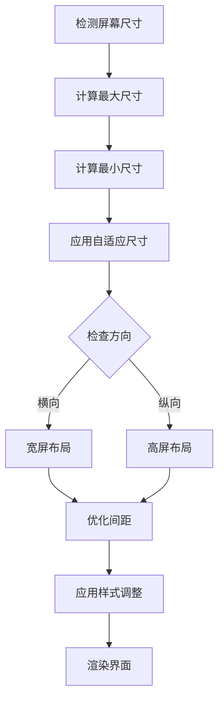

**图表来源**
- [v1.py:491-525](file://v1.py#L491-L525)

### 界面主题系统

系统实现了完整的主题配置体系，包括颜色管理、字体配置和样式定制：

#### 主题配置架构

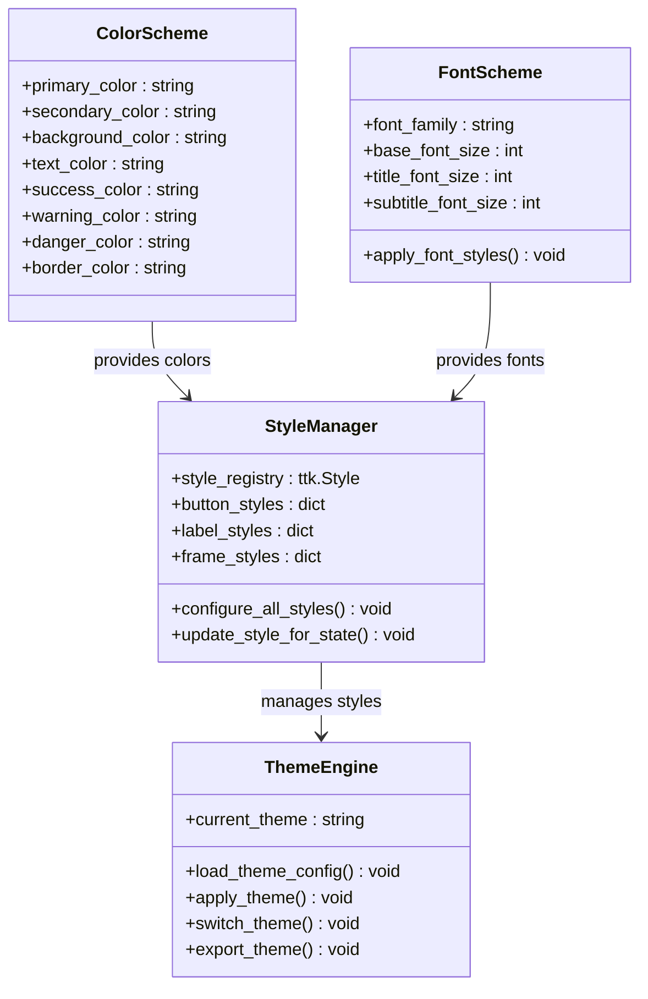

**图表来源**
- [v1.py:527-582](file://v1.py#L527-L582)

#### 颜色配置方案

系统定义了完整的颜色配置方案，支持多种状态和用途：

| 颜色类别 | 颜色值 | 用途场景 |
|----------|--------|----------|
| 背景色 | #F6F7FB | 主背景色 |
| 卡片色 | #FFFFFF | 内容卡片背景 |
| 文本色 | #1F2937 | 主要文本颜色 |
| 柔和色 | #6B7280 | 次要文本和说明文字 |
| 边框色 | #E5E7EB | 分割线和边框 |
| 主色调 | #2563EB | 主要操作按钮和链接 |
| 成功色 | #16A34A | 成功状态和确认操作 |
| 警告色 | #F59E0B | 警告状态和注意提示 |
| 错误色 | #DC2626 | 错误状态和危险操作 |

**章节来源**
- [v1.py:527-582](file://v1.py#L527-L582)

### 字体管理

系统实现了统一的字体管理体系，确保界面的一致性和可读性：

#### 字体配置规范

| 字体类型 | 字体族 | 字号 | 字重 | 应用场景 |
|----------|--------|------|------|----------|
| 基础字体 | 微软雅黑 | 10px | 常规 | 普通文本和输入框 |
| 标题字体 | 微软雅黑 | 16px | 粗体 | 页面标题 |
| 副标题字体 | 微软雅黑 | 10px | 常规 | 说明文字和辅助信息 |
| 标签字体 | 微软雅黑 | 11px | 粗体 | 区域标题和标签 |

**章节来源**
- [v1.py:547-550](file://v1.py#L547-L550)

### 样式定制规范

系统提供了完整的样式定制机制，支持按钮、标签、框架等组件的统一风格：

#### 样式配置体系

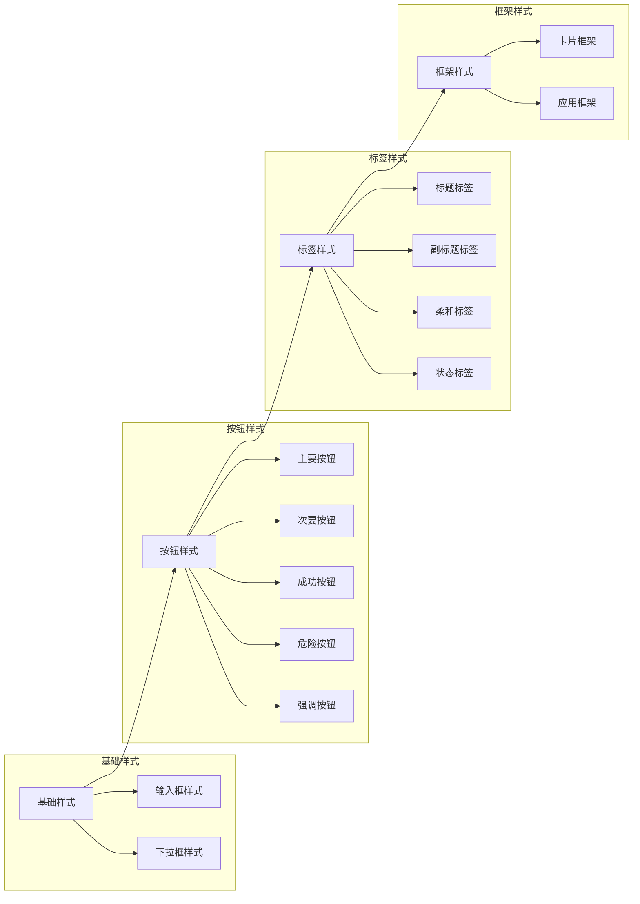

**图表来源**
- [v1.py:551-582](file://v1.py#L551-L582)

**章节来源**
- [v1.py:551-582](file://v1.py#L551-L582)

## 依赖关系分析

系统采用模块化设计，各组件间保持松耦合的依赖关系：

### 核心依赖关系

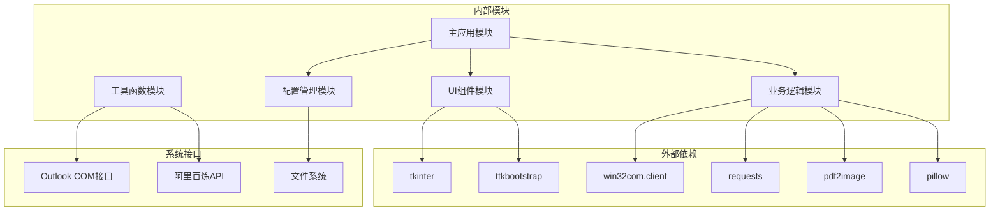

**图表来源**
- [v1.py:1-15](file://v1.py#L1-L15)
- [v1.spec:9-15](file://v1.spec#L9-L15)

### 数据流向分析

系统实现了清晰的数据流向控制，确保UI更新的线程安全：

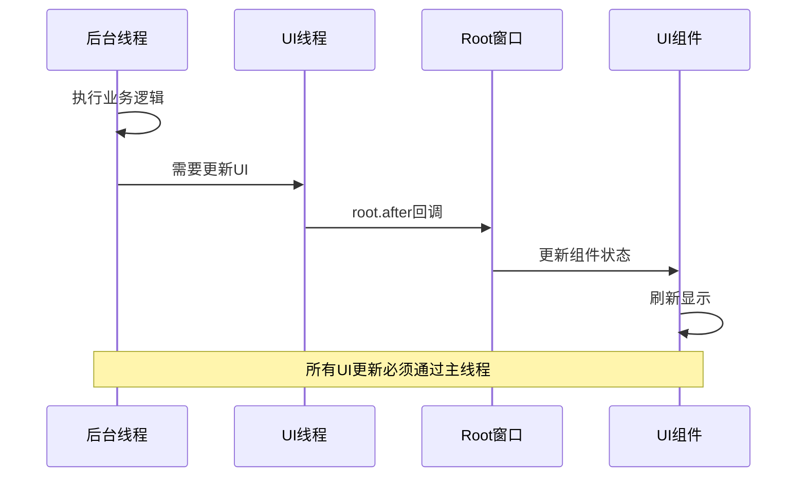

**图表来源**
- [v1.py:200-230](file://v1.py#L200-L230)

**章节来源**
- [v1.spec:9-15](file://v1.spec#L9-L15)

## 性能考虑

系统在设计时充分考虑了性能优化，特别是在UI响应性和资源管理方面：

### 性能优化策略

1. **异步处理**: 所有耗时操作都在后台线程执行，避免阻塞UI线程
2. **内存管理**: 及时清理临时文件和图像资源
3. **网络优化**: 合理设置超时时间和错误处理
4. **UI更新优化**: 使用批量更新减少界面重绘次数

### 资源管理

系统实现了完善的资源生命周期管理：

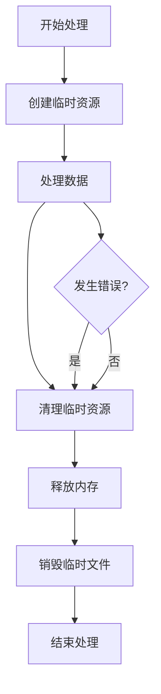

**图表来源**
- [v1.py:184-196](file://v1.py#L184-L196)

## 故障排除指南

### 常见问题及解决方案

#### UI线程安全问题

**问题**: 后台线程直接更新UI组件导致崩溃
**解决方案**: 使用`root.after()`方法进行线程安全的UI更新

#### Outlook连接问题

**问题**: 无法连接到Outlook应用
**解决方案**: 
1. 确认Outlook已安装并正常运行
2. 检查COM接口权限
3. 验证Outlook版本兼容性

#### AI服务连接问题

**问题**: API调用失败或超时
**解决方案**:
1. 检查网络连接
2. 验证API Key有效性
3. 确认服务端点可达性

**章节来源**
- [v1.py:200-230](file://v1.py#L200-L230)

## 结论

Outlook附件下载AI智能命名系统的GUI架构设计体现了现代桌面应用的最佳实践。通过模块化的组件设计、统一的主题系统、响应式的布局管理和完善的错误处理机制，系统为用户提供了稳定可靠的使用体验。

该架构的主要优势包括：
- **模块化设计**: 清晰的功能分离便于维护和扩展
- **主题系统**: 统一的视觉风格提升用户体验
- **响应式布局**: 适配不同屏幕尺寸和分辨率
- **线程安全**: 确保UI响应性和稳定性
- **配置管理**: 灵活的配置选项满足不同需求

未来可以考虑的改进方向：
- 添加更多的主题选项和自定义能力
- 实现热重载功能支持动态样式更新
- 增强错误恢复和重试机制
- 优化大数据量处理的性能表现