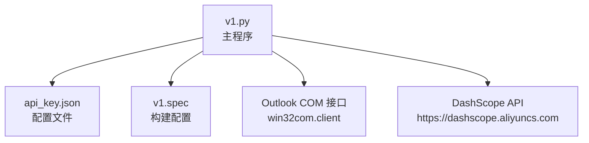
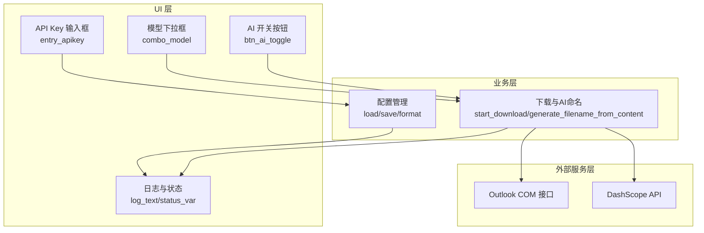
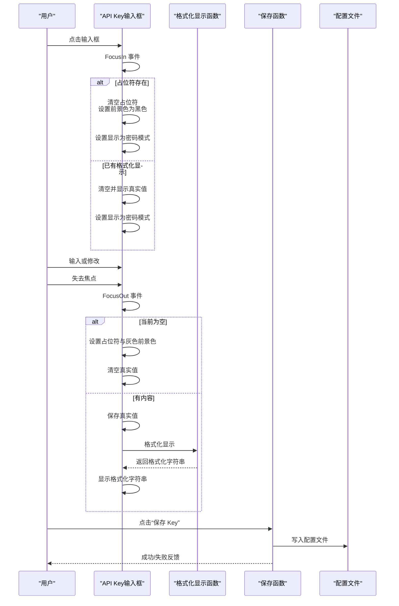
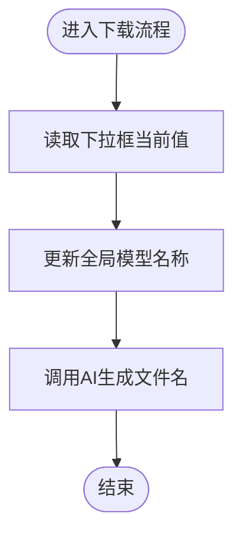
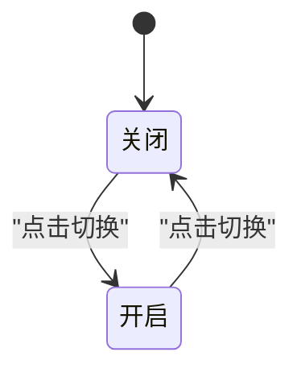
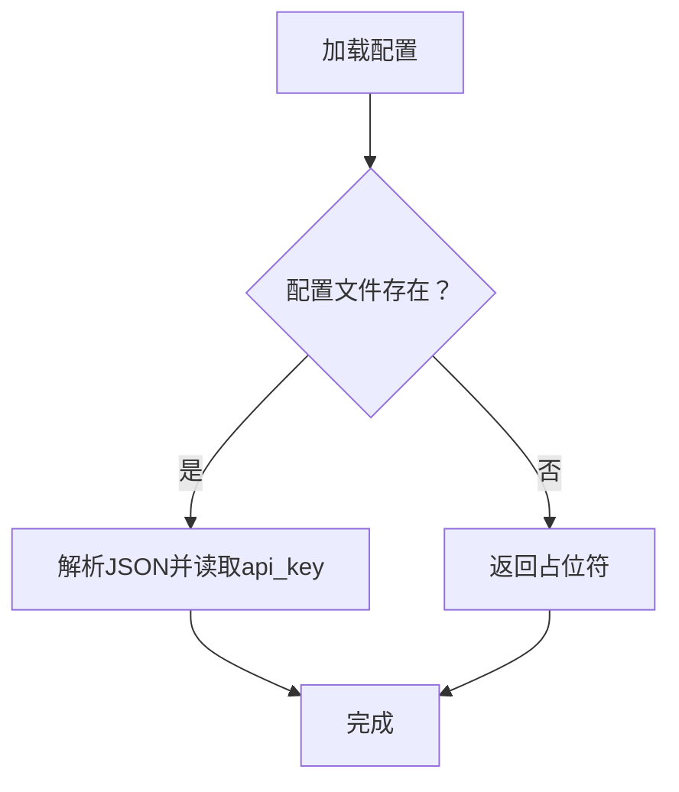
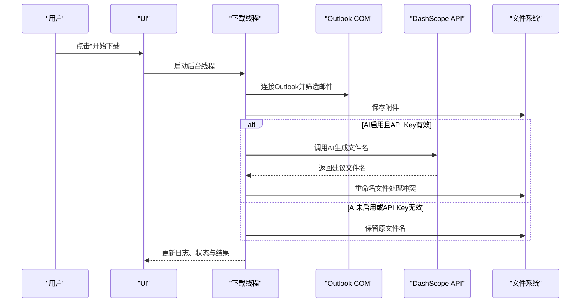
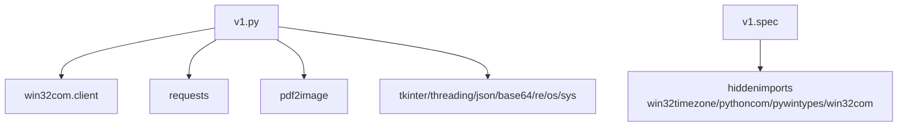

# AI与API配置

<cite>
**本文引用的文件**
- [v1.py](file://v1.py)
- [api_key.json](file://api_key.json)
- [v1.spec](file://v1.spec)
</cite>

## 目录
1. [简介](#简介)
2. [项目结构](#项目结构)
3. [核心组件](#核心组件)
4. [架构总览](#架构总览)
5. [详细组件分析](#详细组件分析)
6. [依赖关系分析](#依赖关系分析)
7. [性能考虑](#性能考虑)
8. [故障排除指南](#故障排除指南)
9. [结论](#结论)
10. [附录](#附录)

## 简介
本项目是一个基于 Tkinter 的桌面应用，用于从 Outlook 邮箱批量下载附件，并支持通过阿里百炼（DashScope）多模态模型对图片和 PDF 附件进行内容识别，从而实现 AI 智能命名。应用提供了直观的图形界面，包括：
- API Key 输入与安全显示
- 模型选择下拉框
- AI 开关切换按钮
- 日志与状态反馈
- 完整的配置持久化与验证流程

该文档将详细说明上述界面元素的设计与交互逻辑，解释 API Key 的安全存储机制、格式化显示、焦点事件处理与保存流程，以及模型名称配置、AI 功能状态管理与用户反馈机制。同时提供 API Key 申请流程、配置验证与错误处理指南，帮助开发者快速集成并部署 AI 功能。

## 项目结构
项目采用单文件主程序 + 配置文件 + 构建脚本的组织方式：
- v1.py：主程序，包含 UI 构建、业务逻辑、API 调用与配置持久化
- api_key.json：用户配置文件，保存 API Key
- v1.spec：PyInstaller 构建配置，声明运行时依赖

图表来源
- [v1.py:1-140](file://v1.py#L1-L140)
- [v1.py:451-465](file://v1.py#L451-L465)
- [v1.spec:1-45](file://v1.spec#L1-L45)

章节来源
- [v1.py:1-140](file://v1.py#L1-L140)
- [v1.spec:1-45](file://v1.spec#L1-L45)

## 核心组件
本节聚焦于与“AI 智能命名与 API 配置”直接相关的组件与职责：
- API Key 管理：加载、保存、格式化显示、焦点事件处理
- 模型选择：下拉框配置与全局模型名称管理
- AI 开关：切换按钮与 UI 控件状态联动
- 下载流程：触发下载、后台线程、日志与状态反馈
- 配置持久化：用户配置文件位置与写入策略

章节来源
- [v1.py:38-65](file://v1.py#L38-L65)
- [v1.py:666-735](file://v1.py#L666-L735)
- [v1.py:737-742](file://v1.py#L737-L742)
- [v1.py:744-784](file://v1.py#L744-L784)
- [v1.py:199-435](file://v1.py#L199-L435)

## 架构总览
应用采用“UI 层 + 业务层 + 外部服务层”的分层设计：
- UI 层：Tkinter 构建界面，绑定事件与状态变量
- 业务层：下载与 AI 命名逻辑，线程安全更新 UI
- 外部服务层：Outlook COM 接口与 DashScope API

图表来源
- [v1.py:38-65](file://v1.py#L38-L65)
- [v1.py:199-435](file://v1.py#L199-L435)
- [v1.py:666-735](file://v1.py#L666-L735)
- [v1.py:737-742](file://v1.py#L737-L742)
- [v1.py:744-784](file://v1.py#L744-L784)

## 详细组件分析

### API Key 输入界面与交互逻辑
- 设计目标
  - 安全显示：默认隐藏真实密钥，仅在编辑时显示
  - 用户体验：占位提示、焦点事件、即时反馈
  - 数据一致性：真实值与显示值分离，避免重复保存
- 关键实现要点
  - 真实值存储：独立变量保存原始 API Key
  - 显示格式化：仅显示前后若干字符，中间以星号替代
  - 焦点事件：
    - 获得焦点：清空占位符、恢复显示为明文、必要时回显真实值
    - 失去焦点：保存当前输入、格式化显示、恢复占位符（若为空）
  - 保存流程：点击“保存 Key”时，允许在未失焦状态下直接保存当前输入，随后写入配置文件并反馈结果

图表来源
- [v1.py:674-717](file://v1.py#L674-L717)
- [v1.py:49-55](file://v1.py#L49-L55)
- [v1.py:58-64](file://v1.py#L58-L64)
- [v1.py:451-465](file://v1.py#L451-L465)

章节来源
- [v1.py:674-717](file://v1.py#L674-L717)
- [v1.py:49-55](file://v1.py#L49-L55)
- [v1.py:58-64](file://v1.py#L58-L64)
- [v1.py:451-465](file://v1.py#L451-L465)

### 模型选择下拉框
- 配置项
  - 可选模型：qwen-vl-max、qwen-vl-max-latest、qwen-vl-plus
  - 默认值：qwen-vl-max
  - 状态控制：当 AI 关闭时禁用下拉框
- 全局管理
  - 下载流程会读取当前下拉框值并更新全局模型名称，确保后续调用使用最新配置

图表来源
- [v1.py:737-742](file://v1.py#L737-L742)
- [v1.py:236-240](file://v1.py#L236-L240)
- [v1.py:149-197](file://v1.py#L149-L197)

章节来源
- [v1.py:737-742](file://v1.py#L737-L742)
- [v1.py:236-240](file://v1.py#L236-L240)
- [v1.py:149-197](file://v1.py#L149-L197)

### AI 开关切换按钮
- 状态变量：BooleanVar 控制是否启用 AI
- UI 同步：
  - 文本：已开启/已关闭
  - 状态描述：随开关变化动态更新
  - 控件联动：当关闭时禁用 API Key 输入框、模型下拉框及相关按钮
- 切换逻辑：点击按钮切换状态并调用统一更新函数

图表来源
- [v1.py:656-657](file://v1.py#L656-L657)
- [v1.py:744-784](file://v1.py#L744-L784)

章节来源
- [v1.py:656-657](file://v1.py#L656-L657)
- [v1.py:744-784](file://v1.py#L744-L784)

### API Key 安全存储机制
- 存储位置
  - 用户配置目录：兼容 PyInstaller 单文件部署，将配置文件放置在用户目录，避免权限问题与程序目录污染
- 加载与回退
  - 若配置文件存在且可解析，则读取 API Key；否则回退到占位符
- 保存策略
  - 写入 JSON 文件，包含键值对；异常时返回失败
- 格式化显示
  - 仅显示前缀与后缀，中间以星号替代，提升安全性

图表来源
- [v1.py:38-46](file://v1.py#L38-L46)
- [v1.py:49-55](file://v1.py#L49-L55)
- [v1.py:58-64](file://v1.py#L58-L64)

章节来源
- [v1.py:38-46](file://v1.py#L38-L46)
- [v1.py:49-55](file://v1.py#L49-L55)
- [v1.py:58-64](file://v1.py#L58-L64)

### 下载与AI命名流程
- 触发条件
  - 用户填写发件人、保存路径、检索天数等参数
  - 可选启用 AI，提供 API Key 与模型名称
- 后台执行
  - 在独立线程中执行，避免阻塞 UI
  - 通过 UI 回调安全更新日志、状态与按钮状态
- AI 命名
  - 支持图片与 PDF：PDF 会截取前若干页作为图像输入
  - 调用 DashScope API，解析返回内容生成文件名
  - 重命名时处理同名冲突
- 错误处理
  - 捕获异常并记录堆栈信息
  - 提供用户可见的状态与结果提示

图表来源
- [v1.py:199-435](file://v1.py#L199-L435)
- [v1.py:107-148](file://v1.py#L107-L148)
- [v1.py:149-197](file://v1.py#L149-L197)

章节来源
- [v1.py:199-435](file://v1.py#L199-L435)
- [v1.py:107-148](file://v1.py#L107-L148)
- [v1.py:149-197](file://v1.py#L149-L197)

### 用户反馈机制
- 日志区域：滚动文本框，实时输出操作过程与结果
- 状态标签：显示当前任务状态（如“正在检索邮件…”、“完成”）
- 结果标签：显示最终统计（如“完成！共保存 X 个附件，AI重命名成功 Y 个”）
- 按钮状态：下载过程中禁用按钮，完成后恢复

章节来源
- [v1.py:207-229](file://v1.py#L207-L229)
- [v1.py:803-812](file://v1.py#L803-L812)
- [v1.py:791-798](file://v1.py#L791-L798)

## 依赖关系分析
- 运行时依赖
  - win32com.client：Outlook 操作
  - requests：HTTP 请求 DashScope API
  - pdf2image：PDF 转图像
  - 其他：tkinter、threading、json、base64、re、os、sys 等
- 构建依赖
  - PyInstaller：打包为单文件可执行程序，声明隐藏导入与二进制资源

图表来源
- [v1.py:1-14](file://v1.py#L1-L14)
- [v1.spec:9-15](file://v1.spec#L9-L15)

章节来源
- [v1.py:1-14](file://v1.py#L1-L14)
- [v1.spec:9-15](file://v1.spec#L9-L15)

## 性能考虑
- 线程模型：下载与 AI 调用在后台线程执行，避免阻塞 UI
- I/O 优化：PDF 转图像时限制页数，减少 AI 调用成本
- 网络超时：API 请求设置合理超时，防止长时间等待
- UI 更新：通过 UI 回调安全地更新日志与状态，避免跨线程访问控件

章节来源
- [v1.py:201-205](file://v1.py#L201-L205)
- [v1.py:164-175](file://v1.py#L164-L175)
- [v1.py:139-141](file://v1.py#L139-L141)

## 故障排除指南
- API Key 未配置或为空
  - 现象：下载时跳过 AI 命名，保留原文件名
  - 处理：点击“申请 Key”获取密钥，再“保存 Key”，最后重新开始下载
- API Key 格式错误或无效
  - 现象：调用 API 返回错误或异常
  - 处理：检查密钥有效性，确认网络连通性，查看日志中的错误详情
- PDF 转图像失败
  - 现象：找不到 pdftoppm.exe 或路径不正确
  - 处理：设置环境变量或在程序目录内提供 poppler 资源
- Outlook 连接异常
  - 现象：无法连接或读取邮件
  - 处理：确保 Outlook 已登录，检查权限与 COM 组件可用性
- UI 卡顿或按钮不可用
  - 现象：下载过程中按钮禁用
  - 处理：等待任务完成，或重启应用

章节来源
- [v1.py:386-407](file://v1.py#L386-L407)
- [v1.py:107-148](file://v1.py#L107-L148)
- [v1.py:97-105](file://v1.py#L97-L105)
- [v1.py:261-269](file://v1.py#L261-L269)

## 结论
本项目通过简洁的 UI 与稳健的后台逻辑，实现了从 Outlook 批量下载附件并结合 DashScope API 实现 AI 智能命名的功能。其关键优势在于：
- 安全的 API Key 管理与格式化显示
- 灵活的模型选择与状态控制
- 完整的用户反馈与错误处理
- 可靠的构建与部署配置

开发者可在此基础上进一步扩展模型类型、增强日志与配置管理能力，并完善网络与异常处理策略。

## 附录

### API Key 申请与配置验证步骤
- 申请 API Key
  - 点击界面上的“申请 Key”按钮，打开阿里百炼控制台页面
  - 在控制台创建并复制 API Key
- 配置与保存
  - 在“API Key”输入框中粘贴密钥
  - 点击“保存 Key”，观察结果标签反馈
- 验证
  - 重新启动应用后，输入框应显示格式化后的密钥
  - 启用 AI 并开始一次小规模下载测试

章节来源
- [v1.py:728-734](file://v1.py#L728-L734)
- [v1.py:451-465](file://v1.py#L451-L465)
- [v1.py:678-714](file://v1.py#L678-L714)

### 配置文件位置与格式
- 位置：用户配置目录下的 api_key.json
- 格式：包含键值对 api_key
- 示例：参见 api_key.json 文件

章节来源
- [v1.py:35](file://v1.py#L35)
- [api_key.json:1-3](file://api_key.json#L1-L3)

### 构建与运行
- 构建：使用 PyInstaller 按 v1.spec 配置进行打包
- 运行：双击生成的可执行文件，首次运行会自动创建配置目录

章节来源
- [v1.spec:1-45](file://v1.spec#L1-L45)
- [v1.py:28-32](file://v1.py#L28-L32)