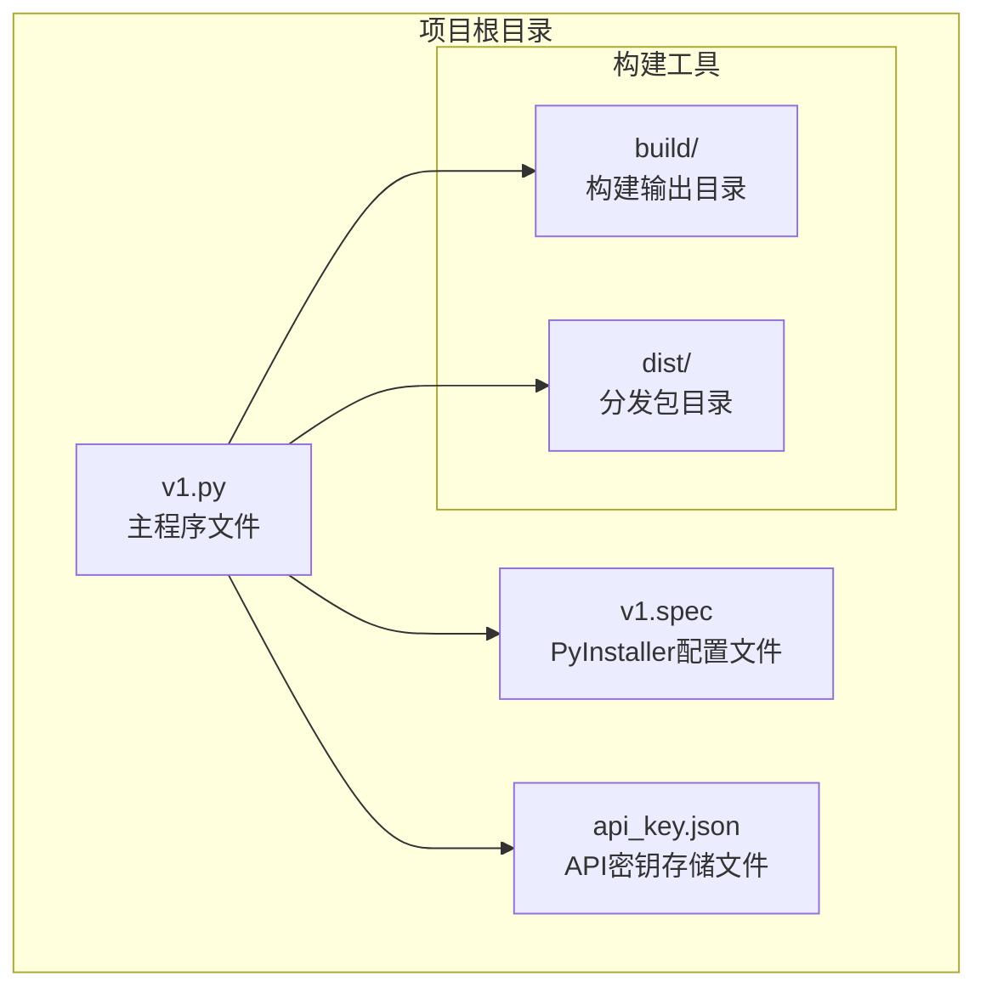
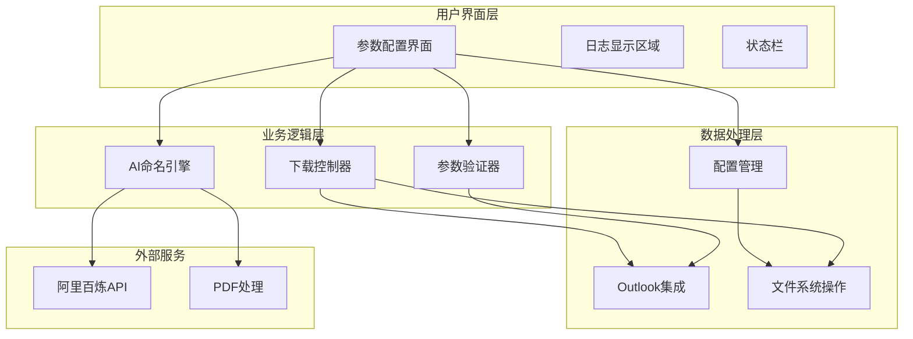
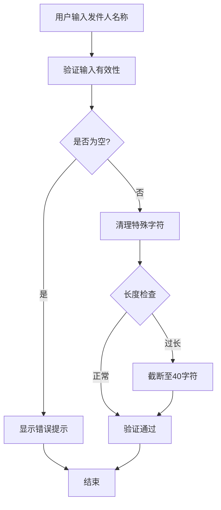
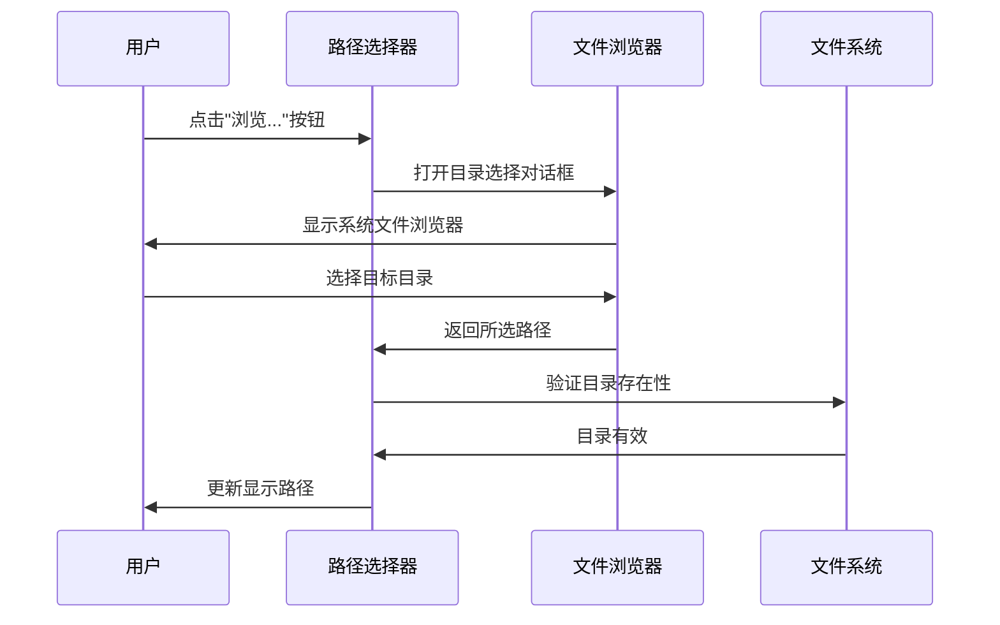
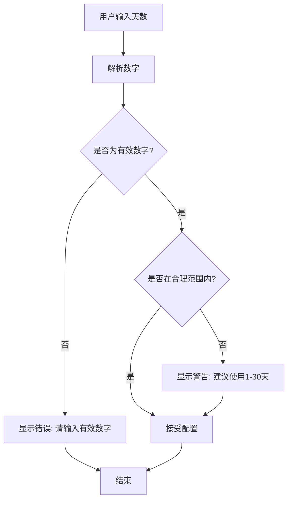
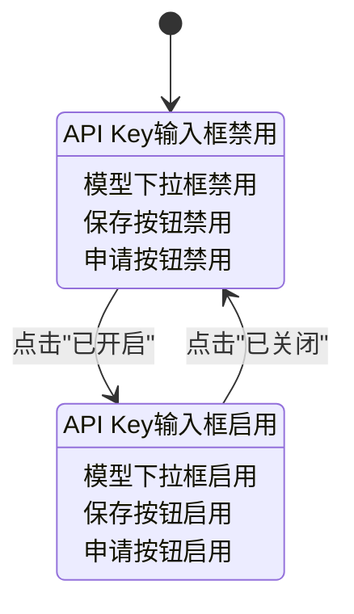
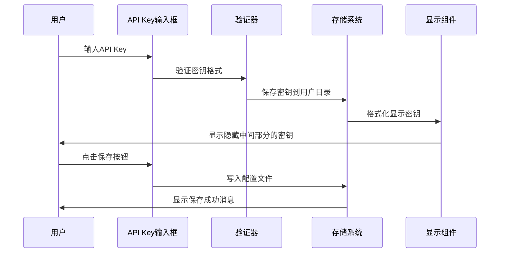
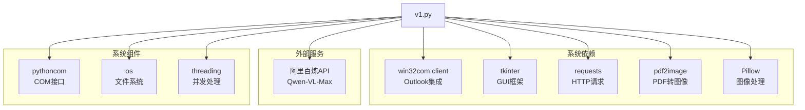

# 参数配置界面

<cite>
**本文档引用的文件**
- [v1.py](file://v1.py)
- [v1.spec](file://v1.spec)
- [api_key.json](file://api_key.json)
</cite>

## 目录
1. [简介](#简介)
2. [项目结构](#项目结构)
3. [核心组件](#核心组件)
4. [架构概览](#架构概览)
5. [详细组件分析](#详细组件分析)
6. [依赖关系分析](#依赖关系分析)
7. [性能考虑](#性能考虑)
8. [故障排除指南](#故障排除指南)
9. [结论](#结论)

## 简介

Outlook附件下载AI智能命名系统是一个基于Python Tkinter开发的桌面应用程序，专门用于从Outlook邮箱中批量下载附件并利用AI技术进行智能命名。该系统提供了直观的参数配置界面，支持发件人名称搜索、主题关键词过滤、保存路径选择、检索天数配置等核心功能。

系统采用现代化的UI设计，具有响应式布局、实时验证反馈和用户友好的交互体验。通过集成阿里百炼Qwen-VL-Max多模态模型，系统能够根据附件内容自动生成合适的文件名，显著提高了文件管理的效率和准确性。

## 项目结构

该项目采用单文件架构设计，所有功能都集中在单一的Python源文件中，便于部署和维护。

**图表来源**
- [v1.py:1-50](file://v1.py#L1-L50)
- [v1.spec:1-45](file://v1.spec#L1-L45)

**章节来源**
- [v1.py:1-860](file://v1.py#L1-L860)
- [v1.spec:1-45](file://v1.spec#L1-L45)

## 核心组件

系统的核心组件包括参数配置界面、AI智能命名引擎、Outlook集成模块和用户界面管理器。

### 参数配置界面组件

系统提供了完整的参数配置界面，包含以下关键元素：

- **发件人名称输入框**：支持精确匹配发件人姓名或邮箱地址
- **主题关键词输入框**：可选的邮件主题过滤功能
- **保存路径选择器**：集成文件浏览器和目录打开功能
- **检索天数配置**：灵活的时间范围设置选项
- **AI智能命名开关**：控制AI重命名功能的启用/禁用
- **API Key管理**：安全的密钥存储和管理机制

### 数据验证与处理组件

系统实现了多层次的数据验证机制，确保用户输入的有效性和完整性。

**章节来源**
- [v1.py:614-742](file://v1.py#L614-L742)
- [v1.py:230-250](file://v1.py#L230-L250)

## 架构概览

系统采用分层架构设计，清晰分离了用户界面、业务逻辑和数据处理层。

**图表来源**
- [v1.py:467-860](file://v1.py#L467-L860)
- [v1.py:199-435](file://v1.py#L199-L435)

## 详细组件分析

### 发件人名称输入组件

发件人名称输入组件是系统的核心搜索条件之一，提供了精确的发件人匹配功能。

#### 输入设计与验证

**图表来源**
- [v1.py:87-95](file://v1.py#L87-L95)
- [v1.py:248-250](file://v1.py#L248-L250)

#### 用户交互流程

发件人名称输入框具有以下特性：
- 默认值："绿色办公"
- 支持发件人姓名和邮箱地址的模糊匹配
- 实时验证和错误提示
- 最大长度限制为40个字符

**章节来源**
- [v1.py:619-623](file://v1.py#L619-L623)
- [v1.py:230-231](file://v1.py#L230-L231)

### 主题关键词设置组件

主题关键词输入组件提供了可选的邮件主题过滤功能，增强了搜索的精确性。

#### 功能特性

- **可选输入**：允许用户留空不使用主题过滤
- **不区分大小写**：自动转换为小写进行匹配
- **包含匹配**：支持部分关键词匹配
- **默认提示**：提供使用说明和示例

**章节来源**
- [v1.py:626-630](file://v1.py#L626-L630)
- [v1.py:231-231](file://v1.py#L231-L231)

### 保存路径选择组件

保存路径选择组件集成了文件浏览器和目录管理功能。

#### 选择器设计

**图表来源**
- [v1.py:437-442](file://v1.py#L437-L442)
- [v1.py:632-643](file://v1.py#L632-L643)

#### 目录管理功能

- **路径验证**：自动创建不存在的目录
- **快捷访问**：提供"打开目录"功能
- **默认路径**：预设常用保存位置
- **路径清理**：自动处理特殊字符和空格

**章节来源**
- [v1.py:443-450](file://v1.py#L443-L450)
- [v1.py:633-635](file://v1.py#L633-L635)

### 检索天数配置组件

检索天数配置组件允许用户设置邮件检索的时间范围。

#### 配置选项

**图表来源**
- [v1.py:242-247](file://v1.py#L242-L247)
- [v1.py:645-650](file://v1.py#L645-L650)

#### 默认值与建议

- **默认值**：1天
- **推荐范围**：1-30天
- **首次使用建议**：7-30天以提高搜索准确性
- **输入限制**：必须为正整数

**章节来源**
- [v1.py:646-649](file://v1.py#L646-L649)
- [v1.py:243-246](file://v1.py#L243-L246)

### AI智能命名配置组件

AI智能命名配置组件提供了完整的AI功能开关和管理界面。

#### 开关控制机制

**图表来源**
- [v1.py:744-784](file://v1.py#L744-L784)
- [v1.py:656-666](file://v1.py#L656-L666)

#### 模型选择与配置

- **默认模型**：qwen-vl-max
- **可用模型**：qwen-vl-max、qwen-vl-max-latest、qwen-vl-plus
- **模型切换**：通过下拉菜单进行选择
- **状态同步**：AI开关状态影响模型控件可用性

**章节来源**
- [v1.py:737-742](file://v1.py#L737-L742)
- [v1.py:744-784](file://v1.py#L744-L784)

### API Key管理组件

API Key管理组件提供了安全的密钥存储和管理功能。

#### 密钥存储机制

**图表来源**
- [v1.py:38-55](file://v1.py#L38-L55)
- [v1.py:451-465](file://v1.py#L451-L465)

#### 安全特性

- **本地存储**：密钥存储在用户配置目录
- **格式化显示**：显示前4位和后4位，中间部分隐藏
- **自动加载**：应用启动时自动加载已保存的密钥
- **权限控制**：避免修改程序目录权限问题

**章节来源**
- [v1.py:38-64](file://v1.py#L38-L64)
- [v1.py:451-465](file://v1.py#L451-L465)

## 依赖关系分析

系统依赖关系主要体现在外部库和系统组件的集成上。

**图表来源**
- [v1.py:1-14](file://v1.py#L1-L14)
- [v1.spec:9-22](file://v1.spec#L9-L22)

### 外部依赖配置

系统通过PyInstaller配置文件管理外部依赖：

- **隐式导入**：win32timezone、pythoncom、pywintypes等
- **二进制文件**：poppler PDF处理工具
- **运行时钩子**：确保COM组件正确加载

**章节来源**
- [v1.spec:9-22](file://v1.spec#L9-L22)
- [v1.spec:25-44](file://v1.spec#L25-L44)

## 性能考虑

系统在设计时充分考虑了性能优化和用户体验。

### 并发处理机制

系统采用多线程架构处理长时间运行的任务：

- **后台线程**：处理Outlook连接和文件下载
- **UI线程安全**：通过root.after确保UI更新的安全性
- **状态管理**：实时更新进度和状态信息
- **异常处理**：优雅处理各种运行时错误

### 内存管理策略

- **临时文件清理**：自动删除PDF转换产生的临时图像文件
- **资源释放**：确保COM接口正确初始化和反初始化
- **内存监控**：避免大量附件同时处理导致的内存压力

### 用户体验优化

- **响应式界面**：自适应窗口大小和屏幕分辨率
- **实时反馈**：详细的下载进度和日志显示
- **错误恢复**：部分失败不影响整体操作流程

## 故障排除指南

### 常见问题与解决方案

#### Outlook连接问题

**症状**：无法连接到Outlook或出现连接超时

**可能原因**：
- Outlook未正确安装或配置
- COM组件注册问题
- 权限不足

**解决步骤**：
1. 确认Outlook已正确安装
2. 重新启动Outlook应用程序
3. 以管理员权限运行程序
4. 检查Windows COM组件注册

#### API Key相关问题

**症状**：AI功能无法正常使用

**可能原因**：
- API Key格式不正确
- 网络连接问题
- 配额限制

**解决步骤**：
1. 重新申请有效的API Key
2. 检查网络连接稳定性
3. 验证API Key格式和有效期
4. 查看阿里百炼平台的使用情况

#### 文件路径问题

**症状**：保存附件时出现权限错误

**可能原因**：
- 目标路径权限不足
- 路径包含非法字符
- 磁盘空间不足

**解决步骤**：
1. 更换到有写入权限的目录
2. 移除路径中的特殊字符
3. 清理磁盘空间
4. 使用相对路径而非绝对路径

### 调试和诊断

系统提供了详细的日志记录功能，帮助用户诊断问题：

- **操作日志**：记录所有用户操作和系统响应
- **错误追踪**：包含完整的异常堆栈信息
- **性能指标**：显示处理时间和资源使用情况
- **状态监控**：实时显示系统运行状态

**章节来源**
- [v1.py:419-427](file://v1.py#L419-L427)
- [v1.py:207-211](file://v1.py#L207-L211)

## 结论

Outlook附件下载AI智能命名系统通过精心设计的参数配置界面，为用户提供了强大而易用的功能。系统不仅具备完整的AI智能命名能力，还提供了丰富的配置选项和用户友好的界面设计。

### 主要优势

1. **直观的界面设计**：清晰的参数分类和布局
2. **强大的功能集成**：AI命名、批量下载、实时验证
3. **良好的用户体验**：响应式设计和详细的反馈机制
4. **安全可靠的架构**：本地存储和权限控制
5. **灵活的配置选项**：满足不同用户的需求

### 技术特色

- **模块化设计**：清晰的组件分离和职责划分
- **异步处理**：避免UI阻塞，提升响应速度
- **错误处理**：完善的异常捕获和用户提示
- **资源管理**：有效的内存和文件资源管理

该系统为Outlook附件管理提供了一个完整、高效且易于使用的解决方案，特别适合需要批量处理和智能命名附件的企业用户和个人用户。