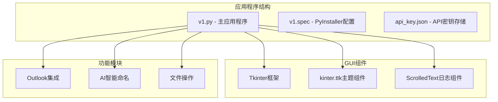
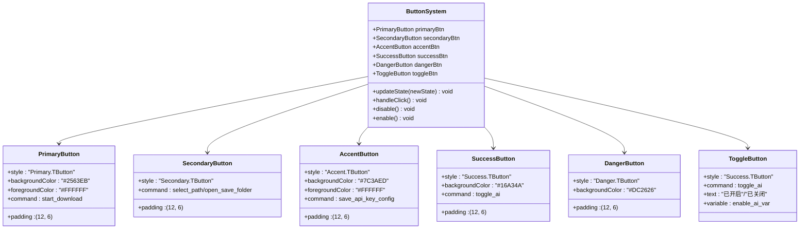
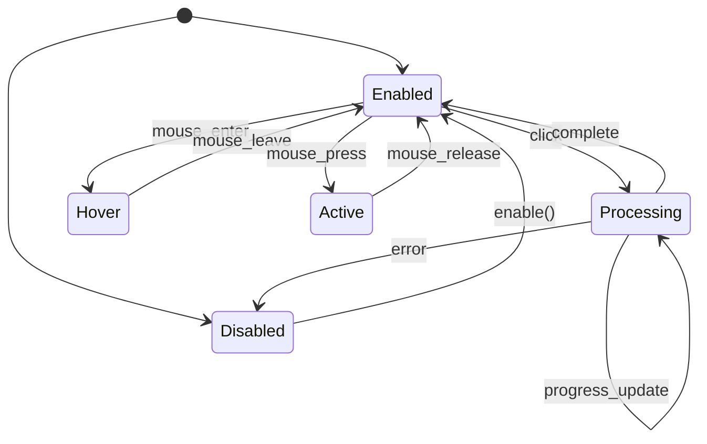
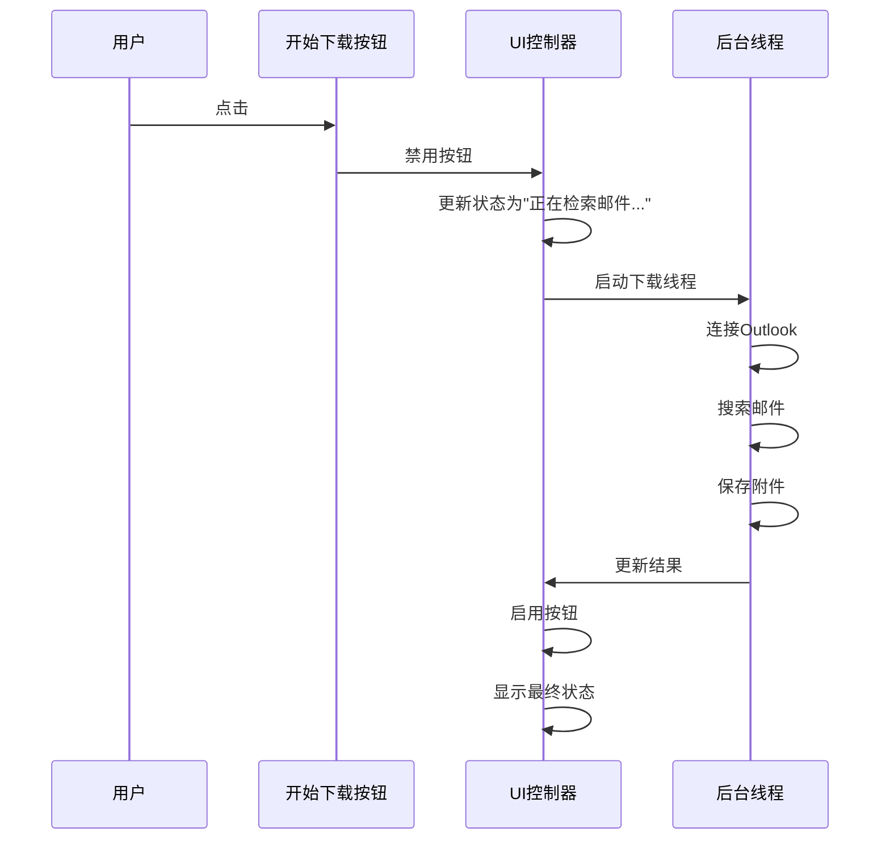
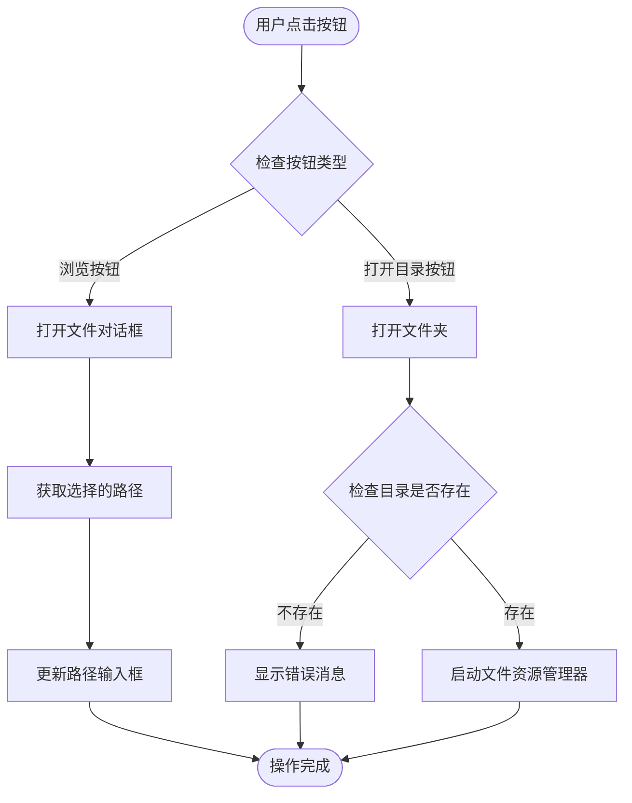
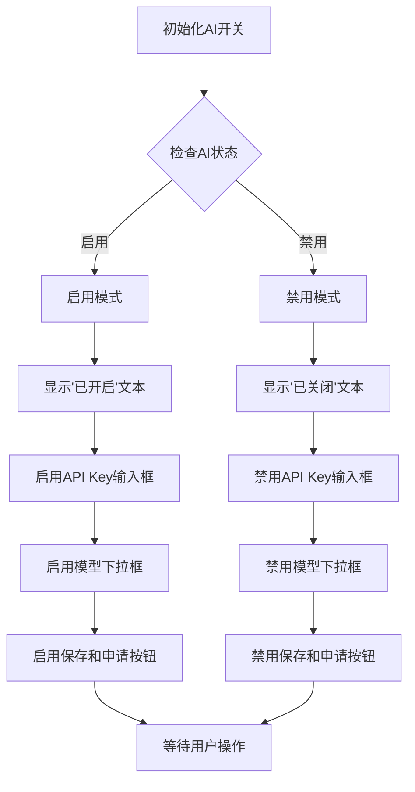
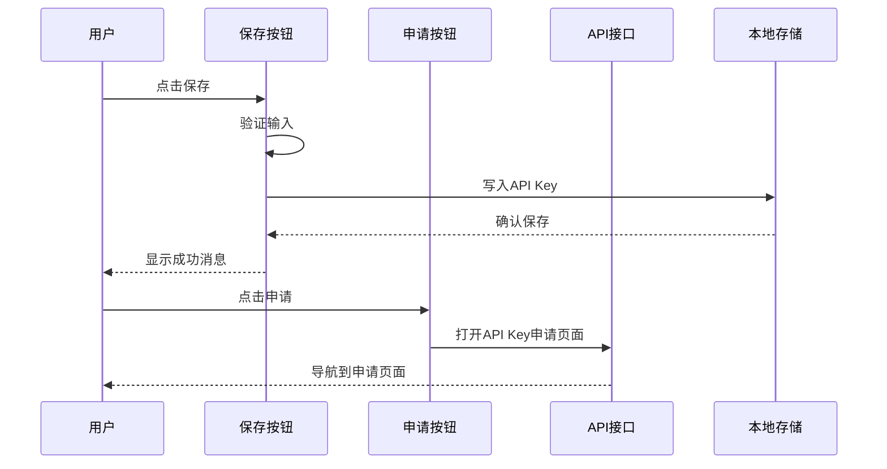
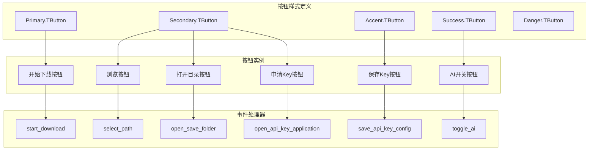

# 按钮交互设计

<cite>
**本文档引用的文件**
- [v1.py](file://v1.py)
- [v1.spec](file://v1.spec)
- [api_key.json](file://api_key.json)
</cite>

## 目录
1. [简介](#简介)
2. [项目结构](#项目结构)
3. [核心组件](#核心组件)
4. [架构概览](#架构概览)
5. [详细组件分析](#详细组件分析)
6. [依赖关系分析](#依赖关系分析)
7. [性能考虑](#性能考虑)
8. [故障排除指南](#故障排除指南)
9. [结论](#结论)

## 简介

本文档详细阐述了基于Tkinter构建的Outlook附件下载工具中的按钮交互设计。该应用程序提供了三种主要类型的按钮：主要操作按钮、辅助功能按钮和状态切换按钮。每个按钮都经过精心设计，确保了良好的用户体验、无障碍访问支持和一致的视觉反馈。

该系统采用现代化的UI设计原则，包括响应式布局、状态管理、禁用/启用机制和键盘导航支持。所有按钮都遵循统一的设计语言，确保界面的一致性和专业性。

## 项目结构

该项目是一个独立的Python应用程序，使用Tkinter作为GUI框架。项目结构简洁明了，主要包含以下组件：

**图表来源**
- [v1.py:467-860](file://v1.py#L467-L860)
- [v1.spec:1-45](file://v1.spec#L1-L45)

**章节来源**
- [v1.py:1-860](file://v1.py#L1-L860)
- [v1.spec:1-45](file://v1.spec#L1-L45)

## 核心组件

### 按钮类型分类

系统中的按钮按照功能分为三大类：

#### 主要操作按钮
- **开始下载按钮**：执行核心下载功能
- **保存API Key按钮**：保存用户配置
- **申请Key按钮**：引导用户获取API密钥

#### 辅助功能按钮
- **浏览按钮**：选择文件保存路径
- **打开目录按钮**：快速访问保存文件夹
- **申请Key按钮**：获取API密钥

#### 状态切换按钮
- **AI开关按钮**：控制AI智能命名功能
- **状态指示器**：显示当前系统状态

**章节来源**
- [v1.py:565-582](file://v1.py#L565-L582)
- [v1.py:637-642](file://v1.py#L637-L642)
- [v1.py:723-734](file://v1.py#L723-L734)

## 架构概览

### 按钮系统架构

**图表来源**
- [v1.py:565-582](file://v1.py#L565-L582)
- [v1.py:744-784](file://v1.py#L744-L784)

### 按钮状态管理系统

**图表来源**
- [v1.py:223-229](file://v1.py#L223-L229)
- [v1.py:433-433](file://v1.py#L433-L433)

**章节来源**
- [v1.py:223-229](file://v1.py#L223-L229)
- [v1.py:433-433](file://v1.py#L433-L433)

## 详细组件分析

### 主要操作按钮设计

#### 开始下载按钮

**设计特点**：
- 使用主要品牌色蓝色 (#2563EB)
- 白色前景色确保对比度
- 12px内边距和6px外边距提供舒适的点击区域
- 禁用状态下使用灰色背景 (#E5E7EB)

**交互逻辑**：

**图表来源**
- [v1.py:199-435](file://v1.py#L199-L435)
- [v1.py:793-794](file://v1.py#L793-L794)

**实现细节**：
- 点击事件绑定到 `start_download` 函数
- 支持线程安全的UI更新
- 自动状态管理（禁用/启用）
- 实时进度反馈

**章节来源**
- [v1.py:199-435](file://v1.py#L199-L435)
- [v1.py:793-794](file://v1.py#L793-L794)

### 辅助功能按钮设计

#### 浏览按钮和打开目录按钮

**设计特点**：
- 使用次级按钮样式
- 相同的视觉规格确保一致性
- 左右排列提供清晰的操作流程

**交互逻辑**：

**图表来源**
- [v1.py:437-450](file://v1.py#L437-L450)
- [v1.py:637-642](file://v1.py#L637-L642)

**实现细节**：
- 浏览按钮使用 `filedialog.askdirectory()`
- 打开目录按钮检查路径有效性
- 错误处理提供用户友好的反馈

**章节来源**
- [v1.py:437-450](file://v1.py#L437-L450)
- [v1.py:637-642](file://v1.py#L637-L642)

### 状态切换按钮设计

#### AI开关按钮

**设计特点**：
- 使用成功状态颜色（绿色）强调积极功能
- 动态文本显示当前状态
- 与相关控件的联动控制

**状态管理逻辑**：

**图表来源**
- [v1.py:744-784](file://v1.py#L744-L784)
- [v1.py:656-666](file://v1.py#L656-L666)

**实现细节**：
- 使用 `BooleanVar` 管理状态
- 动态更新相关控件的可用性
- 即时状态反馈

**章节来源**
- [v1.py:744-784](file://v1.py#L744-L784)
- [v1.py:656-666](file://v1.py#L656-L666)

### API Key管理按钮

#### 保存API Key按钮和申请Key按钮

**设计特点**：
- 保存按钮使用强调色（紫色）
- 申请按钮使用标准次级样式
- 提供清晰的功能区分

**交互流程**：

**图表来源**
- [v1.py:451-465](file://v1.py#L451-L465)
- [v1.py:723-734](file://v1.py#L723-L734)

**实现细节**：
- 输入验证和格式化
- 安全的本地存储机制
- 外部链接处理

**章节来源**
- [v1.py:451-465](file://v1.py#L451-L465)
- [v1.py:723-734](file://v1.py#L723-L734)

## 依赖关系分析

### 按钮依赖关系图

**图表来源**
- [v1.py:565-582](file://v1.py#L565-L582)
- [v1.py:793-794](file://v1.py#L793-L794)

### 样式配置依赖

系统使用集中式的样式配置管理：

**颜色系统**：
- 主色调：蓝色 (#2563EB)
- 成功：绿色 (#16A34A)
- 危险：红色 (#DC2626)
- 中性：灰色系 (#6B7280, #E5E7EB)

**状态映射**：
- 悬停状态：深色版本
- 按下状态：深色版本
- 禁用状态：灰色背景 + 灰色文字

**章节来源**
- [v1.py:528-582](file://v1.py#L528-L582)
- [v1.py:793-794](file://v1.py#L793-L794)

## 性能考虑

### 按钮性能优化策略

1. **线程安全的UI更新**
   - 使用 `root.after()` 方法确保UI更新在主线程执行
   - 避免跨线程直接操作GUI组件

2. **状态管理优化**
   - 批量禁用/启用多个按钮
   - 使用状态变量统一管理复杂状态

3. **内存管理**
   - 及时清理临时文件和图像资源
   - 合理的资源释放策略

4. **响应式设计**
   - 自适应窗口大小调整
   - 屏幕适配和高DPI支持

**章节来源**
- [v1.py:200-206](file://v1.py#L200-L206)
- [v1.py:491-525](file://v1.py#L491-L525)

## 故障排除指南

### 常见按钮问题及解决方案

#### 按钮无响应问题

**症状**：点击按钮没有反应

**可能原因**：
- 按钮处于禁用状态
- 事件绑定错误
- 线程阻塞

**解决步骤**：
1. 检查按钮状态：`button.cget("state")`
2. 验证命令绑定：`button.cget("command")`
3. 确认UI线程状态

#### 按钮样式异常

**症状**：按钮外观不符合预期

**可能原因**：
- 样式配置错误
- 主题切换问题
- 颜色值无效

**解决步骤**：
1. 检查样式定义：`style.configure()`
2. 验证颜色值格式
3. 重新应用主题

#### 状态同步问题

**症状**：按钮状态与实际功能不符

**可能原因**：
- 状态变量未正确更新
- 事件处理逻辑错误
- 并发访问问题

**解决步骤**：
1. 检查状态变量：`BooleanVar.get()`
2. 验证状态更新函数
3. 添加调试输出

**章节来源**
- [v1.py:223-229](file://v1.py#L223-L229)
- [v1.py:744-784](file://v1.py#L744-L784)

## 结论

该按钮交互设计系统展现了现代GUI应用的最佳实践。通过明确的分类、统一的样式规范和完善的交互逻辑，为用户提供了直观、高效且可靠的使用体验。

**关键优势**：
- **一致性**：统一的设计语言和交互模式
- **可访问性**：良好的颜色对比度和状态反馈
- **可靠性**：健壮的状态管理和错误处理
- **可维护性**：清晰的代码结构和注释

**未来改进建议**：
- 添加键盘快捷键支持
- 增强无障碍访问功能
- 实现按钮动画效果
- 优化移动端适配

这个按钮系统为UI设计师和前端开发者提供了完整的参考实现，展示了如何在实际项目中平衡美观性、功能性和用户体验。