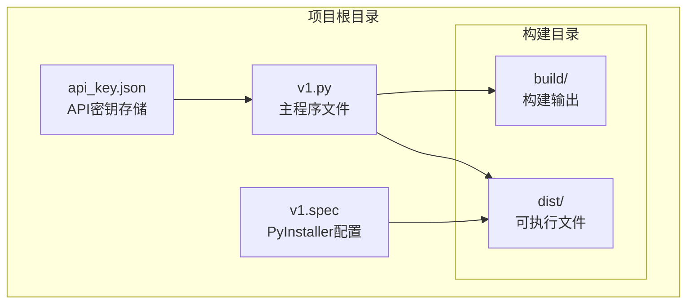
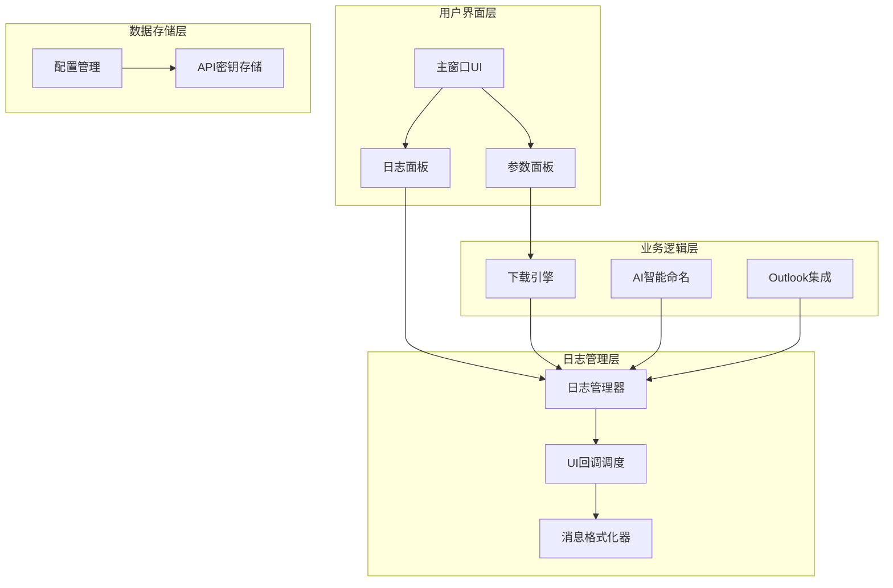
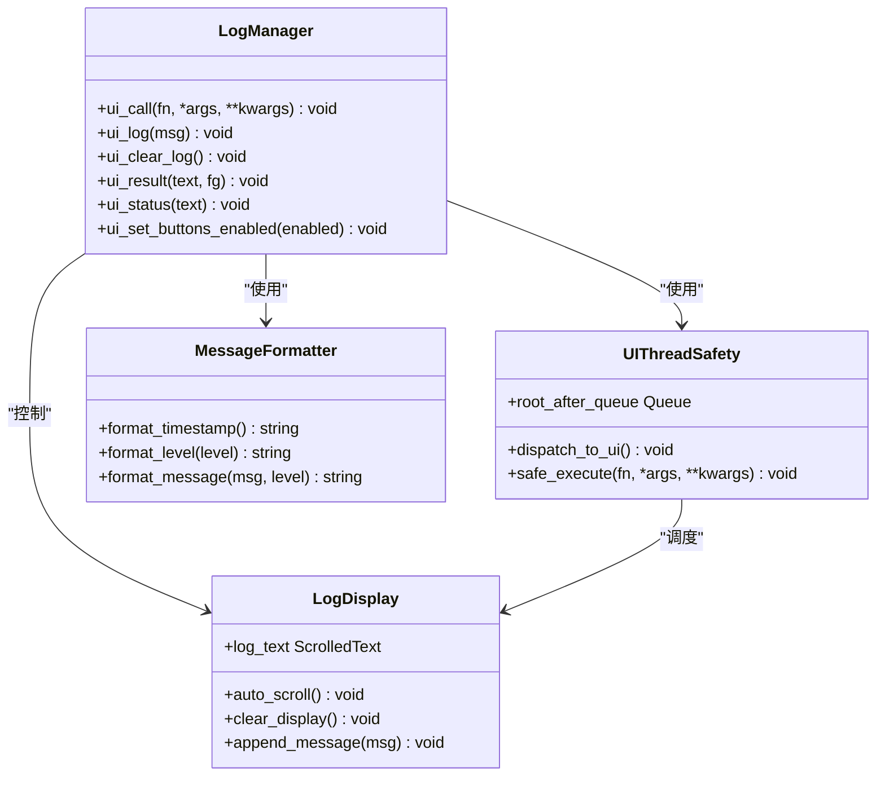
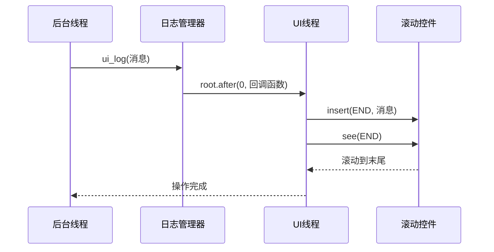
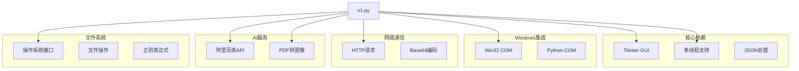

# 日志显示系统

<cite>
**本文档引用的文件**
- [v1.py](file://v1.py)
- [v1.spec](file://v1.spec)
- [api_key.json](file://api_key.json)
</cite>

## 目录
1. [简介](#简介)
2. [项目结构](#项目结构)
3. [核心组件](#核心组件)
4. [架构概览](#架构概览)
5. [详细组件分析](#详细组件分析)
6. [依赖关系分析](#依赖关系分析)
7. [性能考虑](#性能考虑)
8. [故障排除指南](#故障排除指南)
9. [结论](#结论)

## 简介

本项目是一个基于Python Tkinter的Outlook附件下载工具，集成了强大的日志显示系统。该系统提供了实时的下载过程跟踪、错误信息展示、状态更新和用户交互反馈功能。日志系统采用滚动文本框实现，支持消息格式化、自动滚动和用户交互功能。

## 项目结构

该项目采用单文件架构设计，所有功能集中在单一Python文件中，便于部署和维护：

**图表来源**
- [v1.py:1-860](file://v1.py#L1-L860)
- [v1.spec:1-45](file://v1.spec#L1-L45)

**章节来源**
- [v1.py:1-860](file://v1.py#L1-L860)
- [v1.spec:1-45](file://v1.spec#L1-L45)

## 核心组件

### 日志显示组件

日志系统的核心是基于Tkinter ScrolledText组件的滚动文本框，提供以下关键功能：

- **实时消息显示**：支持动态添加日志消息
- **自动滚动**：新消息自动滚动到底部
- **多行显示**：支持大量日志信息的滚动查看
- **样式定制**：统一的视觉风格和字体设置

### UI集成组件

系统采用响应式布局设计，将日志显示区域与参数配置分离：

- **左右分栏布局**：左侧参数配置，右侧日志显示
- **自适应窗口**：根据屏幕尺寸自动调整大小
- **状态指示器**：实时显示系统状态和进度

**章节来源**
- [v1.py:803-812](file://v1.py#L803-L812)
- [v1.py:600-605](file://v1.py#L600-L605)

## 架构概览

系统采用分层架构设计，确保日志功能与业务逻辑的分离：

**图表来源**
- [v1.py:199-435](file://v1.py#L199-L435)
- [v1.py:207-211](file://v1.py#L207-L211)

## 详细组件分析

### 日志管理器组件

日志管理器是整个日志系统的核心，负责消息的接收、格式化和显示：

**图表来源**
- [v1.py:200-230](file://v1.py#L200-L230)
- [v1.py:803-812](file://v1.py#L803-L812)

### 消息格式化机制

系统实现了灵活的消息格式化机制，支持不同类型的消息：

#### 时间戳格式化
- **格式**：`YYYY年MM月DD日_HH时MM分SS秒`
- **用途**：为每个保存的附件生成唯一的时间戳
- **示例**：`2024年01月15日_14时30分25秒`

#### 状态消息格式
- **开始连接**：`⏳ 正在连接 Outlook…`
- **搜索邮件**：`📩 找到 X 封邮件`
- **保存附件**：`💾 已保存: filename`
- **AI处理**：`🤖 正在调用AI识别内容...`
- **完成状态**：`🎉 完成！共保存 X 个附件`

#### 错误消息格式
- **保存失败**：`⚠️ 保存失败: filename (错误详情)`
- **重命名失败**：`⚠️ 重命名失败: 错误详情`
- **异常信息**：`❌ 异常：错误详情`

**章节来源**
- [v1.py:358-384](file://v1.py#L358-L384)
- [v1.py:421-425](file://v1.py#L421-L425)

### 自动滚动机制

系统实现了智能的自动滚动功能，确保用户始终能看到最新的日志信息：

**图表来源**
- [v1.py:207-211](file://v1.py#L207-L211)
- [v1.py:803-812](file://v1.py#L803-L812)

### 用户交互功能

系统提供了丰富的用户交互功能：

#### 实时状态更新
- **状态标签**：显示当前操作状态
- **结果标签**：显示最终操作结果
- **进度指示**：显示下载进度和状态

#### 控制按钮
- **开始下载**：启动附件下载流程
- **浏览目录**：选择保存路径
- **打开目录**：快速打开保存文件夹
- **AI开关**：启用/禁用智能命名功能

#### API密钥管理
- **密钥输入**：安全的API密钥输入界面
- **密钥保存**：本地安全存储API密钥
- **密钥显示**：格式化显示已保存的密钥

**章节来源**
- [v1.py:791-798](file://v1.py#L791-L798)
- [v1.py:437-450](file://v1.py#L437-L450)

## 依赖关系分析

系统依赖关系清晰明确，主要外部依赖包括：

**图表来源**
- [v1.py:1-14](file://v1.py#L1-L14)
- [v1.spec:9-15](file://v1.spec#L9-L15)

**章节来源**
- [v1.spec:1-45](file://v1.spec#L1-L45)

## 性能考虑

### 线程安全设计

系统采用线程安全的设计模式，确保UI更新的正确性：

- **UI回调队列**：使用`root.after()`机制进行线程间通信
- **异常处理**：所有UI操作都在try-catch块中执行
- **资源管理**：正确初始化和释放COM对象

### 内存管理

- **临时文件清理**：PDF转换产生的临时文件会自动清理
- **内存泄漏防护**：确保所有资源正确释放
- **大文件处理**：限制同时处理的文件数量

### 用户体验优化

- **异步操作**：长时间操作在后台线程执行
- **进度反馈**：实时显示操作进度和状态
- **错误恢复**：遇到错误时提供清晰的错误信息

## 故障排除指南

### 常见问题及解决方案

#### Outlook连接问题
- **症状**：无法连接Outlook应用
- **原因**：Outlook未安装或COM组件问题
- **解决**：检查Outlook是否正常运行，重新启动应用

#### API密钥问题
- **症状**：AI功能无法使用
- **原因**：API密钥无效或网络连接问题
- **解决**：重新申请有效的API密钥并正确保存

#### PDF处理问题
- **症状**：PDF文件无法正确处理
- **原因**：缺少Poppler工具或路径配置错误
- **解决**：安装Poppler工具并正确配置路径

#### 权限问题
- **症状**：无法访问某些文件或目录
- **原因**：权限不足
- **解决**：以管理员身份运行程序或修改文件权限

**章节来源**
- [v1.py:419-427](file://v1.py#L419-L427)
- [v1.py:97-105](file://v1.py#L97-L105)

## 结论

本日志显示系统通过精心设计的架构和实现，为用户提供了一个强大而易用的日志记录和显示解决方案。系统具有以下特点：

- **实时性**：所有操作都有实时日志反馈
- **可靠性**：完善的错误处理和异常恢复机制
- **可扩展性**：模块化设计便于功能扩展
- **用户体验**：直观的界面和友好的交互设计

该系统不仅满足了基本的日志记录需求，还为开发者提供了完整的实现参考，包括线程安全、UI更新、消息格式化等关键技术点。通过合理的架构设计和性能优化，系统能够在各种环境下稳定运行，为用户提供可靠的日志显示服务。