# 状态反馈系统

<cite>
**本文档引用的文件**
- [v1.py](file://v1.py)
- [v1.spec](file://v1.spec)
- [api_key.json](file://api_key.json)
</cite>

## 目录
1. [简介](#简介)
2. [项目结构](#项目结构)
3. [核心组件](#核心组件)
4. [架构概览](#架构概览)
5. [详细组件分析](#详细组件分析)
6. [状态管理系统](#状态管理系统)
7. [UI线程安全机制](#ui线程安全机制)
8. [视觉反馈设计](#视觉反馈设计)
9. [错误处理与状态码](#错误处理与状态码)
10. [性能考虑](#性能考虑)
11. [故障排除指南](#故障排除指南)
12. [结论](#结论)

## 简介

这是一个基于Python Tkinter开发的Outlook附件下载工具，集成了状态反馈系统。该系统提供了完整的UI状态管理、多线程安全更新机制、实时状态反馈和用户友好的视觉设计。系统支持从Outlook中批量下载附件，并可选地使用AI进行智能命名。

## 项目结构

该项目采用模块化设计，主要包含以下核心文件：

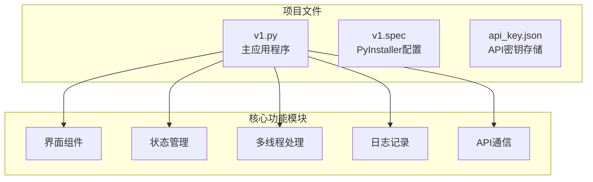

**图表来源**
- [v1.py:1-860](file://v1.py#L1-L860)
- [v1.spec:1-45](file://v1.spec#L1-L45)

**章节来源**
- [v1.py:1-860](file://v1.py#L1-L860)
- [v1.spec:1-45](file://v1.spec#L1-L45)

## 核心组件

### 状态反馈系统架构

系统采用分层的状态管理架构，确保UI状态的一致性和线程安全性：

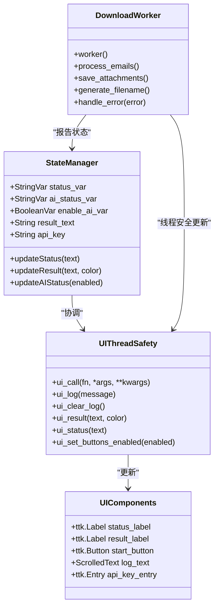

**图表来源**
- [v1.py:199-435](file://v1.py#L199-L435)
- [v1.py:200-229](file://v1.py#L200-L229)

### 状态变量管理

系统维护多个关键状态变量来跟踪应用程序的不同阶段：

| 状态变量 | 类型 | 描述 | 默认值 |
|---------|------|------|--------|
| `status_var` | StringVar | 主要状态显示（如"正在检索邮件..."） | "就绪" |
| `result_label` | Label | 结果状态显示（成功/失败信息） | "" |
| `enable_ai_var` | BooleanVar | AI功能开关状态 | True |
| `ai_status_var` | StringVar | AI功能状态描述 | "AI 智能命名：已开启" |
| `real_api_key` | String | 实际API密钥存储 | "" |

**章节来源**
- [v1.py:791-797](file://v1.py#L791-L797)
- [v1.py:656-665](file://v1.py#L656-L665)
- [v1.py:451-464](file://v1.py#L451-L464)

## 架构概览

系统采用异步多线程架构，确保UI响应性：

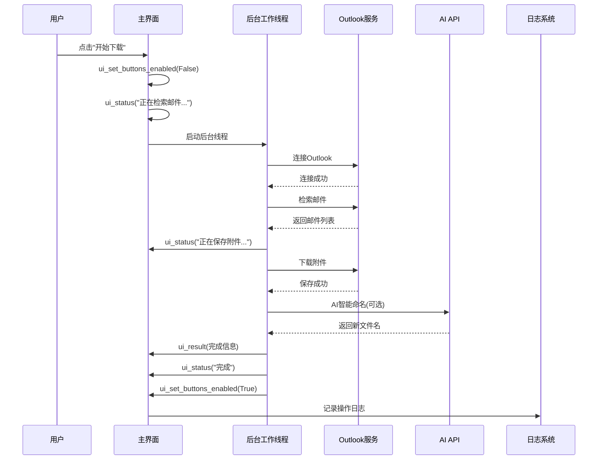

**图表来源**
- [v1.py:199-435](file://v1.py#L199-L435)
- [v1.py:200-229](file://v1.py#L200-L229)

## 详细组件分析

### 线程安全更新机制

系统实现了完善的UI线程安全更新机制，确保后台线程可以安全地更新主界面：

#### 核心线程安全函数

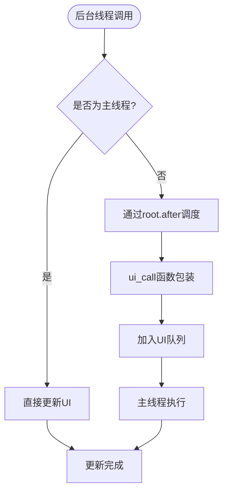

**图表来源**
- [v1.py:200-205](file://v1.py#L200-L205)

#### 状态更新函数详解

系统提供了多个专门的状态更新函数：

| 函数名 | 参数 | 功能 | 线程安全 |
|-------|------|------|----------|
| `ui_call` | fn, *args, **kwargs | 通用UI更新调度器 | ✅ |
| `ui_log` | message: str | 添加日志消息 | ✅ |
| `ui_clear_log` | 无 | 清空日志 | ✅ |
| `ui_result` | text: str, fg: str | 更新结果标签 | ✅ |
| `ui_status` | text: str | 更新状态标签 | ✅ |
| `ui_set_buttons_enabled` | enabled: bool | 控制按钮状态 | ✅ |

**章节来源**
- [v1.py:200-229](file://v1.py#L200-L229)

### 状态标签系统

状态标签系统提供了多层次的状态反馈：

#### 状态标签层次结构

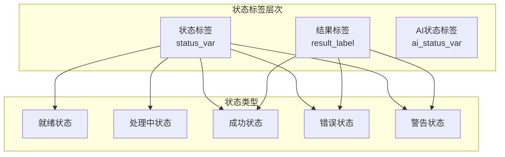

**图表来源**
- [v1.py:791-797](file://v1.py#L791-L797)
- [v1.py:820-821](file://v1.py#L820-L821)

#### 状态标签更新流程

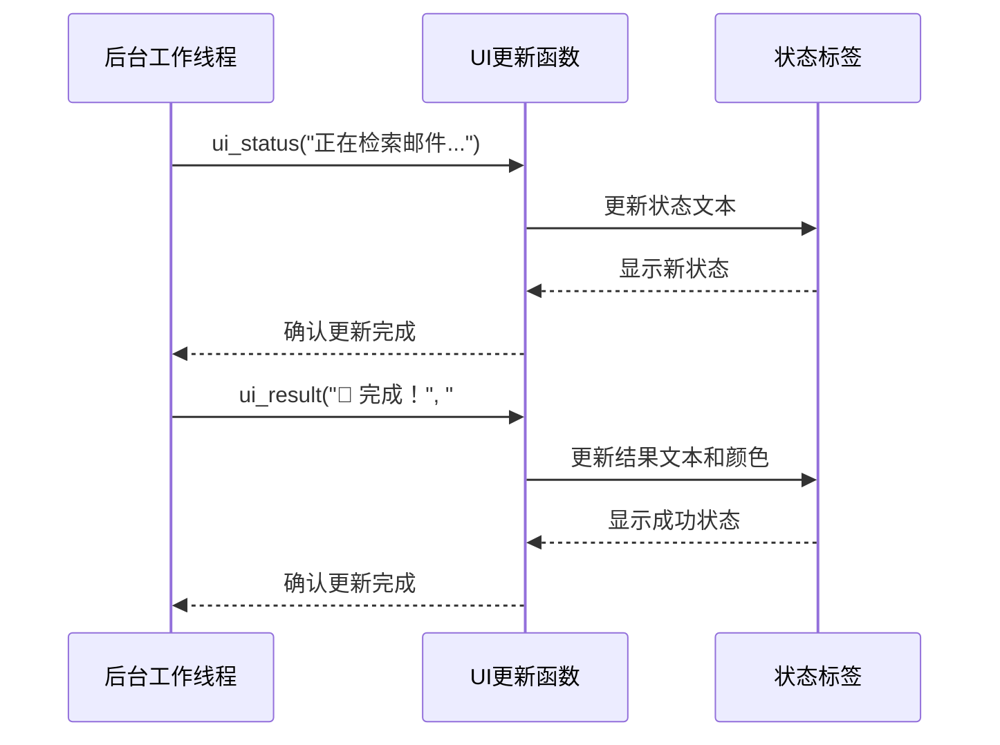

**图表来源**
- [v1.py:216-222](file://v1.py#L216-L222)
- [v1.py:219-221](file://v1.py#L219-L221)

**章节来源**
- [v1.py:216-222](file://v1.py#L216-L222)
- [v1.py:820-821](file://v1.py#L820-L821)

### 结果标签管理

结果标签负责显示操作的最终结果和用户反馈信息：

#### 结果标签样式系统

| 状态 | 文本颜色 | 图标 | 用途 |
|------|----------|------|------|
| 成功 | #388e3c (绿色) | 🎉 | 操作完成 |
| 错误 | #e53935 (红色) | ❌ | 操作失败 |
| 警告 | #e53935 (红色) | ⚠️ | 需要注意的情况 |
| 信息 | #6B7280 (灰色) | ℹ️ | 提示信息 |
| 就绪 | #6B7280 (灰色) | - | 系统就绪 |

**章节来源**
- [v1.py:245-250](file://v1.py#L245-L250)
- [v1.py:416-417](file://v1.py#L416-L417)

### 进度指示器设计

系统提供了多种进度指示方式：

#### 进度可视化组件

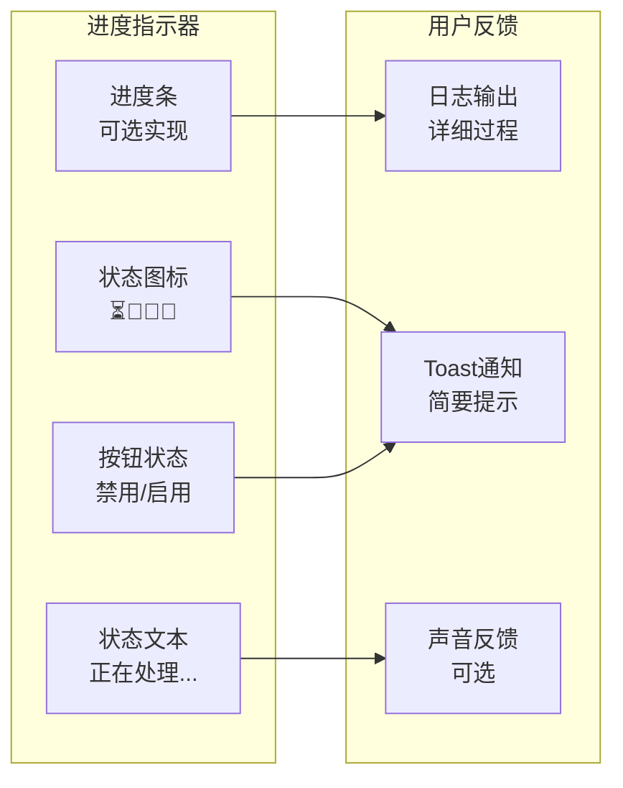

**图表来源**
- [v1.py:254-255](file://v1.py#L254-L255)
- [v1.py:433-434](file://v1.py#L433-L434)

### 按钮状态管理

按钮状态管理系统确保用户界面的交互一致性：

#### 按钮状态控制

| 按钮 | 正常状态 | 处理中状态 | 禁用条件 |
|------|----------|------------|----------|
| 开始下载 | 可点击 | 禁用 | 处理过程中 |
| 浏览... | 可点击 | 可点击 | 无 |
| 打开目录 | 可点击 | 可点击 | 无 |
| 保存Key | 可点击 | 可点击 | 无 |
| 申请Key | 可点击 | 可点击 | 无 |

**章节来源**
- [v1.py:223-228](file://v1.py#L223-L228)
- [v1.py:433-434](file://v1.py#L433-L434)

## 状态管理系统

### 状态生命周期

系统状态遵循严格的生命周期管理：

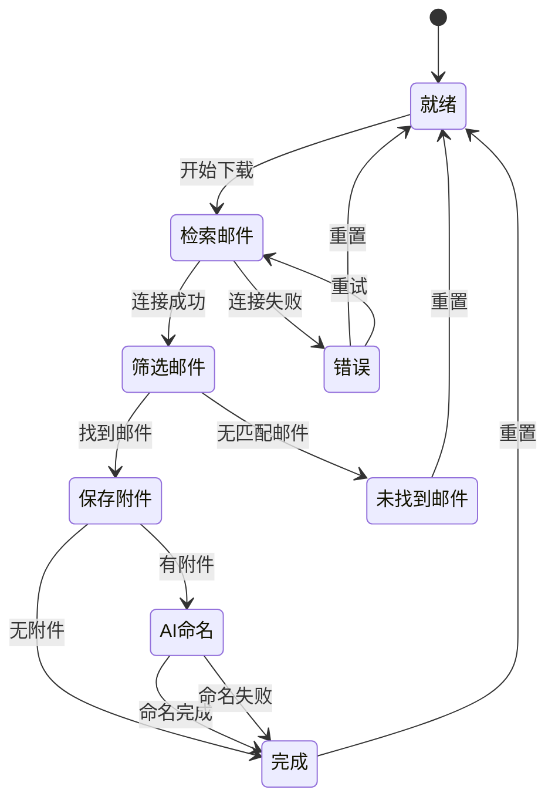

**图表来源**
- [v1.py:254-417](file://v1.py#L254-L417)

### 状态转换规则

系统实现了严格的状态转换规则：

#### 状态转换矩阵

| 当前状态 | 触发事件 | 下一状态 | 操作 |
|----------|----------|----------|------|
| 就绪 | 用户点击开始 | 检索邮件 | 禁用开始按钮 |
| 检索邮件 | 成功连接Outlook | 筛选邮件 | 更新状态文本 |
| 检索邮件 | 连接失败 | 错误 | 显示错误信息 |
| 筛选邮件 | 找到邮件 | 保存附件 | 继续处理 |
| 筛选邮件 | 无邮件 | 未找到邮件 | 显示提示 |
| 保存附件 | 有附件 | AI命名 | 处理附件 |
| 保存附件 | 无附件 | 完成 | 显示完成信息 |
| AI命名 | 成功 | 完成 | 更新统计 |
| AI命名 | 失败 | 完成 | 显示警告 |
| 完成 | 操作结束 | 就绪 | 启用按钮 |
| 错误 | 异常处理 | 就绪 | 启用按钮 |

**章节来源**
- [v1.py:254-426](file://v1.py#L254-L426)

## UI线程安全机制

### 核心线程安全原则

系统采用"后台工作线程 + 主线程UI更新"的设计模式：

#### 线程安全更新流程

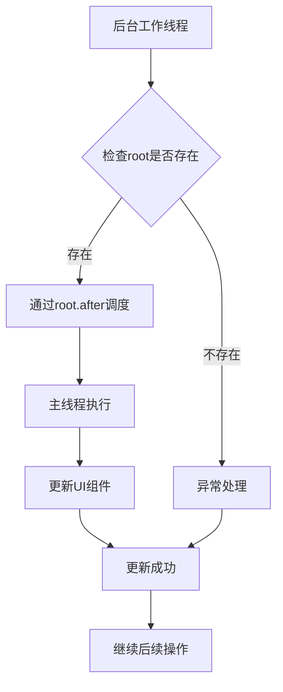

**图表来源**
- [v1.py:200-205](file://v1.py#L200-L205)

### 线程安全更新策略

系统实现了多种线程安全更新策略：

#### 更新策略对比

| 策略 | 优点 | 缺点 | 适用场景 |
|------|------|------|----------|
| root.after | 简单可靠 | 性能开销 | 所有UI更新 |
| queue.Queue | 高性能 | 实现复杂 | 大量数据更新 |
| Threading.Lock | 精确控制 | 可能死锁 | 共享资源访问 |
| Event-driven | 解耦良好 | 调试困难 | 复杂状态机 |

**章节来源**
- [v1.py:200-205](file://v1.py#L200-L205)

## 视觉反馈设计

### 颜色系统设计

系统采用了统一的颜色设计方案：

#### 颜色语义系统

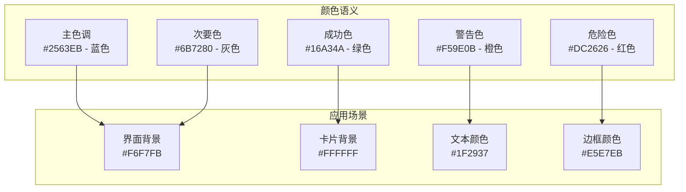

**图表来源**
- [v1.py:528-539](file://v1.py#L528-L539)

#### 颜色使用规范

| 颜色用途 | 颜色值 | 使用场景 |
|----------|--------|----------|
| 主要按钮 | #2563EB | 主要操作 |
| 成功状态 | #16A34A | 操作成功 |
| 警告状态 | #F59E0B | 注意事项 |
| 错误状态 | #DC2626 | 操作失败 |
| 就绪状态 | #6B7280 | 系统就绪 |
| 背景颜色 | #F6F7FB | 主界面背景 |

**章节来源**
- [v1.py:528-539](file://v1.py#L528-L539)

### 图标和符号系统

系统使用了直观的表情符号来增强用户体验：

#### 符号语义表

| 符号 | 名称 | 含义 | 颜色 |
|------|------|------|------|
| 📩 | 邮件包 | 找到邮件 | 默认 |
| 💾 | 硬盘 | 保存文件 | 默认 |
| 🤖 | 机器人 | AI处理 | 默认 |
| 📝 | 笔 | 文件重命名 | 默认 |
| 🔍 | 放大镜 | 未找到 | 默认 |
| ❌ | 错误 | 失败 | #e53935 |
| ⚠️ | 警告 | 注意 | #e53935 |
| ℹ️ | 信息 | 提示 | #6B7280 |
| 🎉 | 庆祝 | 成功 | #388e3c |
| ⏳ | 沙漏 | 正在处理 | #2563EB |

**章节来源**
- [v1.py:338-402](file://v1.py#L338-L402)

## 错误处理与状态码

### 错误状态管理

系统实现了完整的错误状态管理机制：

#### 错误状态分类

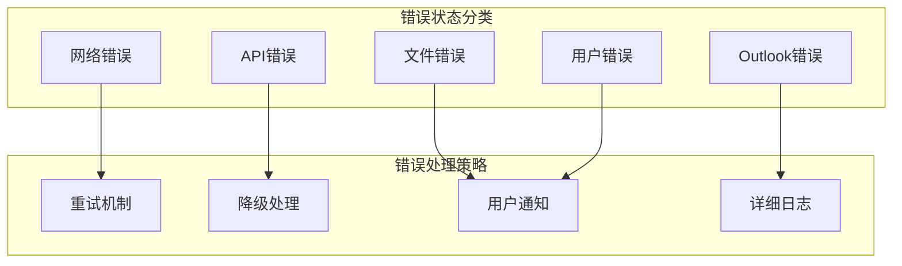

**图表来源**
- [v1.py:419-426](file://v1.py#L419-L426)

#### 错误消息格式化

系统提供了统一的错误消息格式：

| 错误类型 | 格式模板 | 示例 |
|----------|----------|------|
| 网络错误 | "❌ 网络异常：{message}" | ❌ 网络异常：连接超时 |
| API错误 | "❌ API错误：{code} - {message}" | ❌ API错误：401 - 未授权 |
| 文件错误 | "⚠️ 文件错误：{operation} - {path}" | ⚠️ 文件错误：保存 - C:\temp\file.txt |
| Outlook错误 | "❌ Outlook错误：{message}" | ❌ Outlook错误：无法连接 |
| 用户错误 | "⚠️ 用户输入错误：{field}" | ⚠️ 用户输入错误：发件人名称 |

**章节来源**
- [v1.py:419-426](file://v1.py#L419-L426)

### 状态码定义

系统实现了状态码标准化：

#### 状态码体系

| 状态码 | 状态名称 | 描述 | 使用场景 |
|--------|----------|------|----------|
| READY | 就绪 | 系统准备就绪 | 初始状态 |
| PROCESSING | 处理中 | 正在执行操作 | 所有长时间操作 |
| SUCCESS | 成功 | 操作成功完成 | 正常完成 |
| ERROR | 错误 | 操作失败 | 异常情况 |
| WARNING | 警告 | 需要注意的情况 | 部分功能受限 |
| IDLE | 空闲 | 等待用户操作 | 空闲状态 |

**章节来源**
- [v1.py:791-797](file://v1.py#L791-L797)

## 性能考虑

### 多线程性能优化

系统在多线程环境下进行了性能优化：

#### 性能优化策略

| 优化项 | 实现方式 | 性能收益 |
|--------|----------|----------|
| 线程池管理 | 单独工作线程 | 避免UI阻塞 |
| 批量UI更新 | 合并更新请求 | 减少UI刷新次数 |
| 内存管理 | 及时释放临时文件 | 控制内存使用 |
| 网络请求 | 超时控制和重试 | 提高成功率 |

### 内存管理

系统实现了有效的内存管理策略：

#### 内存使用监控

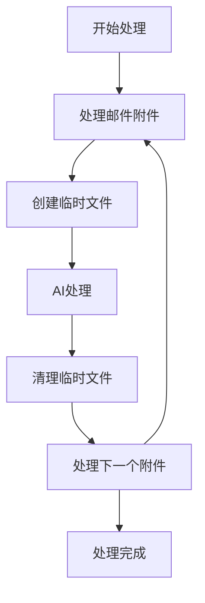

**图表来源**
- [v1.py:184-196](file://v1.py#L184-L196)

**章节来源**
- [v1.py:184-196](file://v1.py#L184-L196)

## 故障排除指南

### 常见问题诊断

系统提供了完善的故障排除机制：

#### 诊断流程

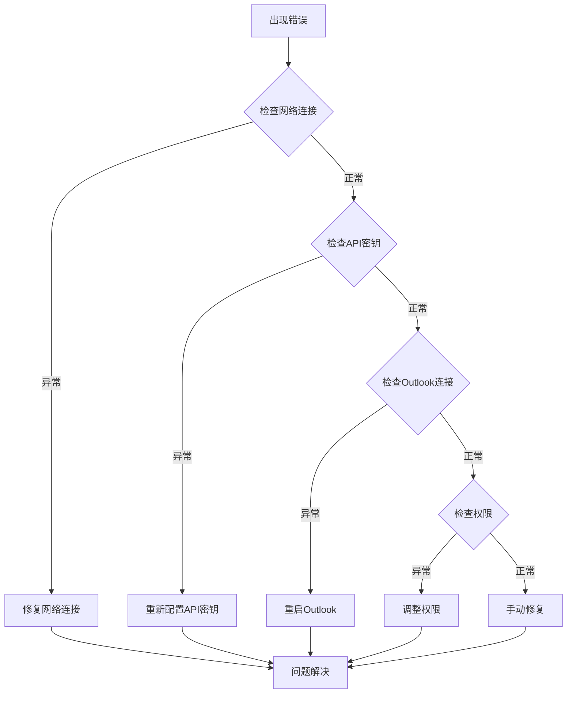

**图表来源**
- [v1.py:419-426](file://v1.py#L419-L426)

### 用户提示信息

系统提供了丰富的用户提示信息：

#### 提示信息模板

| 信息类型 | 模板 | 使用场景 |
|----------|------|----------|
| 成功提示 | "🎉 {action}完成！" | 操作成功 |
| 失败提示 | "❌ {action}失败：{reason}" | 操作失败 |
| 警告提示 | "⚠️ {warning}" | 需要注意 |
| 信息提示 | "ℹ️ {info}" | 一般信息 |
| 进度提示 | "⏳ {action}中..." | 正在处理 |

**章节来源**
- [v1.py:416-417](file://v1.py#L416-L417)

## 结论

状态反馈系统通过以下关键特性实现了优秀的用户体验：

### 核心优势

1. **线程安全保证**：通过root.after机制确保所有UI更新都在主线程执行
2. **状态一致性**：统一的状态管理确保UI状态与实际操作状态保持一致
3. **用户友好反馈**：丰富的视觉和文本反馈提供清晰的操作指导
4. **错误处理完善**：系统化的错误处理和恢复机制提升可靠性
5. **性能优化**：合理的多线程设计和内存管理确保流畅体验

### 设计亮点

- **渐进式反馈**：从状态标签到详细日志的多层次反馈机制
- **即时响应**：按钮状态和界面元素的即时更新
- **错误恢复**：完善的错误处理和用户引导
- **可扩展性**：模块化的状态管理便于功能扩展

该系统为UX设计师和前端开发者提供了完整的状态反馈实现参考，展示了如何在桌面应用中实现高质量的状态管理。