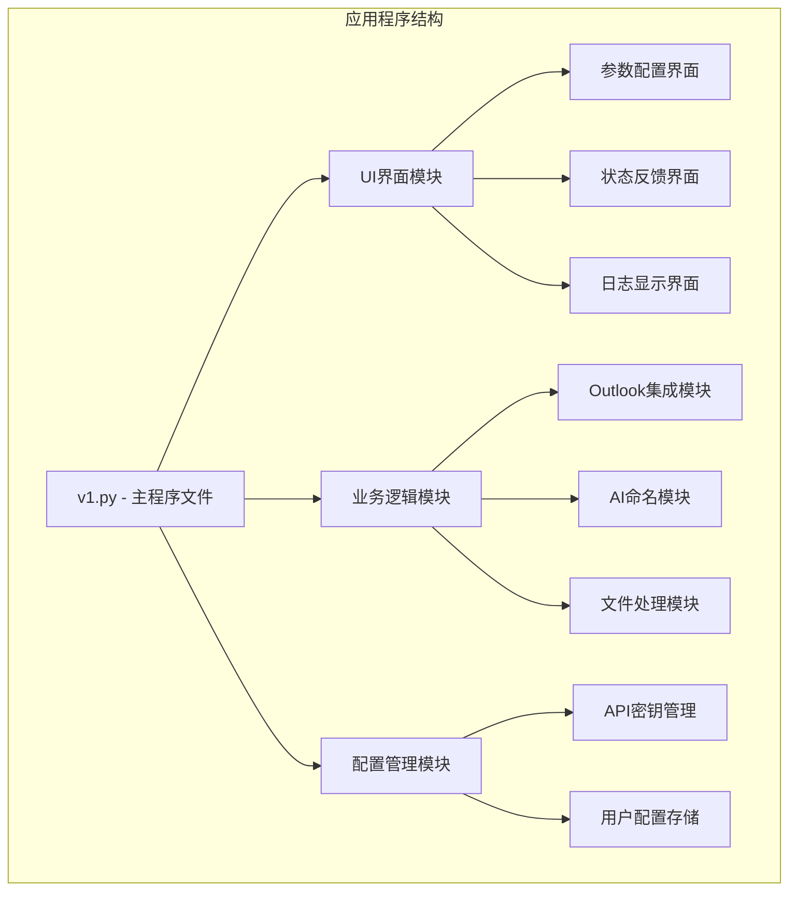
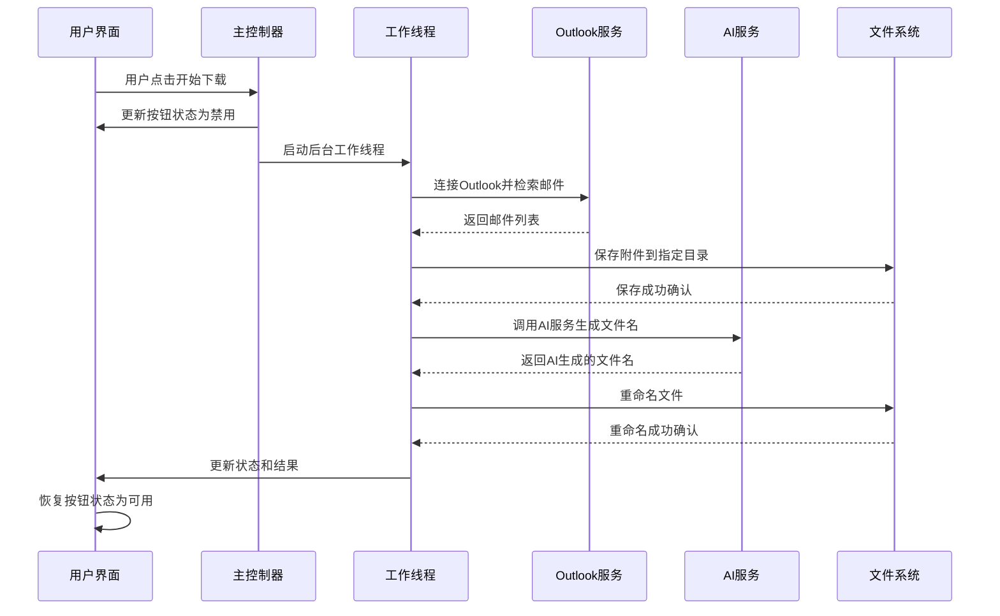
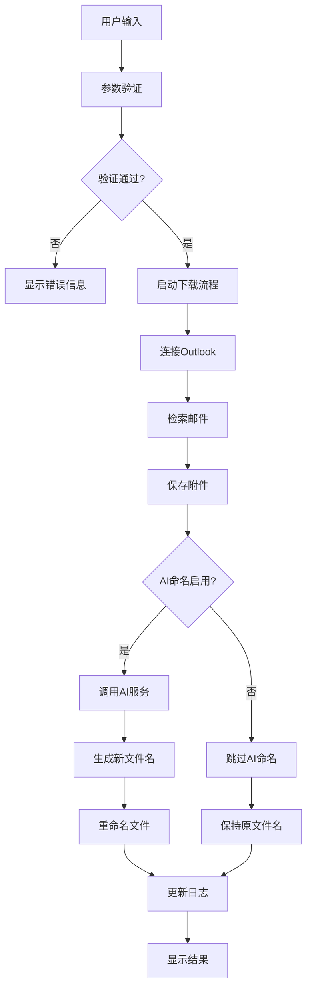
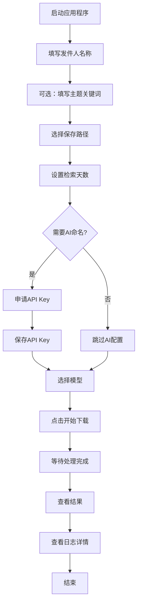
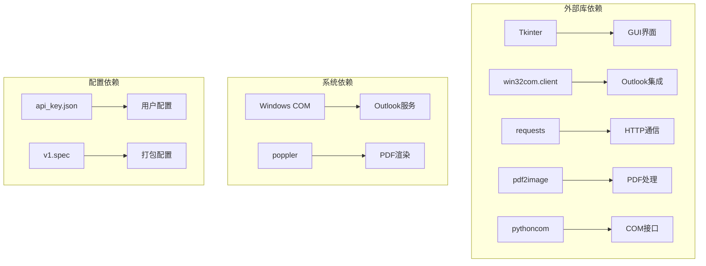

# 用户交互设计

<cite>
**本文引用的文件**
- [v1.py](file://v1.py)
- [v1.spec](file://v1.spec)
- [api_key.json](file://api_key.json)
</cite>

## 目录
1. [简介](#简介)
2. [项目结构](#项目结构)
3. [核心组件](#核心组件)
4. [架构概览](#架构概览)
5. [详细组件分析](#详细组件分析)
6. [依赖关系分析](#依赖关系分析)
7. [性能考虑](#性能考虑)
8. [故障排除指南](#故障排除指南)
9. [结论](#结论)
10. [附录](#附录)

## 简介

Outlook附件下载AI智能命名系统是一个基于Python Tkinter开发的桌面应用程序，专为Outlook邮件客户端设计。该系统能够从指定发件人的邮件中批量下载附件，并利用AI技术对附件进行智能命名，显著提升文件管理效率。

该应用程序采用现代化的用户界面设计，提供直观的操作流程和丰富的状态反馈机制。系统支持实时日志显示、错误处理、进度指示和用户引导功能，确保用户能够轻松完成复杂的邮件附件下载任务。

## 项目结构

应用程序采用模块化设计，主要包含以下核心模块：

**图表来源**
- [v1.py:467-860](file://v1.py#L467-L860)

**章节来源**
- [v1.py:1-860](file://v1.py#L1-L860)
- [v1.spec:1-45](file://v1.spec#L1-L45)

## 核心组件

### 用户界面框架

应用程序采用响应式布局设计，包含三个主要区域：

1. **顶部标题区域** - 显示应用名称和功能描述
2. **主体内容区域** - 分为左侧参数配置区和右侧日志显示区
3. **底部状态区域** - 包含状态栏和新手引导

### 参数配置界面

参数配置界面采用卡片式设计，提供以下配置选项：

- **发件人名称** - 支持模糊匹配，可包含发件人姓名或邮箱地址
- **主题关键词** - 可选配置，支持不区分大小写的关键词匹配
- **保存路径** - 通过文件对话框选择目标文件夹
- **检索天数** - 数值输入，控制邮件检索的时间范围
- **AI智能命名开关** - 控制是否启用AI自动命名功能
- **API密钥配置** - 管理阿里百炼平台的API密钥

**章节来源**
- [v1.py:614-784](file://v1.py#L614-L784)
- [v1.py:670-735](file://v1.py#L670-L735)

## 架构概览

应用程序采用事件驱动的异步架构，确保UI响应性和数据处理的高效性：

**图表来源**
- [v1.py:199-435](file://v1.py#L199-L435)

### 数据流架构

**图表来源**
- [v1.py:257-435](file://v1.py#L257-L435)

## 详细组件分析

### 参数配置界面组件

#### 发件人名称输入框
- **功能**：输入发件人名称或邮箱地址的关键字
- **验证规则**：必填字段，不能为空
- **匹配策略**：支持发件人姓名和邮箱地址的模糊匹配
- **用户体验**：提供实时的匹配提示信息

#### 主题关键词输入框
- **功能**：可选的主题关键词过滤
- **验证规则**：可为空，但输入时必须非空格
- **匹配策略**：不区分大小写的包含匹配
- **用户体验**：支持空值，降低使用门槛

#### 保存路径选择器
- **功能**：选择附件保存的目标文件夹
- **验证规则**：必填字段，必须是有效的文件夹路径
- **交互设计**：提供"浏览..."和"打开目录"两个按钮
- **用户体验**：支持文件对话框选择，一键打开文件夹

#### 检索天数输入框
- **功能**：设置邮件检索的时间范围（天）
- **验证规则**：必须是有效的整数
- **默认值**：1天
- **用户体验**：提供数值输入，支持常见天数选项

**章节来源**
- [v1.py:619-650](file://v1.py#L619-L650)
- [v1.py:632-643](file://v1.py#L632-L643)

### AI智能命名系统

#### API密钥管理系统
- **存储机制**：使用用户配置目录存储API密钥
- **显示策略**：默认显示格式化版本（头尾可见，中间隐藏）
- **编辑模式**：获得焦点时显示真实密钥供编辑
- **安全性**：本地存储，避免硬编码在源码中

#### AI命名开关控制
- **状态管理**：使用tk.BooleanVar管理开关状态
- **界面反馈**：动态更新按钮文本和状态描述
- **功能禁用**：关闭时禁用相关配置控件

#### 模型选择器
- **可用模型**：支持多种Qwen-VL系列模型
- **默认推荐**：优先推荐qwen-vl-max
- **兼容性**：支持不同模型版本的切换

**章节来源**
- [v1.py:668-742](file://v1.py#L668-L742)
- [v1.py:48-55](file://v1.py#L48-L55)
- [v1.py:58-64](file://v1.py#L58-L64)

### 状态反馈机制

#### 实时状态栏
- **状态变量**：使用tk.StringVar管理状态文本
- **更新时机**：在各个处理阶段更新状态信息
- **状态类型**：包括"正在检索邮件"、"正在保存附件"、"完成"等

#### 结果标签
- **结果显示**：显示操作结果和统计信息
- **颜色编码**：使用不同颜色表示成功、警告、错误状态
- **信息内容**：包含保存数量、AI重命名成功率等

#### 进度指示器
- **按钮状态**：下载过程中禁用按钮防止重复操作
- **线程安全**：使用root.after确保UI更新的线程安全
- **异常恢复**：异常发生时自动恢复按钮状态

**章节来源**
- [v1.py:791-797](file://v1.py#L791-L797)
- [v1.py:219-229](file://v1.py#L219-L229)

### 实时日志显示系统

#### 日志文本区域
- **滚动功能**：支持垂直滚动查看历史记录
- **自动滚动**：新日志自动滚动到可视区域
- **格式化输出**：使用表情符号增强日志可读性

#### 日志分类
- **操作日志**：记录主要操作步骤和状态变化
- **错误日志**：详细记录异常信息和错误原因
- **进度日志**：显示处理进度和统计信息

#### 日志清理机制
- **手动清理**：每次开始新的下载任务时自动清空日志
- **内存管理**：及时释放临时文件和资源

**章节来源**
- [v1.py:803-812](file://v1.py#L803-L812)
- [v1.py:207-214](file://v1.py#L207-L214)

### 用户操作流程

#### 完整操作流程

**图表来源**
- [v1.py:793-797](file://v1.py#L793-L797)
- [v1.py:199-435](file://v1.py#L199-L435)

#### 输入验证机制

系统实现了多层次的输入验证：

1. **必填字段验证**：发件人名称和保存路径不能为空
2. **格式验证**：检索天数必须是有效整数
3. **范围验证**：API密钥格式验证
4. **存在性验证**：保存路径必须存在或可创建

#### 错误提示系统

- **即时反馈**：输入错误时立即显示错误信息
- **颜色编码**：使用红色表示错误，绿色表示成功
- **详细说明**：提供具体的错误原因和解决建议
- **自动恢复**：错误修复后自动恢复正常状态

**章节来源**
- [v1.py:242-250](file://v1.py#L242-L250)
- [v1.py:419-426](file://v1.py#L419-L426)

### 事件处理机制

#### 窗口事件处理
- **窗口自适应**：根据屏幕尺寸自动调整窗口大小
- **最小尺寸限制**：确保界面元素的可读性
- **居中显示**：避免任务栏遮挡

#### 控件事件处理
- **焦点事件**：API密钥输入框的焦点处理
- **按钮事件**：所有交互按钮的事件绑定
- **状态变更事件**：AI开关状态变更的处理

#### 线程安全机制
- **UI更新委托**：使用root.after确保UI更新在主线程执行
- **异常捕获**：后台线程异常不影响主界面响应
- **资源清理**：确保线程结束时正确释放资源

**章节来源**
- [v1.py:471-525](file://v1.py#L471-L525)
- [v1.py:201-205](file://v1.py#L201-L205)

### 按钮状态管理和焦点控制

#### 按钮状态管理
- **禁用策略**：下载过程中禁用所有交互按钮
- **启用条件**：处理完成后自动启用按钮
- **条件控制**：根据AI开关状态动态启用/禁用相关控件

#### 焦点控制
- **自动焦点**：首次启动时自动聚焦到发件人输入框
- **导航优化**：Tab键顺序符合逻辑流程
- **无障碍支持**：支持键盘快捷键操作

#### 键盘快捷键支持
- **Enter键**：快速执行下载操作
- **Esc键**：取消当前操作
- **Tab键**：在控件间导航
- **Ctrl+S**：保存API密钥配置

**章节来源**
- [v1.py:744-784](file://v1.py#L744-L784)
- [v1.py:688-717](file://v1.py#L688-L717)

## 依赖关系分析

### 外部依赖关系

**图表来源**
- [v1.py:1-14](file://v1.py#L1-L14)
- [v1.spec:9-15](file://v1.spec#L9-L15)

### 内部模块依赖

应用程序内部模块之间具有清晰的职责分离：

- **UI层**：负责用户交互和界面展示
- **业务逻辑层**：处理核心业务流程
- **数据访问层**：管理配置和文件操作
- **工具层**：提供通用的辅助功能

**章节来源**
- [v1.spec:1-45](file://v1.spec#L1-L45)
- [api_key.json:1-3](file://api_key.json#L1-L3)

## 性能考虑

### 线程管理
- **后台线程**：所有耗时操作都在独立线程中执行
- **UI线程安全**：使用root.after确保UI更新的线程安全
- **资源管理**：线程结束时自动清理资源

### 内存优化
- **临时文件清理**：及时删除PDF转换产生的临时文件
- **图像缓存**：合理控制AI处理时的图像缓存大小
- **日志管理**：定期清理过期的日志信息

### 网络优化
- **超时设置**：AI请求设置合理的超时时间
- **重试机制**：网络异常时提供有限的重试机会
- **连接池**：复用HTTP连接减少开销

## 故障排除指南

### 常见问题及解决方案

#### Outlook连接问题
- **症状**：无法连接到Outlook或获取邮件列表
- **原因**：Outlook未启动或COM接口不可用
- **解决方案**：确保Outlook已启动，检查COM接口权限

#### API密钥问题
- **症状**：AI命名功能无法使用
- **原因**：API密钥无效或网络连接问题
- **解决方案**：重新申请API密钥，检查网络连接

#### PDF处理问题
- **症状**：PDF文件无法正确处理
- **原因**：poppler路径配置错误或PDF损坏
- **解决方案**：检查poppler安装路径，验证PDF文件完整性

#### 权限问题
- **症状**：无法保存文件到指定目录
- **原因**：目标目录权限不足
- **解决方案**：修改目标目录权限或选择其他目录

**章节来源**
- [v1.py:97-105](file://v1.py#L97-L105)
- [v1.py:419-426](file://v1.py#L419-L426)

### 调试和诊断

#### 日志分析
- **操作日志**：查看详细的处理步骤和状态变化
- **错误日志**：分析异常堆栈和错误原因
- **性能日志**：监控处理时间和资源使用情况

#### 状态监控
- **实时状态**：通过状态栏了解当前处理状态
- **进度跟踪**：查看附件保存和重命名进度
- **结果统计**：统计成功和失败的数量

## 结论

Outlook附件下载AI智能命名系统通过精心设计的用户交互界面和强大的后台处理能力，为用户提供了高效、可靠的邮件附件管理解决方案。系统的主要优势包括：

1. **直观的用户界面**：采用卡片式设计和清晰的布局，降低学习成本
2. **强大的功能特性**：支持批量下载、智能命名、实时日志等功能
3. **完善的错误处理**：提供详细的错误信息和恢复机制
4. **良好的性能表现**：异步处理和资源管理确保流畅的用户体验

该系统特别适合需要频繁处理大量邮件附件的用户，能够显著提升工作效率并减少手动操作的错误率。

## 附录

### 用户体验优化建议

#### 界面设计优化
- **视觉层次**：通过颜色和字体大小区分重要信息
- **一致性**：保持控件样式和交互方式的一致性
- **可访问性**：支持键盘导航和屏幕阅读器

#### 交互流程优化
- **简化操作**：减少不必要的步骤和点击次数
- **即时反馈**：每个操作都有明确的视觉和状态反馈
- **撤销机制**：提供有限的撤销操作支持

#### 性能优化建议
- **预加载机制**：在应用启动时预加载常用资源
- **增量更新**：只更新发生变化的界面元素
- **缓存策略**：合理使用缓存提高响应速度

#### 安全性考虑
- **数据加密**：敏感信息（如API密钥）应加密存储
- **权限控制**：限制文件系统访问权限
- **输入验证**：加强输入验证防止恶意攻击