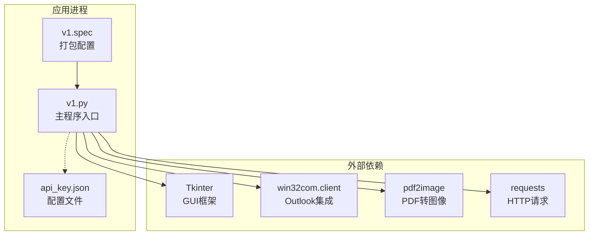
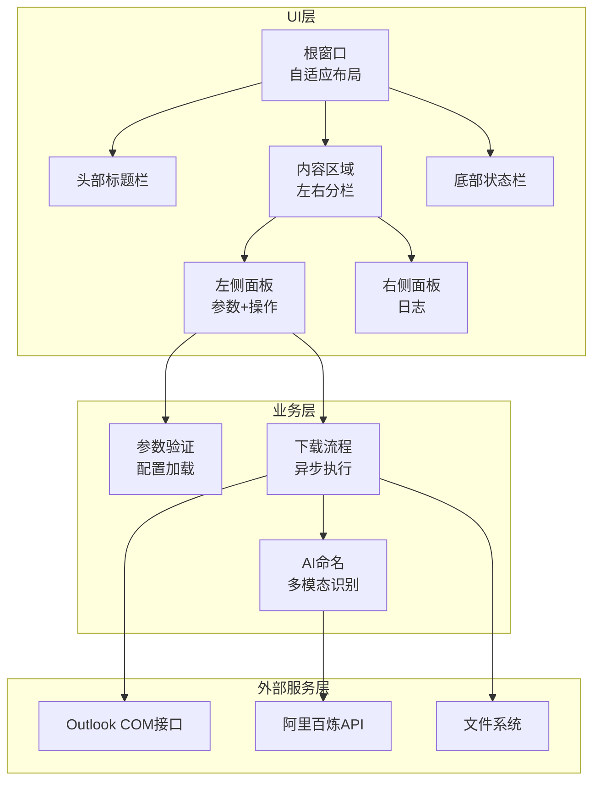
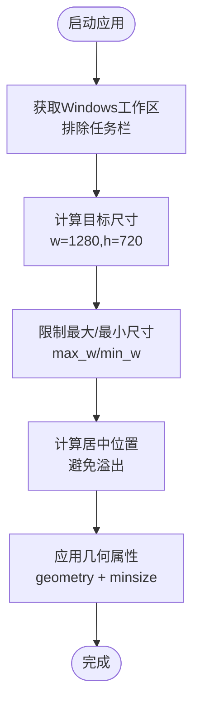
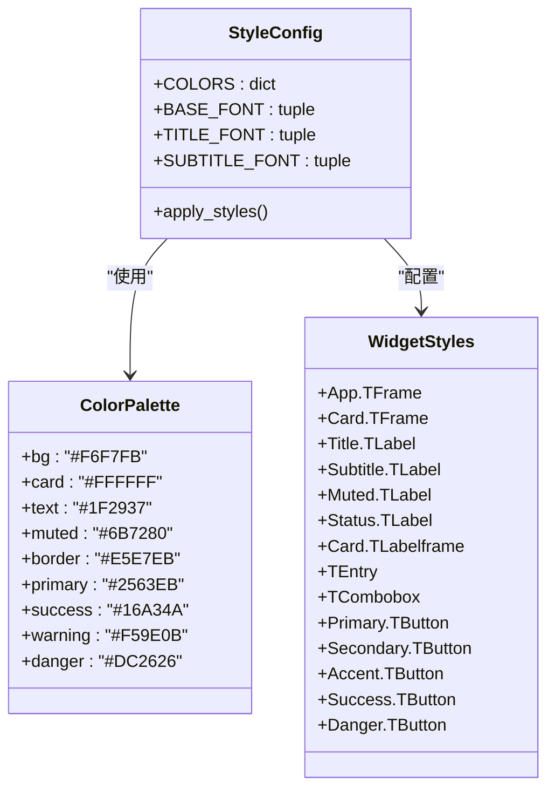
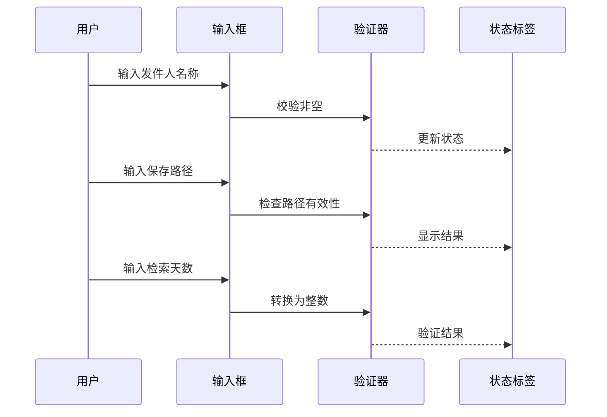
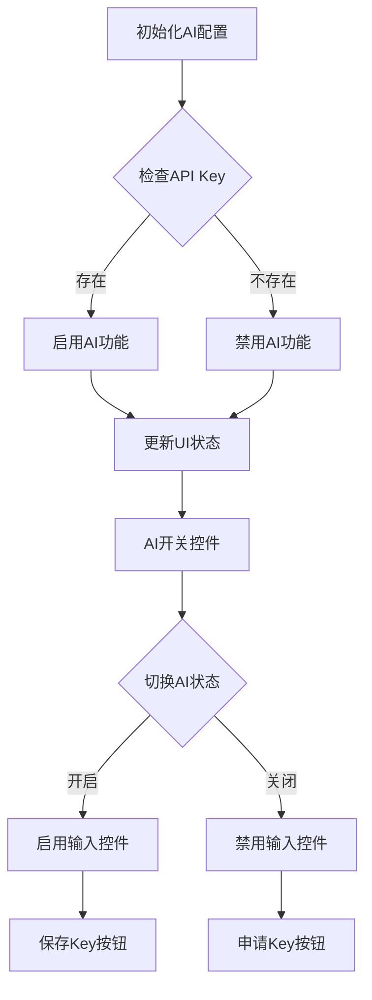
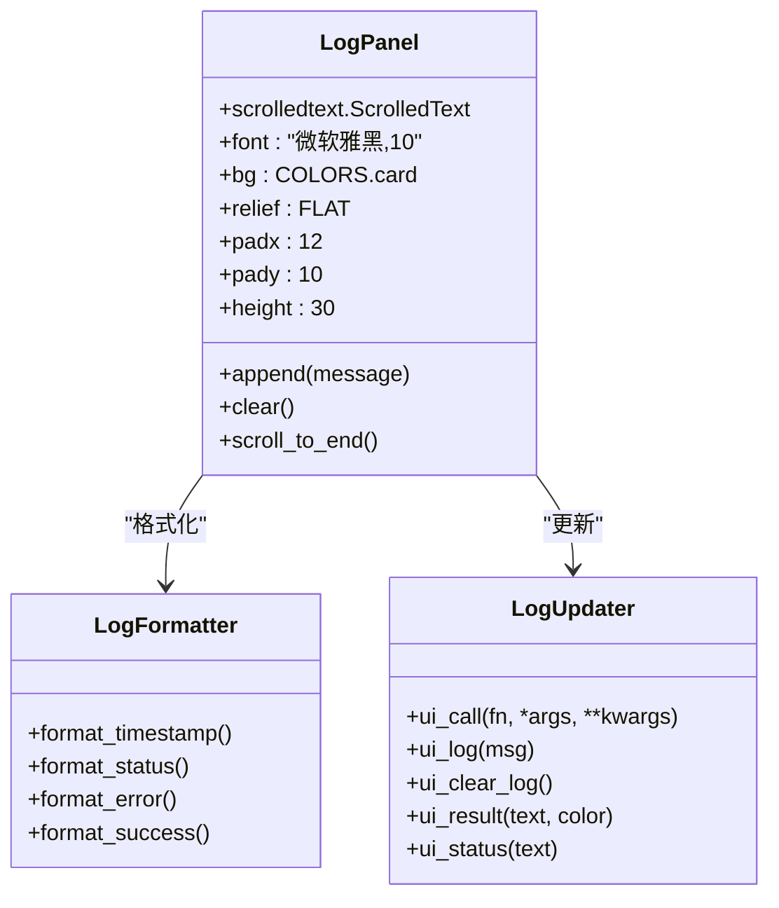
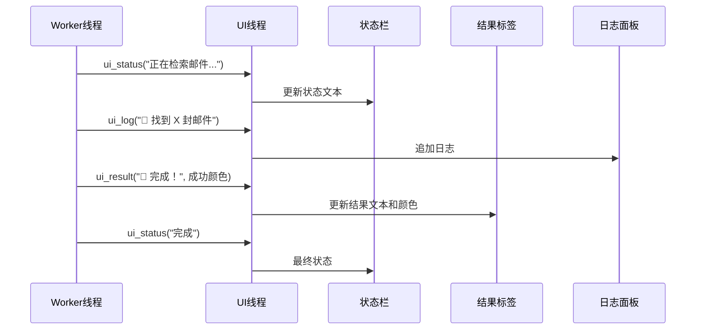
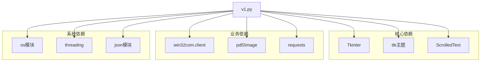

# 用户界面设计

<cite>
**本文档引用的文件**
- [v1.py](file://v1.py)
- [v1.spec](file://v1.spec)
- [api_key.json](file://api_key.json)
</cite>

## 目录
1. [简介](#简介)
2. [项目结构](#项目结构)
3. [核心组件](#核心组件)
4. [架构总览](#架构总览)
5. [详细组件分析](#详细组件分析)
6. [依赖关系分析](#依赖关系分析)
7. [性能考虑](#性能考虑)
8. [故障排除指南](#故障排除指南)
9. [结论](#结论)
10. [附录](#附录)

## 简介
本文件为Outlook附件下载AI智能命名系统的用户界面设计文档，基于Tkinter构建。系统提供参数配置界面、日志显示面板、状态反馈机制等UI元素，支持界面自适应、样式配置系统和响应式设计。文档面向UI/UX设计师和前端开发者，提供完整的界面实现参考与用户体验优化建议。

## 项目结构
该应用采用单文件架构，所有功能集中在单一Python脚本中，包含：
- GUI界面定义与样式配置
- 业务逻辑与异步处理
- 配置文件管理（API Key）
- 打包配置（PyInstaller）

**图表来源**
- [v1.py:467-827](file://v1.py#L467-L827)
- [v1.spec:1-45](file://v1.spec#L1-L45)

**章节来源**
- [v1.py:467-827](file://v1.py#L467-L827)
- [v1.spec:1-45](file://v1.spec#L1-L45)

## 核心组件
系统UI由以下核心组件构成：
- 根窗口与自适应布局
- 视觉样式系统（颜色、字体、主题）
- 参数配置面板（发件人、主题、路径、天数、AI开关）
- 日志显示面板（滚动文本框）
- 状态栏与结果标签
- 按钮控件组（开始下载、浏览、打开目录、保存Key、申请Key）

这些组件通过网格布局和权重配置实现响应式设计，确保在不同屏幕尺寸下保持良好的可用性。

**章节来源**
- [v1.py:527-582](file://v1.py#L527-L582)
- [v1.py:614-784](file://v1.py#L614-L784)
- [v1.py:800-821](file://v1.py#L800-L821)

## 架构总览
系统采用分层架构设计，UI层负责用户交互，业务层处理数据与逻辑，外部服务层提供API调用能力。

**图表来源**
- [v1.py:467-827](file://v1.py#L467-L827)
- [v1.py:199-435](file://v1.py#L199-L435)

## 详细组件分析

### 自适应窗口系统
系统实现了智能窗口自适应机制，能够根据屏幕工作区动态调整窗口大小和位置，避免任务栏遮挡。

**图表来源**
- [v1.py:471-525](file://v1.py#L471-L525)

**章节来源**
- [v1.py:471-525](file://v1.py#L471-L525)

### 视觉样式系统
系统采用集中式样式配置，统一管理颜色、字体和控件样式。

**图表来源**
- [v1.py:527-582](file://v1.py#L527-L582)

**章节来源**
- [v1.py:527-582](file://v1.py#L527-L582)

### 参数配置界面
参数界面采用三列网格布局，支持发件人名称、主题关键词、保存路径、检索天数等配置项。

**图表来源**
- [v1.py:242-250](file://v1.py#L242-L250)
- [v1.py:614-650](file://v1.py#L614-L650)

**章节来源**
- [v1.py:614-650](file://v1.py#L614-L650)
- [v1.py:242-250](file://v1.py#L242-L250)

### AI配置与控制
AI功能提供智能命名开关、API Key管理、模型选择等功能。

**图表来源**
- [v1.py:656-784](file://v1.py#L656-L784)
- [v1.py:451-465](file://v1.py#L451-L465)

**章节来源**
- [v1.py:656-784](file://v1.py#L656-L784)
- [v1.py:451-465](file://v1.py#L451-L465)

### 日志显示面板
日志面板采用ScrolledText组件，支持自动滚动和文本格式化。

**图表来源**
- [v1.py:803-812](file://v1.py#L803-L812)
- [v1.py:207-229](file://v1.py#L207-L229)

**章节来源**
- [v1.py:803-812](file://v1.py#L803-L812)
- [v1.py:207-229](file://v1.py#L207-L229)

### 状态反馈机制
系统提供多层次的状态反馈，包括实时状态栏、结果标签和日志输出。

**图表来源**
- [v1.py:207-229](file://v1.py#L207-L229)
- [v1.py:254-417](file://v1.py#L254-L417)

**章节来源**
- [v1.py:207-229](file://v1.py#L207-L229)
- [v1.py:254-417](file://v1.py#L254-L417)

## 依赖关系分析
系统UI组件之间的依赖关系如下：

**图表来源**
- [v1.py:1-14](file://v1.py#L1-L14)
- [v1.spec:9-15](file://v1.spec#L9-L15)

**章节来源**
- [v1.py:1-14](file://v1.py#L1-L14)
- [v1.spec:9-15](file://v1.spec#L9-L15)

## 性能考虑
- **异步处理**：下载过程在独立线程中执行，避免UI阻塞
- **内存管理**：PDF转图像后及时清理临时文件
- **网络超时**：API调用设置合理超时时间
- **UI线程安全**：通过root.after确保UI更新在主线程执行

## 故障排除指南
常见问题及解决方案：
- **API Key无效**：检查格式是否正确，确认网络连接正常
- **Outlook连接失败**：确保Outlook已安装并可访问
- **PDF处理错误**：验证poppler路径配置正确
- **权限问题**：以管理员权限运行或调整保存路径

**章节来源**
- [v1.py:107-148](file://v1.py#L107-L148)
- [v1.py:261-269](file://v1.py#L261-L269)

## 结论
该UI设计通过模块化架构、集中式样式管理和响应式布局，提供了良好的用户体验。系统支持AI智能命名、实时状态反馈和详细的日志记录，满足企业级Outlook附件管理需求。建议后续可增加主题切换、快捷键支持和导出功能。

## 附录

### 界面定制指南
- **颜色方案**：通过COLORS字典统一修改主题色彩
- **字体配置**：调整BASE_FONT、TITLE_FONT等基础字体设置
- **控件样式**：使用ttk.Style配置各类控件外观
- **布局调整**：通过grid.columnconfigure和rowconfigure权重控制响应式行为

### 用户体验优化建议
- 添加加载动画和进度指示器
- 实现配置模板和快速预设
- 增加键盘快捷键支持
- 提供帮助文档和引导教程
- 支持多语言界面

**章节来源**
- [v1.py:527-582](file://v1.py#L527-L582)
- [v1.py:467-525](file://v1.py#L467-L525)