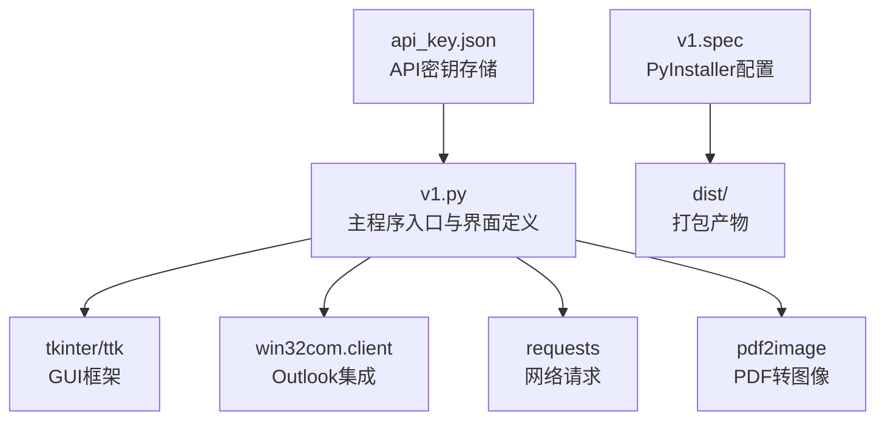
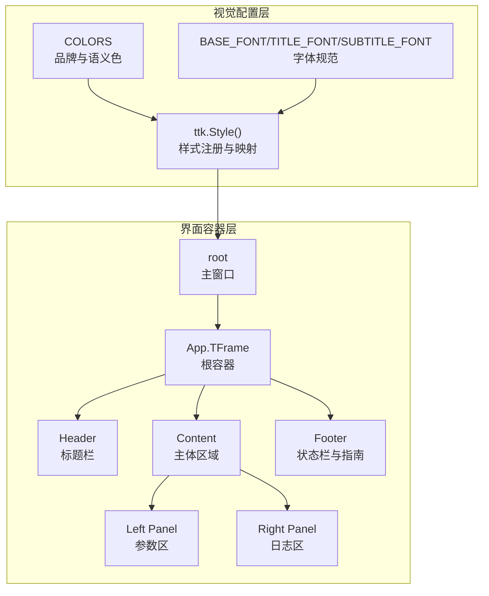
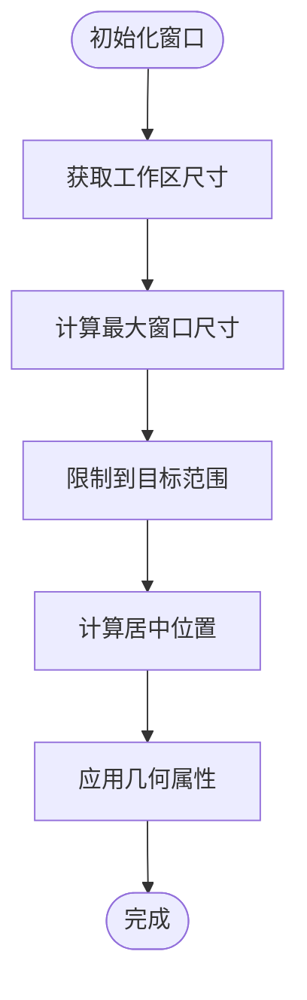
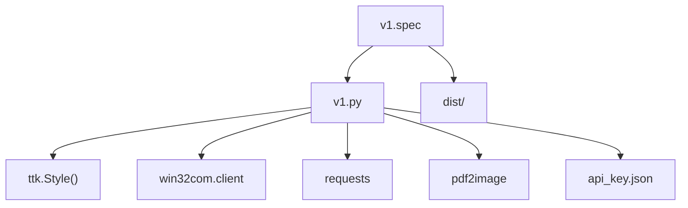
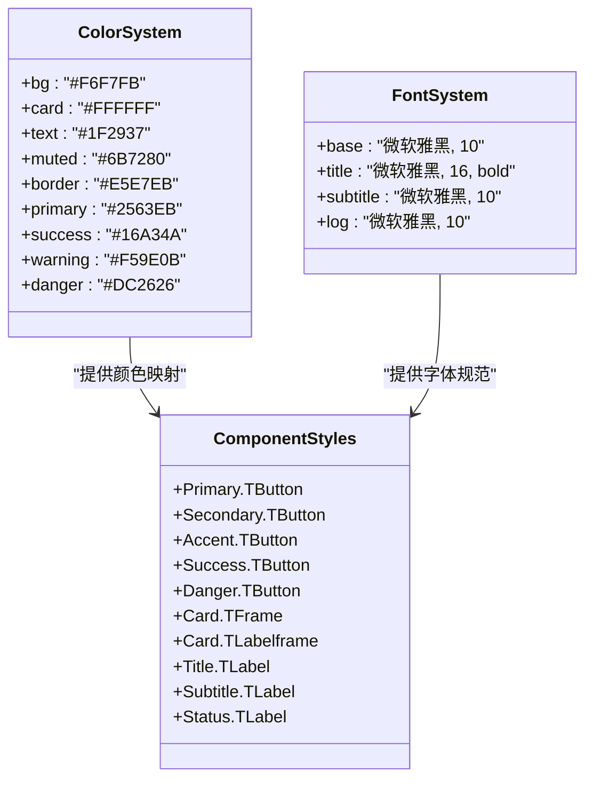

# 视觉设计规范

<cite>
**本文引用的文件**
- [v1.py](file://v1.py)
- [v1.spec](file://v1.spec)
- [api_key.json](file://api_key.json)
</cite>

## 目录
1. [简介](#简介)
2. [项目结构](#项目结构)
3. [核心组件](#核心组件)
4. [架构总览](#架构总览)
5. [详细组件分析](#详细组件分析)
6. [依赖关系分析](#依赖关系分析)
7. [性能考虑](#性能考虑)
8. [故障排除指南](#故障排除指南)
9. [结论](#结论)
10. [附录](#附录)

## 简介
本文件为Outlook附件下载AI智能命名系统的视觉设计规范，面向UI设计师与前端开发者，提供完整的色彩系统、字体规范、图标设计与界面元素样式标准。文档涵盖主题配置机制、样式变量管理、CSS样式映射与响应式适配规则，并包含组件样式定制、动画效果设计、视觉层次构建与品牌一致性维护策略。同时提供设计系统图解、样式表参考与视觉规范检查清单，确保跨平台一致的用户体验。

## 项目结构
该应用采用单文件Python桌面应用结构，基于tkinter/ttk构建GUI界面，配合PyInstaller进行打包。核心逻辑集中在单一脚本中，视觉样式通过集中式配置管理，便于统一维护与扩展。

**图表来源**
- [v1.py:467-860](file://v1.py#L467-L860)
- [v1.spec:1-45](file://v1.spec#L1-L45)

**章节来源**
- [v1.py:467-860](file://v1.py#L467-L860)
- [v1.spec:1-45](file://v1.spec#L1-L45)

## 核心组件
本系统的核心视觉组件包括：
- 颜色系统：定义品牌主色、语义色与中性色，支持悬停、按下、禁用等状态映射
- 字体系统：统一基础字体与标题/副标题/标签字体层级
- 组件样式：按钮、输入框、标签、面板、分割线等控件的样式与状态映射
- 响应式布局：自适应窗口尺寸与最小尺寸约束，兼容不同分辨率与高DPI场景
- 状态指示：状态栏、结果提示、日志区域的颜色与排版规范
- 品牌元素：引导卡片、新用户指南的视觉强调与边界设计

**章节来源**
- [v1.py:527-582](file://v1.py#L527-L582)
- [v1.py:583-854](file://v1.py#L583-L854)

## 架构总览
视觉系统采用集中式样式管理与主题驱动的设计模式。颜色、字体、间距与组件样式均通过变量集中定义，确保一致性与可维护性。界面由根容器承载，采用网格布局与权重分配实现左右分栏与自适应扩展。

**图表来源**
- [v1.py:527-582](file://v1.py#L527-L582)
- [v1.py:583-854](file://v1.py#L583-L854)

## 详细组件分析

### 色彩系统
- 基础背景色：用于根容器与页面背景
- 卡片背景色：用于面板与容器背景
- 文本色：用于主要文本与标题
- 中性色：用于辅助文本与说明
- 边框色：用于面板边框与分割线
- 主色与主色激活：用于主要操作按钮
- 成功色：用于成功状态与确认操作
- 警告色：用于警告与注意提示
- 危险色：用于错误与删除操作

颜色映射通过ttk.Style().map实现状态切换，确保交互反馈清晰明确。

**章节来源**
- [v1.py:527-539](file://v1.py#L527-L539)
- [v1.py:565-582](file://v1.py#L565-L582)

### 字体规范
- 基础字体：统一用于输入框、按钮与普通文本
- 标题字体：用于主标题与重要标签
- 副标题字体：用于说明性文本与辅助标签
- 日志字体：使用等宽字体以提升可读性

字体层级与字号确保信息层次清晰，阅读体验一致。

**章节来源**
- [v1.py:547-549](file://v1.py#L547-L549)
- [v1.py:803-812](file://v1.py#L803-L812)

### 图标设计
本界面未直接使用外部图标库，但可通过以下方式扩展：
- 按钮内嵌文字图标：如“浏览…”、“打开目录”、“保存 Key”、“申请 Key”
- 状态指示：使用emoji符号增强可读性（如⚠️、ℹ️、✅、❌）
- 建议：为未来引入矢量图标预留占位符，保持与品牌风格一致

**章节来源**
- [v1.py:639-642](file://v1.py#L639-L642)
- [v1.py:724-734](file://v1.py#L724-L734)

### 界面元素样式标准

#### 标签与文本
- 标题标签：使用标题字体与文本色，突出主标题
- 副标题标签：使用副标题字体与中性色，说明功能
- 状态标签：使用基础字体与中性色，显示运行状态
- 辅助标签：使用中性色与较小字号，提供说明信息

#### 输入控件
- 输入框：统一内边距与字体，确保一致的触达面积
- 下拉框：统一内边距与只读状态，保证选择体验

#### 按钮样式
- 主要按钮：主色背景与白色文字，支持悬停与按下状态映射
- 次要按钮：常规背景，用于辅助操作
- 强调按钮：紫色系背景，用于关键操作
- 成功按钮：绿色背景，用于确认与完成
- 危险按钮：红色背景，用于删除与取消

按钮状态映射覆盖正常、悬停、按下、禁用四种状态，确保交互一致性。

#### 面板与容器
- 卡片面板：白色背景、浅灰边框与内边距，营造悬浮卡片感
- 标题面板：加粗标题与内边距，清晰划分功能区域
- 根容器：浅灰背景，作为页面底色

#### 分割线与间距
- 分隔线：使用中性色与细线，避免视觉干扰
- 间距：统一内外边距与行间距，确保对齐与呼吸感

**章节来源**
- [v1.py:551-582](file://v1.py#L551-L582)
- [v1.py:614-616](file://v1.py#L614-L616)
- [v1.py:800-812](file://v1.py#L800-L812)

### 主题配置机制
- 集中式颜色与样式配置：通过COLORS字典与ttk.Style()集中管理
- 主题切换：当前使用clam主题，可扩展其他主题
- 动态样式更新：通过Style().configure与Style().map实现运行时样式调整
- 状态变量：使用StringVar/BooleanVar驱动UI状态变化

**章节来源**
- [v1.py:527-545](file://v1.py#L527-L545)
- [v1.py:744-784](file://v1.py#L744-L784)

### 样式变量管理
- 颜色变量：集中定义品牌色、语义色与中性色
- 字体变量：定义基础、标题、副标题字体
- 组件样式：为每个控件类型定义默认样式与状态映射
- 响应式变量：窗口尺寸与最小尺寸约束

**章节来源**
- [v1.py:527-550](file://v1.py#L527-L550)

### CSS样式映射
- ttk.Style()映射：将颜色、字体与状态映射到具体控件类型
- 状态映射：通过map方法定义hover/pressed/disabled状态下的颜色与前景色
- 组件别名：Primary.TButton、Secondary.TButton等别名简化使用

**章节来源**
- [v1.py:565-582](file://v1.py#L565-L582)

### 响应式适配规则
- 自适应窗口：根据屏幕工作区动态计算窗口尺寸与位置
- 最小尺寸约束：确保在小屏设备上仍可完整显示
- 网格布局：左侧参数区固定宽度，右侧日志区自适应扩展
- 权重分配：columnconfigure/rowconfigure实现弹性布局

**图表来源**
- [v1.py:471-525](file://v1.py#L471-L525)

**章节来源**
- [v1.py:471-525](file://v1.py#L471-L525)

### 组件样式定制
- 卡片式设计：通过边框与内边距营造层次感
- 状态反馈：通过颜色与图标提供即时反馈
- 交互一致性：统一的悬停与按下效果
- 可访问性：对比度满足基本要求，适合长时间使用

**章节来源**
- [v1.py:559-561](file://v1.py#L559-L561)
- [v1.py:824-854](file://v1.py#L824-L854)

### 动画效果设计
- 按钮状态过渡：通过状态映射实现平滑的颜色过渡
- 日志滚动：ScrolledText提供自然的滚动体验
- 状态切换：StringVar驱动的即时状态更新

**章节来源**
- [v1.py:565-582](file://v1.py#L565-L582)
- [v1.py:803-812](file://v1.py#L803-L812)

### 视觉层次构建
- 标题层级：主标题与副标题形成清晰的信息层级
- 面板分区：卡片式面板划分功能区域
- 颜色层次：通过语义色区分操作类型与状态
- 间距层次：通过内外边距与行间距建立视觉节奏

**章节来源**
- [v1.py:595-598](file://v1.py#L595-L598)
- [v1.py:614-616](file://v1.py#L614-L616)

### 品牌一致性维护
- 颜色体系：统一的品牌主色与语义色
- 字体体系：一致的字体家族与字号层级
- 组件风格：统一的圆角、阴影与边框风格
- 状态反馈：一致的交互反馈与视觉提示

**章节来源**
- [v1.py:527-550](file://v1.py#L527-L550)

## 依赖关系分析
- PyInstaller打包：通过v1.spec配置隐藏导入与二进制资源
- 运行时依赖：win32com.client、requests、pdf2image等
- 配置持久化：api_key.json存储API密钥

**图表来源**
- [v1.py:1-14](file://v1.py#L1-L14)
- [v1.spec:4-22](file://v1.spec#L4-L22)

**章节来源**
- [v1.py:1-14](file://v1.py#L1-L14)
- [v1.spec:4-22](file://v1.spec#L4-L22)

## 性能考虑
- 样式缓存：ttk.Style()实例复用，避免重复创建
- 线程安全：UI更新通过root.after回到主线程
- 资源清理：PDF临时文件在使用后及时清理
- 响应式优化：自适应窗口减少重绘开销

[本节为通用指导，无需特定文件来源]

## 故障排除指南
- API密钥问题：检查api_key.json是否存在与格式正确
- PDF转换失败：确认poppler路径配置与pdftoppm.exe存在
- Outlook连接失败：确认Outlook进程可用与权限足够
- UI样式异常：检查ttk主题是否加载成功

**章节来源**
- [v1.py:38-55](file://v1.py#L38-L55)
- [v1.py:97-105](file://v1.py#L97-L105)
- [v1.py:261-269](file://v1.py#L261-L269)

## 结论
本视觉设计规范为Outlook附件下载AI智能命名系统提供了完整的样式体系与实现指南。通过集中式配置与主题驱动的设计模式，确保了跨平台的一致性与可维护性。建议在后续迭代中引入矢量图标、完善暗色主题支持，并扩展更多交互状态反馈，以进一步提升用户体验。

[本节为总结性内容，无需特定文件来源]

## 附录

### 设计系统图解

**图表来源**
- [v1.py:527-550](file://v1.py#L527-L550)
- [v1.py:551-582](file://v1.py#L551-L582)

### 样式表参考
- 颜色变量：见COLORS字典定义
- 字体变量：见BASE_FONT/TITLE_FONT/SUBTITLE_FONT定义
- 组件样式：见ttk.Style().configure与.map调用
- 响应式规则：见set_window_geometry_adaptive函数

**章节来源**
- [v1.py:527-550](file://v1.py#L527-L550)
- [v1.py:551-582](file://v1.py#L551-L582)
- [v1.py:491-525](file://v1.py#L491-L525)

### 视觉规范检查清单
- [ ] 颜色对比度满足可访问性要求
- [ ] 字体层级清晰，无过度使用粗体
- [ ] 按钮状态映射完整，包含hover/pressed/disabled
- [ ] 响应式布局在不同分辨率下表现一致
- [ ] 日志区域具备良好的可读性与滚动体验
- [ ] 新用户指南卡片突出且易于识别
- [ ] 状态提示与错误信息颜色明确

[本节为通用检查清单，无需特定文件来源]