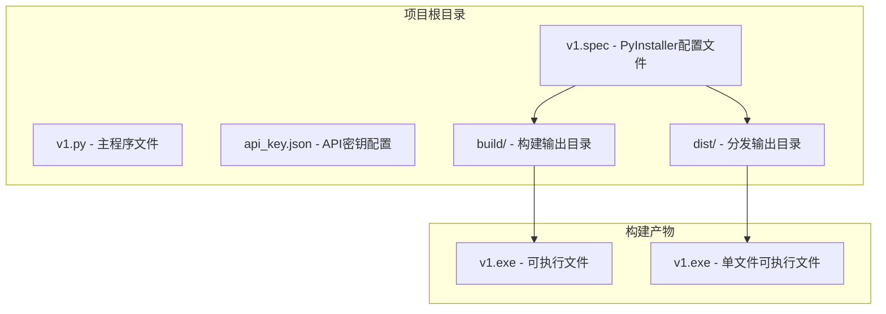
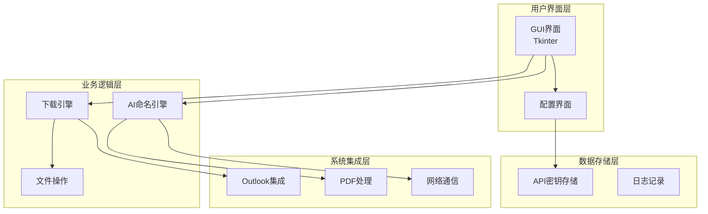
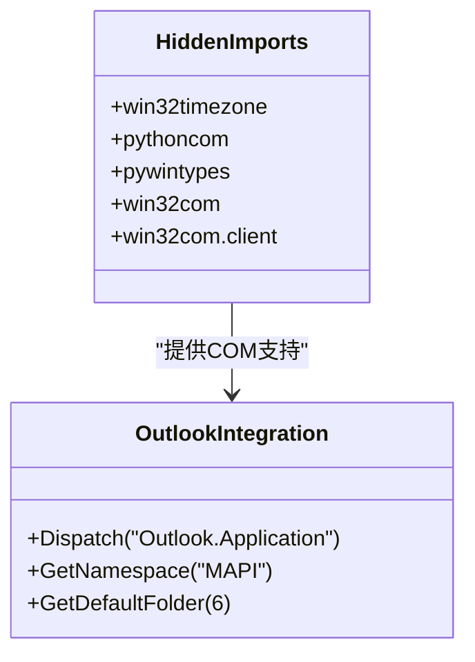
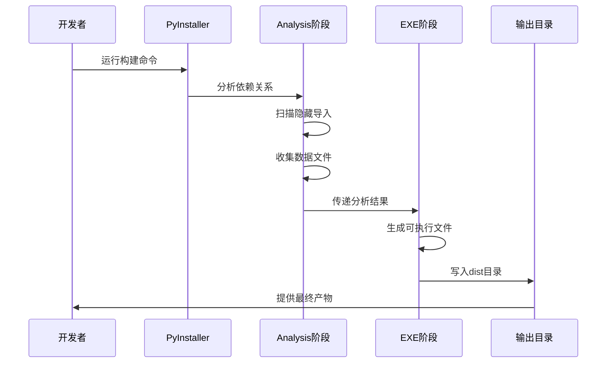
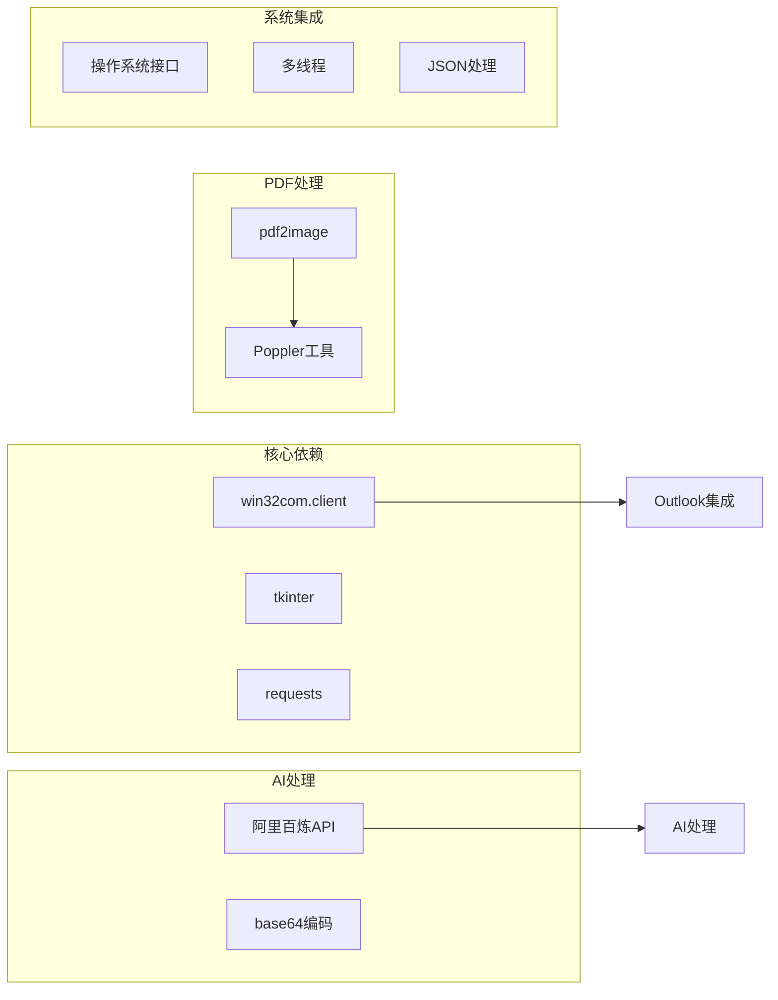
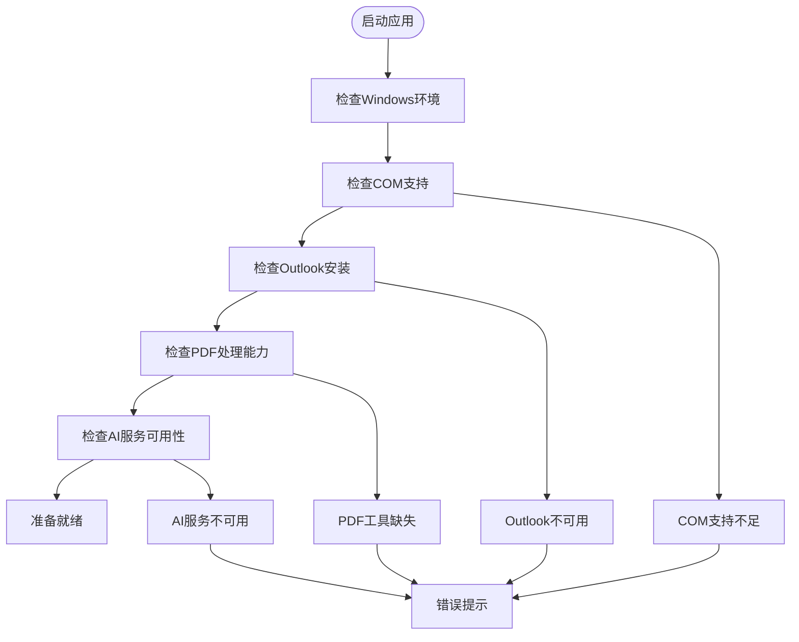
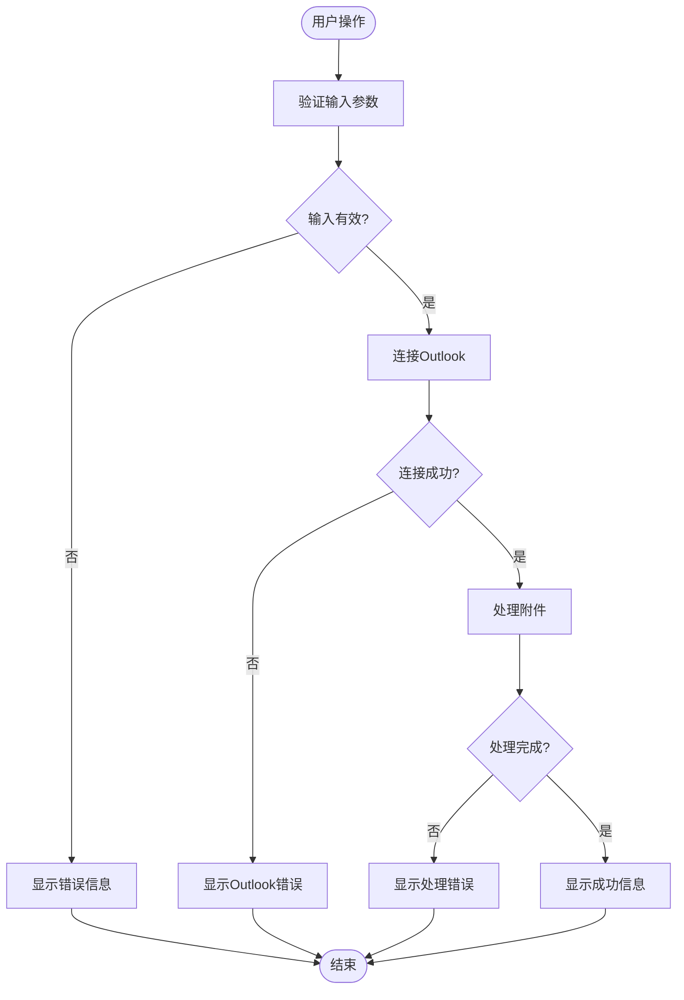

# 打包与分发

<cite>
**本文档引用的文件**
- [v1.spec](file://v1.spec)
- [v1.py](file://v1.py)
- [api_key.json](file://api_key.json)
</cite>

## 目录
1. [简介](#简介)
2. [项目结构](#项目结构)
3. [核心组件](#核心组件)
4. [架构概览](#架构概览)
5. [详细组件分析](#详细组件分析)
6. [依赖分析](#依赖分析)
7. [性能考虑](#性能考虑)
8. [故障排除指南](#故障排除指南)
9. [结论](#结论)
10. [附录](#附录)

## 简介

Outlook附件下载AI智能命名系统是一个基于Python开发的桌面应用程序，专门用于从Outlook邮箱中批量下载附件并利用AI技术进行智能命名。该系统集成了阿里百炼的Qwen-VL-Max多模态模型，能够根据图片和PDF文档的内容自动生成有意义的文件名。

本文档专注于该系统的打包与分发流程，详细解释了PyInstaller配置文件的作用、构建过程以及如何确保应用程序在目标系统上的完整运行。

## 项目结构

该项目采用简洁的单文件架构，主要包含以下核心文件：



**图表来源**
- [v1.spec:1-45](file://v1.spec#L1-L45)
- [v1.py:1-50](file://v1.py#L1-L50)

**章节来源**
- [v1.spec:1-45](file://v1.spec#L1-L45)
- [v1.py:1-50](file://v1.py#L1-L50)

## 核心组件

### PyInstaller配置文件分析

PyInstaller配置文件是整个打包过程的核心，它定义了如何将Python源代码转换为独立的可执行文件。该配置文件包含了多个关键组件：

#### Analysis阶段配置

Analysis阶段负责分析项目的依赖关系和资源文件：

- **源代码入口**: 指定主程序入口点为`['v1']`
- **隐藏导入**: 包含Win32 COM相关模块的显式导入声明
- **二进制文件**: 当前为空，表示需要手动添加外部二进制依赖
- **数据文件**: 当前为空，需要添加配置文件和资源文件

#### EXE阶段配置

EXE阶段负责生成最终的可执行文件：

- **文件名**: 设置为`v1`
- **控制台模式**: 设置为`False`，创建GUI应用程序
- **UPX压缩**: 启用UPX压缩以减小文件体积
- **调试信息**: 禁用调试模式以减少文件大小

**章节来源**
- [v1.spec:4-22](file://v1.spec#L4-L22)
- [v1.spec:25-44](file://v1.spec#L25-L44)

## 架构概览

系统采用模块化设计，主要分为以下几个层次：



**图表来源**
- [v1.py:199-435](file://v1.py#L199-L435)
- [v1.py:107-147](file://v1.py#L107-L147)

## 详细组件分析

### PyInstaller配置详解

#### hiddenimports配置

hiddenimports用于声明需要显式导入的模块，这对于某些动态导入的模块至关重要：



**图表来源**
- [v1.spec:9-15](file://v1.spec#L9-L15)
- [v1.py:261-273](file://v1.py#L261-L273)

这些模块的导入对于Outlook集成至关重要，因为它们提供了Windows COM接口的支持。

#### 数据文件打包策略

当前配置文件中未包含数据文件的显式声明，但应用程序需要以下资源：

- **API密钥文件**: 用户配置文件
- **Poppler工具**: PDF处理依赖
- **配置文件**: 应用程序设置

**章节来源**
- [v1.spec:7-8](file://v1.spec#L7-L8)
- [v1.py:34-55](file://v1.py#L34-L55)

### 构建流程分析

系统采用两阶段构建流程：



**图表来源**
- [v1.spec:4-22](file://v1.spec#L4-L22)
- [v1.spec:25-44](file://v1.spec#L25-L44)

**章节来源**
- [v1.spec:23-24](file://v1.spec#L23-L24)

### 依赖库管理

系统依赖于多个第三方库，每个都有其特定的作用：



**图表来源**
- [v1.py:1-14](file://v1.py#L1-L14)
- [v1.py:107-147](file://v1.py#L107-L147)

**章节来源**
- [v1.py:1-14](file://v1.py#L1-L14)

## 依赖分析

### 外部依赖关系

系统对外部依赖有严格的要求，特别是对于Windows环境的特殊需求：



**图表来源**
- [v1.py:261-273](file://v1.py#L261-L273)
- [v1.py:97-105](file://v1.py#L97-L105)

### 版本兼容性考虑

系统需要考虑不同Windows版本的兼容性：

| Windows版本 | Outlook版本 | COM支持 | PDF处理 |
|-------------|-------------|---------|---------|
| Windows 7 SP1 | Outlook 2010 | ✅ 基础支持 | ❌ 需要额外工具 |
| Windows 8.1 | Outlook 2013 | ✅ 标准支持 | ✅ 内置支持 |
| Windows 10 | Outlook 2016/2019 | ✅ 完整支持 | ✅ 内置支持 |
| Windows 11 | Outlook 2021/365 | ✅ 最新支持 | ✅ 最新支持 |

**章节来源**
- [v1.py:261-273](file://v1.py#L261-L273)

## 性能考虑

### 构建优化策略

为了确保最终可执行文件的性能和体积，系统采用了多种优化策略：

#### UPX压缩配置

UPX压缩是PyInstaller内置的文件压缩功能，可以显著减小可执行文件的体积：

- **启用状态**: `upx=True`
- **压缩算法**: 使用UPX的默认压缩算法
- **性能影响**: 减少约30-50%的文件大小
- **兼容性**: 在所有支持的平台上都能正常工作

#### 无调试信息

构建过程中禁用了调试信息，这有助于：
- 减少文件大小
- 提高运行时性能
- 防止敏感信息泄露

**章节来源**
- [v1.spec:35](file://v1.spec#L35)
- [v1.spec:32](file://v1.spec#L32)

### 运行时性能优化

应用程序在运行时也采用了多项性能优化措施：


## 故障排除指南

### 常见构建问题

#### PyInstaller分析失败

**问题描述**: PyInstaller无法正确分析某些模块的依赖关系

**解决方案**:
1. 检查hiddenimports配置是否完整
2. 确认所有动态导入的模块都已声明
3. 验证Python环境的一致性

#### COM接口访问失败

**问题描述**: 应用程序无法访问Outlook的COM接口

**解决方案**:
1. 确保Windows系统支持COM接口
2. 检查Outlook是否正确安装
3. 验证用户权限是否足够

#### PDF处理失败

**问题描述**: PDF文件无法正确转换为图像

**解决方案**:
1. 检查Poppler工具是否正确安装
2. 验证PDF文件格式是否受支持
3. 确认磁盘空间充足

**章节来源**
- [v1.py:154-196](file://v1.py#L154-L196)
- [v1.py:261-273](file://v1.py#L261-L273)

### 运行时错误处理

系统实现了完善的错误处理机制：



**图表来源**
- [v1.py:242-427](file://v1.py#L242-L427)

**章节来源**
- [v1.py:242-427](file://v1.py#L242-L427)

## 结论

Outlook附件下载AI智能命名系统的打包与分发流程经过精心设计，确保了应用程序在各种Windows环境下的稳定运行。通过合理的PyInstaller配置、完善的依赖管理以及全面的错误处理机制，该系统能够为用户提供可靠的附件下载和智能命名服务。

关键的成功因素包括：
- 精确的模块依赖声明
- 有效的资源文件打包策略  
- 完善的错误处理和用户反馈机制
- 跨版本兼容性的充分考虑

## 附录

### 打包命令参考

#### 基础构建命令

```bash
# 基础PyInstaller构建
pyinstaller v1.spec

# 带详细输出的构建
pyinstaller --debug=all v1.spec

# 清理构建缓存后构建
pyinstaller --clean v1.spec
```

#### 高级构建选项

```bash
# 启用UPX压缩（如果已安装）
pyinstaller --upx-dir=/path/to/upx v1.spec

# 指定图标文件
pyinstaller --icon=app_icon.ico v1.spec

# 指定版本信息
pyinstaller --version-file=version.txt v1.spec

# 生成单文件可执行文件
pyinstaller --onefile v1.spec
```

### 自动化打包脚本示例

```batch
@echo off
echo 开始构建Outlook附件下载AI智能命名系统...

REM 清理之前的构建
if exist build rmdir /s /q build
if exist dist rmdir /s /q dist

REM 检查UPX是否可用
where upx >nul 2>&1
if %ERRORLEVEL% equ 0 (
    echo UPX压缩工具已找到
    set UPX_FLAG=--upx-dir=C:\Program Files\UPX
) else (
    echo UPX压缩工具未找到，跳过压缩
    set UPX_FLAG=
)

REM 执行PyInstaller构建
pyinstaller %UPX_FLAG% v1.spec

REM 检查构建结果
if exist dist\v1.exe (
    echo 构建成功！
    echo 可执行文件位置: dist\v1.exe
) else (
    echo 构建失败！
    exit /b 1
)

pause
```

### CI/CD集成建议

#### GitHub Actions配置示例

```yaml
name: 构建发布

on:
  push:
    branches: [ main ]
  pull_request:
    branches: [ main ]

jobs:
  build:
    runs-on: windows-latest
    
    steps:
    - uses: actions/checkout@v2
    
    - name: 设置Python
      uses: actions/setup-python@v2
      with:
        python-version: 3.9
        
    - name: 安装依赖
      run: |
        python -m pip install --upgrade pip
        pip install pyinstaller
        pip install -r requirements.txt
        
    - name: 构建可执行文件
      run: pyinstaller v1.spec
      
    - name: 上传构建产物
      uses: actions/upload-artifact@v2
      with:
        name: v1-build
        path: dist/
```

### 部署最佳实践

#### 生产环境部署

1. **环境要求检查**
   - Windows 7 SP1及以上版本
   - .NET Framework 4.0及以上
   - Outlook 2010及以上版本

2. **权限配置**
   - 确保应用程序具有访问Outlook的权限
   - 配置防火墙允许网络访问
   - 设置适当的文件系统权限

3. **监控和维护**
   - 定期检查API密钥有效性
   - 监控磁盘空间使用情况
   - 跟踪用户使用统计

**章节来源**
- [v1.py:34-55](file://v1.py#L34-L55)
- [v1.py:66-67](file://v1.py#L66-L67)