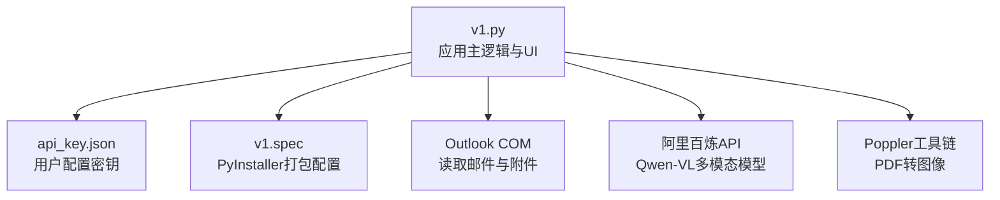
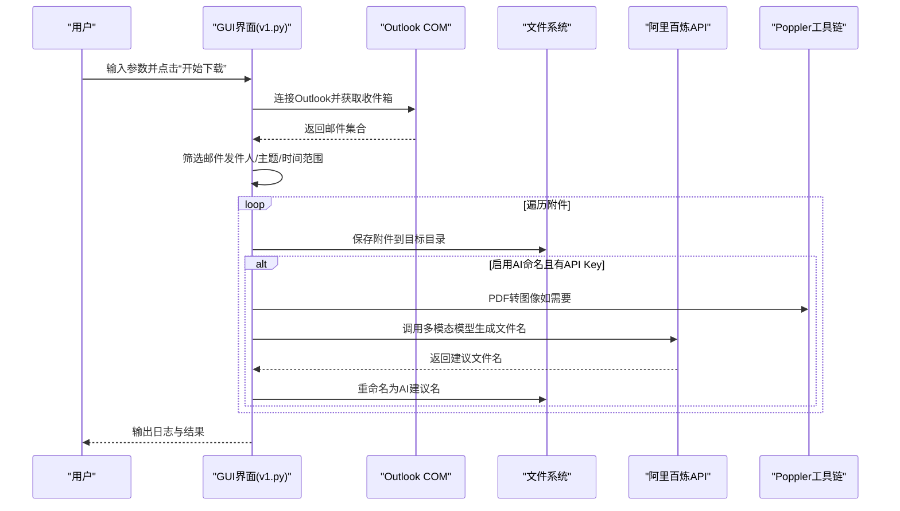
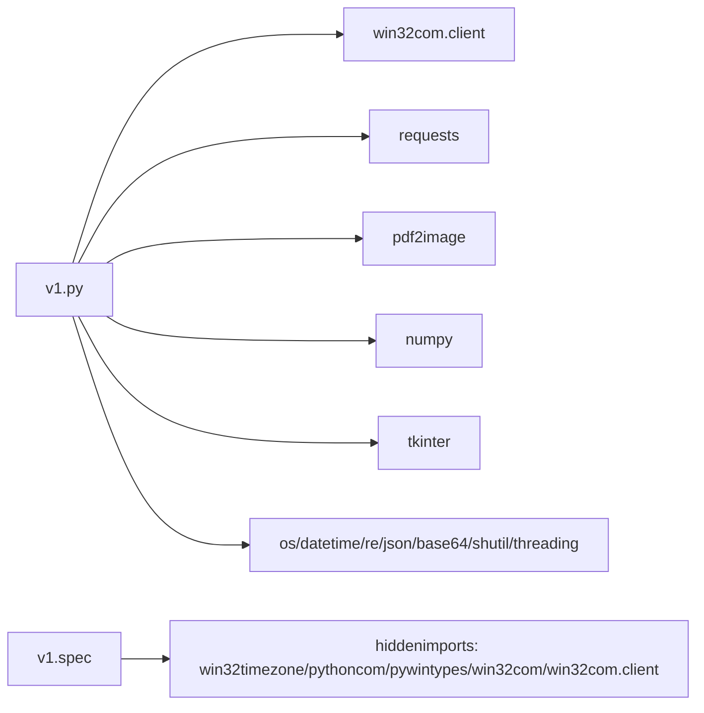

# 环境配置

<cite>
**本文引用的文件**
- [v1.py](file://v1.py)
- [api_key.json](file://api_key.json)
- [v1.spec](file://v1.spec)
</cite>

## 目录
1. [简介](#简介)
2. [项目结构](#项目结构)
3. [核心组件](#核心组件)
4. [架构总览](#架构总览)
5. [详细组件分析](#详细组件分析)
6. [依赖分析](#依赖分析)
7. [性能考虑](#性能考虑)
8. [故障排查指南](#故障排查指南)
9. [结论](#结论)
10. [附录](#附录)

## 简介
本文件面向Outlook附件下载AI智能命名系统，提供从Python环境、操作系统、Outlook版本到依赖库、API密钥、PDF处理环境（Poppler）以及环境验证与常见问题的完整配置指南。文档同时给出虚拟环境搭建建议与依赖版本兼容性提示，帮助快速、稳定地部署与运行该系统。

## 项目结构
该项目采用单文件应用与打包配置相结合的方式：
- 应用入口与业务逻辑集中在单一脚本文件中，便于分发与运行。
- 使用打包配置文件定义打包时需要的隐藏导入与资源，确保可执行文件在目标环境中正常加载COM组件与第三方库。
- API密钥存储在用户配置目录下的独立JSON文件中，避免污染程序目录并便于分享可执行文件。

图表来源
- [v1.py:35](file://v1.py#L35)
- [v1.spec:9-15](file://v1.spec#L9-L15)

章节来源
- [v1.py:1-14](file://v1.py#L1-L14)
- [v1.spec:1-45](file://v1.spec#L1-L45)

## 核心组件
- Python与系统环境
  - Python版本：建议使用Python 3.8及以上版本，兼容至Python 3.11+。注意：某些依赖对较新的Python版本可能存在兼容性差异，建议在受支持范围内选择稳定版本。
  - 操作系统：Windows（系统级限制来自Outlook COM接口与Win32组件）。Linux/macOS不支持Outlook本地访问。
- Outlook版本与环境
  - Outlook桌面版（Outlook 2016/2019/2021/Office 365）均可使用。Outlook必须已登录账户且具备访问收件箱权限。
  - 若使用Outlook Online（浏览器版）无法通过COM接口访问，请改用桌面版。
- 依赖库与功能映射
  - win32com.client：通过Outlook COM接口读取邮件与附件。
  - requests：调用阿里百炼API进行多模态推理。
  - pdf2image：将PDF页转换为图像，供AI识别。
  - numpy：图像处理与数组计算的基础库（由pdf2image间接依赖）。
  - tkinter：图形界面（GUI）交互。
  - 其他：base64、json、re、os、threading、datetime、shutil等。
- API密钥与模型
  - 默认模型名称：qwen-vl-max（可通过界面切换）。
  - API密钥存储位置：用户配置目录下的api_key.json，避免程序目录污染与权限问题。
- PDF处理环境（Poppler）
  - 支持通过环境变量POPPLER_PATH指定路径，或在程序运行目录下放置相对路径的poppler工具链。
  - 若未配置，将尝试使用默认相对路径或预设绝对路径，若仍不可用则会报错。

章节来源
- [v1.py:1-14](file://v1.py#L1-L14)
- [v1.py:35](file://v1.py#L35)
- [v1.py:66](file://v1.py#L66)
- [v1.py:72-85](file://v1.py#L72-L85)
- [v1.spec:9-15](file://v1.spec#L9-L15)

## 架构总览
系统整体运行流程如下：
- 用户在GUI中填写发件人、主题关键词、保存路径、检索天数，并可选择是否启用AI智能命名。
- 启动下载后，程序在后台线程中连接Outlook COM，遍历收件箱并筛选邮件，保存附件到指定目录。
- 若启用AI命名且存在有效API密钥，则对图片/PDF附件进行内容识别，生成新文件名并重命名。
- PDF处理依赖Poppler工具链，确保pdftoppm可用。

图表来源
- [v1.py:199-435](file://v1.py#L199-L435)
- [v1.py:97-106](file://v1.py#L97-L106)
- [v1.py:107-148](file://v1.py#L107-L148)
- [v1.py:149-197](file://v1.py#L149-L197)

## 详细组件分析

### Python与操作系统要求
- Python版本：建议Python 3.8–3.11，确保与win32com、requests、pdf2image等依赖兼容。
- 操作系统：仅支持Windows。Outlook COM接口在非Windows平台不可用。
- Outlook版本：Outlook 2016/2019/2021/Office 365均可。需确保Outlook已登录且具备访问收件箱权限。

章节来源
- [v1.py:261-273](file://v1.py#L261-L273)

### 依赖库安装步骤
- 基础依赖
  - win32com.client：随pywin32安装，用于Outlook COM接口访问。
  - requests：HTTP客户端，用于调用阿里百炼API。
  - pdf2image：将PDF页转换为图像，供AI识别。
  - numpy：图像处理与数组计算的基础库。
- 安装方式
  - 推荐使用pip安装：pip install pywin32 requests pdf2image numpy
  - 若遇到编译问题，可优先安装wheel包或使用预编译二进制。
- 版本兼容性提示
  - pdf2image依赖Poppler工具链；若使用Conda，可考虑conda-forge频道。
  - win32com依赖系统COM组件，确保Windows系统完整安装Office或Office Runtime。

章节来源
- [v1.py:1-14](file://v1.py#L1-L14)
- [v1.spec:9-15](file://v1.spec#L9-L15)

### API密钥配置指南
- 配置文件位置
  - 用户配置目录下的api_key.json，路径由程序动态计算并创建。
- 文件格式
  - JSON对象，包含键“api_key”，值为字符串形式的密钥。
- 配置流程
  - 在界面中点击“申请 Key”跳转至阿里百炼控制台获取密钥。
  - 在界面中粘贴密钥并点击“保存 Key”，程序会将密钥写入用户配置目录的api_key.json。
  - 程序启动时会自动读取该文件中的密钥，若不存在则使用占位值。
- 安全建议
  - 密钥仅保存在用户配置目录，避免与源码或可执行文件一起分发。
  - 如需在团队内共享，建议通过安全渠道传递密钥文件。

章节来源
- [v1.py:28-35](file://v1.py#L28-L35)
- [v1.py:38-55](file://v1.py#L38-L55)
- [v1.py:66](file://v1.py#L66)
- [api_key.json:1-3](file://api_key.json#L1-L3)

### PDF处理环境设置（Poppler）
- 目标工具
  - pdftoppm.exe：将PDF页转换为图像文件。
- 配置方式
  - 环境变量：设置POPPLER_PATH指向Poppler的bin目录。
  - 相对路径：在程序运行目录下放置poppler/Library/bin。
  - 默认路径：若未设置，程序会尝试预设绝对路径（开发环境常用）。
- 验证方法
  - 确认pdftoppm.exe存在于POPPLER_PATH中。
  - 运行程序时若出现“Poppler路径不存在”或“未找到pdftoppm.exe”的错误，需检查路径配置。
- 常见问题
  - 路径拼写错误或缺少可执行文件。
  - 权限不足导致无法读取或执行工具链。
  - 32位/64位不匹配：确保Poppler与Python架构一致。

章节来源
- [v1.py:69-85](file://v1.py#L69-L85)
- [v1.py:97-106](file://v1.py#L97-L106)

### 虚拟环境搭建建议
- 推荐使用Python 3.8–3.11，创建独立虚拟环境隔离依赖。
- 安装顺序建议：
  1) pip install pywin32
  2) pip install requests
  3) pip install pdf2image
  4) pip install numpy
  5) pip install tk（通常随Python自带，若缺失请单独安装）
- 验证命令
  - python -c "import win32com.client, requests, pdf2image, numpy; print('依赖导入成功')"
  - 运行GUI：python v1.py

章节来源
- [v1.py:1-14](file://v1.py#L1-L14)

### 环境验证方法
- Outlook连接测试
  - 确保Outlook已登录且可访问收件箱。
  - 运行程序后观察“正在连接Outlook…”日志，若无异常则连接成功。
- API调用测试
  - 在界面中填写有效API Key并保存，尝试触发一次AI命名流程（如对图片/PDF进行识别）。
  - 查看返回的日志信息，确认API返回格式正确。
- PDF转图像测试
  - 准备一个PDF文件，确保Poppler路径正确。
  - 运行程序并选择该PDF作为附件，观察是否生成临时图像并进入AI识别流程。
- 日志与状态
  - 关注界面右上角的状态栏与日志区域，异常信息会在此显示。

章节来源
- [v1.py:270-273](file://v1.py#L270-L273)
- [v1.py:107-148](file://v1.py#L107-L148)
- [v1.py:160-175](file://v1.py#L160-L175)

## 依赖分析
- 模块导入关系
  - 应用主逻辑集中于v1.py，通过导入win32com.client、requests、pdf2image等实现核心功能。
  - 打包配置v1.spec声明了隐藏导入，确保打包后的可执行文件能正确加载COM组件与相关模块。
- 外部依赖耦合
  - Outlook COM：强耦合，需Windows与Outlook环境。
  - 阿里百炼API：网络依赖，需稳定的外网访问。
  - Poppler：外部工具链，需正确路径与可执行权限。
- 潜在循环依赖
  - 当前代码未发现循环导入；GUI与业务逻辑分离良好。
- 外部集成点
  - 阿里百炼API：通过HTTP请求调用，需处理超时与返回格式。
  - Outlook：通过COM接口访问，需处理异常与线程初始化/反初始化。

图表来源
- [v1.py:1-14](file://v1.py#L1-L14)
- [v1.spec:9-15](file://v1.spec#L9-L15)

章节来源
- [v1.py:1-14](file://v1.py#L1-L14)
- [v1.spec:9-15](file://v1.spec#L9-L15)

## 性能考虑
- 并发与阻塞
  - 下载与AI识别在后台线程执行，避免阻塞GUI。
- I/O与网络
  - 附件保存与重命名为I/O密集型；AI调用为网络延迟敏感。
- PDF处理
  - PDF转图像可能占用较多内存与CPU，建议限制最大处理页数（代码中默认最多处理若干页）。
- 稳定性
  - Outlook COM接口在长时间运行中可能出现不稳定，建议定期重启程序或增加异常恢复逻辑。

章节来源
- [v1.py:257-435](file://v1.py#L257-L435)
- [v1.py:149-197](file://v1.py#L149-L197)

## 故障排查指南
- Outlook无法连接
  - 症状：界面显示连接异常或无邮件数据。
  - 排查：确认Outlook已登录、收件箱可访问；确保Windows与Outlook版本兼容。
- API Key无效或未配置
  - 症状：AI命名失败或提示未配置API Key。
  - 排查：在界面中重新申请并保存API Key；确认api_key.json位于用户配置目录。
- Poppler路径错误
  - 症状：出现“Poppler路径不存在”或“未找到pdftoppm.exe”。
  - 排查：设置环境变量POPPLER_PATH或在程序目录下放置poppler工具链；确保路径正确且可执行。
- 网络超时或API返回异常
  - 症状：API调用失败或返回格式异常。
  - 排查：检查网络连通性；确认模型名称与API端点正确；查看日志中的错误详情。
- 权限问题
  - 症状：保存附件失败或无法读取工具链。
  - 排查：以管理员权限运行；检查目标目录写入权限与工具链执行权限。

章节来源
- [v1.py:97-106](file://v1.py#L97-L106)
- [v1.py:107-148](file://v1.py#L107-L148)
- [v1.py:38-55](file://v1.py#L38-L55)

## 结论
通过遵循本环境配置文档，您可以在Windows环境下完成Outlook附件下载AI智能命名系统的部署与运行。关键在于：
- 正确的Python与系统环境；
- 完整的依赖安装与Poppler工具链配置；
- API密钥的安全存储与正确使用；
- 合理的虚拟环境与版本兼容性管理。

## 附录
- 快速检查清单
  - Python 3.8–3.11，Windows系统，Outlook已登录。
  - pip安装win32com.client、requests、pdf2image、numpy。
  - 设置POPPLER_PATH或放置poppler工具链。
  - 在界面中申请并保存API Key。
  - 运行GUI并执行一次下载与AI命名流程验证。