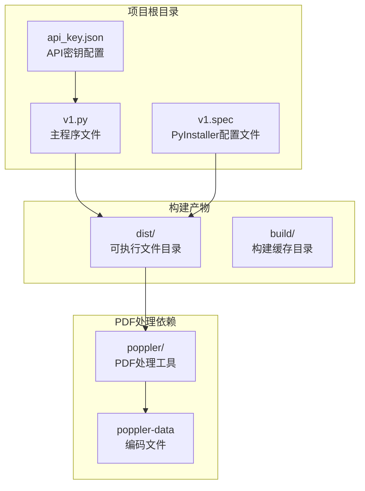
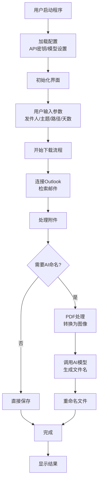
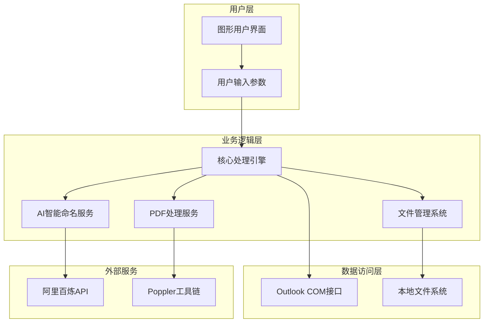
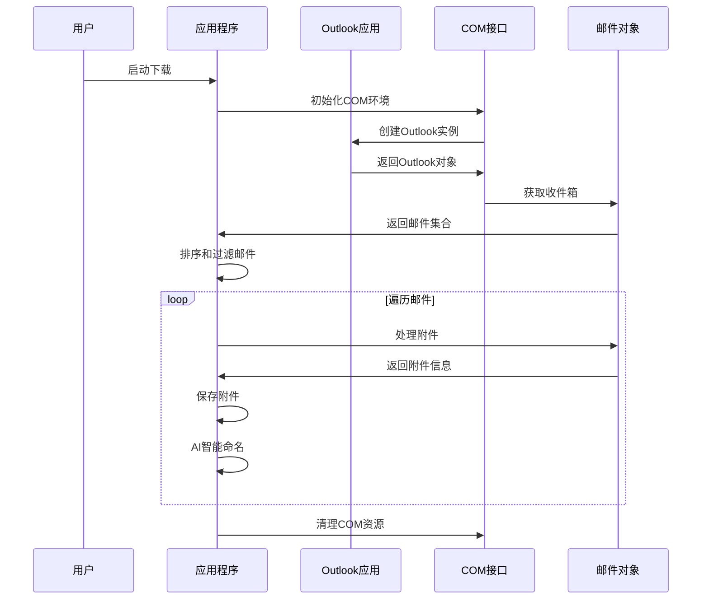
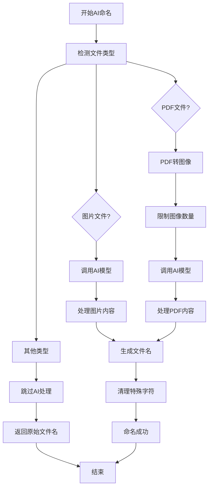
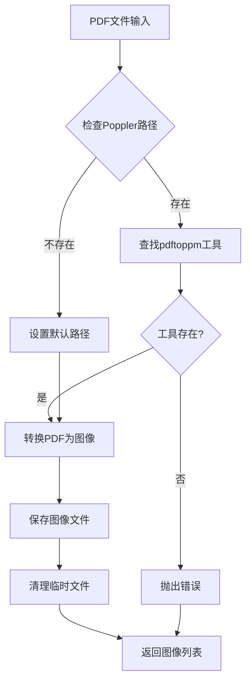
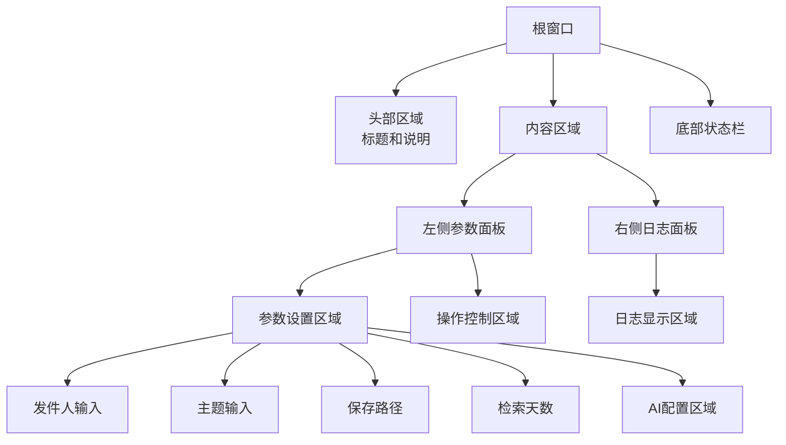
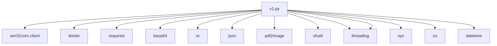
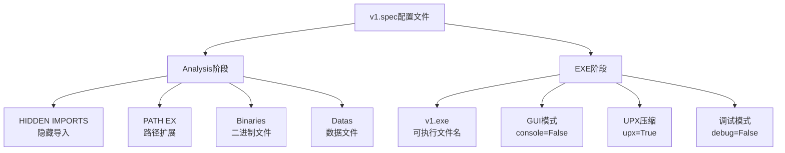
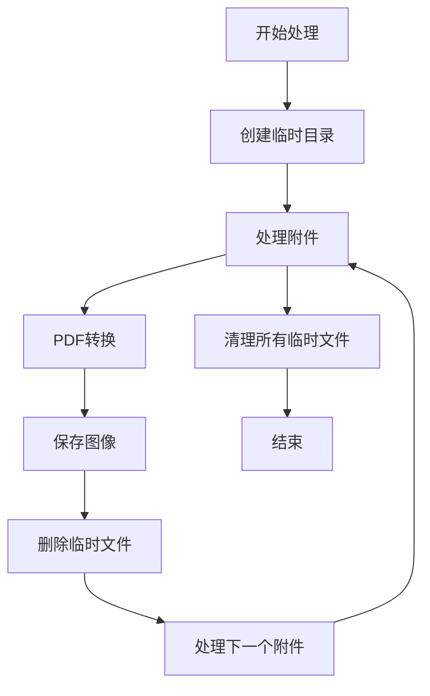

# 配置与部署

<cite>
**本文档引用的文件**
- [v1.py](file://v1.py)
- [v1.spec](file://v1.spec)
- [api_key.json](file://api_key.json)
- [README](file://dist/poppler/share/poppler/README)
</cite>

## 目录
1. [简介](#简介)
2. [项目结构](#项目结构)
3. [核心组件](#核心组件)
4. [架构概览](#架构概览)
5. [详细组件分析](#详细组件分析)
6. [依赖关系分析](#依赖关系分析)
7. [性能考虑](#性能考虑)
8. [故障排除指南](#故障排除指南)
9. [结论](#结论)
10. [附录](#附录)

## 简介

Outlook附件下载AI智能命名系统是一个基于Python开发的桌面应用程序，专门用于从Outlook邮箱中批量下载附件并利用AI技术对附件进行智能命名。该系统集成了阿里百炼的Qwen-VL-Max多模态模型，能够自动识别图片和PDF文档的内容，并生成合适的文件名。

该系统具有以下核心特性：
- 自动连接Outlook邮箱并检索指定发件人的邮件
- 批量下载邮件附件并保存到指定目录
- 基于AI的内容识别实现智能文件命名
- 支持图片和PDF文档的多模态内容分析
- 提供友好的图形用户界面
- 支持跨平台部署和打包

## 项目结构

该项目采用简洁的单文件架构设计，主要包含以下核心文件：



**图表来源**
- [v1.py:1-50](file://v1.py#L1-L50)
- [v1.spec:1-45](file://v1.spec#L1-L45)

**章节来源**
- [v1.py:1-100](file://v1.py#L1-L100)
- [v1.spec:1-45](file://v1.spec#L1-L45)

## 核心组件

### 主要功能模块

系统由多个相互协作的功能模块组成，每个模块负责特定的任务：

1. **Outlook集成模块**：负责与Outlook应用建立连接，检索邮件并下载附件
2. **AI智能命名模块**：基于阿里百炼API实现多模态内容识别和文件名生成
3. **PDF处理模块**：使用Poppler工具将PDF文档转换为图像以便AI分析
4. **文件管理模块**：处理文件的保存、重命名和清理操作
5. **用户界面模块**：提供图形化的用户交互界面
6. **配置管理模块**：处理API密钥存储和应用程序配置

### 数据流架构



**图表来源**
- [v1.py:199-435](file://v1.py#L199-L435)
- [v1.py:149-196](file://v1.py#L149-L196)

**章节来源**
- [v1.py:107-147](file://v1.py#L107-L147)
- [v1.py:149-196](file://v1.py#L149-L196)

## 架构概览

### 系统架构图



**图表来源**
- [v1.py:199-435](file://v1.py#L199-L435)
- [v1.spec:9-15](file://v1.spec#L9-L15)

### 技术栈分析

系统采用现代化的Python技术栈，主要技术组件包括：

- **Python 3.x**：核心编程语言
- **tkinter**：图形用户界面框架
- **win32com.client**：Windows COM接口，用于Outlook集成
- **requests**：HTTP客户端，用于API通信
- **pdf2image**：PDF转图像库
- **PyInstaller**：应用程序打包工具
- **阿里百炼SDK**：多模态AI服务集成

**章节来源**
- [v1.py:1-15](file://v1.py#L1-L15)
- [v1.spec:9-15](file://v1.spec#L9-L15)

## 详细组件分析

### Outlook集成组件

Outlook集成组件是系统的核心，负责与Outlook应用建立连接并处理邮件附件。

#### 连接管理机制



**图表来源**
- [v1.py:257-435](file://v1.py#L257-L435)

#### 邮件筛选逻辑

系统实现了智能的邮件筛选机制，支持多种筛选条件：

1. **发件人筛选**：支持发件人姓名和邮箱地址的模糊匹配
2. **主题关键词筛选**：可选的主题关键词匹配
3. **时间范围筛选**：基于接收时间的日期范围限制
4. **附件有效性筛选**：自动跳过小于阈值的附件

**章节来源**
- [v1.py:288-335](file://v1.py#L288-L335)

### AI智能命名组件

AI智能命名组件是系统的核心创新点，利用阿里百炼的Qwen-VL-Max模型实现多模态内容识别。

#### 模型调用流程



**图表来源**
- [v1.py:149-196](file://v1.py#L149-L196)
- [v1.py:107-147](file://v1.py#L107-L147)

#### 文件名生成策略

系统针对不同类型的文件采用了差异化的命名策略：

1. **图片文件**：直接调用AI模型生成描述性文件名
2. **PDF文件**：转换前几页为图像，然后生成综合性的文件名
3. **其他文件**：保持原有文件名不变

**章节来源**
- [v1.py:149-196](file://v1.py#L149-L196)

### PDF处理组件

PDF处理组件负责将PDF文档转换为图像格式，以便AI模型进行内容分析。

#### PDF转图像流程



**图表来源**
- [v1.py:97-105](file://v1.py#L97-L105)

#### Poppler配置管理

系统提供了灵活的Poppler工具配置机制：

1. **环境变量优先**：优先使用`POPPLER_PATH`环境变量
2. **相对路径支持**：打包后程序的相对路径查找
3. **开发环境回退**：预设的开发环境路径
4. **路径验证**：确保工具路径的有效性

**章节来源**
- [v1.py:69-84](file://v1.py#L69-L84)

### 用户界面组件

用户界面组件基于tkinter框架构建，提供了直观易用的操作界面。

#### 界面布局设计



**图表来源**
- [v1.py:467-827](file://v1.py#L467-L827)

**章节来源**
- [v1.py:467-827](file://v1.py#L467-L827)

## 依赖关系分析

### Python依赖关系

系统的主要Python依赖包括：



**图表来源**
- [v1.py:1-15](file://v1.py#L1-L15)

### PyInstaller打包配置

PyInstaller配置文件定义了应用程序的打包规则和依赖管理：

#### 隐藏导入配置

系统需要显式声明一些隐藏导入，以确保打包后的程序正常运行：

- `win32timezone`：Windows时区支持
- `pythoncom`：Python COM支持
- `pywintypes`：Windows类型支持
- `win32com`：Windows COM库
- `win32com.client`：COM客户端

#### 打包选项分析



**图表来源**
- [v1.spec:4-22](file://v1.spec#L4-L22)
- [v1.spec:25-44](file://v1.spec#L25-L44)

**章节来源**
- [v1.spec:9-15](file://v1.spec#L9-L15)
- [v1.spec:25-44](file://v1.spec#L25-L44)

## 性能考虑

### 并发处理优化

系统采用了多线程架构来提高性能：

1. **UI线程分离**：所有长时间运行的操作都在独立线程中执行
2. **线程安全更新**：通过`root.after()`方法安全地更新UI
3. **资源管理**：确保COM对象正确释放，避免内存泄漏

### 内存管理策略



**图表来源**
- [v1.py:165-196](file://v1.py#L165-L196)

### 网络请求优化

系统在网络请求方面采用了多项优化措施：

1. **超时控制**：所有API请求设置60秒超时
2. **错误处理**：完善的异常捕获和错误恢复机制
3. **重试机制**：在网络不稳定情况下提供重试机会

**章节来源**
- [v1.py:139-147](file://v1.py#L139-L147)

## 故障排除指南

### 常见问题诊断

#### Outlook连接问题

**症状**：无法连接到Outlook或出现COM相关错误

**解决方案**：
1. 确认Outlook已正确安装并可以正常启动
2. 检查用户权限是否足够访问Outlook
3. 验证COM接口是否正常工作

#### AI命名失败

**症状**：AI智能命名功能不可用或返回错误

**解决方案**：
1. 检查API密钥配置是否正确
2. 验证网络连接是否正常
3. 确认阿里百炼服务可用性

#### PDF处理错误

**症状**：PDF文件无法正确转换为图像

**解决方案**：
1. 检查Poppler工具路径配置
2. 验证PDF文件格式是否受支持
3. 确认磁盘空间充足

### 日志分析

系统提供了详细的日志记录功能，可以帮助诊断问题：

1. **操作日志**：记录所有用户操作和系统响应
2. **错误日志**：详细记录异常信息和堆栈跟踪
3. **性能日志**：记录关键操作的执行时间和资源使用情况

**章节来源**
- [v1.py:207-228](file://v1.py#L207-L228)
- [v1.py:420-426](file://v1.py#L420-L426)

## 结论

Outlook附件下载AI智能命名系统是一个功能完整、架构清晰的桌面应用程序。它成功地将传统的邮件附件下载功能与现代AI技术相结合，为用户提供了智能化的文件管理体验。

系统的主要优势包括：
- **功能完整性**：涵盖了从邮件检索到智能命名的完整流程
- **用户体验**：提供了直观易用的图形界面
- **技术先进性**：集成了最新的AI多模态技术
- **部署友好**：支持一键打包和跨平台部署

对于运维人员和系统管理员来说，该系统提供了清晰的配置选项和完善的错误处理机制，便于在生产环境中稳定运行。

## 附录

### 部署准备清单

#### 环境要求

- **操作系统**：Windows 10/11（系统要求）
- **Python版本**：Python 3.8+
- **Outlook版本**：Outlook 2016+（推荐）
- **磁盘空间**：至少500MB可用空间
- **网络连接**：稳定的互联网连接

#### 必需软件

1. **Python运行时**：Python 3.8或更高版本
2. **Microsoft Office**：包含Outlook组件
3. **Poppler工具**：用于PDF处理
4. **PyInstaller**：用于应用程序打包

#### 安装步骤

1. **安装Python**：下载并安装Python 3.8+
2. **安装依赖包**：使用pip安装所需依赖
3. **配置Outlook**：确保Outlook正常运行
4. **设置Poppler**：安装并配置Poppler工具
5. **生成可执行文件**：使用PyInstaller打包

### 配置模板

#### API密钥配置模板

```json
{
  "api_key": "sk-xxxxxxxxxxxxxxxxxxxxxxxx"
}
```

#### PyInstaller配置模板

```python
# -*- mode: python ; coding: utf-8 -*-

a = Analysis(
    ['v1'],
    pathex=[],
    binaries=[],
    datas=[],
    hiddenimports=[
        "win32timezone",
        "pythoncom",
        "pywintypes",
        "win32com",
        "win32com.client",
    ],
    hookspath=[],
    hooksconfig={},
    runtime_hooks=[],
    excludes=[],
    noarchive=False,
    optimize=0,
)
pyz = PYZ(a.pure)

exe = EXE(
    pyz,
    a.scripts,
    a.binaries,
    a.datas,
    [],
    name='v1',
    debug=False,
    bootloader_ignore_signals=False,
    strip=False,
    upx=True,
    upx_exclude=[],
    runtime_tmpdir=None,
    console=False,
    disable_windowed_traceback=False,
    argv_emulation=False,
    target_arch=None,
    codesign_identity=None,
    entitlements_file=None,
)
```

### 自动化部署脚本

#### 批处理部署脚本

```batch
@echo off
echo 开始部署Outlook附件下载AI智能命名系统

REM 检查Python环境
python --version
if %ERRORLEVEL% NEQ 0 (
    echo 错误：未找到Python环境
    pause
    exit /b 1
)

REM 安装依赖包
pip install -r requirements.txt
if %ERRORLEVEL% NEQ 0 (
    echo 错误：依赖包安装失败
    pause
    exit /b 1
)

REM 检查Outlook安装
reg query "HKLM\SOFTWARE\Microsoft\Office\Outlook" >nul
if %ERRORLEVEL% NEQ 0 (
    echo 警告：未检测到Outlook安装
)

REM 检查Poppler工具
if exist "poppler\Library\bin\pdftoppm.exe" (
    echo Poppler工具已就绪
) else (
    echo 警告：Poppler工具未找到
)

REM 生成可执行文件
pyinstaller v1.spec
if %ERRORLEVEL% NEQ 0 (
    echo 错误：可执行文件生成失败
    pause
    exit /b 1
)

echo 部署完成！
pause
```

### 安全配置建议

#### API密钥安全管理

1. **密钥存储**：使用用户配置目录存储API密钥
2. **权限控制**：确保只有应用程序进程可以访问密钥文件
3. **加密传输**：通过HTTPS协议传输API密钥
4. **定期轮换**：建议定期更换API密钥

#### 网络安全配置

1. **防火墙设置**：允许应用程序访问互联网
2. **代理配置**：支持企业网络代理环境
3. **SSL证书**：验证API服务的SSL证书有效性

#### 文件安全配置

1. **权限管理**：确保应用程序有写入目标目录的权限
2. **文件监控**：监控文件系统变化防止恶意篡改
3. **备份策略**：定期备份重要配置文件

### 性能调优建议

#### 系统性能优化

1. **内存管理**：合理设置PDF处理的最大图像数量
2. **并发控制**：根据系统资源调整并发处理级别
3. **缓存策略**：利用临时文件缓存减少重复处理

#### 网络性能优化

1. **连接池**：复用HTTP连接减少建立开销
2. **超时设置**：根据网络状况调整超时时间
3. **重试策略**：实现指数退避重试机制

#### 存储性能优化

1. **磁盘选择**：使用SSD作为保存目录提升I/O性能
2. **批量处理**：合并小文件减少磁盘写入次数
3. **清理策略**：定期清理临时文件释放磁盘空间