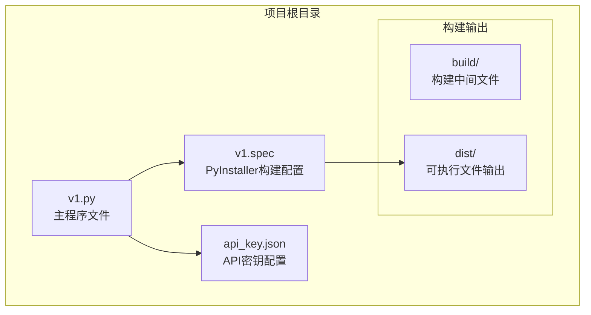
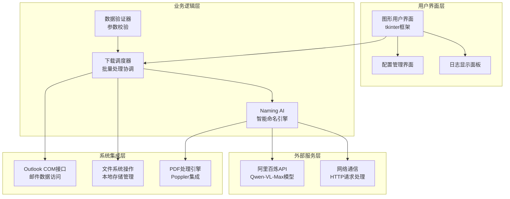
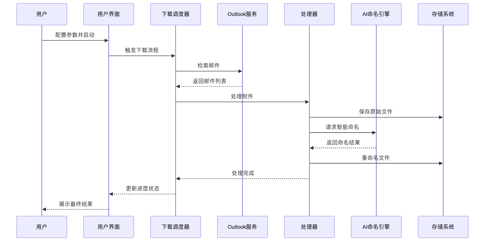
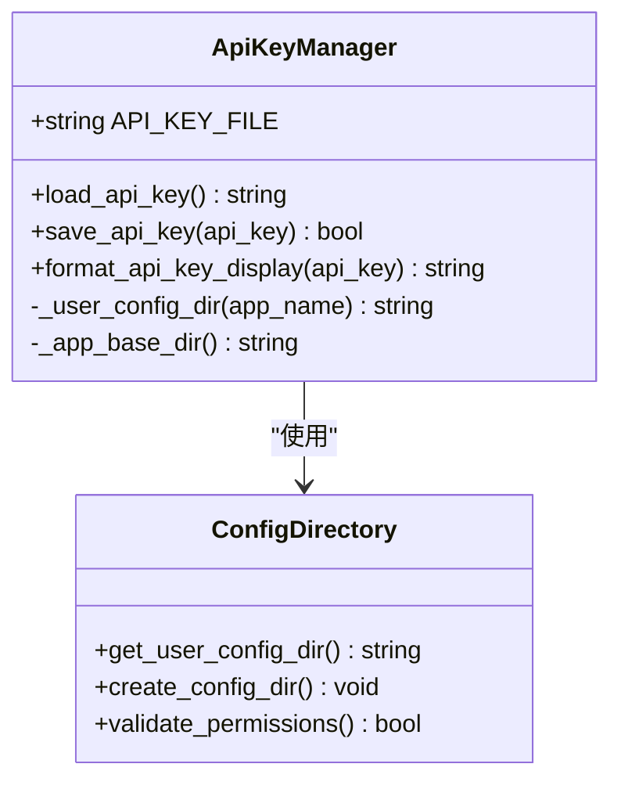
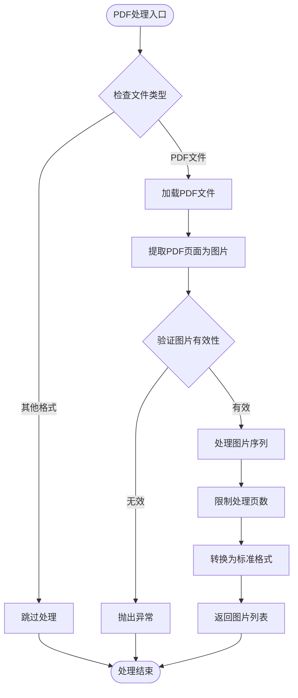
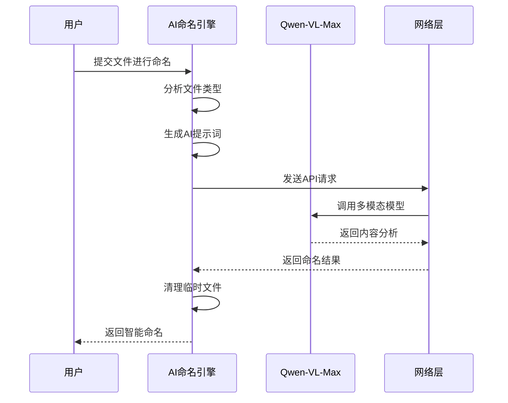
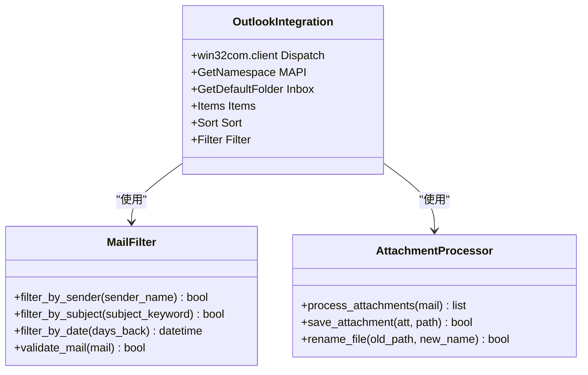
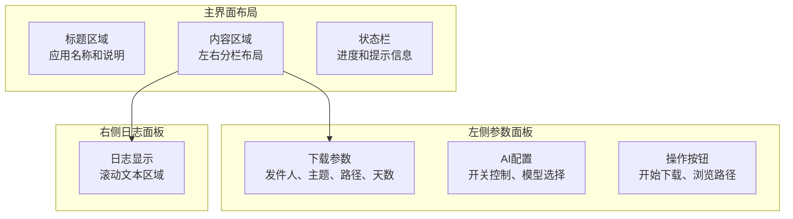
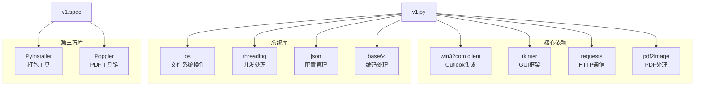

# 项目概述

<cite>
**本文档引用的文件**
- [v1.py](file://v1.py)
- [v1.spec](file://v1.spec)
- [api_key.json](file://api_key.json)
</cite>

## 目录
1. [项目简介](#项目简介)
2. [项目结构](#项目结构)
3. [核心组件](#核心组件)
4. [架构总览](#架构总览)
5. [详细组件分析](#详细组件分析)
6. [依赖关系分析](#依赖关系分析)
7. [性能考虑](#性能考虑)
8. [故障排除指南](#故障排除指南)
9. [结论](#结论)

## 项目简介

Outlook附件批量下载AI智能命名系统是一个专为Windows平台设计的企业级邮件附件管理工具。该系统集成了Outlook邮件客户端、AI智能识别技术和PDF处理能力，为用户提供了一套完整的自动化附件管理解决方案。

### 核心目标
- **自动化批量下载**：从Outlook收件箱中批量提取指定发件人的邮件附件
- **智能命名优化**：利用AI技术对附件内容进行智能分析，生成语义化的文件名
- **多格式支持**：支持图片、PDF等多种文件格式的自动处理
- **用户体验优化**：提供直观的图形界面和实时进度反馈

### 主要特性
- **Outlook深度集成**：直接访问Outlook邮件数据，无需手动操作
- **AI智能识别**：基于阿里百炼Qwen-VL-Max模型的多模态内容分析
- **PDF处理能力**：内置PDF转图片功能，支持文档内容智能识别
- **批量处理优化**：高效的并发处理机制，支持大量附件的快速处理
- **灵活配置选项**：支持发件人过滤、主题关键词搜索、时间范围限制等

### 技术优势
- **跨平台兼容**：支持Windows系统，兼容不同版本的Outlook
- **模块化设计**：清晰的功能模块划分，便于维护和扩展
- **错误处理完善**：全面的异常处理机制，确保系统稳定性
- **性能优化**：采用多线程异步处理，提升用户体验

## 项目结构

该项目采用简洁的单文件架构设计，所有功能集中在单一Python文件中，配合构建配置文件实现完整的应用程序。

**图表来源**
- [v1.py:1-50](file://v1.py#L1-L50)
- [v1.spec:1-45](file://v1.spec#L1-L45)

### 文件组织特点
- **主程序文件**：v1.py包含完整的业务逻辑和用户界面
- **构建配置**：v1.spec定义了PyInstaller的构建参数
- **配置管理**：api_key.json存储API密钥信息
- **构建产物**：自动创建build和dist目录用于编译输出

**章节来源**
- [v1.py:1-827](file://v1.py#L1-L827)
- [v1.spec:1-45](file://v1.spec#L1-L45)

## 核心组件

系统由多个相互协作的功能模块组成，每个模块都有明确的职责和边界。

### 1. API密钥管理系统
负责API密钥的安全存储、加载和验证，确保AI功能的正常运行。

### 2. PDF处理引擎
集成Poppler工具链，提供PDF文件的图像转换和预处理能力。

### 3. AI智能命名模块
基于阿里百炼Qwen-VL-Max模型，实现多模态内容分析和智能文件命名。

### 4. Outlook集成层
通过COM接口与Outlook进行深度集成，实现邮件数据的自动检索和附件提取。

### 5. 用户界面系统
提供直观的图形用户界面，支持参数配置、进度监控和结果展示。

**章节来源**
- [v1.py:21-65](file://v1.py#L21-L65)
- [v1.py:69-85](file://v1.py#L69-L85)
- [v1.py:107-148](file://v1.py#L107-L148)
- [v1.py:199-435](file://v1.py#L199-L435)

## 架构总览

系统采用分层架构设计，从底层的系统集成到上层的用户交互，形成了清晰的技术栈层次。

**图表来源**
- [v1.py:467-827](file://v1.py#L467-L827)
- [v1.py:199-435](file://v1.py#L199-L435)
- [v1.py:107-148](file://v1.py#L107-L148)

### 数据流架构

系统的数据处理遵循严格的流水线模式，确保每个环节的独立性和可靠性。

**图表来源**
- [v1.py:257-435](file://v1.py#L257-L435)
- [v1.py:149-197](file://v1.py#L149-L197)

## 详细组件分析

### API密钥管理系统

该系统实现了安全的API密钥管理机制，确保敏感信息不会泄露。

**图表来源**
- [v1.py:28-55](file://v1.py#L28-L55)

#### 核心功能
- **安全存储**：API密钥存储在用户配置目录中，避免权限问题
- **格式化显示**：保护性地显示API密钥，仅显示前后部分
- **持久化管理**：提供完整的读写接口，支持配置的持久化

**章节来源**
- [v1.py:28-65](file://v1.py#L28-L65)

### PDF处理引擎

系统集成了专业的PDF处理能力，支持多页PDF的图像转换和AI分析。

**图表来源**
- [v1.py:97-106](file://v1.py#L97-L106)
- [v1.py:160-175](file://v1.py#L160-L175)

#### 技术实现
- **Poppler集成**：支持多种Poppler路径配置，提高部署灵活性
- **内存管理**：自动清理临时生成的图片文件
- **错误处理**：完善的异常捕获和错误恢复机制

**章节来源**
- [v1.py:97-106](file://v1.py#L97-L106)
- [v1.py:160-197](file://v1.py#L160-L197)

### AI智能命名模块

这是系统的核心创新点，通过AI技术实现附件内容的智能理解和命名。

**图表来源**
- [v1.py:107-148](file://v1.py#L107-L148)
- [v1.py:149-197](file://v1.py#L149-L197)

#### 模型选择策略
- **默认推荐**：qwen-vl-max提供最佳的性价比平衡
- **高级选项**：qwen-vl-max-latest支持最新模型能力
- **轻量选择**：qwen-vl-plus适合资源受限环境

**章节来源**
- [v1.py:107-148](file://v1.py#L107-L148)
- [v1.py:149-197](file://v1.py#L149-L197)

### Outlook集成层

系统通过COM接口与Outlook进行深度集成，实现无缝的邮件数据访问。

**图表来源**
- [v1.py:270-283](file://v1.py#L270-L283)
- [v1.py:288-335](file://v1.py#L288-L335)
- [v1.py:346-410](file://v1.py#L346-L410)

#### 过滤机制
- **发件人匹配**：支持发件人名称和邮箱地址的模糊匹配
- **主题搜索**：可选的主题关键词过滤功能
- **时间限制**：灵活的日期范围控制，避免处理过期邮件

**章节来源**
- [v1.py:270-283](file://v1.py#L270-L283)
- [v1.py:288-335](file://v1.py#L288-L335)
- [v1.py:346-410](file://v1.py#L346-L410)

### 用户界面系统

采用现代化的tkinter框架构建，提供直观易用的操作界面。

**图表来源**
- [v1.py:467-827](file://v1.py#L467-L827)

#### 界面特色
- **响应式设计**：自适应窗口大小，适配不同分辨率
- **状态反馈**：实时显示处理进度和结果状态
- **错误提示**：友好的错误信息展示，便于问题诊断

**章节来源**
- [v1.py:467-827](file://v1.py#L467-L827)

## 依赖关系分析

系统依赖关系清晰，各模块间耦合度低，便于维护和扩展。

**图表来源**
- [v1.py:1-14](file://v1.py#L1-L14)
- [v1.spec:4-22](file://v1.spec#L4-L22)

### 关键依赖特性
- **Outlook集成**：通过win32com.client实现深度系统集成
- **GUI框架**：使用tkinter构建跨平台用户界面
- **网络通信**：requests库提供稳定的HTTP通信能力
- **PDF处理**：pdf2image结合Poppler实现专业级PDF处理

**章节来源**
- [v1.py:1-14](file://v1.py#L1-L14)
- [v1.spec:4-22](file://v1.spec#L4-L22)

## 性能考虑

系统在设计时充分考虑了性能优化，采用多种策略提升用户体验。

### 并发处理策略
- **多线程架构**：下载和处理过程在独立线程中执行，避免界面阻塞
- **异步回调机制**：UI更新通过主线程回调确保线程安全
- **资源池管理**：合理控制同时处理的附件数量，避免系统过载

### 内存管理优化
- **临时文件清理**：自动删除PDF转换产生的临时图片文件
- **内存泄漏防护**：确保所有资源在异常情况下都能正确释放
- **批量处理优化**：采用流式处理减少内存占用

### 网络通信优化
- **超时控制**：AI API调用设置合理的超时时间
- **重试机制**：网络异常时提供有限的自动重试
- **连接复用**：合理管理HTTP连接，减少建立连接的开销

## 故障排除指南

### 常见问题及解决方案

#### Outlook连接问题
**症状**：无法连接到Outlook或显示连接失败
**原因**：Outlook未安装或COM接口不可用
**解决方法**：
1. 确认Outlook已正确安装
2. 以管理员权限运行程序
3. 检查Outlook的COM接口是否启用

#### API密钥配置问题
**症状**：AI功能无法使用或显示API Key错误
**原因**：API密钥未正确配置或格式不正确
**解决方法**：
1. 在设置界面输入有效的API密钥
2. 点击"保存 Key"按钮确认配置
3. 重新启动应用程序使配置生效

#### PDF处理失败
**症状**：PDF文件无法正确处理或转换
**原因**：Poppler工具链未正确安装或路径配置错误
**解决方法**：
1. 确认Poppler工具链已正确安装
2. 设置POPPLER_PATH环境变量指向pdftoppm.exe所在目录
3. 重启应用程序重新检测配置

#### 性能问题
**症状**：处理大量附件时响应缓慢
**解决方法**：
1. 减少同时处理的附件数量
2. 调整"检索天数"参数缩小处理范围
3. 关闭不必要的应用程序释放系统资源

**章节来源**
- [v1.py:242-250](file://v1.py#L242-L250)
- [v1.py:419-426](file://v1.py#L419-L426)

## 结论

Outlook附件批量下载AI智能命名系统是一个功能完整、架构清晰的企业级应用。通过巧妙地整合Outlook集成、AI智能识别和PDF处理技术，为用户提供了高效、智能的附件管理解决方案。

### 技术亮点
- **模块化设计**：清晰的功能分离便于维护和扩展
- **智能增强**：AI技术的应用显著提升了系统的智能化水平
- **用户体验**：直观的界面设计和实时反馈机制
- **稳定性保障**：完善的错误处理和异常恢复机制

### 应用场景
- **企业文档管理**：批量处理来自特定发件人的重要文档
- **学术研究辅助**：自动整理邮件中的研究资料和论文
- **项目管理支持**：集中管理项目相关的邮件附件
- **个人知识管理**：自动化整理个人重要的邮件资料

### 发展前景
随着AI技术的不断进步和用户需求的持续增长，该系统具有良好的扩展潜力。未来可以考虑增加更多AI功能、支持更多文件格式、提供云端同步能力等增强特性。